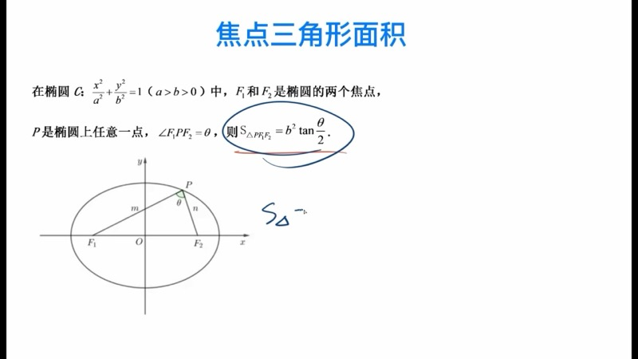
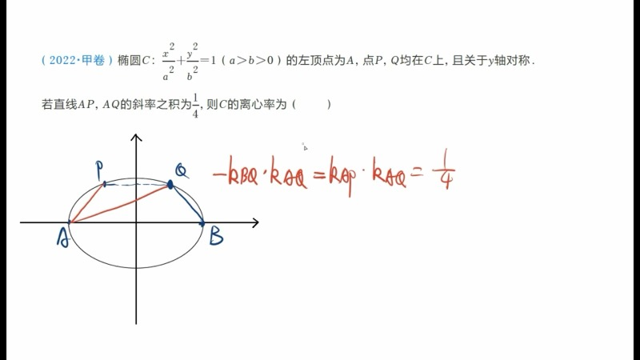
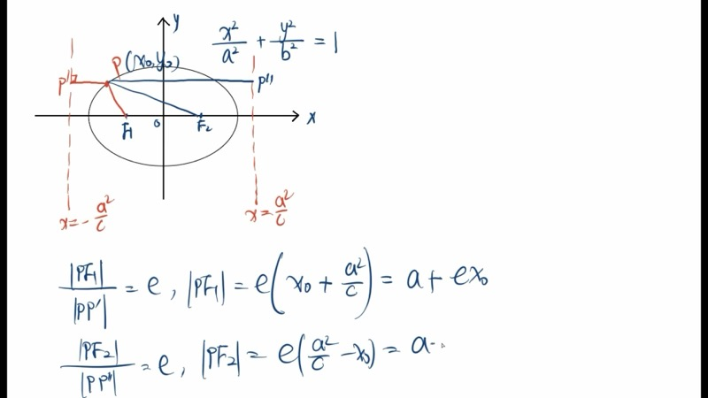
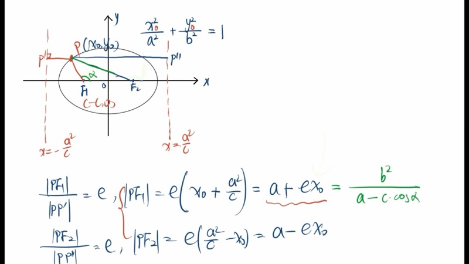

本课系统梳理椭圆（ellipse）中最常用的二级结论，包括焦点三角形面积公式、椭圆的第三定义及其推论，以及焦半径公式（focal radius formula）与焦点弦长公式。这些结论在高考解析几何中可以大幅简化计算，但应在掌握基础方法的前提下使用。

::: {.callout-note collapse="true"}
## 预备知识

- 椭圆（ellipse）的标准方程：$\dfrac{x^2}{a^2} + \dfrac{y^2}{b^2} = 1 \;(a > b > 0)$
- 椭圆的定义：$|PF_1| + |PF_2| = 2a$
- 离心率（eccentricity）：$e = \dfrac{c}{a}$，其中 $c^2 = a^2 - b^2$
- 余弦定理（Law of Cosines）与基本三角恒等式
- 椭圆的准线（directrix）：$x = \pm\dfrac{a^2}{c}$
:::

## 本课内容

- 焦点三角形面积公式（focal triangle area formula）：$S = b^2 \tan\dfrac{\theta}{2}$
- 焦点三角形面积公式的推导（余弦定理 + 椭圆定义）
- 椭圆的第三定义（third definition of ellipse）：$k_{PA} \cdot k_{PB} = -\dfrac{b^2}{a^2}$
- 焦半径公式（focal radius formula）：$|PF_1| = a + ex_0$，$|PF_2| = a - ex_0$
- 焦半径的角度形式与焦点弦长公式

## 课程视频

```{=html}
<div class="video-container">
  <iframe src="//player.bilibili.com/player.html?bvid=BV1wP4y1273G&page=1" title="椭圆好用的二级结论梳理" frameborder="0" scrolling="no" allowfullscreen></iframe>
</div>
```

## 课程关键帧









## 核心概念

### 一、焦点三角形面积公式（Focal Triangle Area Formula）

设椭圆 $\dfrac{x^2}{a^2} + \dfrac{y^2}{b^2} = 1\;(a>b>0)$ 的两个焦点为 $F_1(-c,0)$ 和 $F_2(c,0)$，$P$ 是椭圆上任意一点，记 $\angle F_1PF_2 = \theta$。则焦点三角形 $\triangle PF_1F_2$ 的面积为：

$$
S_{\triangle PF_1F_2} = b^2 \tan\frac{\theta}{2}
$$

::: {.callout-tip}
## 记忆口诀
已知 $S$、$b$、$\theta$ 三个量中的任意两个，即可求出第三个。
:::

**推导过程**：设 $|PF_1| = m$，$|PF_2| = n$。

1. 由椭圆定义：$m + n = 2a$
2. 在 $\triangle PF_1F_2$ 中对角 $\theta$ 使用余弦定理：

$$
\cos\theta = \frac{m^2 + n^2 - (2c)^2}{2mn}
$$

3. 对分子配方：$m^2 + n^2 = (m+n)^2 - 2mn = 4a^2 - 2mn$，代入得：

$$
\cos\theta = \frac{4a^2 - 2mn - 4c^2}{2mn} = \frac{4b^2 - 2mn}{2mn} = \frac{2b^2}{mn} - 1
$$

4. 整理得 $mn = \dfrac{2b^2}{1 + \cos\theta}$

5. 三角形面积 $S = \dfrac{1}{2}mn\sin\theta$，代入：

$$
S = \frac{1}{2} \cdot \frac{2b^2}{1+\cos\theta} \cdot \sin\theta = \frac{b^2 \sin\theta}{1 + \cos\theta}
$$

6. 利用二倍角公式 $\sin\theta = 2\sin\dfrac{\theta}{2}\cos\dfrac{\theta}{2}$，$1 + \cos\theta = 2\cos^2\dfrac{\theta}{2}$：

$$
S = \frac{b^2 \cdot 2\sin\frac{\theta}{2}\cos\frac{\theta}{2}}{2\cos^2\frac{\theta}{2}} = b^2 \tan\frac{\theta}{2}
$$

### 交互演示：焦点三角形面积（Desmos）

```{=html}
<div id="calc-focal-triangle" class="desmos-container"></div>
<script src="https://www.desmos.com/api/v1.9/calculator.js?apiKey=dcb31709b452b1cf9dc26972add0fda6"></script>
<script>
(function() {
  var elt = document.getElementById('calc-focal-triangle');
  var calc = Desmos.GraphingCalculator(elt, {
    expressions: true, settingsMenu: false, xAxisLabel: 'x', yAxisLabel: 'y'
  });
  calc.setExpression({ id: 'a', latex: 'a = 3', sliderBounds: { min: 1.5, max: 5, step: 0.1 } });
  calc.setExpression({ id: 'b', latex: 'b = 2', sliderBounds: { min: 0.5, max: 4, step: 0.1 } });
  calc.setExpression({ id: 'ellipse', latex: '\\frac{x^2}{a^2} + \\frac{y^2}{b^2} = 1', color: '#2d70b3' });
  calc.setExpression({ id: 'c_val', latex: 'c_0 = \\sqrt{a^2 - b^2}' });
  calc.setExpression({ id: 'F1', latex: '(-c_0, 0)', color: '#c74440', pointStyle: 'POINT', pointSize: 12, label: 'F₁', showLabel: true });
  calc.setExpression({ id: 'F2', latex: '(c_0, 0)', color: '#c74440', pointStyle: 'POINT', pointSize: 12, label: 'F₂', showLabel: true });
  calc.setExpression({ id: 't', latex: 't = 1.0', sliderBounds: { min: 0.05, max: 3.1, step: 0.01 } });
  calc.setExpression({ id: 'Px', latex: 'P_x = a \\cos(t)' });
  calc.setExpression({ id: 'Py', latex: 'P_y = b \\sin(t)' });
  calc.setExpression({ id: 'P', latex: '(P_x, P_y)', color: '#388c46', pointStyle: 'POINT', pointSize: 12, label: 'P', showLabel: true });
  calc.setExpression({ id: 'seg1', latex: '(1-s)(-c_0, 0) + s(P_x, P_y)', color: '#fa7e19', parametricDomain: { min: 0, max: 1 }, lineWidth: 2 });
  calc.setExpression({ id: 'seg2', latex: '(1-s)(c_0, 0) + s(P_x, P_y)', color: '#fa7e19', parametricDomain: { min: 0, max: 1 }, lineWidth: 2 });
  calc.setExpression({ id: 'seg3', latex: '(1-s)(-c_0, 0) + s(c_0, 0)', color: '#fa7e19', parametricDomain: { min: 0, max: 1 }, lineWidth: 2 });
  calc.setMathBounds({ left: -6, right: 6, bottom: -4, top: 4 });
})();
</script>
```

拖动滑块 $t$ 改变点 $P$ 在椭圆上的位置，观察焦点三角形的形状变化。调节 $a$、$b$ 观察不同椭圆下三角形面积的变化。

### D3 动画：焦点三角形实时计算

```{=html}
<div class="d3-container" id="d3-focal-triangle">
  <svg id="svg-focal-triangle" width="600" height="400"></svg>
  <div class="d3-controls" id="controls-focal-triangle">
    <label>拖动椭圆上的点 P 观察实时变化</label><br>
    <label>a = <input type="range" id="ft-slider-a" min="2" max="5" step="0.1" value="3"><span id="ft-val-a">3</span></label>
    <label>b = <input type="range" id="ft-slider-b" min="1" max="4" step="0.1" value="2"><span id="ft-val-b">2</span></label>
  </div>
  <div id="ft-info" style="font-family: 'KaTeX_Main', serif; font-size: 15px; padding: 8px; background: #f8f8f8; border-radius: 6px; margin-top: 6px;"></div>
</div>
<script src="https://d3js.org/d3.v7.min.js"></script>
<script>
(function() {
  var W = 600, H = 400, margin = 40;
  var svg = d3.select('#svg-focal-triangle');
  svg.selectAll('*').remove();

  var a = 3, b = 2, angle = 1.0;

  function c() { return Math.sqrt(a*a - b*b); }

  function toSVG(x, y) {
    return [W/2 + x * (W - 2*margin)/(2*a*1.4), H/2 - y * (H - 2*margin)/(2*a*1.4)];
  }

  function ellipsePoints(a, b, n) {
    var pts = [];
    for (var i = 0; i <= n; i++) {
      var t = 2 * Math.PI * i / n;
      pts.push(toSVG(a * Math.cos(t), b * Math.sin(t)));
    }
    return pts;
  }

  var ellipsePath = svg.append('path').attr('fill', 'none').attr('stroke', '#2d70b3').attr('stroke-width', 2);
  var triPath = svg.append('path').attr('fill', 'rgba(250,126,25,0.15)').attr('stroke', '#fa7e19').attr('stroke-width', 2);
  var lineF1P = svg.append('line').attr('stroke', '#c74440').attr('stroke-width', 1.5).attr('stroke-dasharray', '5,3');
  var lineF2P = svg.append('line').attr('stroke', '#388c46').attr('stroke-width', 1.5).attr('stroke-dasharray', '5,3');
  var dotF1 = svg.append('circle').attr('r', 5).attr('fill', '#c74440');
  var dotF2 = svg.append('circle').attr('r', 5).attr('fill', '#c74440');
  var dotP = svg.append('circle').attr('r', 7).attr('fill', '#388c46').attr('cursor', 'pointer');
  var labelF1 = svg.append('text').text('F₁').attr('font-size', 14).attr('fill', '#c74440');
  var labelF2 = svg.append('text').text('F₂').attr('font-size', 14).attr('fill', '#c74440');
  var labelP = svg.append('text').text('P').attr('font-size', 14).attr('fill', '#388c46');

  function update() {
    var cv = c();
    var px = a * Math.cos(angle), py = b * Math.sin(angle);
    var f1 = toSVG(-cv, 0), f2 = toSVG(cv, 0), p = toSVG(px, py);

    // Ellipse
    var pts = ellipsePoints(a, b, 200);
    var line = d3.line().x(function(d){return d[0];}).y(function(d){return d[1];});
    ellipsePath.attr('d', line(pts));

    // Triangle
    triPath.attr('d', 'M'+f1[0]+','+f1[1]+' L'+p[0]+','+p[1]+' L'+f2[0]+','+f2[1]+' Z');

    lineF1P.attr('x1',f1[0]).attr('y1',f1[1]).attr('x2',p[0]).attr('y2',p[1]);
    lineF2P.attr('x1',f2[0]).attr('y1',f2[1]).attr('x2',p[0]).attr('y2',p[1]);

    dotF1.attr('cx',f1[0]).attr('cy',f1[1]);
    dotF2.attr('cx',f2[0]).attr('cy',f2[1]);
    dotP.attr('cx',p[0]).attr('cy',p[1]);

    labelF1.attr('x',f1[0]-18).attr('y',f1[1]+20);
    labelF2.attr('x',f2[0]+8).attr('y',f2[1]+20);
    labelP.attr('x',p[0]+10).attr('y',p[1]-10);

    // Compute values
    var pf1 = Math.sqrt((px+cv)*(px+cv) + py*py);
    var pf2 = Math.sqrt((px-cv)*(px-cv) + py*py);
    var cosTheta = (pf1*pf1 + pf2*pf2 - 4*cv*cv) / (2*pf1*pf2);
    cosTheta = Math.max(-1, Math.min(1, cosTheta));
    var theta = Math.acos(cosTheta);
    var area = b*b * Math.tan(theta/2);
    var thetaDeg = (theta * 180 / Math.PI).toFixed(1);

    document.getElementById('ft-info').innerHTML =
      '|PF₁| = ' + pf1.toFixed(3) +
      ' &nbsp;&nbsp; |PF₂| = ' + pf2.toFixed(3) +
      ' &nbsp;&nbsp; |PF₁|+|PF₂| = ' + (pf1+pf2).toFixed(3) + ' = 2a' +
      '<br>∠F₁PF₂ = θ = ' + thetaDeg + '°' +
      ' &nbsp;&nbsp; S = b²·tan(θ/2) = ' + area.toFixed(3);
  }

  // Drag
  var drag = d3.drag().on('drag', function(event) {
    var sx = (event.x - W/2) / ((W - 2*margin)/(2*a*1.4));
    var sy = -(event.y - H/2) / ((H - 2*margin)/(2*a*1.4));
    angle = Math.atan2(sy / b, sx / a);
    update();
  });
  dotP.call(drag);

  // Sliders
  d3.select('#ft-slider-a').on('input', function() {
    a = +this.value;
    if (b >= a) { b = a - 0.1; d3.select('#ft-slider-b').property('value', b); d3.select('#ft-val-b').text(b.toFixed(1)); }
    d3.select('#ft-val-a').text(a.toFixed(1));
    update();
  });
  d3.select('#ft-slider-b').on('input', function() {
    b = +this.value;
    if (b >= a) { b = a - 0.1; d3.select('#ft-slider-b').property('value', b); }
    d3.select('#ft-val-b').text(b.toFixed(1));
    update();
  });

  update();
})();
</script>
```

拖动绿色点 $P$ 在椭圆上移动，可实时观察 $|PF_1|$、$|PF_2|$、夹角 $\theta = \angle F_1PF_2$ 以及面积 $S = b^2\tan\dfrac{\theta}{2}$ 的变化。

### 二、椭圆的第三定义（Third Definition of Ellipse）

设 $A(-a, 0)$ 和 $B(a, 0)$ 是椭圆的左、右顶点，$P(x_0, y_0)$ 是椭圆上异于 $A$、$B$ 的任意一点。则：

$$
k_{PA} \cdot k_{PB} = -\frac{b^2}{a^2}
$$

其中 $k_{PA}$、$k_{PB}$ 分别是直线 $PA$ 和 $PB$ 的斜率（slope）。

::: {.callout-important}
## 推广
更一般地，若 $A'$、$B'$ 是椭圆上关于中心对称的任意两点，$P$ 是椭圆上另一点，则：

$$
k_{PA'} \cdot k_{PB'} = -\frac{b^2}{a^2}
$$

此结论仍然成立。证明方法与上述相同——利用点差法（point-difference method）取 $AP$ 中点 $M$，由 $O$ 为 $AB$ 中点得到 $OM$ 为中位线，从而 $k_{OM} = k_{PB}$。
:::

**应用示例（2022 高考甲卷）**：椭圆左顶点 $A$，点 $P$、$Q$ 在椭圆上且关于 $y$ 轴对称，若 $k_{AP} \cdot k_{AQ} = \dfrac{1}{4}$，求离心率。

利用对称性 $k_{AP} = -k_{BQ}$（其中 $B$ 为右顶点），原条件变为 $-k_{BQ} \cdot k_{AQ} = \dfrac{1}{4}$，即 $k_{AQ} \cdot k_{BQ} = -\dfrac{1}{4}$。由第三定义 $k_{AQ} \cdot k_{BQ} = -\dfrac{b^2}{a^2}$，得 $\dfrac{b^2}{a^2} = \dfrac{1}{4}$，因此 $e = \sqrt{1 - \dfrac{b^2}{a^2}} = \dfrac{\sqrt{3}}{2}$。

### 交互演示：第三定义斜率乘积（Desmos）

```{=html}
<div id="calc-third-def" class="desmos-container"></div>
<script>
(function() {
  var elt = document.getElementById('calc-third-def');
  var calc = Desmos.GraphingCalculator(elt, {
    expressions: true, settingsMenu: false, xAxisLabel: 'x', yAxisLabel: 'y'
  });
  calc.setExpression({ id: 'a', latex: 'a = 3', sliderBounds: { min: 1.5, max: 5, step: 0.1 } });
  calc.setExpression({ id: 'b', latex: 'b = 2', sliderBounds: { min: 0.5, max: 4, step: 0.1 } });
  calc.setExpression({ id: 'ellipse', latex: '\\frac{x^2}{a^2} + \\frac{y^2}{b^2} = 1', color: '#2d70b3' });
  calc.setExpression({ id: 'A', latex: '(-a, 0)', color: '#c74440', pointSize: 12, label: 'A', showLabel: true });
  calc.setExpression({ id: 'B', latex: '(a, 0)', color: '#c74440', pointSize: 12, label: 'B', showLabel: true });
  calc.setExpression({ id: 't', latex: 't_0 = 1.2', sliderBounds: { min: 0.05, max: 3.1, step: 0.01 } });
  calc.setExpression({ id: 'Px', latex: 'P_x = a \\cos(t_0)' });
  calc.setExpression({ id: 'Py', latex: 'P_y = b \\sin(t_0)' });
  calc.setExpression({ id: 'P', latex: '(P_x, P_y)', color: '#388c46', pointSize: 12, label: 'P', showLabel: true });
  calc.setExpression({ id: 'lineAP', latex: 'y = \\frac{P_y}{P_x + a}(x + a)', color: '#fa7e19', lineWidth: 1.5 });
  calc.setExpression({ id: 'lineBP', latex: 'y = \\frac{P_y}{P_x - a}(x - a)', color: '#6042a6', lineWidth: 1.5 });
  calc.setExpression({ id: 'k_prod', latex: 'k = \\frac{P_y}{P_x + a} \\cdot \\frac{P_y}{P_x - a}' });
  calc.setExpression({ id: 'target', latex: 'k_0 = -\\frac{b^2}{a^2}' });
  calc.setMathBounds({ left: -6, right: 6, bottom: -4, top: 4 });
})();
</script>
```

拖动滑块 $t_0$ 移动点 $P$，观察 $k$ 的值始终等于 $k_0 = -\dfrac{b^2}{a^2}$。

### 三、焦半径公式（Focal Radius Formula）

设 $P(x_0, y_0)$ 是椭圆上的一点，$e = \dfrac{c}{a}$ 为离心率，则：

$$
\boxed{|PF_1| = a + ex_0, \qquad |PF_2| = a - ex_0}
$$

记忆口诀：**左加右减**——到左焦点用加号，到右焦点用减号。

**推导**（利用椭圆第二定义）：椭圆的准线为 $x = -\dfrac{a^2}{c}$（左）和 $x = \dfrac{a^2}{c}$（右）。第二定义指出：

$$
\frac{|PF_1|}{|PP'|} = e, \quad \text{其中 } |PP'| = x_0 + \frac{a^2}{c}
$$

因此：

$$
|PF_1| = e\left(x_0 + \frac{a^2}{c}\right) = \frac{c}{a}\cdot x_0 + \frac{c}{a}\cdot\frac{a^2}{c} = ex_0 + a
$$

同理可得 $|PF_2| = a - ex_0$。

**也可直接用两点距离公式验证**（参见关键帧 frame\_03 与 frame\_04）：

$$
|PF_1| = \sqrt{(x_0+c)^2 + y_0^2}
$$

将 $y_0^2 = b^2\left(1 - \frac{x_0^2}{a^2}\right)$ 代入，展开配方后得到 $\sqrt{\left(ex_0 + a\right)^2} = a + ex_0$。

### 焦半径的角度形式（Focal Radius in Angle Form）

设焦半径 $PF_1$ 与 $x$ 轴正方向的夹角为 $\alpha$，则：

$$
|PF_1| = \frac{b^2}{a - c\cos\alpha}
$$

设焦半径 $PF_2$ 与 $x$ 轴正方向的夹角为 $\beta$，则：

$$
|PF_2| = \frac{b^2}{a + c\cos\beta}
$$

### 焦点弦长公式（Focal Chord Length Formula）

若一条直线过左焦点 $F_1$，与椭圆交于 $P$、$Q$ 两点，且该直线与 $x$ 轴正方向的夹角为 $\alpha$，则焦点弦长（focal chord length）为：

$$
|PQ| = \frac{2ab^2}{a^2 - c^2\cos^2\alpha}
$$

::: {.callout-note}
## 特殊情况：通径（Semi-latus Rectum）
当 $\alpha = 90°$ 时，直线垂直于长轴，此时焦点弦即为通径，长度为 $\dfrac{2b^2}{a}$。
:::

### D3 动画：焦半径变化

```{=html}
<div class="d3-container" id="d3-focal-radius">
  <svg id="svg-focal-radius" width="600" height="400"></svg>
  <div class="d3-controls" id="controls-focal-radius">
    <label>a = <input type="range" id="fr-slider-a" min="2" max="5" step="0.1" value="3"><span id="fr-val-a">3</span></label>
    <label>b = <input type="range" id="fr-slider-b" min="1" max="4" step="0.1" value="2"><span id="fr-val-b">2</span></label>
    <button id="fr-play">▶ 播放动画</button>
    <button id="fr-pause">⏸ 暂停</button>
  </div>
  <div id="fr-info" style="font-family: 'KaTeX_Main', serif; font-size: 15px; padding: 8px; background: #f8f8f8; border-radius: 6px; margin-top: 6px;"></div>
</div>
<script>
(function() {
  var W = 600, H = 400, margin = 40;
  var svg = d3.select('#svg-focal-radius');
  svg.selectAll('*').remove();

  var a = 3, b = 2, t = 0, animating = false, animTimer = null;

  function cv() { return Math.sqrt(a*a - b*b); }
  function e() { return cv()/a; }

  function toSVG(x, y) {
    var scale = (W - 2*margin)/(2*a*1.4);
    return [W/2 + x*scale, H/2 - y*scale];
  }

  function ellipsePoints(n) {
    var pts = [];
    for (var i = 0; i <= n; i++) {
      var th = 2*Math.PI*i/n;
      pts.push(toSVG(a*Math.cos(th), b*Math.sin(th)));
    }
    return pts;
  }

  // Axes
  svg.append('line').attr('x1',margin).attr('y1',H/2).attr('x2',W-margin).attr('y2',H/2).attr('stroke','#999').attr('stroke-width',1);
  svg.append('line').attr('x1',W/2).attr('y1',margin).attr('x2',W/2).attr('y2',H-margin).attr('stroke','#999').attr('stroke-width',1);

  var ellipsePath = svg.append('path').attr('fill','none').attr('stroke','#2d70b3').attr('stroke-width',2);
  var lineR1 = svg.append('line').attr('stroke','#c74440').attr('stroke-width',2);
  var lineR2 = svg.append('line').attr('stroke','#388c46').attr('stroke-width',2);
  var dotF1 = svg.append('circle').attr('r',5).attr('fill','#c74440');
  var dotF2 = svg.append('circle').attr('r',5).attr('fill','#388c46');
  var dotP = svg.append('circle').attr('r',7).attr('fill','#fa7e19');
  var lblF1 = svg.append('text').text('F₁').attr('font-size',13).attr('fill','#c74440');
  var lblF2 = svg.append('text').text('F₂').attr('font-size',13).attr('fill','#388c46');
  var lblP = svg.append('text').text('P').attr('font-size',13).attr('fill','#fa7e19');

  // Bar chart for PF1, PF2
  var barG = svg.append('g').attr('transform','translate('+(W-90)+',60)');
  barG.append('text').text('焦半径').attr('font-size',12).attr('fill','#333').attr('x',-5).attr('y',-8);
  var bar1 = barG.append('rect').attr('x',0).attr('y',0).attr('width',20).attr('fill','#c74440');
  var bar2 = barG.append('rect').attr('x',30).attr('y',0).attr('width',20).attr('fill','#388c46');
  var barLbl1 = barG.append('text').attr('font-size',10).attr('fill','#c74440').attr('x',0);
  var barLbl2 = barG.append('text').attr('font-size',10).attr('fill','#388c46').attr('x',30);
  var barMax = 120;

  function update() {
    var c0 = cv(), ecc = e();
    var px = a*Math.cos(t), py = b*Math.sin(t);
    var f1 = toSVG(-c0,0), f2 = toSVG(c0,0), p = toSVG(px,py);

    var line = d3.line().x(function(d){return d[0];}).y(function(d){return d[1];});
    ellipsePath.attr('d', line(ellipsePoints(200)));

    dotF1.attr('cx',f1[0]).attr('cy',f1[1]);
    dotF2.attr('cx',f2[0]).attr('cy',f2[1]);
    dotP.attr('cx',p[0]).attr('cy',p[1]);
    lblF1.attr('x',f1[0]-18).attr('y',f1[1]+18);
    lblF2.attr('x',f2[0]+8).attr('y',f2[1]+18);
    lblP.attr('x',p[0]+10).attr('y',p[1]-8);

    lineR1.attr('x1',f1[0]).attr('y1',f1[1]).attr('x2',p[0]).attr('y2',p[1]);
    lineR2.attr('x1',f2[0]).attr('y1',f2[1]).attr('x2',p[0]).attr('y2',p[1]);

    var pf1 = a + ecc*px;
    var pf2 = a - ecc*px;

    var h1 = pf1/(2*a)*barMax, h2 = pf2/(2*a)*barMax;
    bar1.attr('height',h1).attr('y', barMax - h1);
    bar2.attr('height',h2).attr('y', barMax - h2);
    barLbl1.attr('y', barMax+14).text(pf1.toFixed(2));
    barLbl2.attr('y', barMax+14).text(pf2.toFixed(2));

    document.getElementById('fr-info').innerHTML =
      'P = (' + px.toFixed(2) + ', ' + py.toFixed(2) + ')' +
      ' &nbsp;&nbsp; e = ' + ecc.toFixed(3) +
      '<br><span style="color:#c74440">|PF₁| = a + ex₀ = ' + pf1.toFixed(3) + '</span>' +
      ' &nbsp;&nbsp; <span style="color:#388c46">|PF₂| = a − ex₀ = ' + pf2.toFixed(3) + '</span>' +
      '<br>|PF₁| + |PF₂| = ' + (pf1+pf2).toFixed(3) + ' = 2a = ' + (2*a).toFixed(1);
  }

  function startAnim() {
    if (animating) return;
    animating = true;
    animTimer = d3.timer(function(elapsed) {
      t = (elapsed * 0.001) % (2*Math.PI);
      update();
    });
  }
  function stopAnim() {
    animating = false;
    if (animTimer) { animTimer.stop(); animTimer = null; }
  }

  d3.select('#fr-play').on('click', startAnim);
  d3.select('#fr-pause').on('click', stopAnim);

  d3.select('#fr-slider-a').on('input', function() {
    a = +this.value;
    if (b >= a) { b = a-0.1; d3.select('#fr-slider-b').property('value',b); d3.select('#fr-val-b').text(b.toFixed(1)); }
    d3.select('#fr-val-a').text(a.toFixed(1));
    update();
  });
  d3.select('#fr-slider-b').on('input', function() {
    b = +this.value;
    if (b >= a) { b = a-0.1; d3.select('#fr-slider-b').property('value',b); }
    d3.select('#fr-val-b').text(b.toFixed(1));
    update();
  });

  // Allow drag on P
  var drag = d3.drag().on('drag', function(event) {
    var scale = (W-2*margin)/(2*a*1.4);
    var sx = (event.x - W/2)/scale;
    var sy = -(event.y - H/2)/scale;
    t = Math.atan2(sy/b, sx/a);
    stopAnim();
    update();
  });
  dotP.call(drag);

  update();
})();
</script>
```

点击"播放动画"按钮观察点 $P$ 沿椭圆运动时，$|PF_1|$（红色）与 $|PF_2|$（绿色）此消彼长但始终满足 $|PF_1| + |PF_2| = 2a$。也可直接拖动橙色点 $P$。

## 速查表

::: {.key-formula}

| 结论名称 | 公式 | 适用条件 |
|:---------|:-----|:---------|
| 焦点三角形面积 | $S = b^2\tan\dfrac{\theta}{2}$ | $\theta = \angle F_1PF_2$，$P$ 在椭圆上 |
| 焦半径（坐标形式） | $\|PF_1\| = a + ex_0$，$\|PF_2\| = a - ex_0$ | $P(x_0, y_0)$ 在椭圆上，左加右减 |
| 焦半径（角度形式） | $\|PF_1\| = \dfrac{b^2}{a - c\cos\alpha}$ | $\alpha$ 为 $PF_1$ 与 $x$ 正方向夹角 |
| 焦点弦长 | $\|PQ\| = \dfrac{2ab^2}{a^2 - c^2\cos^2\alpha}$ | 直线过焦点，倾斜角 $\alpha$ |
| 通径 | $\dfrac{2b^2}{a}$ | 过焦点且垂直于长轴的弦 |
| 第三定义 | $k_{PA} \cdot k_{PB} = -\dfrac{b^2}{a^2}$ | $A$、$B$ 为左右顶点（或关于中心对称的两点） |
| 第三定义等价形式 | $k_{PA} \cdot k_{PB} = -(1 - e^2)$ | 同上，利用 $b^2 = a^2 - c^2$ |

:::
