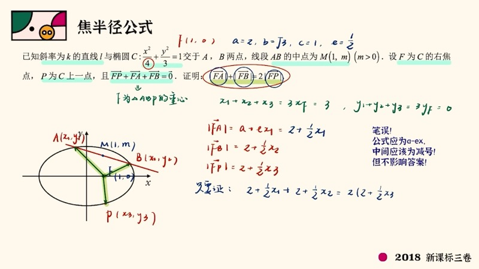
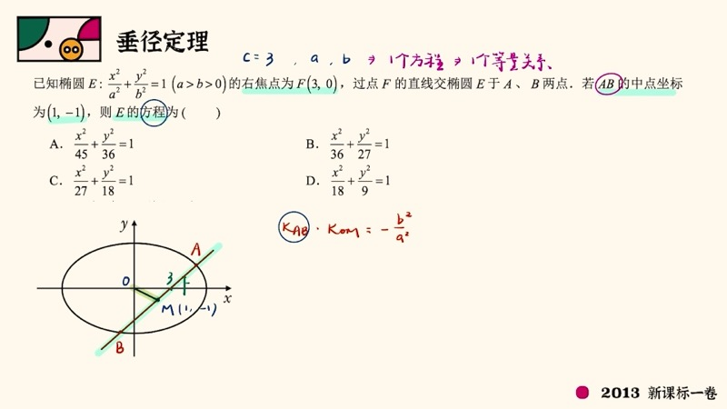
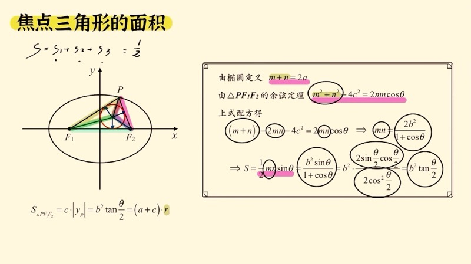

本课系统整理圆锥曲线（conic sections）中最常考、最重要的二级结论，涵盖焦半径公式（focal radius formula）、垂径定理（椭圆第三定义）、焦点三角形面积公式（focal triangle area formula）以及距离类经典结论。这些结论在高考选填题中可一步到位，大题中则需先推导再使用。

::: {.callout-note collapse="true"}
## 预备知识

- 椭圆（ellipse）标准方程：$\dfrac{x^2}{a^2} + \dfrac{y^2}{b^2} = 1 \;(a > b > 0)$
- 双曲线（hyperbola）标准方程：$\dfrac{x^2}{a^2} - \dfrac{y^2}{b^2} = 1 \;(a > 0,\; b > 0)$
- 椭圆定义：$|PF_1| + |PF_2| = 2a$；双曲线定义：$\bigl||PF_1| - |PF_2|\bigr| = 2a$
- 离心率（eccentricity）：$e = \dfrac{c}{a}$
- 椭圆 $c^2 = a^2 - b^2$；双曲线 $c^2 = a^2 + b^2$
- 焦点三角形面积公式（第一课内容）：$S = b^2\tan\dfrac{\theta}{2}$
:::

## 本课内容

- 焦半径公式（focal radius formula）：椭圆与双曲线的统一形式
- 垂径定理 / 椭圆第三定义（third definition）：$k_{PA} \cdot k_{PB} = -\dfrac{b^2}{a^2}$
- 焦点三角形面积的三种表达与"知一求二"
- 距离类结论：椭圆上点到原点 / 焦点距离的范围，双曲线焦点到渐近线距离

## 课程视频

```{=html}
<div class="video-container">
  <iframe src="//player.bilibili.com/player.html?bvid=BV1qH4y1B7dm&page=1" title="圆锥曲线最常考的二级结论" frameborder="0" scrolling="no" allowfullscreen></iframe>
</div>
```

## 课程关键帧







![距离类经典结论：椭圆上点到原点距离 $\in [b, a]$，焦点到渐近线距离 $= b$](../images/ch02/frame_04.jpg)

## 核心概念

### 一、焦半径公式（Focal Radius Formula）

#### 1. 椭圆的焦半径公式

设 $P(x_0, y_0)$ 在椭圆 $\dfrac{x^2}{a^2} + \dfrac{y^2}{b^2} = 1$ 上，$e = \dfrac{c}{a}$，则：

$$
\boxed{|PF_1| = a + ex_0, \qquad |PF_2| = a - ex_0}
$$

记忆口诀：**左加右减**。

**推导思路**：将 $P(x_0, y_0)$ 与 $F_1(-c, 0)$ 代入两点间距离公式 $|PF_1| = \sqrt{(x_0 + c)^2 + y_0^2}$，利用 $y_0^2 = b^2\!\left(1 - \dfrac{x_0^2}{a^2}\right)$ 代入展开，配方后得到完全平方式 $(a + ex_0)^2$，开根即得。

::: {.callout-important}
## 大题使用注意
小题可直接使用焦半径公式。大题中需先用两点间距离公式推导一个焦半径（如 $|PF_1|$），然后注明"同理可得"其余。
:::

**应用示例（2019 新课标三卷）**：椭圆 $\dfrac{x^2}{36} + \dfrac{y^2}{20} = 1$，$a = 6$，$b^2 = 20$，$c = 4$，$e = \dfrac{2}{3}$。$M$ 在第一象限，$\triangle MF_1F_2$ 为等腰三角形。由 $|MF_1| + |MF_2| = 12$，且焦距 $|F_1F_2| = 8$，推出 $|MF_1| = 8$，$|MF_2| = 4$。由焦半径公式 $8 = 6 + \dfrac{2}{3}x_0$，解得 $x_0 = 3$，代入椭圆方程求得 $y_0 = \sqrt{15}$。

#### 2. 双曲线的焦半径公式

双曲线 $\dfrac{x^2}{a^2} - \dfrac{y^2}{b^2} = 1$ 上的点 $P(x_0, y_0)$，无论 $P$ 在哪一支上：

$$
\boxed{|PF_1| = |a + ex_0|, \qquad |PF_2| = |a - ex_0|}
$$

::: {.callout-tip}
## 为什么需要绝对值？
当 $P$ 远离中心时，$|ex_0|$ 可能大于 $a$，导致括号内为负值。加绝对值确保距离为正。例如 $P$ 的横坐标为 $-100$、$a = 1$、$e = 2$ 时，$|PF_1| = |1 + 2\times(-100)| = |-199| = 199$。
:::

### 交互演示：椭圆第三定义斜率乘积（Desmos）

```{=html}
<div id="calc-third-def-ch02" class="desmos-container"></div>
<script src="https://www.desmos.com/api/v1.9/calculator.js?apiKey=dcb31709b452b1cf9dc26972add0fda6"></script>
<script>
(function() {
  var elt = document.getElementById('calc-third-def-ch02');
  var calc = Desmos.GraphingCalculator(elt, {
    expressions: true, settingsMenu: false, xAxisLabel: 'x', yAxisLabel: 'y'
  });
  calc.setExpression({ id: 'a', latex: 'a = 3', sliderBounds: { min: 1.5, max: 5, step: 0.1 } });
  calc.setExpression({ id: 'b', latex: 'b = 2', sliderBounds: { min: 0.5, max: 4, step: 0.1 } });
  calc.setExpression({ id: 'ellipse', latex: '\\frac{x^2}{a^2} + \\frac{y^2}{b^2} = 1', color: '#2d70b3' });
  calc.setExpression({ id: 'A', latex: '(-a, 0)', color: '#c74440', pointSize: 12, label: 'A(−a,0)', showLabel: true });
  calc.setExpression({ id: 'B', latex: '(a, 0)', color: '#c74440', pointSize: 12, label: 'B(a,0)', showLabel: true });
  calc.setExpression({ id: 't', latex: 't_0 = 1.2', sliderBounds: { min: 0.05, max: 3.1, step: 0.01 } });
  calc.setExpression({ id: 'Px', latex: 'P_x = a \\cos(t_0)' });
  calc.setExpression({ id: 'Py', latex: 'P_y = b \\sin(t_0)' });
  calc.setExpression({ id: 'P', latex: '(P_x, P_y)', color: '#388c46', pointSize: 12, label: 'P', showLabel: true });
  calc.setExpression({ id: 'lineAP', latex: 'y = \\frac{P_y}{P_x + a}(x + a)', color: '#fa7e19', lineWidth: 1.5 });
  calc.setExpression({ id: 'lineBP', latex: 'y = \\frac{P_y}{P_x - a}(x - a)', color: '#6042a6', lineWidth: 1.5 });
  calc.setExpression({ id: 'k_prod', latex: 'k = \\frac{P_y}{P_x + a} \\cdot \\frac{P_y}{P_x - a}' });
  calc.setExpression({ id: 'target', latex: 'k_0 = -\\frac{b^2}{a^2}' });
  calc.setMathBounds({ left: -6, right: 6, bottom: -4, top: 4 });
})();
</script>
```

拖动滑块 $t_0$ 移动点 $P$，观察 $k$ 的值始终等于 $k_0 = -\dfrac{b^2}{a^2}$，验证椭圆第三定义。

### 二、垂径定理 / 椭圆第三定义（Third Definition of Ellipse）

设 $A(-a, 0)$、$B(a, 0)$ 为椭圆左右顶点，$P(x_0, y_0)$ 是椭圆上异于 $A$、$B$ 的点。则：

$$
\boxed{k_{PA} \cdot k_{PB} = -\frac{b^2}{a^2}}
$$

**推导（点差法）**：设 $A(-a, 0)$，$B(a, 0)$ 关于原点对称。将 $P(x_0, y_0)$ 和 $A(-a, 0)$ 都代入椭圆方程后相减（点差法），利用平方差公式化简，最终得到 $k_{PA} \cdot k_{PB} = -\dfrac{b^2}{a^2}$。

::: {.callout-important}
## 垂径定理的三种形式

1. **过原点的弦形式**：$A$、$B$ 关于原点对称（即 $AB$ 过原点），$P$ 为椭圆上另一点 $\Rightarrow$ $k_{PA} \cdot k_{PB} = -\dfrac{b^2}{a^2}$
2. **左右顶点形式**：$A$、$B$ 为左右顶点（$AB$ 过原点的特殊情况），同样成立
3. **弦中点形式**：弦 $AB$ 的中点为 $M$，则 $k_{AB} \cdot k_{OM} = -\dfrac{b^2}{a^2}$（利用中位线，$OM$ 平行于 $PB$，斜率相同）
:::

**应用示例（2019 新课标二卷）**：已知 $A(-2, 0)$、$B(2, 0)$，动点 $M$ 满足 $k_{MA} \cdot k_{MB} = -\dfrac{1}{2}$，求 $M$ 的轨迹。由第三定义的逆用，$\dfrac{b^2}{a^2} = \dfrac{1}{2}$，$a = 2$，得 $b^2 = 2$，轨迹为椭圆 $\dfrac{x^2}{4} + \dfrac{y^2}{2} = 1$（需排除端点 $(\pm 2, 0)$，因为此时斜率不存在）。

**应用示例（2013 新课标一卷）**：弦 $AB$ 中点 $M(1, -1)$，右焦点 $F(3, 0)$。弦中点形式：$k_{AB} \cdot k_{OM} = -\dfrac{b^2}{a^2}$，其中 $k_{AB} = \dfrac{-1 - 0}{1 - 3} = \dfrac{1}{2}$，$k_{OM} = \dfrac{-1}{1} = -1$。于是 $\dfrac{1}{2} \times (-1) = -\dfrac{b^2}{a^2}$，得 $a^2 = 2b^2$。结合 $c = 3$ 求解即得椭圆方程。

### 交互演示：焦半径公式（Desmos）

```{=html}
<div id="calc-focal-radius-ch02" class="desmos-container"></div>
<script>
(function() {
  var elt = document.getElementById('calc-focal-radius-ch02');
  var calc = Desmos.GraphingCalculator(elt, {
    expressions: true, settingsMenu: false, xAxisLabel: 'x', yAxisLabel: 'y'
  });
  calc.setExpression({ id: 'a', latex: 'a = 3', sliderBounds: { min: 1.5, max: 5, step: 0.1 } });
  calc.setExpression({ id: 'b', latex: 'b = 2', sliderBounds: { min: 0.5, max: 4, step: 0.1 } });
  calc.setExpression({ id: 'ellipse', latex: '\\frac{x^2}{a^2} + \\frac{y^2}{b^2} = 1', color: '#2d70b3' });
  calc.setExpression({ id: 'c_val', latex: 'c_0 = \\sqrt{a^2 - b^2}' });
  calc.setExpression({ id: 'e_val', latex: 'e_0 = c_0 / a' });
  calc.setExpression({ id: 'F1', latex: '(-c_0, 0)', color: '#c74440', pointSize: 12, label: 'F₁', showLabel: true });
  calc.setExpression({ id: 'F2', latex: '(c_0, 0)', color: '#388c46', pointSize: 12, label: 'F₂', showLabel: true });
  calc.setExpression({ id: 't', latex: 't = 0.8', sliderBounds: { min: 0.05, max: 6.2, step: 0.01 } });
  calc.setExpression({ id: 'Px', latex: 'P_x = a \\cos(t)' });
  calc.setExpression({ id: 'Py', latex: 'P_y = b \\sin(t)' });
  calc.setExpression({ id: 'P', latex: '(P_x, P_y)', color: '#fa7e19', pointSize: 12, label: 'P', showLabel: true });
  calc.setExpression({ id: 'seg1', latex: '(1-s)(-c_0,0)+s(P_x,P_y)', color: '#c74440', parametricDomain: {min:0,max:1}, lineWidth: 2 });
  calc.setExpression({ id: 'seg2', latex: '(1-s)(c_0,0)+s(P_x,P_y)', color: '#388c46', parametricDomain: {min:0,max:1}, lineWidth: 2 });
  calc.setExpression({ id: 'pf1', latex: 'r_1 = a + e_0 \\cdot P_x' });
  calc.setExpression({ id: 'pf2', latex: 'r_2 = a - e_0 \\cdot P_x' });
  calc.setMathBounds({ left: -6, right: 6, bottom: -4, top: 4 });
})();
</script>
```

拖动滑块 $t$ 改变 $P$ 的位置，观察 $r_1 = a + ex_0$（红色）与 $r_2 = a - ex_0$（绿色）如何随 $P$ 的横坐标变化，且始终满足 $r_1 + r_2 = 2a$。

### 三、焦点三角形面积公式（Focal Triangle Area Formula）

设椭圆的两个焦点为 $F_1$、$F_2$，$P$ 为椭圆上一点，$\theta = \angle F_1PF_2$。焦点三角形 $\triangle PF_1F_2$ 的面积有三种表达：

| 表达方式 | 公式 | 核心变量 |
|:---------|:-----|:---------|
| 底乘高 | $S = c \cdot |y_P|$ | $P$ 点纵坐标 $y_P$ |
| 顶角公式 | $S = b^2\tan\dfrac{\theta}{2}$ | 顶角 $\theta$ |
| 内切圆半径 | $S = (a + c) \cdot r$ | 内切圆半径 $r$ |

::: {.callout-tip}
## 知一求二
这三个变量（$y_P$、$\theta$、$r$）中，**知二求一**——已知任意两个量，即可通过等面积法建立关于 $a$、$c$ 的等式，进而求出离心率或椭圆方程。
:::

**内切圆半径公式推导**：将 $\triangle PF_1F_2$ 以内切圆圆心 $I$ 为顶点分成三个小三角形，每个小三角形的高均为 $r$，底分别为 $|PF_1|$、$|PF_2|$、$|F_1F_2|$。因此 $S = \dfrac{1}{2}r(|PF_1| + |PF_2| + |F_1F_2|) = \dfrac{1}{2}r(2a + 2c) = (a + c)r$。

**双曲线的焦点三角形面积**：

$$
S_{\text{双曲线}} = b^2 \cdot \frac{1}{\tan\dfrac{\theta}{2}} = \frac{b^2}{\tan\dfrac{\theta}{2}}
$$

### 交互演示：焦点三角形面积（Desmos）

```{=html}
<div id="calc-focal-tri-ch02" class="desmos-container"></div>
<script>
(function() {
  var elt = document.getElementById('calc-focal-tri-ch02');
  var calc = Desmos.GraphingCalculator(elt, {
    expressions: true, settingsMenu: false, xAxisLabel: 'x', yAxisLabel: 'y'
  });
  calc.setExpression({ id: 'a', latex: 'a = 3', sliderBounds: { min: 1.5, max: 5, step: 0.1 } });
  calc.setExpression({ id: 'b', latex: 'b = 2', sliderBounds: { min: 0.5, max: 4, step: 0.1 } });
  calc.setExpression({ id: 'ellipse', latex: '\\frac{x^2}{a^2} + \\frac{y^2}{b^2} = 1', color: '#2d70b3' });
  calc.setExpression({ id: 'c_val', latex: 'c_0 = \\sqrt{a^2 - b^2}' });
  calc.setExpression({ id: 'F1', latex: '(-c_0, 0)', color: '#c74440', pointSize: 12, label: 'F₁', showLabel: true });
  calc.setExpression({ id: 'F2', latex: '(c_0, 0)', color: '#c74440', pointSize: 12, label: 'F₂', showLabel: true });
  calc.setExpression({ id: 't', latex: 't = 1.0', sliderBounds: { min: 0.05, max: 3.1, step: 0.01 } });
  calc.setExpression({ id: 'Px', latex: 'P_x = a \\cos(t)' });
  calc.setExpression({ id: 'Py', latex: 'P_y = b \\sin(t)' });
  calc.setExpression({ id: 'P', latex: '(P_x, P_y)', color: '#388c46', pointSize: 12, label: 'P', showLabel: true });
  calc.setExpression({ id: 'seg1', latex: '(1-s)(-c_0,0)+s(P_x,P_y)', color: '#fa7e19', parametricDomain: {min:0,max:1}, lineWidth: 2 });
  calc.setExpression({ id: 'seg2', latex: '(1-s)(c_0,0)+s(P_x,P_y)', color: '#fa7e19', parametricDomain: {min:0,max:1}, lineWidth: 2 });
  calc.setExpression({ id: 'seg3', latex: '(1-s)(-c_0,0)+s(c_0,0)', color: '#fa7e19', parametricDomain: {min:0,max:1}, lineWidth: 2 });
  calc.setMathBounds({ left: -6, right: 6, bottom: -4, top: 4 });
})();
</script>
```

拖动滑块 $t$ 改变点 $P$ 在椭圆上的位置，观察焦点三角形的形状变化。

### 四、距离类经典结论（Distance Conclusions）

#### 1. 椭圆上点到原点的距离

$$
b \leqslant |OP| \leqslant a
$$

最短在短轴端点（$|OP| = b$），最长在长轴端点（$|OP| = a$）。

#### 2. 椭圆上点到焦点的距离

由焦半径公式 $|PF_1| = a + ex_0$ 知，$|PF_1|$ 关于 $x_0$ 单调递增。$x_0 \in [-a, a]$，故：

$$
a - c \leqslant |PF_1| \leqslant a + c
$$

右端点时 $|PF_1|$ 最大（远日点），左端点时最小（近日点）。

#### 3. 双曲线焦点到渐近线的距离

$$
d(F, \text{渐近线}) = b
$$

由点到直线距离公式可验证：渐近线 $y = \dfrac{b}{a}x$ 即 $bx - ay = 0$，焦点 $F(c, 0)$ 到该直线的距离为 $\dfrac{|bc|}{\sqrt{a^2 + b^2}} = \dfrac{bc}{c} = b$。

::: {.callout-tip}
## 双曲线 ABC 直角三角形
焦点 $F$ 到渐近线的垂足 $H$、原点 $O$、焦点 $F$ 构成直角三角形，三边分别为 $a$、$b$、$c$（斜边 $OF = c$，直角边 $FH = b$，$OH = a$）。这一构型在高考中反复出现。
:::

**应用示例**：椭圆上存在点 $P$ 使 $PF_1$ 中垂线过 $F_2$，求离心率范围。条件等价于 $|PF_2| = |F_1F_2| = 2c$。由 $a - c \leqslant |PF_2| \leqslant a + c$，得 $a - c \leqslant 2c \leqslant a + c$，即 $e \geqslant \dfrac{1}{3}$（右侧不等式自然成立）。结合 $0 < e < 1$，得 $e \in \left[\dfrac{1}{3},\; 1\right)$。

### D3 动画：椭圆第三定义动画

```{=html}
<div class="d3-container" id="d3-third-def-ch02">
  <svg id="svg-third-def-ch02" width="600" height="400"></svg>
  <div class="d3-controls" id="controls-third-def-ch02">
    <label>拖动椭圆上的点 P，观察 k<sub>PA</sub> · k<sub>PB</sub> 始终为定值</label><br>
    <label>a = <input type="range" id="td-slider-a" min="2" max="5" step="0.1" value="3"><span id="td-val-a">3</span></label>
    <label>b = <input type="range" id="td-slider-b" min="1" max="4" step="0.1" value="2"><span id="td-val-b">2</span></label>
  </div>
  <div id="td-info" style="font-family: 'KaTeX_Main', serif; font-size: 15px; padding: 8px; background: #f8f8f8; border-radius: 6px; margin-top: 6px;"></div>
</div>
<script src="https://d3js.org/d3.v7.min.js"></script>
<script>
(function() {
  var W = 600, H = 400, margin = 40;
  var svg = d3.select('#svg-third-def-ch02');
  svg.selectAll('*').remove();

  var a = 3, b = 2, angle = 1.0;

  function toSVG(x, y) {
    var scale = (W - 2*margin) / (2*a*1.4);
    return [W/2 + x*scale, H/2 - y*scale];
  }

  function ellipsePoints(n) {
    var pts = [];
    for (var i = 0; i <= n; i++) {
      var t = 2*Math.PI*i/n;
      pts.push(toSVG(a*Math.cos(t), b*Math.sin(t)));
    }
    return pts;
  }

  // Axes
  svg.append('line').attr('x1',margin).attr('y1',H/2).attr('x2',W-margin).attr('y2',H/2).attr('stroke','#ccc').attr('stroke-width',1);
  svg.append('line').attr('x1',W/2).attr('y1',margin).attr('x2',W/2).attr('y2',H-margin).attr('stroke','#ccc').attr('stroke-width',1);

  var ellipsePath = svg.append('path').attr('fill','none').attr('stroke','#2d70b3').attr('stroke-width',2);
  var lineAP = svg.append('line').attr('stroke','#fa7e19').attr('stroke-width',2);
  var lineBP = svg.append('line').attr('stroke','#6042a6').attr('stroke-width',2);
  var dotA = svg.append('circle').attr('r',6).attr('fill','#c74440');
  var dotB = svg.append('circle').attr('r',6).attr('fill','#c74440');
  var dotP = svg.append('circle').attr('r',7).attr('fill','#388c46').attr('cursor','pointer');
  var lblA = svg.append('text').text('A').attr('font-size',14).attr('fill','#c74440');
  var lblB = svg.append('text').text('B').attr('font-size',14).attr('fill','#c74440');
  var lblP = svg.append('text').text('P').attr('font-size',14).attr('fill','#388c46');

  function update() {
    var px = a*Math.cos(angle), py = b*Math.sin(angle);
    var pA = toSVG(-a,0), pB = toSVG(a,0), pP = toSVG(px,py);

    var line = d3.line().x(function(d){return d[0];}).y(function(d){return d[1];});
    ellipsePath.attr('d', line(ellipsePoints(200)));

    lineAP.attr('x1',pA[0]).attr('y1',pA[1]).attr('x2',pP[0]).attr('y2',pP[1]);
    lineBP.attr('x1',pB[0]).attr('y1',pB[1]).attr('x2',pP[0]).attr('y2',pP[1]);

    dotA.attr('cx',pA[0]).attr('cy',pA[1]);
    dotB.attr('cx',pB[0]).attr('cy',pB[1]);
    dotP.attr('cx',pP[0]).attr('cy',pP[1]);

    lblA.attr('x',pA[0]-18).attr('y',pA[1]+20);
    lblB.attr('x',pB[0]+8).attr('y',pB[1]+20);
    lblP.attr('x',pP[0]+10).attr('y',pP[1]-10);

    var kPA = py / (px + a);
    var kPB = py / (px - a);
    var prod = kPA * kPB;
    var target = -(b*b)/(a*a);

    document.getElementById('td-info').innerHTML =
      'P = (' + px.toFixed(2) + ', ' + py.toFixed(2) + ')' +
      '<br><span style="color:#fa7e19">k<sub>PA</sub> = ' + kPA.toFixed(4) + '</span>' +
      ' &nbsp;&nbsp; <span style="color:#6042a6">k<sub>PB</sub> = ' + kPB.toFixed(4) + '</span>' +
      '<br>k<sub>PA</sub> · k<sub>PB</sub> = ' + prod.toFixed(4) +
      ' &nbsp;&nbsp; −b²/a² = ' + target.toFixed(4);
  }

  var drag = d3.drag().on('drag', function(event) {
    var scale = (W-2*margin)/(2*a*1.4);
    var sx = (event.x - W/2)/scale;
    var sy = -(event.y - H/2)/scale;
    angle = Math.atan2(sy/b, sx/a);
    update();
  });
  dotP.call(drag);

  d3.select('#td-slider-a').on('input', function() {
    a = +this.value;
    if (b >= a) { b = a-0.1; d3.select('#td-slider-b').property('value',b); d3.select('#td-val-b').text(b.toFixed(1)); }
    d3.select('#td-val-a').text(a.toFixed(1));
    update();
  });
  d3.select('#td-slider-b').on('input', function() {
    b = +this.value;
    if (b >= a) { b = a-0.1; d3.select('#td-slider-b').property('value',b); }
    d3.select('#td-val-b').text(b.toFixed(1));
    update();
  });

  update();
})();
</script>
```

拖动绿色点 $P$ 在椭圆上移动，可实时观察 $k_{PA}$、$k_{PB}$ 的值及其乘积始终等于 $-\dfrac{b^2}{a^2}$。

### D3 动画：焦点弦性质

```{=html}
<div class="d3-container" id="d3-focal-chord-ch02">
  <svg id="svg-focal-chord-ch02" width="600" height="400"></svg>
  <div class="d3-controls" id="controls-focal-chord-ch02">
    <label>旋转过焦点的弦，观察弦长公式变化</label><br>
    <label>倾斜角 α = <input type="range" id="fc-slider-alpha" min="10" max="170" step="1" value="90"><span id="fc-val-alpha">90</span>°</label>
    <button id="fc-play-ch02">&#9654; 播放</button>
    <button id="fc-pause-ch02">&#9724; 暂停</button>
  </div>
  <div id="fc-info" style="font-family: 'KaTeX_Main', serif; font-size: 15px; padding: 8px; background: #f8f8f8; border-radius: 6px; margin-top: 6px;"></div>
</div>
<script>
(function() {
  var W = 600, H = 400, margin = 40;
  var svg = d3.select('#svg-focal-chord-ch02');
  svg.selectAll('*').remove();

  var a = 3, b = 2, alphaDeg = 90, animating = false, animTimer = null;
  function c() { return Math.sqrt(a*a - b*b); }

  function toSVG(x, y) {
    var scale = (W-2*margin)/(2*a*1.4);
    return [W/2 + x*scale, H/2 - y*scale];
  }

  function ellipsePoints(n) {
    var pts = [];
    for (var i = 0; i <= n; i++) {
      var t = 2*Math.PI*i/n;
      pts.push(toSVG(a*Math.cos(t), b*Math.sin(t)));
    }
    return pts;
  }

  // Find intersection of line through focus with ellipse
  function chordEndpoints(alpha) {
    var cv = c();
    var cosA = Math.cos(alpha), sinA = Math.sin(alpha);
    // Parametric: x = cv + t*cosA, y = t*sinA
    // Substitute into ellipse: (cv+t*cosA)^2/a^2 + (t*sinA)^2/b^2 = 1
    var A2 = cosA*cosA/(a*a) + sinA*sinA/(b*b);
    var B2 = 2*cv*cosA/(a*a);
    var C2 = cv*cv/(a*a) - 1;
    var disc = B2*B2 - 4*A2*C2;
    if (disc < 0) return null;
    var sqrtD = Math.sqrt(disc);
    var t1 = (-B2 + sqrtD)/(2*A2);
    var t2 = (-B2 - sqrtD)/(2*A2);
    return {
      p1: [cv + t1*cosA, t1*sinA],
      p2: [cv + t2*cosA, t2*sinA],
      len: Math.abs(t1 - t2)
    };
  }

  // Axes
  svg.append('line').attr('x1',margin).attr('y1',H/2).attr('x2',W-margin).attr('y2',H/2).attr('stroke','#ccc').attr('stroke-width',1);
  svg.append('line').attr('x1',W/2).attr('y1',margin).attr('x2',W/2).attr('y2',H-margin).attr('stroke','#ccc').attr('stroke-width',1);

  var ellipsePath = svg.append('path').attr('fill','none').attr('stroke','#2d70b3').attr('stroke-width',2);
  var chordLine = svg.append('line').attr('stroke','#fa7e19').attr('stroke-width',2.5);
  var dotF = svg.append('circle').attr('r',5).attr('fill','#c74440');
  var dotP1 = svg.append('circle').attr('r',5).attr('fill','#388c46');
  var dotP2 = svg.append('circle').attr('r',5).attr('fill','#388c46');
  var lblF = svg.append('text').text('F₂').attr('font-size',13).attr('fill','#c74440');

  function update() {
    var cv = c();
    var alpha = alphaDeg * Math.PI / 180;

    var line = d3.line().x(function(d){return d[0];}).y(function(d){return d[1];});
    ellipsePath.attr('d', line(ellipsePoints(200)));

    var f = toSVG(cv, 0);
    dotF.attr('cx',f[0]).attr('cy',f[1]);
    lblF.attr('x',f[0]+8).attr('y',f[1]+18);

    var ep = chordEndpoints(alpha);
    if (!ep) return;

    var s1 = toSVG(ep.p1[0], ep.p1[1]);
    var s2 = toSVG(ep.p2[0], ep.p2[1]);

    chordLine.attr('x1',s1[0]).attr('y1',s1[1]).attr('x2',s2[0]).attr('y2',s2[1]);
    dotP1.attr('cx',s1[0]).attr('cy',s1[1]);
    dotP2.attr('cx',s2[0]).attr('cy',s2[1]);

    // Focal chord length formula: 2ab^2 / (a^2 - c^2 cos^2 alpha)
    var cosAlpha = Math.cos(alpha);
    var formulaLen = 2*a*b*b / (a*a - cv*cv*cosAlpha*cosAlpha);
    var actualLen = ep.len;

    document.getElementById('fc-info').innerHTML =
      'α = ' + alphaDeg + '°' +
      ' &nbsp;&nbsp; 弦长 |PQ| = ' + actualLen.toFixed(3) +
      '<br>公式：2ab²/(a² − c²cos²α) = ' + formulaLen.toFixed(3) +
      '<br>通径（α=90°时）：2b²/a = ' + (2*b*b/a).toFixed(3);
  }

  d3.select('#fc-slider-alpha').on('input', function() {
    alphaDeg = +this.value;
    d3.select('#fc-val-alpha').text(alphaDeg);
    update();
  });

  function startAnim() {
    if (animating) return;
    animating = true;
    var t0 = alphaDeg;
    animTimer = d3.timer(function(elapsed) {
      alphaDeg = ((t0 + elapsed * 0.03) % 160) + 10;
      d3.select('#fc-slider-alpha').property('value', Math.round(alphaDeg));
      d3.select('#fc-val-alpha').text(Math.round(alphaDeg));
      update();
    });
  }
  function stopAnim() {
    animating = false;
    if (animTimer) { animTimer.stop(); animTimer = null; }
  }

  d3.select('#fc-play-ch02').on('click', startAnim);
  d3.select('#fc-pause-ch02').on('click', stopAnim);

  update();
})();
</script>
```

拖动倾斜角滑块或点击"播放"按钮，观察过右焦点 $F_2$ 的弦旋转时弦长的变化，并验证焦点弦长公式 $|PQ| = \dfrac{2ab^2}{a^2 - c^2\cos^2\alpha}$。当 $\alpha = 90°$ 时，弦即为通径（semi-latus rectum），长度 $= \dfrac{2b^2}{a}$。

## 速查表

::: {.key-formula}

| 结论名称 | 公式 | 适用条件 |
|:---------|:-----|:---------|
| 椭圆焦半径 | $\|PF_1\| = a + ex_0$，$\|PF_2\| = a - ex_0$ | $P(x_0, y_0)$ 在椭圆上，左加右减 |
| 双曲线焦半径 | $\|PF_1\| = \|a + ex_0\|$，$\|PF_2\| = \|a - ex_0\|$ | $P(x_0, y_0)$ 在双曲线上，需绝对值 |
| 垂径定理（第三定义） | $k_{PA} \cdot k_{PB} = -\dfrac{b^2}{a^2}$ | $A$、$B$ 关于中心对称，$P$ 在椭圆上 |
| 垂径定理（弦中点） | $k_{AB} \cdot k_{OM} = -\dfrac{b^2}{a^2}$ | $M$ 为弦 $AB$ 中点，$O$ 为原点 |
| 双曲线垂径定理 | $k_{PA} \cdot k_{PB} = +\dfrac{b^2}{a^2}$ | 注意正号！ |
| 焦点三角形面积（底高） | $S = c \cdot \|y_P\|$ | $P$ 在椭圆上 |
| 焦点三角形面积（顶角） | $S = b^2\tan\dfrac{\theta}{2}$（椭圆），$S = \dfrac{b^2}{\tan\frac{\theta}{2}}$（双曲线） | $\theta = \angle F_1PF_2$ |
| 焦点三角形面积（内切圆） | $S = (a + c) \cdot r$ | $r$ 为内切圆半径 |
| 椭圆上点到原点距离 | $b \leqslant \|OP\| \leqslant a$ | 短轴端点最近，长轴端点最远 |
| 椭圆上点到焦点距离 | $a - c \leqslant \|PF\| \leqslant a + c$ | 近日点 $a-c$，远日点 $a+c$ |
| 焦点到渐近线距离 | $d = b$ | 双曲线，$F$ 到任一渐近线 |
| 双曲线 ABC 三角形 | 直角边 $a$、$b$，斜边 $c$ | $O$、$H$（垂足）、$F$ 构成 |
| 焦点弦长 | $\|PQ\| = \dfrac{2ab^2}{a^2 - c^2\cos^2\alpha}$ | 过焦点弦，倾斜角 $\alpha$ |
| 焦点弦三角形周长 | 椭圆：$4a$；焦点三角形：$2a + 2c$ | 过焦点弦与另一焦点构成三角形 |

:::
