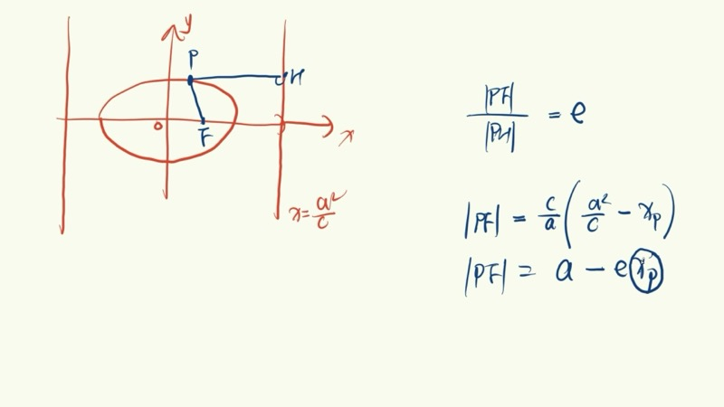
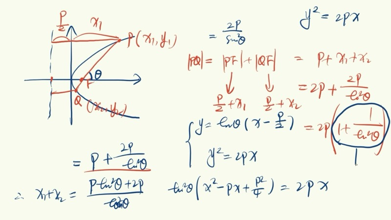
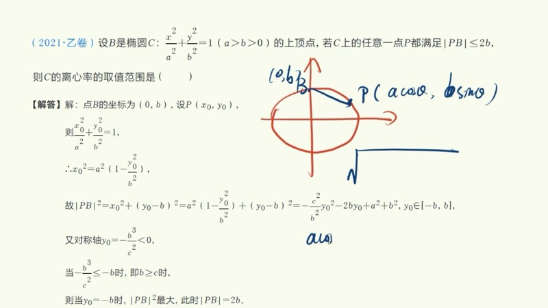
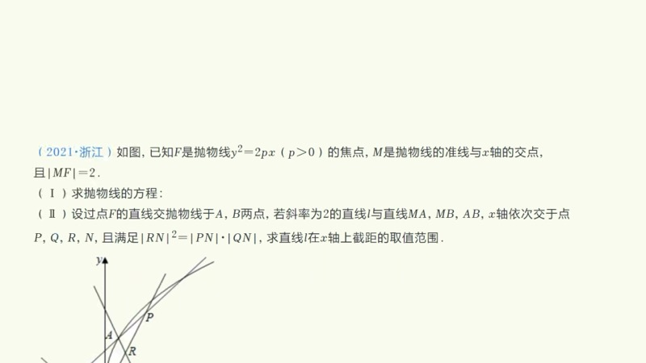

本课对圆锥曲线（conic sections）的实用性质与方法进行全面梳理，包括椭圆定义的对称性扩展与代数应用、焦半径公式的第二定义推导、双曲线渐近线性质、参数方程（parametric equations）、弦长公式（chord length formula）、夹角公式、点差法（point-difference method）以及相似三角形在距离比值中的应用。

::: {.callout-note collapse="true"}
## 预备知识

- 椭圆（ellipse）、双曲线（hyperbola）、抛物线（parabola）的标准方程与定义
- 离心率（eccentricity）：$e = \dfrac{c}{a}$
- 椭圆第二定义（second definition）：点到焦点距离与到同侧准线距离之比为 $e$
- 准线（directrix）方程：$x = \pm\dfrac{a^2}{c}$（椭圆）
- 三角函数基本恒等式：$\sin^2\alpha + \cos^2\alpha = 1$，$\sec^2\alpha - \tan^2\alpha = 1$
- 基本不等式（AM-GM inequality）：$\dfrac{m+n}{2} \geqslant \sqrt{mn}$
:::

## 本课内容

- 椭圆第一定义的对称性扩展与代数应用（基本不等式）
- 焦半径公式的第二定义推导
- 双曲线渐近线方程及焦点-渐近线直角三角形
- 椭圆、双曲线、抛物线的参数方程
- 弦长公式（正式与反式）与两直线夹角公式
- 点差法解决中点弦问题
- 相似三角形法处理距离比值问题

## 课程视频

```{=html}
<div class="video-container">
  <iframe src="//player.bilibili.com/player.html?bvid=BV1iq4y1B7Km&page=1" title="圆锥曲线实用性质全梳理" frameborder="0" scrolling="no" allowfullscreen></iframe>
</div>
```

## 课程关键帧









## 核心概念

### 一、椭圆定义的深层应用

#### 1. 对称性扩展（Symmetry Extension）

椭圆关于原点中心对称。若过原点的直线交椭圆于 $A$、$B$ 两点，焦点为 $F$，则 $OAOF_1$ 构成平行四边形（对角线互相平分），因此 $|AF| = |BF_1|$。

这意味着：$|AF| + |BF| = |BF_1| + |BF| = 2a$，从而将**同侧**两段焦半径转化为椭圆第一定义。

**应用**：若已知 $|FA| + |FB| = 4$，其中 $A$、$B$ 关于原点对称，$F$ 为一个焦点，则 $2a = 4$，$a = 2$。

#### 2. 代数应用（AM-GM Inequality）

椭圆第一定义 $|PF_1| + |PF_2| = 2a$ 是两个正数之**和**为定值的条件。由基本不等式：

$$
|PF_1| \cdot |PF_2| \leqslant \left(\frac{|PF_1| + |PF_2|}{2}\right)^2 = a^2
$$

当且仅当 $|PF_1| = |PF_2|$（即 $P$ 在短轴端点）时取等号。

**应用示例（2021 新课标一卷）**：椭圆 $\dfrac{x^2}{9} + \dfrac{y^2}{b^2} = 1$，$a^2 = 9$，$a = 3$。$M$ 为椭圆上一点，求 $|MF_1| \cdot |MF_2|$ 的最大值。由基本不等式，$|MF_1| \cdot |MF_2| \leqslant a^2 = 9$。

### 二、焦半径公式的第二定义推导

椭圆的第二定义：椭圆上的点到焦点的距离与到同侧准线的距离之比恒为 $e$：

$$
\frac{|PF|}{d(P, l)} = e
$$

设 $P(x_0, y_0)$，左焦点 $F_1(-c, 0)$，左准线 $x = -\dfrac{a^2}{c}$。则：

$$
|PF_1| = e \cdot d(P, l) = \frac{c}{a}\left(x_0 + \frac{a^2}{c}\right) = \frac{c}{a} \cdot x_0 + a = a + ex_0
$$

同理 $|PF_2| = a - ex_0$。推导特别简洁——只需一步代入即可。

### 三、双曲线渐近线（Asymptotes of Hyperbola）

#### 渐近线方程快速求法

将双曲线方程 $\dfrac{x^2}{a^2} - \dfrac{y^2}{b^2} = 1$ 右边的 $1$ 改为 $0$，分解因式即得渐近线：

$$
y = \pm\frac{b}{a}x
$$

#### 焦点-渐近线直角三角形

过焦点 $F(c, 0)$ 向渐近线作垂线，垂足为 $H$。则 $\triangle OHF$ 为直角三角形，三边为：

- 斜边 $OF = c$
- 直角边 $FH = b$（焦点到渐近线距离）
- 直角边 $OH = a$

渐近线的倾斜角 $\alpha$ 满足 $\tan\alpha = \dfrac{b}{a}$，且 $a^2 + b^2 = c^2$，两条关系恰好自洽。

### 交互演示：椭圆参数方程（Desmos）

```{=html}
<div id="calc-parametric-ch03" class="desmos-container"></div>
<script src="https://www.desmos.com/api/v1.9/calculator.js?apiKey=dcb31709b452b1cf9dc26972add0fda6"></script>
<script>
(function() {
  var elt = document.getElementById('calc-parametric-ch03');
  var calc = Desmos.GraphingCalculator(elt, {
    expressions: true, settingsMenu: false, xAxisLabel: 'x', yAxisLabel: 'y'
  });
  calc.setExpression({ id: 'a', latex: 'a = 3', sliderBounds: { min: 1.5, max: 5, step: 0.1 } });
  calc.setExpression({ id: 'b', latex: 'b = 2', sliderBounds: { min: 0.5, max: 4, step: 0.1 } });
  calc.setExpression({ id: 'ellipse', latex: '\\frac{x^2}{a^2} + \\frac{y^2}{b^2} = 1', color: '#2d70b3' });
  calc.setExpression({ id: 'alpha', latex: '\\alpha_0 = 1.0', sliderBounds: { min: 0, max: 6.28, step: 0.01 } });
  calc.setExpression({ id: 'Px', latex: 'P_x = a \\cos(\\alpha_0)' });
  calc.setExpression({ id: 'Py', latex: 'P_y = b \\sin(\\alpha_0)' });
  calc.setExpression({ id: 'P', latex: '(P_x, P_y)', color: '#388c46', pointSize: 12, label: 'P(acosα, bsinα)', showLabel: true });
  calc.setExpression({ id: 'proj_x', latex: '(P_x, 0)', color: '#fa7e19', pointSize: 8, label: 'x₀', showLabel: true });
  calc.setExpression({ id: 'proj_y', latex: '(0, P_y)', color: '#6042a6', pointSize: 8, label: 'y₀', showLabel: true });
  calc.setExpression({ id: 'vline', latex: 'x = P_x', color: '#fa7e19', lineWidth: 1, lineStyle: 'DASHED' });
  calc.setExpression({ id: 'hline', latex: 'y = P_y', color: '#6042a6', lineWidth: 1, lineStyle: 'DASHED' });
  calc.setMathBounds({ left: -6, right: 6, bottom: -4, top: 4 });
})();
</script>
```

拖动滑块 $\alpha_0$ 观察参数 $\alpha$ 如何控制点 $P = (a\cos\alpha,\; b\sin\alpha)$ 在椭圆上的位置。注意 $\alpha$ 不是 $OP$ 与 $x$ 轴的夹角，而是参数角。

### 四、参数方程（Parametric Equations）

#### 1. 椭圆

由 $\sin^2\alpha + \cos^2\alpha = 1$ 与 $\dfrac{x^2}{a^2} + \dfrac{y^2}{b^2} = 1$ 的形式类比，令 $\dfrac{x}{a} = \cos\alpha$，$\dfrac{y}{b} = \sin\alpha$：

$$
\boxed{x = a\cos\alpha, \quad y = b\sin\alpha}
$$

只用一个参数 $\alpha$ 即可表示椭圆上任意一点。

#### 2. 双曲线

由 $\sec^2\alpha - \tan^2\alpha = 1$ 与 $\dfrac{x^2}{a^2} - \dfrac{y^2}{b^2} = 1$ 类比：

$$
\boxed{x = \frac{a}{\cos\alpha}, \quad y = b\tan\alpha}
$$

#### 3. 抛物线

$y^2 = 2px$。令 $y = 2pt$，则 $x = 2pt^2$：

$$
\boxed{x = 2pt^2, \quad y = 2pt}
$$

::: {.callout-tip}
## 适用场景
参数方程适合**单动点问题**——题目给出"椭圆上某点 $P$ 运动，求某量的最值"时，只需设一个参数即可表达 $P$ 的坐标，避免引入两个未知数。
:::

**应用示例（2021 乙卷）**：椭圆上顶点 $B(0, b)$，椭圆上任意点 $P$，$|PB| \leqslant 2$。设 $P = (a\cos\alpha,\; b\sin\alpha)$，则 $|PB|^2 = a^2\cos^2\alpha + (b\sin\alpha - b)^2$。展开后利用参数分离求离心率取值范围。

### 交互演示：双曲线渐近线与 ABC 三角形（Desmos）

```{=html}
<div id="calc-asymptote-ch03" class="desmos-container"></div>
<script>
(function() {
  var elt = document.getElementById('calc-asymptote-ch03');
  var calc = Desmos.GraphingCalculator(elt, {
    expressions: true, settingsMenu: false, xAxisLabel: 'x', yAxisLabel: 'y'
  });
  calc.setExpression({ id: 'a', latex: 'a = 2', sliderBounds: { min: 0.5, max: 4, step: 0.1 } });
  calc.setExpression({ id: 'b', latex: 'b = 1.5', sliderBounds: { min: 0.5, max: 4, step: 0.1 } });
  calc.setExpression({ id: 'hyp', latex: '\\frac{x^2}{a^2} - \\frac{y^2}{b^2} = 1', color: '#2d70b3' });
  calc.setExpression({ id: 'asym1', latex: 'y = \\frac{b}{a}x', color: '#888', lineWidth: 1.5, lineStyle: 'DASHED' });
  calc.setExpression({ id: 'asym2', latex: 'y = -\\frac{b}{a}x', color: '#888', lineWidth: 1.5, lineStyle: 'DASHED' });
  calc.setExpression({ id: 'c_val', latex: 'c_0 = \\sqrt{a^2 + b^2}' });
  calc.setExpression({ id: 'F', latex: '(c_0, 0)', color: '#c74440', pointSize: 12, label: 'F(c,0)', showLabel: true });
  // Foot of perpendicular from F to asymptote y = (b/a)x
  // H = (a^2*c/(a^2+b^2), ab*c/(a^2+b^2)) = (a^2/c, ab/c)
  calc.setExpression({ id: 'Hx', latex: 'H_x = \\frac{a^2}{c_0}' });
  calc.setExpression({ id: 'Hy', latex: 'H_y = \\frac{a \\cdot b}{c_0}' });
  calc.setExpression({ id: 'H', latex: '(H_x, H_y)', color: '#388c46', pointSize: 10, label: 'H', showLabel: true });
  calc.setExpression({ id: 'segOF', latex: '(1-s)(0,0)+s(c_0,0)', color: '#c74440', parametricDomain:{min:0,max:1}, lineWidth: 2 });
  calc.setExpression({ id: 'segFH', latex: '(1-s)(c_0,0)+s(H_x,H_y)', color: '#388c46', parametricDomain:{min:0,max:1}, lineWidth: 2 });
  calc.setExpression({ id: 'segOH', latex: '(1-s)(0,0)+s(H_x,H_y)', color: '#6042a6', parametricDomain:{min:0,max:1}, lineWidth: 2 });
  calc.setMathBounds({ left: -5, right: 5, bottom: -4, top: 4 });
})();
</script>
```

调节 $a$、$b$ 的值，观察双曲线的渐近线变化以及 $\triangle OHF$（紫 $= a$，绿 $= b$，红 $= c$）始终为直角三角形。

### 五、弦长公式与夹角公式

#### 弦长公式（Chord Length Formula）

设直线 $y = kx + m$ 与曲线交于 $A(x_1, y_1)$、$B(x_2, y_2)$：

$$
|AB| = \sqrt{1 + k^2}\;|x_1 - x_2|
$$

**反式**：若直线设为 $x = my + n$（避免斜率不存在的分类讨论），则：

$$
|AB| = \sqrt{1 + m^2}\;|y_1 - y_2|
$$

其中 $m = \dfrac{1}{k}$。

#### 两直线夹角公式（Angle Between Two Lines）

设两直线斜率分别为 $k_1$、$k_2$，夹角为 $\alpha$：

$$
\tan\alpha = \left|\frac{k_1 - k_2}{1 + k_1 k_2}\right|
$$

推导来自正切差角公式 $\tan(\alpha_1 - \alpha_2) = \dfrac{\tan\alpha_1 - \tan\alpha_2}{1 + \tan\alpha_1\tan\alpha_2}$，取绝对值确保求夹角（而非有向角）。

### 六、点差法（Point-Difference Method）

点差法用于解决**中点弦问题**（midpoint-chord problem）。

**方法**：设弦两端 $A(x_1, y_1)$、$B(x_2, y_2)$ 都在椭圆上，代入椭圆方程后**两式相减**：

$$
\frac{x_1^2 - x_2^2}{a^2} + \frac{y_1^2 - y_2^2}{b^2} = 0
$$

利用平方差公式：

$$
\frac{(x_1 + x_2)(x_1 - x_2)}{a^2} + \frac{(y_1 + y_2)(y_1 - y_2)}{b^2} = 0
$$

设中点 $M\!\left(\dfrac{x_1 + x_2}{2},\; \dfrac{y_1 + y_2}{2}\right)$，弦斜率 $k = \dfrac{y_1 - y_2}{x_1 - x_2}$，整理得：

$$
\boxed{k_{AB} = -\frac{b^2}{a^2} \cdot \frac{x_1 + x_2}{y_1 + y_2} = -\frac{b^2}{a^2} \cdot \frac{x_M}{y_M}}
$$

::: {.callout-note}
## 记忆口诀
**点差法 = 代入 + 相减**。名字本身就是方法：把**点**代入方程，然后做**差**。
:::

### 七、相似三角形法处理距离比值

当过 $x$ 轴上一点的直线与曲线交于两点 $P$、$Q$ 时，线段比值问题可利用相似三角形转化为**纵坐标之比**。

设 $F$ 在 $x$ 轴上，直线过 $F$ 交曲线于 $P$、$Q$，则：

$$
\frac{|PF|}{|QF|} = \frac{|y_P|}{|y_Q|}
$$

这一技巧避免了使用两点间距离公式的复杂计算，在高考解析几何大题中经常出现。

**应用示例（2021 浙江卷）**：条件 $|RN|^2 = |PN| \cdot |QN|$ 中，$R$、$P$、$Q$ 均在过 $x$ 轴上点 $N$ 的直线上。利用相似三角形将各线段转化为纵坐标：$\dfrac{|RN|}{|PN|} = \dfrac{|y_R|}{|y_P|}$，$\dfrac{|QN|}{|RN|} = \dfrac{|y_Q|}{|y_R|}$，得 $y_P \cdot y_Q = -y_R^2$（注意符号）。

### 交互演示：抛物线焦点弦（Desmos）

```{=html}
<div id="calc-parabola-ch03" class="desmos-container"></div>
<script>
(function() {
  var elt = document.getElementById('calc-parabola-ch03');
  var calc = Desmos.GraphingCalculator(elt, {
    expressions: true, settingsMenu: false, xAxisLabel: 'x', yAxisLabel: 'y'
  });
  calc.setExpression({ id: 'p', latex: 'p = 1', sliderBounds: { min: 0.5, max: 3, step: 0.1 } });
  calc.setExpression({ id: 'parab', latex: 'y^2 = 2px', color: '#2d70b3' });
  calc.setExpression({ id: 'focus', latex: '(p/2, 0)', color: '#c74440', pointSize: 12, label: 'F', showLabel: true });
  calc.setExpression({ id: 'directrix', latex: 'x = -p/2', color: '#888', lineWidth: 1, lineStyle: 'DASHED' });
  calc.setExpression({ id: 'alpha', latex: '\\alpha_0 = 60', sliderBounds: { min: 10, max: 170, step: 1 } });
  // Chord through focus: parametric
  calc.setExpression({ id: 'chord', latex: '(p/2 + t\\cos(\\alpha_0 \\cdot \\pi/180),\\; t\\sin(\\alpha_0 \\cdot \\pi/180))', color: '#fa7e19', lineWidth: 2, parametricDomain: {min:-8,max:8} });
  calc.setMathBounds({ left: -3, right: 8, bottom: -5, top: 5 });
})();
</script>
```

调节参数 $p$ 和倾斜角 $\alpha_0$，观察抛物线焦点弦的变化。焦点弦长公式 $|PQ| = \dfrac{2p}{\sin^2\alpha}$，当 $\alpha = 90°$ 时取最小值 $2p$（通径）。

### D3 动画：椭圆光学性质

```{=html}
<div class="d3-container" id="d3-optics-ch03">
  <svg id="svg-optics-ch03" width="600" height="400"></svg>
  <div class="d3-controls" id="controls-optics-ch03">
    <label>光线从一个焦点出发，经椭圆反射后汇聚到另一个焦点</label><br>
    <label>反射点角度 = <input type="range" id="op-slider-t" min="5" max="175" step="1" value="60"><span id="op-val-t">60</span>°</label>
    <button id="op-play">&#9654; 播放</button>
    <button id="op-pause">&#9724; 暂停</button>
  </div>
  <div id="op-info" style="font-family: 'KaTeX_Main', serif; font-size: 15px; padding: 8px; background: #f8f8f8; border-radius: 6px; margin-top: 6px;"></div>
</div>
<script src="https://d3js.org/d3.v7.min.js"></script>
<script>
(function() {
  var W = 600, H = 400, margin = 40;
  var svg = d3.select('#svg-optics-ch03');
  svg.selectAll('*').remove();

  var a = 4, b = 2.5;
  function cv() { return Math.sqrt(a*a - b*b); }
  var tDeg = 60, animating = false, animTimer = null;

  function toSVG(x, y) {
    var scale = (W-2*margin)/(2*a*1.3);
    return [W/2 + x*scale, H/2 - y*scale];
  }

  function ellipsePoints(n) {
    var pts = [];
    for (var i = 0; i <= n; i++) {
      var t = 2*Math.PI*i/n;
      pts.push(toSVG(a*Math.cos(t), b*Math.sin(t)));
    }
    return pts;
  }

  // Axes
  svg.append('line').attr('x1',margin).attr('y1',H/2).attr('x2',W-margin).attr('y2',H/2).attr('stroke','#ddd').attr('stroke-width',1);

  var ellipsePath = svg.append('path').attr('fill','none').attr('stroke','#2d70b3').attr('stroke-width',2);
  var rayIn = svg.append('line').attr('stroke','#c74440').attr('stroke-width',2);
  var rayOut = svg.append('line').attr('stroke','#388c46').attr('stroke-width',2);
  var normalLine = svg.append('line').attr('stroke','#999').attr('stroke-width',1).attr('stroke-dasharray','4,3');
  var dotF1 = svg.append('circle').attr('r',5).attr('fill','#c74440');
  var dotF2 = svg.append('circle').attr('r',5).attr('fill','#388c46');
  var dotP = svg.append('circle').attr('r',6).attr('fill','#fa7e19');
  var lblF1 = svg.append('text').text('F₁').attr('font-size',13).attr('fill','#c74440');
  var lblF2 = svg.append('text').text('F₂').attr('font-size',13).attr('fill','#388c46');
  var lblP = svg.append('text').text('P').attr('font-size',13).attr('fill','#fa7e19');

  function update() {
    var c0 = cv();
    var t = tDeg * Math.PI / 180;
    var px = a*Math.cos(t), py = b*Math.sin(t);

    var line = d3.line().x(function(d){return d[0];}).y(function(d){return d[1];});
    ellipsePath.attr('d', line(ellipsePoints(200)));

    var f1 = toSVG(-c0, 0), f2 = toSVG(c0, 0), p = toSVG(px, py);

    dotF1.attr('cx',f1[0]).attr('cy',f1[1]);
    dotF2.attr('cx',f2[0]).attr('cy',f2[1]);
    dotP.attr('cx',p[0]).attr('cy',p[1]);

    lblF1.attr('x',f1[0]-18).attr('y',f1[1]+20);
    lblF2.attr('x',f2[0]+8).attr('y',f2[1]+20);
    lblP.attr('x',p[0]+10).attr('y',p[1]-10);

    // Incoming ray: F1 -> P
    rayIn.attr('x1',f1[0]).attr('y1',f1[1]).attr('x2',p[0]).attr('y2',p[1]);
    // Reflected ray: P -> F2
    rayOut.attr('x1',p[0]).attr('y1',p[1]).attr('x2',f2[0]).attr('y2',f2[1]);

    // Normal at P: gradient of ellipse at (px,py) is (2px/a^2, 2py/b^2)
    var nx = px/(a*a), ny = py/(b*b);
    var nlen = Math.sqrt(nx*nx + ny*ny);
    nx /= nlen; ny /= nlen;
    var n1 = toSVG(px + nx*1.2, py + ny*1.2);
    var n2 = toSVG(px - nx*1.2, py - ny*1.2);
    normalLine.attr('x1',n1[0]).attr('y1',n1[1]).attr('x2',n2[0]).attr('y2',n2[1]);

    // Compute angles
    var v1x = -c0 - px, v1y = -py; // F1 - P
    var v2x = c0 - px, v2y = -py;  // F2 - P
    var dot1 = v1x*nx + v1y*ny;
    var dot2 = v2x*nx + v2y*ny;
    var mag1 = Math.sqrt(v1x*v1x + v1y*v1y);
    var mag2 = Math.sqrt(v2x*v2x + v2y*v2y);
    var ang1 = Math.acos(Math.abs(dot1)/mag1) * 180 / Math.PI;
    var ang2 = Math.acos(Math.abs(dot2)/mag2) * 180 / Math.PI;

    document.getElementById('op-info').innerHTML =
      'P = (' + px.toFixed(2) + ', ' + py.toFixed(2) + ')' +
      '<br><span style="color:#c74440">入射角 = ' + ang1.toFixed(1) + '°</span>' +
      ' &nbsp;&nbsp; <span style="color:#388c46">反射角 = ' + ang2.toFixed(1) + '°</span>' +
      '<br>入射角 ≈ 反射角（椭圆光学性质）';
  }

  d3.select('#op-slider-t').on('input', function() {
    tDeg = +this.value;
    d3.select('#op-val-t').text(tDeg);
    update();
  });

  function startAnim() {
    if (animating) return;
    animating = true;
    var t0 = tDeg;
    animTimer = d3.timer(function(elapsed) {
      tDeg = ((t0 + elapsed * 0.02) % 170) + 5;
      d3.select('#op-slider-t').property('value', Math.round(tDeg));
      d3.select('#op-val-t').text(Math.round(tDeg));
      update();
    });
  }
  function stopAnim() {
    animating = false;
    if (animTimer) { animTimer.stop(); animTimer = null; }
  }

  d3.select('#op-play').on('click', startAnim);
  d3.select('#op-pause').on('click', stopAnim);

  update();
})();
</script>
```

从焦点 $F_1$（红色）出发的光线到达椭圆上的点 $P$ 后，沿法线（虚线）反射，反射光线恰好通过另一个焦点 $F_2$（绿色）。入射角与反射角始终相等，这就是椭圆的**光学性质**（optical property）：椭圆上任一点处的法线平分 $\angle F_1PF_2$ 的外角。

### D3 动画：共焦圆锥曲线族

```{=html}
<div class="d3-container" id="d3-confocal-ch03">
  <svg id="svg-confocal-ch03" width="600" height="400"></svg>
  <div class="d3-controls" id="controls-confocal-ch03">
    <label>共焦椭圆/双曲线族：调节参数观察形态变化</label><br>
    <label>c（半焦距）= <input type="range" id="cf-slider-c" min="0.5" max="3" step="0.1" value="2"><span id="cf-val-c">2</span></label>
    <label>椭圆数量 = <input type="range" id="cf-slider-ne" min="1" max="8" step="1" value="5"><span id="cf-val-ne">5</span></label>
    <label>双曲线数量 = <input type="range" id="cf-slider-nh" min="1" max="6" step="1" value="4"><span id="cf-val-nh">4</span></label>
    <button id="cf-play">&#9654; 动态变化</button>
    <button id="cf-pause">&#9724; 暂停</button>
  </div>
</div>
<script>
(function() {
  var W = 600, H = 400, margin = 30;
  var svg = d3.select('#svg-confocal-ch03');
  svg.selectAll('*').remove();

  var cVal = 2, numE = 5, numH = 4, animating = false, animTimer = null;

  function toSVG(x, y) {
    var scale = Math.min((W-2*margin)/14, (H-2*margin)/10);
    return [W/2 + x*scale, H/2 - y*scale];
  }

  function drawEllipse(g, a, b, color) {
    var pts = [];
    for (var i = 0; i <= 200; i++) {
      var t = 2*Math.PI*i/200;
      pts.push(toSVG(a*Math.cos(t), b*Math.sin(t)));
    }
    var line = d3.line().x(function(d){return d[0];}).y(function(d){return d[1];});
    g.append('path').attr('d', line(pts)).attr('fill','none').attr('stroke',color).attr('stroke-width',1.5).attr('opacity',0.7);
  }

  function drawHyperbola(g, a, b, color) {
    // Right branch
    var pts1 = [], pts2 = [];
    for (var i = -60; i <= 60; i++) {
      var t = i * 0.03;
      var x = a / Math.cos(t);
      var y = b * Math.tan(t);
      if (Math.abs(x) < 7 && Math.abs(y) < 5) {
        pts1.push(toSVG(x, y));
        pts2.push(toSVG(-x, y));
      }
    }
    var line = d3.line().x(function(d){return d[0];}).y(function(d){return d[1];});
    if (pts1.length > 1) g.append('path').attr('d', line(pts1)).attr('fill','none').attr('stroke',color).attr('stroke-width',1.5).attr('opacity',0.7);
    if (pts2.length > 1) g.append('path').attr('d', line(pts2)).attr('fill','none').attr('stroke',color).attr('stroke-width',1.5).attr('opacity',0.7);
  }

  function update() {
    svg.selectAll('*').remove();

    // Axes
    svg.append('line').attr('x1',margin).attr('y1',H/2).attr('x2',W-margin).attr('y2',H/2).attr('stroke','#ddd').attr('stroke-width',1);
    svg.append('line').attr('x1',W/2).attr('y1',margin).attr('x2',W/2).attr('y2',H-margin).attr('stroke','#ddd').attr('stroke-width',1);

    // Foci
    var f1 = toSVG(-cVal, 0), f2 = toSVG(cVal, 0);
    svg.append('circle').attr('cx',f1[0]).attr('cy',f1[1]).attr('r',5).attr('fill','#c74440');
    svg.append('circle').attr('cx',f2[0]).attr('cy',f2[1]).attr('r',5).attr('fill','#c74440');
    svg.append('text').text('F₁').attr('x',f1[0]-15).attr('y',f1[1]+18).attr('font-size',12).attr('fill','#c74440');
    svg.append('text').text('F₂').attr('x',f2[0]+6).attr('y',f2[1]+18).attr('font-size',12).attr('fill','#c74440');

    var g = svg.append('g');

    // Ellipses: a > c, b = sqrt(a^2 - c^2)
    var colors_e = ['#2d70b3','#1a9988','#388c46','#6042a6','#1565C0','#00897B','#2E7D32','#7B1FA2'];
    for (var i = 0; i < numE; i++) {
      var ae = cVal + 0.5 + i * 0.8;
      var be = Math.sqrt(ae*ae - cVal*cVal);
      drawEllipse(g, ae, be, colors_e[i % colors_e.length]);
    }

    // Hyperbolas: a < c, b = sqrt(c^2 - a^2)
    var colors_h = ['#e65100','#c74440','#bf360c','#d84315','#E53935','#FF7043'];
    for (var j = 0; j < numH; j++) {
      var ah = 0.3 + j * 0.5;
      if (ah >= cVal) continue;
      var bh = Math.sqrt(cVal*cVal - ah*ah);
      drawHyperbola(g, ah, bh, colors_h[j % colors_h.length]);
    }
  }

  d3.select('#cf-slider-c').on('input', function() {
    cVal = +this.value;
    d3.select('#cf-val-c').text(cVal.toFixed(1));
    update();
  });
  d3.select('#cf-slider-ne').on('input', function() {
    numE = +this.value;
    d3.select('#cf-val-ne').text(numE);
    update();
  });
  d3.select('#cf-slider-nh').on('input', function() {
    numH = +this.value;
    d3.select('#cf-val-nh').text(numH);
    update();
  });

  function startAnim() {
    if (animating) return;
    animating = true;
    animTimer = d3.timer(function(elapsed) {
      cVal = 1.2 + 1.5 * Math.sin(elapsed * 0.001);
      d3.select('#cf-slider-c').property('value', cVal.toFixed(1));
      d3.select('#cf-val-c').text(cVal.toFixed(1));
      update();
    });
  }
  function stopAnim() {
    animating = false;
    if (animTimer) { animTimer.stop(); animTimer = null; }
  }

  d3.select('#cf-play').on('click', startAnim);
  d3.select('#cf-pause').on('click', stopAnim);

  update();
})();
</script>
```

一组共焦（confocal）的椭圆（蓝/绿色）和双曲线（红/橙色）共享同一对焦点 $F_1$、$F_2$。椭圆族与双曲线族彼此正交。点击"动态变化"按钮观察半焦距 $c$ 变化时整族曲线的形态演变。

## 速查表

::: {.key-formula}

| 结论名称 | 公式 | 适用条件 |
|:---------|:-----|:---------|
| 椭圆定义（对称性扩展） | $\|AF\| + \|BF\| = 2a$（$A$、$B$ 关于 $O$ 对称） | 过原点弦 + 焦点，平行四边形转化 |
| 焦半径积的最值 | $\|PF_1\| \cdot \|PF_2\| \leqslant a^2$ | 基本不等式，短轴端点取等 |
| 焦半径（第二定义推导） | $\|PF_1\| = a + ex_0$ | 由准线距离乘离心率推出 |
| 渐近线方程 | $y = \pm\dfrac{b}{a}x$ | 将双曲线方程右端 $1 \to 0$ |
| 焦点到渐近线距离 | $d = b$ | 双曲线 $ABC$ 直角三角形 |
| 椭圆参数方程 | $(a\cos\alpha,\; b\sin\alpha)$ | 单动点问题 |
| 双曲线参数方程 | $\left(\dfrac{a}{\cos\alpha},\; b\tan\alpha\right)$ | 单动点问题 |
| 抛物线参数方程 | $(2pt^2,\; 2pt)$ | $y^2 = 2px$ |
| 弦长公式（正式） | $\|AB\| = \sqrt{1+k^2}\;\|x_1 - x_2\|$ | $y = kx + m$ |
| 弦长公式（反式） | $\|AB\| = \sqrt{1+m^2}\;\|y_1 - y_2\|$ | $x = my + n$ |
| 夹角公式 | $\tan\alpha = \left\|\dfrac{k_1 - k_2}{1 + k_1 k_2}\right\|$ | 两直线夹角 |
| 点差法（中点弦） | $k_{AB} = -\dfrac{b^2}{a^2} \cdot \dfrac{x_M}{y_M}$ | 弦中点 $M(x_M, y_M)$ |
| 相似三角形距离比 | $\dfrac{\|PF\|}{\|QF\|} = \dfrac{\|y_P\|}{\|y_Q\|}$ | $F$ 在 $x$ 轴上，$PQ$ 过 $F$ |
| 抛物线焦点弦长 | $\|PQ\| = \dfrac{2p}{\sin^2\alpha}$ | 过焦点弦，倾斜角 $\alpha$ |
| 抛物线焦点弦长（坐标） | $\|PQ\| = x_1 + x_2 + p$ | 利用抛物线定义 |

:::
