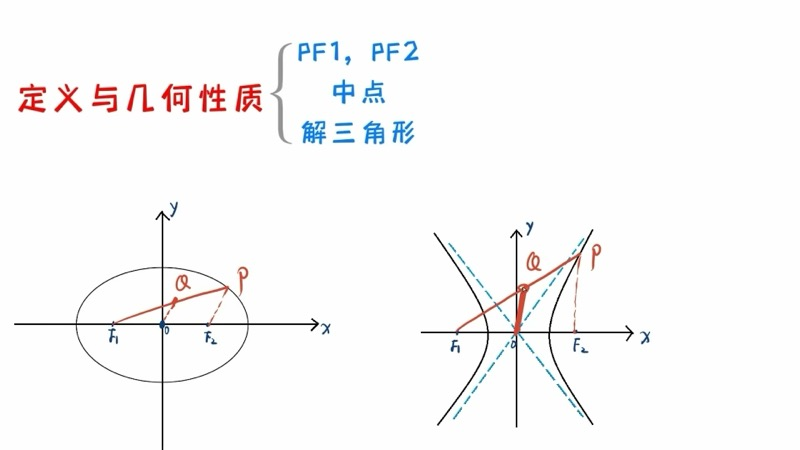
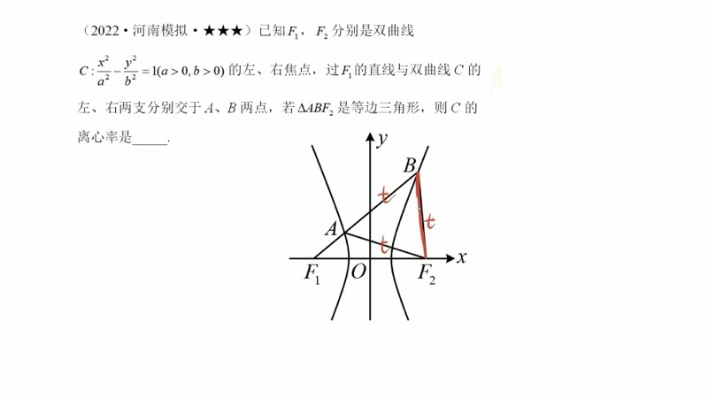
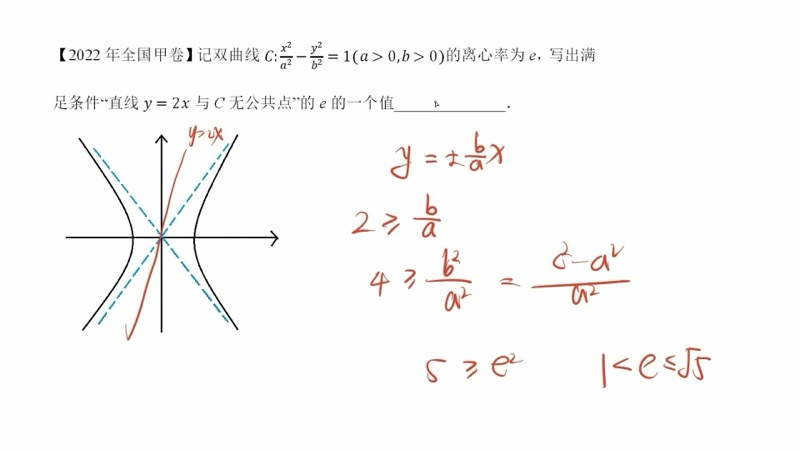
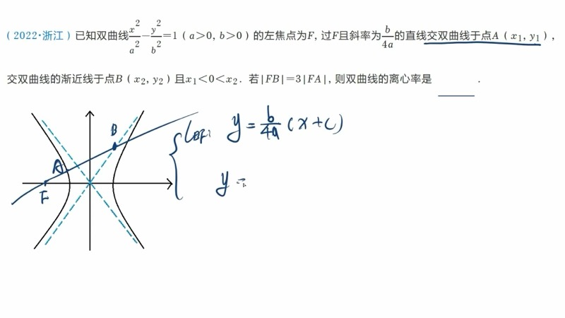

本课系统梳理双曲线（hyperbola）的方法框架，包括利用定义转换焦点弦长、焦点三角形中的中点构造、解三角形法求离心率，以及常规条件的代数翻译。双曲线的解题思路与椭圆（ellipse）有约 80% 相通，掌握椭圆方法后可快速迁移。

::: {.callout-note collapse="true"}
## 预备知识

- 双曲线（hyperbola）的标准方程：$\dfrac{x^2}{a^2} - \dfrac{y^2}{b^2} = 1 \;(a > 0,\, b > 0)$
- 双曲线的定义：$\bigl||PF_1| - |PF_2|\bigr| = 2a$
- 离心率（eccentricity）：$e = \dfrac{c}{a}$，其中 $c^2 = a^2 + b^2$，且 $e > 1$
- 渐近线（asymptote）：$y = \pm\dfrac{b}{a}x$
- 余弦定理（Law of Cosines）与中位线定理
- 椭圆的基本方法（定义、辅助线、焦点三角形）
:::

## 本课内容

- 利用双曲线定义转换焦点弦长（definition-based length conversion）
- 焦点三角形中的中点构造与中位线方法（midpoint & midsegment）
- 解三角形法（Law of Cosines method）求离心率
- 特征三角形（characteristic triangle）：边长为 $a$、$b$、$c$
- 常规条件的代数翻译（algebraic translation）

## 课程视频

```{=html}
<div class="video-container">
  <iframe src="//player.bilibili.com/player.html?bvid=BV15t4y1N7UN&page=1" title="双曲线方法、题型与性质" frameborder="0" scrolling="no" allowfullscreen></iframe>
</div>
```

## 课程关键帧









## 核心概念

### 一、利用定义转换焦点弦长（Definition-Based Length Conversion）

在椭圆中，$|PF_1| + |PF_2| = 2a$ 可以沟通两条焦半径的长度关系。类似地，在双曲线中：

$$
\bigl||PF_1| - |PF_2|\bigr| = 2a
$$

当双曲线上的点 $P$ 只与一个焦点相连时，我们往往将另一个焦点也连上，从而利用定义进行长度转换。

::: {.callout-tip}
## 辅助线口诀
看到双曲线上的点只连了一个焦点，立刻把另一个焦点也连上，用定义转换长度。此做法在椭圆与双曲线中**通用**。
:::

**例题**：给定双曲线 $\dfrac{x^2}{4} - \dfrac{y^2}{5} = 1$，左焦点为 $F$。点 $P$ 在双曲线右支上运动，点 $Q$ 在以右焦点 $F_2(3,0)$ 为圆心、半径为 $1$ 的圆上运动。求 $|PQ| + |PF|$ 的最小值。

**解题过程**：

1. 由 $a^2 = 4$，$b^2 = 5$，得 $c^2 = 9$，$a = 2$，$c = 3$。
2. $P$ 在右支上，故 $|PF| - |PF_2| = 2a = 4$，即 $|PF| = |PF_2| + 4$。
3. 因此 $|PQ| + |PF| = |PQ| + |PF_2| + 4$。
4. 要使 $|PQ| + |PF_2|$ 最小，由"两点之间线段最短"，当 $Q$、$P$、$F_2$ 三点共线时取最小值。
5. 此时 $|PQ| + |PF_2| = |QF_2|_{\min} = |OF_2| - r$（圆心到左焦点距离减去半径）。

其中 $|OF_2F| = \sqrt{3^2 + 4^2} = 5$（利用勾股定理），故 $|QF_2|_{\min} = 5 - 1 = 4$。

$$
\boxed{(|PQ| + |PF|)_{\min} = 4 + 4 = 8}
$$

### 交互演示：双曲线定义（Desmos）

```{=html}
<div id="calc-hyp-def" class="desmos-container"></div>
<script src="https://www.desmos.com/api/v1.9/calculator.js?apiKey=dcb31709b452b1cf9dc26972add0fda6"></script>
<script>
(function() {
  var elt = document.getElementById('calc-hyp-def');
  var calc = Desmos.GraphingCalculator(elt, {
    expressions: true, settingsMenu: false, xAxisLabel: 'x', yAxisLabel: 'y'
  });
  calc.setExpression({ id: 'a', latex: 'a = 2', sliderBounds: { min: 0.5, max: 4, step: 0.1 } });
  calc.setExpression({ id: 'b', latex: 'b = 1.5', sliderBounds: { min: 0.5, max: 4, step: 0.1 } });
  calc.setExpression({ id: 'hyp', latex: '\\frac{x^2}{a^2} - \\frac{y^2}{b^2} = 1', color: '#2d70b3' });
  calc.setExpression({ id: 'c_val', latex: 'c_0 = \\sqrt{a^2 + b^2}' });
  calc.setExpression({ id: 'F1', latex: '(-c_0, 0)', color: '#c74440', pointStyle: 'POINT', pointSize: 12, label: 'F\u2081', showLabel: true });
  calc.setExpression({ id: 'F2', latex: '(c_0, 0)', color: '#c74440', pointStyle: 'POINT', pointSize: 12, label: 'F\u2082', showLabel: true });
  calc.setExpression({ id: 'asym1', latex: 'y = \\frac{b}{a}x', color: '#999', lineWidth: 1, lineStyle: 'DASHED' });
  calc.setExpression({ id: 'asym2', latex: 'y = -\\frac{b}{a}x', color: '#999', lineWidth: 1, lineStyle: 'DASHED' });
  calc.setExpression({ id: 't', latex: 't = 0.8', sliderBounds: { min: 0.01, max: 3.0, step: 0.01 } });
  calc.setExpression({ id: 'Px', latex: 'P_x = a \\cosh(t)' });
  calc.setExpression({ id: 'Py', latex: 'P_y = b \\sinh(t)' });
  calc.setExpression({ id: 'P', latex: '(P_x, P_y)', color: '#388c46', pointStyle: 'POINT', pointSize: 12, label: 'P', showLabel: true });
  calc.setExpression({ id: 'seg1', latex: '(1-s)(-c_0, 0) + s(P_x, P_y)', color: '#fa7e19', parametricDomain: { min: 0, max: 1 }, lineWidth: 2 });
  calc.setExpression({ id: 'seg2', latex: '(1-s)(c_0, 0) + s(P_x, P_y)', color: '#6042a6', parametricDomain: { min: 0, max: 1 }, lineWidth: 2 });
  calc.setMathBounds({ left: -8, right: 8, bottom: -5, top: 5 });
})();
</script>
```

拖动滑块 $t$ 改变点 $P$ 在双曲线右支上的位置，观察 $|PF_1|$ 与 $|PF_2|$ 的差值始终等于 $2a$。调节 $a$、$b$ 观察不同双曲线的形态。

### D3 动画：双曲线定义动画

```{=html}
<div class="d3-container" id="d3-hyp-def">
  <svg id="svg-hyp-def" width="600" height="400"></svg>
  <div class="d3-controls" id="controls-hyp-def">
    <label>a = <input type="range" id="hd-slider-a" min="1" max="4" step="0.1" value="2"><span id="hd-val-a">2</span></label>
    <label>b = <input type="range" id="hd-slider-b" min="0.5" max="4" step="0.1" value="1.5"><span id="hd-val-b">1.5</span></label>
    <button id="hd-play">&#9654; 播放动画</button>
    <button id="hd-pause">&#9208; 暂停</button>
  </div>
  <div id="hd-info" style="font-family: 'KaTeX_Main', serif; font-size: 15px; padding: 8px; background: #f8f8f8; border-radius: 6px; margin-top: 6px;"></div>
</div>
<script src="https://d3js.org/d3.v7.min.js"></script>
<script>
(function() {
  var W = 600, H = 400, margin = 40;
  var svg = d3.select('#svg-hyp-def');
  svg.selectAll('*').remove();

  var a = 2, b = 1.5, param = 0.8, animating = false, animTimer = null;

  function c() { return Math.sqrt(a*a + b*b); }

  function toSVG(x, y) {
    var scale = Math.min((W - 2*margin)/(2*c()*1.5), (H - 2*margin)/(2*b*2));
    return [W/2 + x * scale, H/2 - y * scale];
  }

  function hyperbolaPoints(a, b, n, branch) {
    var pts = [];
    for (var i = 0; i <= n; i++) {
      var t = -3 + 6 * i / n;
      var px = branch * a * Math.cosh(t);
      var py = b * Math.sinh(t);
      pts.push(toSVG(px, py));
    }
    return pts;
  }

  svg.append('line').attr('x1',margin).attr('y1',H/2).attr('x2',W-margin).attr('y2',H/2).attr('stroke','#ccc').attr('stroke-width',1);
  svg.append('line').attr('x1',W/2).attr('y1',margin).attr('x2',W/2).attr('y2',H-margin).attr('stroke','#ccc').attr('stroke-width',1);

  var rightBranch = svg.append('path').attr('fill','none').attr('stroke','#2d70b3').attr('stroke-width',2);
  var leftBranch = svg.append('path').attr('fill','none').attr('stroke','#2d70b3').attr('stroke-width',2);
  var lineF1P = svg.append('line').attr('stroke','#c74440').attr('stroke-width',2);
  var lineF2P = svg.append('line').attr('stroke','#388c46').attr('stroke-width',2);
  var dotF1 = svg.append('circle').attr('r',5).attr('fill','#c74440');
  var dotF2 = svg.append('circle').attr('r',5).attr('fill','#c74440');
  var dotP = svg.append('circle').attr('r',7).attr('fill','#fa7e19').attr('cursor','pointer');
  var lblF1 = svg.append('text').text('F\u2081').attr('font-size',13).attr('fill','#c74440');
  var lblF2 = svg.append('text').text('F\u2082').attr('font-size',13).attr('fill','#c74440');
  var lblP = svg.append('text').text('P').attr('font-size',13).attr('fill','#fa7e19');

  function update() {
    var cv = c();
    var px = a * Math.cosh(param), py = b * Math.sinh(param);
    var f1 = toSVG(-cv, 0), f2 = toSVG(cv, 0), p = toSVG(px, py);

    var line = d3.line().x(function(d){return d[0];}).y(function(d){return d[1];});
    rightBranch.attr('d', line(hyperbolaPoints(a, b, 200, 1)));
    leftBranch.attr('d', line(hyperbolaPoints(a, b, 200, -1)));

    dotF1.attr('cx',f1[0]).attr('cy',f1[1]);
    dotF2.attr('cx',f2[0]).attr('cy',f2[1]);
    dotP.attr('cx',p[0]).attr('cy',p[1]);
    lblF1.attr('x',f1[0]-18).attr('y',f1[1]+18);
    lblF2.attr('x',f2[0]+8).attr('y',f2[1]+18);
    lblP.attr('x',p[0]+10).attr('y',p[1]-8);

    lineF1P.attr('x1',f1[0]).attr('y1',f1[1]).attr('x2',p[0]).attr('y2',p[1]);
    lineF2P.attr('x1',f2[0]).attr('y1',f2[1]).attr('x2',p[0]).attr('y2',p[1]);

    var pf1 = Math.sqrt((px+cv)*(px+cv) + py*py);
    var pf2 = Math.sqrt((px-cv)*(px-cv) + py*py);
    var diff = Math.abs(pf1 - pf2);

    document.getElementById('hd-info').innerHTML =
      '<span style="color:#c74440">|PF\u2081| = ' + pf1.toFixed(3) + '</span>' +
      ' &nbsp;&nbsp; <span style="color:#388c46">|PF\u2082| = ' + pf2.toFixed(3) + '</span>' +
      '<br>||PF\u2081| \u2212 |PF\u2082|| = ' + diff.toFixed(3) + ' = 2a = ' + (2*a).toFixed(1);
  }

  function startAnim() {
    if (animating) return;
    animating = true;
    var t0 = performance.now();
    animTimer = d3.timer(function(elapsed) {
      param = 3 * Math.sin(elapsed * 0.0008);
      update();
    });
  }
  function stopAnim() {
    animating = false;
    if (animTimer) { animTimer.stop(); animTimer = null; }
  }

  d3.select('#hd-play').on('click', startAnim);
  d3.select('#hd-pause').on('click', stopAnim);

  d3.select('#hd-slider-a').on('input', function() {
    a = +this.value; d3.select('#hd-val-a').text(a.toFixed(1)); update();
  });
  d3.select('#hd-slider-b').on('input', function() {
    b = +this.value; d3.select('#hd-val-b').text(b.toFixed(1)); update();
  });

  var drag = d3.drag().on('drag', function(event) {
    var scale = Math.min((W-2*margin)/(2*c()*1.5), (H-2*margin)/(2*b*2));
    var sx = (event.x - W/2)/scale;
    var sy = -(event.y - H/2)/scale;
    if (sx > 0) { param = Math.asinh(sy/b); }
    stopAnim();
    update();
  });
  dotP.call(drag);

  update();
})();
</script>
```

点击"播放动画"按钮，观察点 $P$ 沿双曲线右支运动时，$|PF_1|$（红色）与 $|PF_2|$（绿色）的差值始终满足 $||PF_1| - |PF_2|| = 2a$。也可直接拖动橙色点 $P$。

### 二、焦点三角形中的中点构造（Midpoint Construction）

在椭圆中，若题目给出 $PF_1$ 中点 $Q$ 的相关性质，我们通常将 $Q$ 与原点 $O$ 相连、将 $P$ 与另一焦点 $F_2$ 相连，构造中位线（midsegment）。因为 $O$ 永远是 $F_1F_2$ 的中点。

在双曲线中，此思路**完全成立**：

- $O$ 始终是 $F_1F_2$ 的中点
- 若题目给出某线段的中点条件，立刻构造中位线
- 即使题目未显式给出中点条件，有时也可自行构造

**例题 1（简单型）**：双曲线 $\dfrac{x^2}{a^2} - \dfrac{y^2}{b^2} = 1$ 的左右焦点为 $F_1$、$F_2$。过 $F_1$ 的直线交双曲线右支于点 $P$，以实轴为直径的圆与该直线相切于 $H$，且 $F_1P = 2F_1H$（即 $H$ 为 $F_1P$ 的中点）。求离心率。

**解题过程**：

1. $H$ 是 $F_1P$ 的中点，$O$ 是 $F_1F_2$ 的中点，故 $OH$ 是 $\triangle PF_1F_2$ 的中位线。
2. 直线与以实轴（长度 $2a$）为直径的圆相切，故 $\angle F_1HO = 90°$，由中位线平行性得 $\angle F_1PF_2 = 90°$。
3. 圆的半径为 $a$，故 $OH = a$，从而 $PF_2 = 2 \cdot OH = 2a$。
4. 由勾股定理：$|F_1F_2|^2 = |PF_2|^2 + |PF_1|^2$，即 $(2c)^2 = (2a)^2 + |PF_1|^2$。
5. 故 $|PF_1| = 2\sqrt{c^2 - a^2} = 2b$。
6. 由双曲线定义（$P$ 在右支上）：$|PF_1| - |PF_2| = 2a$，即 $2b - 2a = 2a$，$b = 2a$。
7. $e^2 = \dfrac{c^2}{a^2} = \dfrac{a^2 + b^2}{a^2} = 1 + 4 = 5$，故 $e = \sqrt{5}$。

### 交互演示：焦点三角形中位线（Desmos）

```{=html}
<div id="calc-hyp-midline" class="desmos-container"></div>
<script>
(function() {
  var elt = document.getElementById('calc-hyp-midline');
  var calc = Desmos.GraphingCalculator(elt, {
    expressions: true, settingsMenu: false, xAxisLabel: 'x', yAxisLabel: 'y'
  });
  calc.setExpression({ id: 'a', latex: 'a = 2', sliderBounds: { min: 0.5, max: 4, step: 0.1 } });
  calc.setExpression({ id: 'b', latex: 'b = 1.5', sliderBounds: { min: 0.5, max: 4, step: 0.1 } });
  calc.setExpression({ id: 'hyp', latex: '\\frac{x^2}{a^2} - \\frac{y^2}{b^2} = 1', color: '#2d70b3' });
  calc.setExpression({ id: 'c_val', latex: 'c_0 = \\sqrt{a^2 + b^2}' });
  calc.setExpression({ id: 'F1', latex: '(-c_0, 0)', color: '#c74440', pointSize: 12, label: 'F\u2081', showLabel: true });
  calc.setExpression({ id: 'F2', latex: '(c_0, 0)', color: '#c74440', pointSize: 12, label: 'F\u2082', showLabel: true });
  calc.setExpression({ id: 'circle', latex: 'x^2 + y^2 = a^2', color: '#999', lineStyle: 'DASHED' });
  calc.setExpression({ id: 't', latex: 't_0 = 1.0', sliderBounds: { min: 0.1, max: 3.0, step: 0.01 } });
  calc.setExpression({ id: 'Px', latex: 'P_x = a \\cosh(t_0)' });
  calc.setExpression({ id: 'Py', latex: 'P_y = b \\sinh(t_0)' });
  calc.setExpression({ id: 'P', latex: '(P_x, P_y)', color: '#388c46', pointSize: 12, label: 'P', showLabel: true });
  calc.setExpression({ id: 'M', latex: '\\left(\\frac{P_x - c_0}{2}, \\frac{P_y}{2}\\right)', color: '#6042a6', pointSize: 10, label: 'M (midpoint)', showLabel: true });
  calc.setExpression({ id: 'midline', latex: '(1-s)(0,0) + s\\left(\\frac{P_x - c_0}{2}, \\frac{P_y}{2}\\right)', color: '#6042a6', parametricDomain: { min: 0, max: 1 }, lineWidth: 1.5, lineStyle: 'DASHED' });
  calc.setMathBounds({ left: -8, right: 8, bottom: -5, top: 5 });
})();
</script>
```

拖动滑块 $t_0$ 移动点 $P$，观察中点 $M$ 的位置以及中位线 $OM$ 始终平行于 $PF_2$ 且长度为 $\dfrac{1}{2}|PF_2|$。

### 三、解三角形法（Law of Cosines Method）

许多焦点三角形的问题本质上是几何题。我们可以通过余弦定理（Law of Cosines）构造关于 $a$、$b$、$c$ 的方程，从而求出离心率。

**构造方程的思路**：若已知焦点三角形的一个角，且三边均可用 $a$、$b$、$c$ 表示，则对该角使用余弦定理即可得到一个方程。

**例题**：双曲线 $\dfrac{x^2}{a^2} - \dfrac{y^2}{b^2} = 1$ 的左右焦点为 $F_1$、$F_2$。过 $F_1$ 的直线交双曲线左、右两支于 $A$、$B$ 两点，若 $\triangle ABF_2$ 为等边三角形，求双曲线的离心率。

**解题过程**：

1. 设等边三角形的边长为 $T$，则 $|AF_2| = |BF_2| = |AB| = T$。
2. 由定义（$B$ 在右支上）：$|BF_1| - |BF_2| = -2a$，即 $|BF_1| = |BF_2| - 2a$。
   但 $|BF_1| = |AB| + |AF_1|$，其中 $B$ 在右支，$A$ 在左支。实际上 $|BF_1| = T + |AF_1|$。
   由定义（$B$ 在右支）：$|BF_1| - |BF_2| = 2a$，故 $|BF_1| = T + 2a$，从而 $|AF_1| = 2a$。
3. 由定义（$A$ 在左支）：$|AF_2| - |AF_1| = 2a$，故 $|AF_2| = 4a$，即 $T = 4a$。
4. 在 $\triangle AF_1F_2$ 中，$\angle F_1AF_2 = 120°$（等边三角形内角 $60°$ 的邻补角）。
5. 余弦定理：

$$
\cos 120° = \frac{|AF_1|^2 + |AF_2|^2 - |F_1F_2|^2}{2|AF_1|\cdot|AF_2|}
$$

$$
-\frac{1}{2} = \frac{4a^2 + 16a^2 - 4c^2}{2 \cdot 2a \cdot 4a} = \frac{20a^2 - 4c^2}{16a^2}
$$

6. 整理：$-8a^2 = 20a^2 - 4c^2$，即 $4c^2 = 28a^2$，$e^2 = 7$，$e = \sqrt{7}$。

### 四、特征三角形（Characteristic Triangle）

在双曲线中，过焦点作渐近线的垂线，或过顶点作 $x$ 轴的垂线等操作，都会产生边长为 $a$、$b$、$c$ 的直角三角形，称为**特征三角形**。

$$
c^2 = a^2 + b^2
$$

::: {.callout-important}
## 与椭圆的区别
椭圆中 $c^2 = a^2 - b^2$，双曲线中 $c^2 = a^2 + b^2$。计算时务必注意符号。
:::

### 五、常规条件的代数翻译（Algebraic Translation）

当题目条件不涉及特殊结论时，只需逐句翻译条件：

1. **"过焦点的直线"** — 设出直线方程（利用题目给出的斜率）
2. **"交双曲线于点 $A$"** — 点 $A$ 满足双曲线方程
3. **"交渐近线于点 $B$"** — 联立直线与渐近线方程求 $B$ 坐标
4. **长度关系** — 转化为坐标运算

::: {.callout-tip}
## 翻译策略
优先翻译容易计算的条件（如联立一次方程），最后利用"点在曲线上"构造方程。
:::

**例题（浙江高考）**：双曲线 $\dfrac{x^2}{a^2} - \dfrac{y^2}{b^2} = 1$，左焦点为 $F$，过 $F$ 作斜率为 $\dfrac{b}{4a}$ 的直线，交双曲线于点 $A$（$x_A < 0$），交渐近线 $y = \dfrac{b}{a}x$ 于点 $B$（$x_B > 0$），且 $|FB| = 3|FA|$。求离心率。

**解题思路**：

1. 直线方程：$y = \dfrac{b}{4a}(x + c)$
2. 与渐近线 $y = \dfrac{b}{a}x$ 联立，约分后得 $B$ 的坐标 $\left(\dfrac{c}{3},\, \dfrac{bc}{3a}\right)$
3. 由 $|FB| = 3|FA|$ 及共线关系，利用相似比得 $A$ 的坐标
4. 将 $A$ 代入双曲线方程，化简得：

$$
e = \frac{c}{a} = \frac{3\sqrt{6}}{4}
$$

### 交互演示：渐近线与直线交点（Desmos）

```{=html}
<div id="calc-hyp-asym" class="desmos-container"></div>
<script>
(function() {
  var elt = document.getElementById('calc-hyp-asym');
  var calc = Desmos.GraphingCalculator(elt, {
    expressions: true, settingsMenu: false, xAxisLabel: 'x', yAxisLabel: 'y'
  });
  calc.setExpression({ id: 'a', latex: 'a = 2', sliderBounds: { min: 0.5, max: 4, step: 0.1 } });
  calc.setExpression({ id: 'b', latex: 'b = 1.5', sliderBounds: { min: 0.5, max: 4, step: 0.1 } });
  calc.setExpression({ id: 'hyp', latex: '\\frac{x^2}{a^2} - \\frac{y^2}{b^2} = 1', color: '#2d70b3' });
  calc.setExpression({ id: 'asym1', latex: 'y = \\frac{b}{a}x', color: '#999', lineWidth: 1.5, lineStyle: 'DASHED' });
  calc.setExpression({ id: 'asym2', latex: 'y = -\\frac{b}{a}x', color: '#999', lineWidth: 1.5, lineStyle: 'DASHED' });
  calc.setExpression({ id: 'c_val', latex: 'c_0 = \\sqrt{a^2 + b^2}' });
  calc.setExpression({ id: 'k', latex: 'k_0 = \\frac{b}{4a}', hidden: true });
  calc.setExpression({ id: 'line', latex: 'y = k_0(x + c_0)', color: '#fa7e19', lineWidth: 2 });
  calc.setExpression({ id: 'F', latex: '(-c_0, 0)', color: '#c74440', pointSize: 12, label: 'F', showLabel: true });
  calc.setMathBounds({ left: -8, right: 8, bottom: -5, top: 5 });
})();
</script>
```

调节 $a$、$b$ 观察过左焦点的直线与双曲线、渐近线的交点关系。

### D3 动画：渐近线与双曲线关系

```{=html}
<div class="d3-container" id="d3-asymptote">
  <svg id="svg-asymptote" width="600" height="400"></svg>
  <div class="d3-controls" id="controls-asymptote">
    <label>a = <input type="range" id="as-slider-a" min="0.5" max="4" step="0.1" value="2"><span id="as-val-a">2.0</span></label>
    <label>b = <input type="range" id="as-slider-b" min="0.5" max="4" step="0.1" value="1.5"><span id="as-val-b">1.5</span></label>
    <label>x 范围 = <input type="range" id="as-slider-range" min="3" max="30" step="1" value="8"><span id="as-val-range">8</span></label>
  </div>
  <div id="as-info" style="font-family: 'KaTeX_Main', serif; font-size: 15px; padding: 8px; background: #f8f8f8; border-radius: 6px; margin-top: 6px;"></div>
</div>
<script>
(function() {
  var W = 600, H = 400, margin = 40;
  var svg = d3.select('#svg-asymptote');
  svg.selectAll('*').remove();

  var a = 2, b = 1.5, xRange = 8;

  function toSVG(x, y) {
    var sx = (W - 2*margin)/(2*xRange);
    var sy = (H - 2*margin)/(2*xRange * H/W);
    return [W/2 + x*sx, H/2 - y*sy];
  }

  svg.append('line').attr('x1',margin).attr('y1',H/2).attr('x2',W-margin).attr('y2',H/2).attr('stroke','#ddd').attr('stroke-width',1);
  svg.append('line').attr('x1',W/2).attr('y1',margin).attr('x2',W/2).attr('y2',H-margin).attr('stroke','#ddd').attr('stroke-width',1);

  var asymLine1 = svg.append('line').attr('stroke','#e8a030').attr('stroke-width',1.5).attr('stroke-dasharray','6,4');
  var asymLine2 = svg.append('line').attr('stroke','#e8a030').attr('stroke-width',1.5).attr('stroke-dasharray','6,4');
  var rightBranch = svg.append('path').attr('fill','none').attr('stroke','#2d70b3').attr('stroke-width',2.5);
  var leftBranch = svg.append('path').attr('fill','none').attr('stroke','#2d70b3').attr('stroke-width',2.5);
  var gapLine = svg.append('line').attr('stroke','#c74440').attr('stroke-width',2).attr('stroke-dasharray','3,3');
  var gapDot = svg.append('circle').attr('r',4).attr('fill','#c74440');
  var gapLabel = svg.append('text').attr('font-size',12).attr('fill','#c74440');

  function update() {
    var slope = b/a;
    var p1a = toSVG(-xRange, -slope*xRange), p1b = toSVG(xRange, slope*xRange);
    var p2a = toSVG(-xRange, slope*xRange), p2b = toSVG(xRange, -slope*xRange);
    asymLine1.attr('x1',p1a[0]).attr('y1',p1a[1]).attr('x2',p1b[0]).attr('y2',p1b[1]);
    asymLine2.attr('x1',p2a[0]).attr('y1',p2a[1]).attr('x2',p2b[0]).attr('y2',p2b[1]);

    var rPts = [], lPts = [];
    for (var i = 0; i <= 300; i++) {
      var t = -4 + 8*i/300;
      var px = a*Math.cosh(t), py = b*Math.sinh(t);
      if (px <= xRange) { rPts.push(toSVG(px, py)); lPts.push(toSVG(-px, -py)); }
    }
    var line = d3.line().x(function(d){return d[0];}).y(function(d){return d[1];});
    rightBranch.attr('d', line(rPts));

    var lPts2 = [];
    for (var i = 0; i <= 300; i++) {
      var t = -4 + 8*i/300;
      var px = -a*Math.cosh(t), py = b*Math.sinh(t);
      if (Math.abs(px) <= xRange) { lPts2.push(toSVG(px, py)); }
    }
    leftBranch.attr('d', line(lPts2));

    // Show gap at a specific x
    var xShow = Math.min(xRange * 0.8, xRange);
    var yHyp = b * Math.sqrt(xShow*xShow/(a*a) - 1);
    var yAsym = slope * xShow;
    if (xShow > a) {
      var gap = yAsym - yHyp;
      var pH = toSVG(xShow, yHyp);
      var pA = toSVG(xShow, yAsym);
      gapLine.attr('x1',pH[0]).attr('y1',pH[1]).attr('x2',pA[0]).attr('y2',pA[1]).attr('visibility','visible');
      gapDot.attr('cx',pH[0]).attr('cy',pH[1]).attr('visibility','visible');
      gapLabel.attr('x',pA[0]+6).attr('y',(pH[1]+pA[1])/2).text('gap = '+gap.toFixed(3)).attr('visibility','visible');
    } else {
      gapLine.attr('visibility','hidden');
      gapDot.attr('visibility','hidden');
      gapLabel.attr('visibility','hidden');
    }

    document.getElementById('as-info').innerHTML =
      'a = ' + a.toFixed(1) + ', b = ' + b.toFixed(1) +
      ', e = ' + (Math.sqrt(a*a+b*b)/a).toFixed(3) +
      '<br>渐近线 (asymptote): y = \u00B1' + slope.toFixed(3) + 'x' +
      '<br>当 x \u2192 \u221E 时，双曲线与渐近线的距离趋近于 0';
  }

  d3.select('#as-slider-a').on('input', function() {
    a = +this.value; d3.select('#as-val-a').text(a.toFixed(1)); update();
  });
  d3.select('#as-slider-b').on('input', function() {
    b = +this.value; d3.select('#as-val-b').text(b.toFixed(1)); update();
  });
  d3.select('#as-slider-range').on('input', function() {
    xRange = +this.value; d3.select('#as-val-range').text(xRange); update();
  });

  update();
})();
</script>
```

调节 $a$、$b$ 的值观察渐近线斜率的变化。增大"x 范围"可以看到当 $x \to \infty$ 时，双曲线与渐近线之间的距离（gap）趋向于零。

## 双曲线与椭圆方法对比

| 方法 | 椭圆 | 双曲线 |
|:-----|:-----|:-------|
| 定义 | $\|PF_1\| + \|PF_2\| = 2a$ | $\bigl\|\|PF_1\| - \|PF_2\|\bigr\| = 2a$ |
| 辅助线 | 连接另一焦点 | 连接另一焦点（完全相同） |
| 中点构造 | 利用 $O$ 为 $F_1F_2$ 中点 | 利用 $O$ 为 $F_1F_2$ 中点（完全相同） |
| 解三角形法 | 余弦定理构造方程 | 余弦定理构造方程（完全相同） |
| 特征三角形 | 边长 $a$、$b$、$c$，$c^2 = a^2 - b^2$ | 边长 $a$、$b$、$c$，$c^2 = a^2 + b^2$ |
| 代数翻译 | 逐句翻译 | 逐句翻译（完全相同） |

::: {.callout-note}
## 核心认知
双曲线约 80% 的解题思路与椭圆相通。主要差异仅在于：定义中加号变减号、$c^2 = a^2 + b^2$（而非 $a^2 - b^2$）、离心率 $e > 1$（而非 $0 < e < 1$）。掌握椭圆方法后，双曲线可谓"买一赠一"。
:::

## 速查表

::: {.key-formula}

| 结论名称 | 公式 | 适用条件 |
|:---------|:-----|:---------|
| 双曲线定义 | $\bigl\|\|PF_1\| - \|PF_2\|\bigr\| = 2a$ | $P$ 在双曲线上 |
| 基本关系 | $c^2 = a^2 + b^2$ | 始终成立 |
| 渐近线 | $y = \pm\dfrac{b}{a}x$ | 标准方程 $\dfrac{x^2}{a^2} - \dfrac{y^2}{b^2} = 1$ |
| 离心率 | $e = \dfrac{c}{a} > 1$ | 始终成立 |
| 焦半径（坐标形式） | $\|PF_1\| = \|ex_0 + a\|$，$\|PF_2\| = \|ex_0 - a\|$ | $P(x_0, y_0)$ 在双曲线上 |
| 特征三角形 | 直角三角形，边长 $a$、$b$、$c$ | 过焦点作渐近线的垂线 |
| 辅助线策略 | 连接另一焦点，利用定义转换长度 | 焦点弦长问题 |
| 中位线构造 | $O$ 为 $F_1F_2$ 中点，构造中位线 | 涉及中点条件的题目 |
| 余弦定理法 | 已知一角 + 三边用 $a,b,c$ 表示 $\Rightarrow$ 构造方程 | 焦点三角形问题 |

:::
