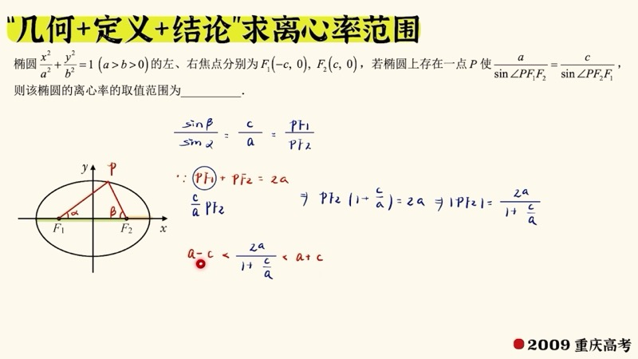
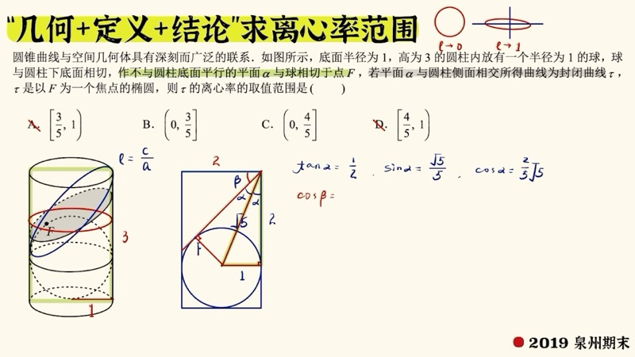
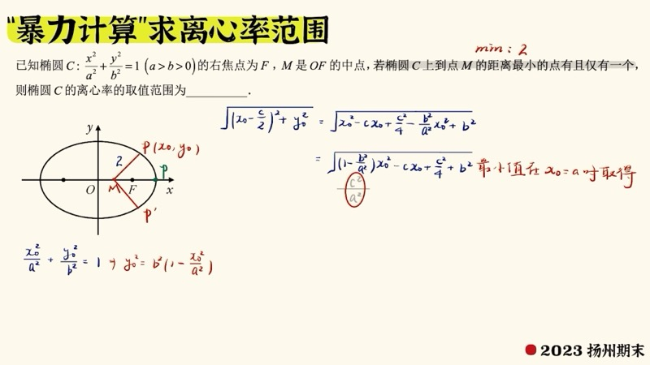
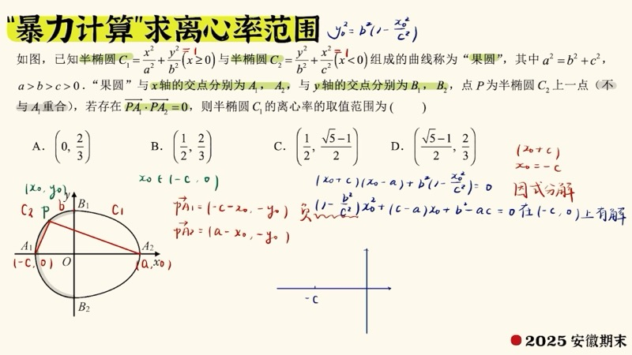

本课讲解离心率（eccentricity）取值范围问题的两大解题思路：一是利用几何结论（椭圆上点到原点、到焦点的距离范围）快速定界；二是通过代数计算（联立方程、消元、解不等式）暴力求解。这两类方法涵盖了高考中几乎所有的离心率范围问题。

::: {.callout-note collapse="true"}
## 预备知识

- 椭圆（ellipse）的标准方程：$\dfrac{x^2}{a^2} + \dfrac{y^2}{b^2} = 1 \;(a > b > 0)$
- 双曲线（hyperbola）的标准方程：$\dfrac{x^2}{a^2} - \dfrac{y^2}{b^2} = 1$
- 离心率（eccentricity）：$e = \dfrac{c}{a}$
- 正弦定理（Law of Sines）与余弦定理（Law of Cosines）
- 向量数量积（dot product）与极化恒等式（polarization identity）
- 一元二次不等式的解法
:::

## 本课内容

- 椭圆上点到原点的距离范围（distance from point to origin）：$b \le |OP| \le a$
- 椭圆上点到焦点的距离范围（distance from point to focus）：$a - c \le |PF| \le a + c$
- 利用距离范围求离心率范围的几何法
- 正弦定理在焦点三角形中的应用
- 向量数量积与离心率范围
- 代数暴力法：消元 + 判别式 + 解不等式
- 圆锥截面与立体几何的结合（圆柱截面问题）

## 课程视频

```{=html}
<div class="video-container">
  <iframe src="//player.bilibili.com/player.html?bvid=BV1BZhEz5Esd&page=1" title="离心率求解技巧" frameborder="0" scrolling="no" allowfullscreen></iframe>
</div>
```

## 课程关键帧









## 核心概念

### 一、椭圆上点的距离范围（Distance Bounds on Ellipse）

这是求离心率范围最常用的两条结论：

**结论 1**：椭圆上的点 $P$ 到原点 $O$ 的距离满足：

$$
b \le |OP| \le a
$$

其中 $|OP| = b$ 在上下顶点取得，$|OP| = a$ 在左右顶点取得。

**结论 2**：椭圆上的点 $P$ 到焦点 $F$ 的距离满足：

$$
a - c \le |PF| \le a + c
$$

其中最短距离 $a - c$ 在 $P$ 为同侧顶点时取得，最长距离 $a + c$ 在 $P$ 为异侧顶点时取得。

::: {.callout-tip}
## 解题模式
将题目条件转化为"椭圆上点到原点/焦点的距离"，代入上述范围，即可得到关于 $a$、$c$ 的不等式，进而求出离心率范围。
:::

### 交互演示：离心率与椭圆形状（Desmos）

```{=html}
<div id="calc-ecc-shape" class="desmos-container"></div>
<script src="https://www.desmos.com/api/v1.9/calculator.js?apiKey=dcb31709b452b1cf9dc26972add0fda6"></script>
<script>
(function() {
  var elt = document.getElementById('calc-ecc-shape');
  var calc = Desmos.GraphingCalculator(elt, {
    expressions: true, settingsMenu: false, xAxisLabel: 'x', yAxisLabel: 'y'
  });
  calc.setExpression({ id: 'a_val', latex: 'a = 3' });
  calc.setExpression({ id: 'e_slider', latex: 'e_0 = 0.6', sliderBounds: { min: 0.01, max: 0.99, step: 0.01 } });
  calc.setExpression({ id: 'c_val', latex: 'c_0 = a \\cdot e_0' });
  calc.setExpression({ id: 'b_val', latex: 'b_0 = \\sqrt{a^2 - c_0^2}' });
  calc.setExpression({ id: 'ellipse', latex: '\\frac{x^2}{a^2} + \\frac{y^2}{b_0^2} = 1', color: '#2d70b3' });
  calc.setExpression({ id: 'F1', latex: '(-c_0, 0)', color: '#c74440', pointSize: 10, label: 'F\u2081', showLabel: true });
  calc.setExpression({ id: 'F2', latex: '(c_0, 0)', color: '#c74440', pointSize: 10, label: 'F\u2082', showLabel: true });
  calc.setExpression({ id: 'circle_b', latex: 'x^2 + y^2 = b_0^2', color: '#388c46', lineStyle: 'DASHED', lineWidth: 1 });
  calc.setExpression({ id: 'circle_a', latex: 'x^2 + y^2 = a^2', color: '#fa7e19', lineStyle: 'DASHED', lineWidth: 1 });
  calc.setExpression({ id: 'note_e', latex: '(0, -a-0.5)', color: '#000', label: 'e = e\u2080', showLabel: true, pointSize: 0, labelSize: 'large' });
  calc.setMathBounds({ left: -5, right: 5, bottom: -4.5, top: 4.5 });
})();
</script>
```

拖动滑块 $e_0$ 改变离心率：当 $e \to 0$ 时椭圆趋近于圆（$b \to a$），当 $e \to 1$ 时椭圆趋近于线段（$b \to 0$）。绿色虚线圆半径为 $b$，橙色虚线圆半径为 $a$，椭圆始终位于两圆之间。

### D3 动画：离心率与椭圆形状

```{=html}
<div class="d3-container" id="d3-ecc-morph">
  <svg id="svg-ecc-morph" width="600" height="400"></svg>
  <div class="d3-controls" id="controls-ecc-morph">
    <label>离心率 e = <input type="range" id="em-slider-e" min="0.01" max="0.99" step="0.01" value="0.5"><span id="em-val-e">0.50</span></label>
    <button id="em-play">&#9654; 自动演示</button>
    <button id="em-pause">&#9208; 暂停</button>
  </div>
  <div id="em-info" style="font-family: 'KaTeX_Main', serif; font-size: 15px; padding: 8px; background: #f8f8f8; border-radius: 6px; margin-top: 6px;"></div>
</div>
<script src="https://d3js.org/d3.v7.min.js"></script>
<script>
(function() {
  var W = 600, H = 400, margin = 50;
  var svg = d3.select('#svg-ecc-morph');
  svg.selectAll('*').remove();

  var aFixed = 3, ecc = 0.5, animating = false, animTimer = null;

  function toSVG(x, y) {
    var scale = (W - 2*margin)/(2*aFixed*1.2);
    return [W/2 + x*scale, H/2 - y*scale];
  }

  svg.append('line').attr('x1',margin).attr('y1',H/2).attr('x2',W-margin).attr('y2',H/2).attr('stroke','#ddd').attr('stroke-width',1);
  svg.append('line').attr('x1',W/2).attr('y1',margin).attr('x2',W/2).attr('y2',H-margin).attr('stroke','#ddd').attr('stroke-width',1);

  var ellipsePath = svg.append('path').attr('fill','rgba(45,112,179,0.1)').attr('stroke','#2d70b3').attr('stroke-width',2.5);
  var dotF1 = svg.append('circle').attr('r',5).attr('fill','#c74440');
  var dotF2 = svg.append('circle').attr('r',5).attr('fill','#c74440');
  var lblF1 = svg.append('text').text('F\u2081').attr('font-size',12).attr('fill','#c74440');
  var lblF2 = svg.append('text').text('F\u2082').attr('font-size',12).attr('fill','#c74440');
  var shapeLabel = svg.append('text').attr('font-size',16).attr('fill','#2d70b3').attr('text-anchor','middle');

  function update() {
    var a = aFixed, c = a * ecc, b = Math.sqrt(a*a - c*c);
    var pts = [];
    for (var i = 0; i <= 200; i++) {
      var t = 2*Math.PI*i/200;
      pts.push(toSVG(a*Math.cos(t), b*Math.sin(t)));
    }
    var line = d3.line().x(function(d){return d[0];}).y(function(d){return d[1];});
    ellipsePath.attr('d', line(pts));

    var f1 = toSVG(-c, 0), f2 = toSVG(c, 0);
    dotF1.attr('cx',f1[0]).attr('cy',f1[1]);
    dotF2.attr('cx',f2[0]).attr('cy',f2[1]);
    lblF1.attr('x',f1[0]-15).attr('y',f1[1]+18);
    lblF2.attr('x',f2[0]+8).attr('y',f2[1]+18);

    var shape = ecc < 0.1 ? '\u2248 \u5706 (circle)' : ecc > 0.9 ? '\u2248 \u7ebf\u6bb5 (line)' : '';
    shapeLabel.attr('x',W/2).attr('y',margin - 10).text(shape);

    document.getElementById('em-info').innerHTML =
      'e = ' + ecc.toFixed(2) +
      ' &nbsp;&nbsp; a = ' + a.toFixed(1) +
      ' &nbsp;&nbsp; b = ' + b.toFixed(3) +
      ' &nbsp;&nbsp; c = ' + c.toFixed(3) +
      '<br>b/a = ' + (b/a).toFixed(3) +
      ' &nbsp;&nbsp; c/a = e = ' + ecc.toFixed(3);
  }

  d3.select('#em-slider-e').on('input', function() {
    ecc = +this.value;
    d3.select('#em-val-e').text(ecc.toFixed(2));
    update();
  });

  function startAnim() {
    if (animating) return;
    animating = true;
    animTimer = d3.timer(function(elapsed) {
      ecc = 0.5 + 0.49 * Math.sin(elapsed * 0.0006);
      d3.select('#em-slider-e').property('value', ecc);
      d3.select('#em-val-e').text(ecc.toFixed(2));
      update();
    });
  }
  function stopAnim() {
    animating = false;
    if (animTimer) { animTimer.stop(); animTimer = null; }
  }

  d3.select('#em-play').on('click', startAnim);
  d3.select('#em-pause').on('click', stopAnim);

  update();
})();
</script>
```

点击"自动演示"按钮，观察离心率 $e$ 从接近 $0$ 到接近 $1$ 的变化过程中，椭圆如何从近似圆形逐渐变为扁平的形状。

### 二、几何法求离心率范围

**例题 1（中垂线型）**：椭圆 $\dfrac{x^2}{a^2} + \dfrac{y^2}{b^2} = 1$ 的左右焦点为 $F_1$、$F_2$。若椭圆上存在一点 $P$ 使得 $PF_1$ 的中垂线（perpendicular bisector）恰好经过 $F_2$，求离心率的取值范围。

**解题过程**：

1. $F_2$ 在 $PF_1$ 的中垂线上，故 $|PF_2| = |F_1F_2| = 2c$。
2. 由距离范围 $a - c \le |PF_2| \le a + c$，代入 $|PF_2| = 2c$：

$$
a - c \le 2c \le a + c
$$

3. 左侧不等式：$a \le 3c$，即 $e \ge \dfrac{1}{3}$。
4. 右侧不等式：$2c \le a + c$，即 $c \le a$，对椭圆自动成立。
5. 结合 $0 < e < 1$，得 $e \in \left[\dfrac{1}{3},\, 1\right)$。

**例题 2（正弦定理型）**：椭圆上存在一点 $P$ 使得 $\dfrac{a}{\sin\alpha} = \dfrac{c}{\sin\beta}$，其中 $\alpha = \angle PF_1F_2$，$\beta = \angle PF_2F_1$。求离心率范围。

**解题过程**：

1. 交叉相乘得 $\dfrac{\sin\beta}{\sin\alpha} = \dfrac{c}{a} = e$。
2. 在 $\triangle PF_1F_2$ 中由正弦定理：$\dfrac{\sin\beta}{\sin\alpha} = \dfrac{|PF_1|}{|PF_2|}$。
3. 故 $\dfrac{|PF_1|}{|PF_2|} = e$，结合 $|PF_1| + |PF_2| = 2a$ 解得：

$$
|PF_1| = \frac{2ce}{1+e}, \quad |PF_2| = \frac{2a}{1+e} = \frac{2c}{e(1+e)}
$$

4. 由距离范围 $a - c \le |PF_1| \le a + c$（注意端点不可取，因为取端点时 $\sin\alpha$ 或 $\sin\beta$ 为零）：

$$
a - c < \frac{2ce}{1+e} < a + c
$$

5. 化简右侧：$e + e^2 > 2$，即 $e > \sqrt{2} - 1$（取正根）。
6. 结合 $0 < e < 1$，得 $e \in (\sqrt{2} - 1,\, 1)$。

::: {.callout-important}
## 端点能否取等
在填空题中务必检验端点。若取等意味着 $P$ 在顶点上，而此时 $P$、$F_1$、$F_2$ 三点共线，角度 $\alpha$ 或 $\beta$ 为零或 $\pi$，可能与题目条件矛盾（如三角函数无意义）。
:::

### 三、向量数量积与离心率范围

**例题**：椭圆上存在一点 $A$ 使得 $\overrightarrow{AF_1} \cdot \overrightarrow{AF_2} = 4c^2$。求离心率范围。

**解题过程**：利用极化恒等式（polarization identity），对于共起点的两个向量，取底边中点 $O$：

$$
\overrightarrow{AF_1} \cdot \overrightarrow{AF_2} = |OA|^2 - |OF_1|^2 = |OA|^2 - c^2
$$

故条件变为 $|OA|^2 - c^2 = 4c^2$，即 $|OA|^2 = 5c^2$，$|OA| = \sqrt{5}\,c$。

由 $b \le |OA| \le a$，得：

- 右侧：$\sqrt{5}\,c \le a$，即 $e \le \dfrac{1}{\sqrt{5}} = \dfrac{\sqrt{5}}{5}$
- 左侧：$\sqrt{5}\,c \ge b$，即 $5c^2 \ge b^2 = a^2 - c^2$，$6c^2 \ge a^2$，$e \ge \dfrac{1}{\sqrt{6}} = \dfrac{\sqrt{6}}{6}$

故 $e \in \left[\dfrac{\sqrt{6}}{6},\, \dfrac{\sqrt{5}}{5}\right]$。

### 交互演示：距离范围与离心率约束（Desmos）

```{=html}
<div id="calc-ecc-range" class="desmos-container"></div>
<script>
(function() {
  var elt = document.getElementById('calc-ecc-range');
  var calc = Desmos.GraphingCalculator(elt, {
    expressions: true, settingsMenu: false, xAxisLabel: 'x', yAxisLabel: 'y'
  });
  calc.setExpression({ id: 'a', latex: 'a = 3', sliderBounds: { min: 1.5, max: 5, step: 0.1 } });
  calc.setExpression({ id: 'e_val', latex: 'e_0 = 0.6', sliderBounds: { min: 0.05, max: 0.95, step: 0.01 } });
  calc.setExpression({ id: 'c_val', latex: 'c_0 = a \\cdot e_0' });
  calc.setExpression({ id: 'b_val', latex: 'b_0 = \\sqrt{a^2 - c_0^2}' });
  calc.setExpression({ id: 'ellipse', latex: '\\frac{x^2}{a^2} + \\frac{y^2}{b_0^2} = 1', color: '#2d70b3' });
  calc.setExpression({ id: 'F1', latex: '(-c_0, 0)', color: '#c74440', pointSize: 10, label: 'F\u2081', showLabel: true });
  calc.setExpression({ id: 'F2', latex: '(c_0, 0)', color: '#c74440', pointSize: 10, label: 'F\u2082', showLabel: true });
  calc.setExpression({ id: 'circle_inner', latex: 'x^2 + y^2 = (a - c_0)^2', color: '#388c46', lineStyle: 'DASHED', lineWidth: 1 });
  calc.setExpression({ id: 'circle_outer', latex: 'x^2 + y^2 = (a + c_0)^2', color: '#fa7e19', lineStyle: 'DASHED', lineWidth: 1 });
  calc.setExpression({ id: 't', latex: 't_0 = 1.0', sliderBounds: { min: 0, max: 6.28, step: 0.01 } });
  calc.setExpression({ id: 'Px', latex: 'P_x = a \\cos(t_0)' });
  calc.setExpression({ id: 'Py', latex: 'P_y = b_0 \\sin(t_0)' });
  calc.setExpression({ id: 'P', latex: '(P_x, P_y)', color: '#388c46', pointSize: 12, label: 'P', showLabel: true });
  calc.setExpression({ id: 'segPF2', latex: '(1-s)(c_0,0)+s(P_x,P_y)', color: '#fa7e19', parametricDomain: {min:0,max:1}, lineWidth: 2 });
  calc.setMathBounds({ left: -8, right: 8, bottom: -6, top: 6 });
})();
</script>
```

拖动 $e_0$ 改变离心率，拖动 $t_0$ 移动椭圆上的点 $P$，观察 $|PF_2|$ 始终在 $a - c$（绿色虚线圆）到 $a + c$（橙色虚线圆）之间。

### 四、代数暴力法（Algebraic Computation Method）

当题目不涉及特殊几何结论时，需要代数计算：

1. 设椭圆上的点 $P(x_0, y_0)$，利用 $y_0^2 = b^2\left(1 - \dfrac{x_0^2}{a^2}\right)$ 消去 $y_0$
2. 将题目条件转化为关于 $x_0$ 的方程或不等式
3. 该方程有解 $\Leftrightarrow$ 判别式 $\Delta \ge 0$（或利用零点存在定理）
4. 由判别式条件得到关于 $a$、$c$ 的不等式
5. 两边除以 $a^2$，化为关于 $e = \dfrac{c}{a}$ 的不等式

**例题（经典模型）**：椭圆 $\dfrac{x^2}{a^2} + \dfrac{y^2}{b^2} = 1$ 的右焦点为 $F$，$M$ 为 $OF$ 中点 $\left(\dfrac{c}{2}, 0\right)$。若椭圆上有且仅有一个点 $P$ 使得 $|PM|$ 取最小值，求离心率范围。

**解题思路**：

1. 设 $P(x_0, y_0)$，则 $|PM|^2 = \left(x_0 - \dfrac{c}{2}\right)^2 + y_0^2$。
2. 用 $y_0^2 = b^2\left(1 - \dfrac{x_0^2}{a^2}\right)$ 替换，得到关于 $x_0$ 的二次函数。
3. 分析该二次函数在 $[-a, a]$ 上的最小值取法。
4. 当 $M$ 在椭圆内部且二次函数的顶点在 $[-a, a]$ 内时，最小值唯一；否则在端点取得，可能不唯一。
5. 化简后得到关于 $e$ 的不等式，利用因式分解求解范围。

**代数展开的关键步骤**：

将 $y_0^2$ 替换后，$|PM|^2$ 化为关于 $x_0$ 的二次函数：

$$
f(x_0) = \left(1 - \frac{b^2}{a^2}\right)x_0^2 - cx_0 + \frac{c^2}{4} + b^2
$$

即 $f(x_0) = \dfrac{c^2}{a^2}\,x_0^2 - cx_0 + \dfrac{c^2}{4} + b^2$。

对称轴为 $x_0 = \dfrac{a^2}{2c}$。当 $\dfrac{a^2}{2c} > a$ 即 $e < \dfrac{1}{2}$ 时，最小值在右端点 $x_0 = a$ 取得（唯一）。当 $e \ge \dfrac{1}{2}$ 时，对称轴在 $[-a, a]$ 内，最小值在对称轴处取得（也唯一）。

::: {.callout-tip}
## 代数法的核心技巧
- 消元后得到关于 $x_0$ 的式子，再利用 $x_0 \in [-a, a]$ 的约束
- 将 $b^2$ 替换为 $a^2 - c^2$，使所有量只含 $a$、$c$
- 两边除以 $a^2$ 后，所有分数变为 $e$ 的函数
- 二次不等式因式分解时注意离心率的自然范围 $0 < e < 1$（椭圆）或 $e > 1$（双曲线）
:::

### D3 动画：离心率范围求解

```{=html}
<div class="d3-container" id="d3-ecc-range-viz">
  <svg id="svg-ecc-range-viz" width="600" height="400"></svg>
  <div class="d3-controls" id="controls-ecc-range-viz">
    <label>离心率 e = <input type="range" id="er-slider-e" min="0.05" max="0.95" step="0.01" value="0.5"><span id="er-val-e">0.50</span></label>
    <label>约束值 k = <input type="range" id="er-slider-k" min="0.5" max="5" step="0.1" value="2"><span id="er-val-k">2.0</span></label>
  </div>
  <div id="er-info" style="font-family: 'KaTeX_Main', serif; font-size: 15px; padding: 8px; background: #f8f8f8; border-radius: 6px; margin-top: 6px;"></div>
</div>
<script>
(function() {
  var W = 600, H = 400, margin = 50;
  var svg = d3.select('#svg-ecc-range-viz');
  svg.selectAll('*').remove();

  var ecc = 0.5, kVal = 2.0, aFixed = 3;

  function toSVG(x, y) {
    var scale = (W - 2*margin)/(2*aFixed*1.5);
    return [W/2 + x*scale, H/2 - y*scale];
  }

  svg.append('line').attr('x1',margin).attr('y1',H/2).attr('x2',W-margin).attr('y2',H/2).attr('stroke','#ddd').attr('stroke-width',1);
  svg.append('line').attr('x1',W/2).attr('y1',margin).attr('x2',W/2).attr('y2',H-margin).attr('stroke','#ddd').attr('stroke-width',1);

  var ellipsePath = svg.append('path').attr('fill','none').attr('stroke','#2d70b3').attr('stroke-width',2);
  var constraintCircle = svg.append('circle').attr('fill','none').attr('stroke','#c74440').attr('stroke-width',2).attr('stroke-dasharray','5,3');
  var dotF1 = svg.append('circle').attr('r',5).attr('fill','#c74440');
  var dotF2 = svg.append('circle').attr('r',5).attr('fill','#c74440');
  var lblF1 = svg.append('text').text('F\u2081').attr('font-size',12).attr('fill','#c74440');
  var lblF2 = svg.append('text').text('F\u2082').attr('font-size',12).attr('fill','#c74440');

  // Highlight band for valid e range
  var bandRect = svg.append('rect').attr('y', H - 35).attr('height', 20).attr('fill','rgba(56,140,70,0.3)').attr('rx',3);
  var eAxisLine = svg.append('line').attr('y1',H-25).attr('y2',H-25).attr('stroke','#333').attr('stroke-width',1);
  var eMarker = svg.append('circle').attr('cy',H-25).attr('r',4).attr('fill','#c74440');
  var eLabel = svg.append('text').attr('y',H-8).attr('font-size',11).attr('fill','#333').attr('text-anchor','middle');

  function update() {
    var a = aFixed, c = a * ecc, b = Math.sqrt(a*a - c*c);
    var constraintR = kVal * c;

    var pts = [];
    for (var i = 0; i <= 200; i++) {
      var t = 2*Math.PI*i/200;
      pts.push(toSVG(a*Math.cos(t), b*Math.sin(t)));
    }
    var line = d3.line().x(function(d){return d[0];}).y(function(d){return d[1];});
    ellipsePath.attr('d', line(pts));

    var center = toSVG(0, 0);
    var scale = (W-2*margin)/(2*aFixed*1.5);
    constraintCircle.attr('cx',center[0]).attr('cy',center[1]).attr('r', constraintR * scale);

    var f1 = toSVG(-c, 0), f2 = toSVG(c, 0);
    dotF1.attr('cx',f1[0]).attr('cy',f1[1]);
    dotF2.attr('cx',f2[0]).attr('cy',f2[1]);
    lblF1.attr('x',f1[0]-15).attr('y',f1[1]+16);
    lblF2.attr('x',f2[0]+6).attr('y',f2[1]+16);

    // e-axis
    var eAxisLeft = margin + 20, eAxisRight = W - margin - 20;
    eAxisLine.attr('x1',eAxisLeft).attr('x2',eAxisRight);
    var ePos = eAxisLeft + ecc * (eAxisRight - eAxisLeft);
    eMarker.attr('cx', ePos);
    eLabel.attr('x', ePos).text('e = ' + ecc.toFixed(2));

    // Determine if constraint is satisfiable
    var satisfiable = (constraintR >= b && constraintR <= a);
    var status = satisfiable ? 'constraint |OP| = kc is satisfiable' : 'constraint |OP| = kc is NOT satisfiable';
    var eMin = 0, eMax = 1;
    if (kVal > 0) {
      var eMinCalc = 1/Math.sqrt(kVal*kVal + 1);
      var eMaxCalc = 1/kVal;
      if (eMaxCalc <= 1) eMax = eMaxCalc;
      if (eMinCalc > 0) eMin = eMinCalc;
    }
    var bandLeft = eAxisLeft + eMin * (eAxisRight - eAxisLeft);
    var bandRight = eAxisLeft + Math.min(eMax,1) * (eAxisRight - eAxisLeft);
    bandRect.attr('x', bandLeft).attr('width', Math.max(0, bandRight - bandLeft));

    document.getElementById('er-info').innerHTML =
      'e = ' + ecc.toFixed(2) + ', k = ' + kVal.toFixed(1) +
      ', |OP| = kc = ' + constraintR.toFixed(2) +
      '<br>b = ' + b.toFixed(2) + ', a = ' + a.toFixed(1) +
      '<br>' + (satisfiable ?
        '<span style="color:green">b \u2264 kc \u2264 a: \u6761\u4ef6\u53ef\u6ee1\u8db3</span>' :
        '<span style="color:red">kc \u4e0d\u5728 [b, a] \u5185: \u6761\u4ef6\u4e0d\u53ef\u6ee1\u8db3</span>');
  }

  d3.select('#er-slider-e').on('input', function() {
    ecc = +this.value; d3.select('#er-val-e').text(ecc.toFixed(2)); update();
  });
  d3.select('#er-slider-k').on('input', function() {
    kVal = +this.value; d3.select('#er-val-k').text(kVal.toFixed(1)); update();
  });

  update();
})();
</script>
```

调节离心率 $e$ 和约束值 $k$，观察红色虚线圆（半径 $kc$）与椭圆的交点关系。底部绿色区间显示使约束可满足的离心率范围。当红色圆完全在椭圆内部或外部时，约束不可满足。

### 五、圆锥截面与立体几何（Conic Section in 3D）

**例题**：底面半径为 $1$、高为 $3$ 的圆柱内放置一个半径为 $1$ 的球，球与底面相切。用一个不平行于底面的平面截圆柱，该截面与球相切，切点 $F$ 为椭圆的一个焦点。求该椭圆离心率的取值范围。

**关键思路**：

- 截面越"平"，椭圆越接近圆，$e \to 0$
- 截面越"斜"，椭圆越扁，$e$ 增大
- 最斜的极限情况：截面过圆柱顶端边缘切球
- 利用正视图中的几何关系（全等三角形、勾股定理），求出极限情况下 $a = \dfrac{5}{4}$，$c = \dfrac{3}{4}$，$e = \dfrac{3}{5}$

因此离心率范围为 $e \in \left(0,\, \dfrac{3}{5}\right)$。

### 交互演示：离心率约束可视化（Desmos）

```{=html}
<div id="calc-ecc-constraint" class="desmos-container"></div>
<script>
(function() {
  var elt = document.getElementById('calc-ecc-constraint');
  var calc = Desmos.GraphingCalculator(elt, {
    expressions: true, settingsMenu: false, xAxisLabel: 'e', yAxisLabel: 'f(e)'
  });
  calc.setExpression({ id: 'f1', latex: 'y = 3x^2 + x - 2', color: '#2d70b3', lineWidth: 2 });
  calc.setExpression({ id: 'f2', latex: 'y = x^2 - x', color: '#c74440', lineWidth: 2 });
  calc.setExpression({ id: 'zero', latex: 'y = 0', color: '#999', lineWidth: 1, lineStyle: 'DASHED' });
  calc.setExpression({ id: 'root1', latex: '\\left(\\frac{2}{3}, 0\\right)', color: '#388c46', pointSize: 10, label: 'e = 2/3', showLabel: true });
  calc.setExpression({ id: 'root2', latex: '\\left(\\frac{-1+\\sqrt{5}}{2}, 0\\right)', color: '#fa7e19', pointSize: 10, label: 'e = (\u221A5\u22121)/2', showLabel: true });
  calc.setExpression({ id: 'region', latex: '0 < x < 1', color: '#eee', lineWidth: 0 });
  calc.setMathBounds({ left: -0.5, right: 1.5, bottom: -1.5, top: 2 });
})();
</script>
```

蓝色曲线为 $3e^2 + e - 2$（零点 $e = \dfrac{2}{3}$），红色曲线为 $e^2 - e$（零点 $e = \dfrac{-1+\sqrt{5}}{2}$）。离心率范围由两条曲线在 $(0, 1)$ 上的符号共同确定。

## 方法总结

| 题型特征 | 推荐方法 | 关键步骤 |
|:---------|:---------|:---------|
| 涉及 $\|OP\|$ 或 $\|PF\|$ 的距离条件 | 几何法 | 代入距离范围 $b \le \|OP\| \le a$ 或 $a-c \le \|PF\| \le a+c$ |
| 涉及角度条件 | 正弦/余弦定理 | 在焦点三角形中利用正弦定理将角度转化为边长比 |
| 涉及向量数量积 | 极化恒等式 | $\vec{AF_1}\cdot\vec{AF_2} = \|OA\|^2 - c^2$ |
| 无特殊结论可用 | 代数暴力法 | 设点坐标，消 $y_0^2$，利用判别式或零点存在定理 |
| 立体几何截面 | 几何分析 | 分析极限位置，利用正视图/俯视图求 $a$、$b$、$c$ |

## 速查表

::: {.key-formula}

| 结论名称 | 公式 | 适用条件 |
|:---------|:-----|:---------|
| 椭圆上点到原点距离 | $b \le \|OP\| \le a$ | $P$ 在椭圆上，端点分别在顶点取得 |
| 椭圆上点到焦点距离 | $a - c \le \|PF\| \le a + c$ | $P$ 在椭圆上 |
| 极化恒等式 | $\vec{AF_1}\cdot\vec{AF_2} = \|OA\|^2 - c^2$ | $O$ 为 $F_1F_2$ 中点 |
| 离心率自然范围 | $0 < e < 1$（椭圆），$e > 1$（双曲线） | 始终成立 |
| 代数法核心替换 | $b^2 = a^2 - c^2$，两边除以 $a^2$ | 将不等式化为关于 $e$ 的不等式 |
| 判别式法 | 方程有解 $\Leftrightarrow \Delta \ge 0$ | 消元后得关于 $x_0$ 的二次方程 |
| 零点存在定理 | $f(x_1) \cdot f(x_2) < 0 \Rightarrow$ 有零点 | 单调函数在区间端点异号 |
| 端点检验 | 取等时 $P$ 是否退化（共线、角度无意义等） | 填空题必须检验 |

:::
