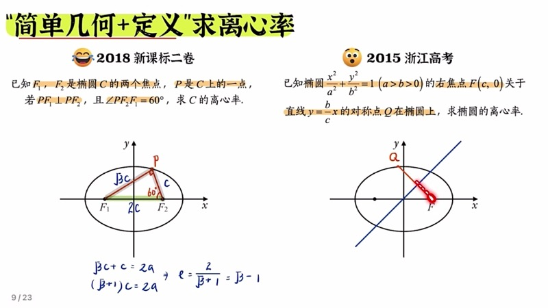
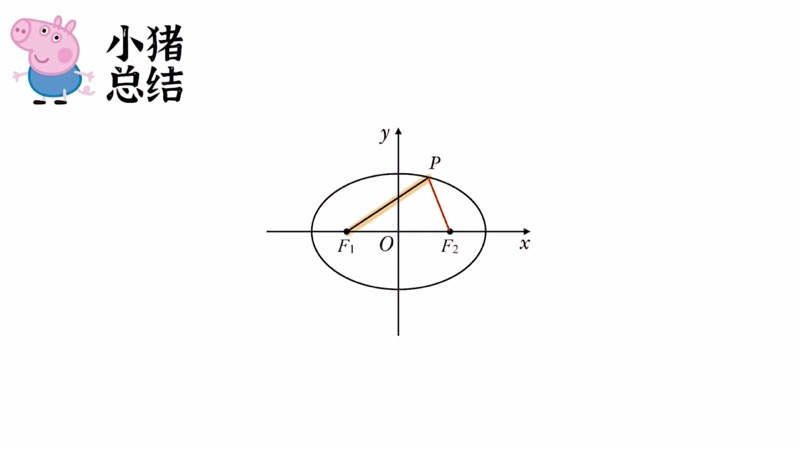
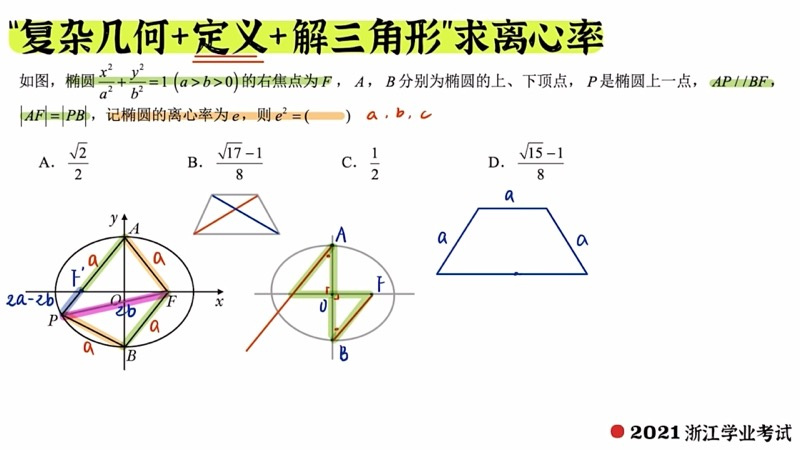
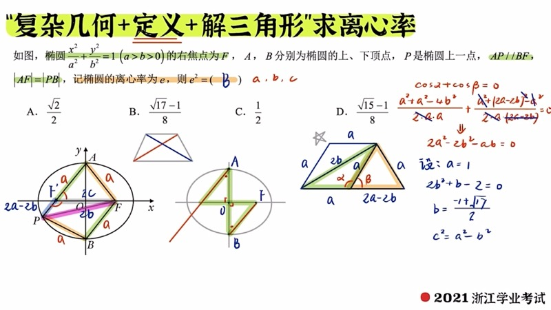

本课系统讲解椭圆离心率（eccentricity）求解的出题思路与方法。离心率问题分为**定值问题**和**范围问题**两大类，我们重点分析定值问题的三种解题路径：利用定义加解三角形、识别几何条件中的隐含关系、以及暴力坐标计算。通过高考真题从易到难逐步深入，帮助大家建立求离心率的系统思维。

::: {.callout-note collapse="true"}
## 预备知识

- 椭圆（ellipse）的标准方程：$\dfrac{x^2}{a^2} + \dfrac{y^2}{b^2} = 1 \;(a > b > 0)$
- 离心率（eccentricity）：$e = \dfrac{c}{a}$，其中 $c^2 = a^2 - b^2$
- 椭圆的定义：$|PF_1| + |PF_2| = 2a$
- 余弦定理（Law of Cosines）与解三角形基本方法
- 焦点三角形（focal triangle）的概念
- 设一法（normalization method）：设 $a=1$ 求比例关系
:::

## 本课内容

- 离心率的基本含义：$e$ 越大椭圆越扁，$e$ 越小椭圆越圆，$0 < e < 1$
- 求离心率的本质：寻找 $a$、$b$、$c$ 三者之间的关系
- 第一类：简单几何 + 椭圆定义（焦点三角形直接解）
- 第二类：隐含几何条件（对称、中位线、需自行连线构造焦点三角形）
- 第三类：多三角形联解（等腰梯形、菱形等复杂图形中的余弦定理）
- 第四类：暴力计算（坐标代入椭圆方程建立等式）
- 设一法求离心率的技巧

## 课程视频

```{=html}
<div class="video-container">
  <iframe src="//player.bilibili.com/player.html?bvid=BV1chytYaE4C&page=1" title="椭圆离心率的出题思路" frameborder="0" scrolling="no" allowfullscreen></iframe>
</div>
```

## 课程关键帧









## 核心概念

### 一、离心率的基本理解

离心率 $e = \dfrac{c}{a}$ 衡量椭圆的扁圆程度。由 $a^2 = b^2 + c^2$ 可知 $a > c$，因此 $0 < e < 1$。

- 当 $e \to 1$：$c \to a$，$b \to 0$，椭圆趋于扁平
- 当 $e \to 0$：$c \to 0$，$b \to a$，椭圆趋于圆形

**求离心率的本质**就是找到 $a$、$b$、$c$ 之间的一个等式关系，从而得到 $e = \dfrac{c}{a}$ 的值。

### 二、第一类：定义 + 解三角形（简单题）

椭圆上的点 $P$ 与两个焦点 $F_1$、$F_2$ 构成的三角形称为**焦点三角形**（focal triangle），其核心性质为 $|PF_1| + |PF_2| = 2a$，底边 $|F_1F_2| = 2c$。

**例题（2018 新高考二卷）**：$F_1$、$F_2$ 是两个焦点，$P$ 是椭圆上一点，$PF_1 \perp F_1F_2$，$\angle PF_2F_1 = 60°$。

分析：$\triangle PF_1F_2$ 是 $30°$-$60°$-$90°$ 直角三角形，三边比为 $1 : \sqrt{3} : 2$。斜边 $|F_1F_2| = 2c$，两直角边分别为 $c$ 和 $\sqrt{3}c$。由椭圆定义：

$$
|PF_1| + |PF_2| = \sqrt{3}c + c = 2a \implies e = \frac{c}{a} = \frac{2}{\sqrt{3}+1} = \sqrt{3} - 1
$$

::: {.callout-tip}
## 解题要点
遇到椭圆上的点与焦点相关的问题，务必**主动将椭圆上的点与两个焦点都连起来**，构造完整的焦点三角形，利用 $|PF_1| + |PF_2| = 2a$ 这一定义。
:::

### 三、第二类：隐含几何条件（进阶题）

**例题（2015 高考）**：椭圆右焦点 $F$，直线斜率为 $\dfrac{b}{c}$，右焦点关于该直线的对称点 $Q$ 恰好也在椭圆上，求离心率。

**关键识别**：
1. 对称意味着连线 $QF$ 与对称轴垂直，且对称轴平分 $QF$
2. 原点 $O$ 是 $F_1F_2$ 的中点，对称轴中点与 $O$ 构成中位线 $\implies$ 对称轴 $\parallel QF_1$
3. 斜率 $\dfrac{b}{c}$ 恰好等于上顶点 $(0,b)$ 与焦点 $(-c,0)$ 连线的斜率，因此 $Q$ 就在上顶点
4. 焦点三角形为等腰直角三角形：$2c = \sqrt{2}\cdot a$，得 $e = \dfrac{\sqrt{2}}{2}$

### 四、第三类：多三角形联解（难题）

**例题（2021 浙江学业考试）**：右焦点 $F$，$A$、$B$ 分别是上下顶点，$P$ 是椭圆上一点，$AP \parallel BF$，$|AF| = |PB|$，求 $e^2$。

**解题步骤**：

1. **识别隐含焦点**：$AP \parallel BF$，$A$、$B$ 关于中心对称 $\implies$ 延长 $AP$ 方向上的对称点即为左焦点 $F_1$
2. **计算各边长**：$|AF| = |BF| = a$（由 $\triangle OAF$ 中 $\sqrt{b^2+c^2} = a$），等腰梯形各边确定
3. **连接 $PF_2$**：利用等腰梯形对角线相等的性质，确定 $|PF_2|$ 的值
4. **双余弦定理**（贴贴法）：在两个相邻三角形中分别列余弦定理，利用 $\cos\alpha + \cos\beta = 0$ 消元
5. **得到关系式**：$2a^2 - 2b^2 - ab = 0$
6. **设一法求解**：设 $a = 1$，解方程 $2b^2 + b - 2 = 0$，由求根公式得 $b = \dfrac{-1+\sqrt{17}}{4}$，再由 $c^2 = a^2 - b^2$ 求出离心率

::: {.callout-important}
## 选择三角形的策略
当图形中有多个三角形可以联解时，应选择**变量最少**的一对三角形列余弦定理。尽量避免同时引入 $a$、$b$、$c$ 三个未知量，优先选择只含其中两个的三角形组合。
:::

### 五、第四类：暴力坐标计算

当几何关系不明显时，可直接通过坐标联立求解。

**方法**：
1. 确定各已知点的坐标（用 $a$、$b$、$c$ 表示）
2. 列出直线方程，求交点坐标
3. 利用"点在椭圆上"的条件，将坐标代入椭圆方程
4. 化简得到 $a$、$b$、$c$ 的关系式，求出离心率

### 交互演示：离心率与椭圆形状（Desmos）

```{=html}
<div id="calc-ecc-shape" class="desmos-container"></div>
<script src="https://www.desmos.com/api/v1.9/calculator.js?apiKey=dcb31709b452b1cf9dc26972add0fda6"></script>
<script>
(function() {
  var elt = document.getElementById('calc-ecc-shape');
  var calc = Desmos.GraphingCalculator(elt, {
    expressions: true, settingsMenu: false, xAxisLabel: 'x', yAxisLabel: 'y'
  });
  calc.setExpression({ id: 'e_val', latex: 'e_0 = 0.6', sliderBounds: { min: 0.05, max: 0.99, step: 0.01 } });
  calc.setExpression({ id: 'a', latex: 'a = 3' });
  calc.setExpression({ id: 'c_val', latex: 'c_0 = a \\cdot e_0' });
  calc.setExpression({ id: 'b', latex: 'b_0 = \\sqrt{a^2 - c_0^2}' });
  calc.setExpression({ id: 'ellipse', latex: '\\frac{x^2}{a^2} + \\frac{y^2}{b_0^2} = 1', color: '#2d70b3' });
  calc.setExpression({ id: 'F1', latex: '(-c_0, 0)', color: '#c74440', pointStyle: 'POINT', pointSize: 12, label: 'F\u2081', showLabel: true });
  calc.setExpression({ id: 'F2', latex: '(c_0, 0)', color: '#c74440', pointStyle: 'POINT', pointSize: 12, label: 'F\u2082', showLabel: true });
  calc.setMathBounds({ left: -5, right: 5, bottom: -4, top: 4 });
})();
</script>
```

拖动滑块 $e_0$ 改变离心率的值，观察椭圆形状的变化。$e_0$ 越接近 $1$ 椭圆越扁，越接近 $0$ 椭圆越圆。

### 交互演示：焦点三角形与离心率（Desmos）

```{=html}
<div id="calc-focal-tri-ecc" class="desmos-container"></div>
<script>
(function() {
  var elt = document.getElementById('calc-focal-tri-ecc');
  var calc = Desmos.GraphingCalculator(elt, {
    expressions: true, settingsMenu: false, xAxisLabel: 'x', yAxisLabel: 'y'
  });
  calc.setExpression({ id: 'a', latex: 'a = 3', sliderBounds: { min: 1.5, max: 5, step: 0.1 } });
  calc.setExpression({ id: 'b', latex: 'b = 2', sliderBounds: { min: 0.5, max: 4, step: 0.1 } });
  calc.setExpression({ id: 'ellipse', latex: '\\frac{x^2}{a^2} + \\frac{y^2}{b^2} = 1', color: '#2d70b3' });
  calc.setExpression({ id: 'c_val', latex: 'c_0 = \\sqrt{a^2 - b^2}' });
  calc.setExpression({ id: 'ecc', latex: 'e_0 = c_0 / a' });
  calc.setExpression({ id: 'F1', latex: '(-c_0, 0)', color: '#c74440', pointSize: 10, label: 'F\u2081', showLabel: true });
  calc.setExpression({ id: 'F2', latex: '(c_0, 0)', color: '#c74440', pointSize: 10, label: 'F\u2082', showLabel: true });
  calc.setExpression({ id: 't', latex: 't = 1.0', sliderBounds: { min: 0.05, max: 3.1, step: 0.01 } });
  calc.setExpression({ id: 'Px', latex: 'P_x = a \\cos(t)' });
  calc.setExpression({ id: 'Py', latex: 'P_y = b \\sin(t)' });
  calc.setExpression({ id: 'P', latex: '(P_x, P_y)', color: '#388c46', pointSize: 12, label: 'P', showLabel: true });
  calc.setExpression({ id: 'seg1', latex: '(1-s)(-c_0, 0) + s(P_x, P_y)', color: '#fa7e19', parametricDomain: { min: 0, max: 1 }, lineWidth: 2 });
  calc.setExpression({ id: 'seg2', latex: '(1-s)(c_0, 0) + s(P_x, P_y)', color: '#fa7e19', parametricDomain: { min: 0, max: 1 }, lineWidth: 2 });
  calc.setExpression({ id: 'seg3', latex: '(1-s)(-c_0, 0) + s(c_0, 0)', color: '#fa7e19', parametricDomain: { min: 0, max: 1 }, lineWidth: 2 });
  calc.setMathBounds({ left: -6, right: 6, bottom: -4, top: 4 });
})();
</script>
```

调节 $a$、$b$ 改变椭圆参数，拖动 $t$ 改变点 $P$ 的位置，观察焦点三角形的变化。注意离心率 $e_0 = c_0/a$ 的实时值。

### D3 动画：几何条件到离心率 — 角平分线与中垂线约束

```{=html}
<div class="d3-container" id="d3-geo-to-ecc">
  <svg id="svg-geo-to-ecc" width="600" height="400"></svg>
  <div class="d3-controls" id="controls-geo-to-ecc">
    <label>约束类型：</label>
    <select id="geo-ecc-mode">
      <option value="perp">PF₁ ⊥ F₁F₂ (直角三角形)</option>
      <option value="bisector">角平分线约束</option>
      <option value="midperp">中垂线约束</option>
    </select>
    <br>
    <label>角度 α = <input type="range" id="geo-ecc-angle" min="10" max="80" step="1" value="60"><span id="geo-ecc-val-angle">60</span>°</label>
  </div>
  <div id="geo-ecc-info" style="font-family: 'KaTeX_Main', serif; font-size: 15px; padding: 8px; background: #f8f8f8; border-radius: 6px; margin-top: 6px;"></div>
</div>
<script src="https://d3js.org/d3.v7.min.js"></script>
<script>
(function() {
  var W = 600, H = 400, margin = 50;
  var svg = d3.select('#svg-geo-to-ecc');
  svg.selectAll('*').remove();

  var a = 3, mode = 'perp', angleDeg = 60;

  function toSVG(x, y) {
    var s = (W - 2*margin) / (2*a*1.4);
    return [W/2 + x*s, H/2 - y*s];
  }

  function drawEllipse(a, b, n) {
    var pts = [];
    for (var i = 0; i <= n; i++) {
      var t = 2*Math.PI*i/n;
      pts.push(toSVG(a*Math.cos(t), b*Math.sin(t)));
    }
    return pts;
  }

  svg.append('line').attr('x1',margin).attr('y1',H/2).attr('x2',W-margin).attr('y2',H/2).attr('stroke','#ccc').attr('stroke-width',1);
  svg.append('line').attr('x1',W/2).attr('y1',margin).attr('x2',W/2).attr('y2',H-margin).attr('stroke','#ccc').attr('stroke-width',1);

  var ellipsePath = svg.append('path').attr('fill','none').attr('stroke','#2d70b3').attr('stroke-width',2);
  var triPath = svg.append('path').attr('fill','rgba(250,126,25,0.12)').attr('stroke','#fa7e19').attr('stroke-width',2);
  var constraintLine = svg.append('line').attr('stroke','#6042a6').attr('stroke-width',2).attr('stroke-dasharray','6,3');
  var dotF1 = svg.append('circle').attr('r',5).attr('fill','#c74440');
  var dotF2 = svg.append('circle').attr('r',5).attr('fill','#c74440');
  var dotP = svg.append('circle').attr('r',7).attr('fill','#388c46');
  var lblF1 = svg.append('text').text('F\u2081').attr('font-size',13).attr('fill','#c74440');
  var lblF2 = svg.append('text').text('F\u2082').attr('font-size',13).attr('fill','#c74440');
  var lblP = svg.append('text').text('P').attr('font-size',13).attr('fill','#388c46');
  var rightAngle = svg.append('path').attr('fill','none').attr('stroke','#333').attr('stroke-width',1.5);

  function update() {
    var alpha = angleDeg * Math.PI / 180;
    var e, c, b, px, py;

    if (mode === 'perp') {
      // PF1 perp F1F2, angle PF2F1 = alpha
      // tan(alpha) = PF1/F1F2 = PF1/(2c)
      // PF1 = 2c*tan(alpha), PF2 = 2c/cos(alpha)
      // PF1+PF2 = 2a => 2c(tan(alpha) + 1/cos(alpha)) = 2a
      // e = c/a = 1/(tan(alpha)+1/cos(alpha))
      e = 1/(Math.tan(alpha) + 1/Math.cos(alpha));
      c = a * e;
      b = Math.sqrt(a*a - c*c);
      px = -c; py = 2*c*Math.tan(alpha);
    } else if (mode === 'bisector') {
      // Angle bisector from P bisects F1PF2, meeting F1F2 at ratio PF1:PF2
      // Use special case: angle F1PF2 = 2*alpha
      var halfAngle = alpha;
      var theta = 2*alpha;
      // From focal triangle area formula area = b^2*tan(theta/2)
      // and PF1+PF2=2a, use cosine theorem
      // cos(theta) = (4a^2-2mn-4c^2)/(2mn) where mn = 2b^2/(1+cos(theta))
      // For visualization, place P at parametric angle
      var t = Math.PI/2 - alpha*0.5;
      e = 0.6;
      c = a*e; b = Math.sqrt(a*a-c*c);
      px = a*Math.cos(t); py = b*Math.sin(t);
    } else {
      // Midperp: perpendicular bisector of PF1 passes through specific point
      var t = alpha * Math.PI / 180 + 0.5;
      e = Math.sin(alpha)*0.7 + 0.2;
      if (e > 0.95) e = 0.95;
      c = a*e; b = Math.sqrt(a*a-c*c);
      px = a*Math.cos(alpha*0.8); py = b*Math.sin(alpha*0.8);
    }

    if (b < 0.1) b = 0.1;
    c = Math.sqrt(a*a - b*b);
    e = c/a;

    var line = d3.line().x(function(d){return d[0];}).y(function(d){return d[1];});
    ellipsePath.attr('d', line(drawEllipse(a, b, 200)));

    var f1 = toSVG(-c,0), f2 = toSVG(c,0), p = toSVG(px,py);
    triPath.attr('d','M'+f1[0]+','+f1[1]+' L'+p[0]+','+p[1]+' L'+f2[0]+','+f2[1]+' Z');

    dotF1.attr('cx',f1[0]).attr('cy',f1[1]);
    dotF2.attr('cx',f2[0]).attr('cy',f2[1]);
    dotP.attr('cx',p[0]).attr('cy',p[1]);
    lblF1.attr('x',f1[0]-18).attr('y',f1[1]+20);
    lblF2.attr('x',f2[0]+8).attr('y',f2[1]+20);
    lblP.attr('x',p[0]+10).attr('y',p[1]-10);

    if (mode === 'perp') {
      var sz = 12;
      rightAngle.attr('d','M'+(f1[0]+sz)+','+f1[1]+' L'+(f1[0]+sz)+','+(f1[1]-sz)+' L'+f1[0]+','+(f1[1]-sz));
      constraintLine.attr('x1',f1[0]).attr('y1',f1[1]).attr('x2',f1[0]).attr('y2',p[1]).attr('opacity',1);
    } else {
      rightAngle.attr('d','');
      var mx = (px+(-c))/2, my = py/2;
      var ms = toSVG(mx,my);
      constraintLine.attr('x1',ms[0]-60).attr('y1',ms[1]+40).attr('x2',ms[0]+60).attr('y2',ms[1]-40).attr('opacity',1);
    }

    var pf1 = Math.sqrt((px+c)*(px+c)+py*py);
    var pf2 = Math.sqrt((px-c)*(px-c)+py*py);

    document.getElementById('geo-ecc-info').innerHTML =
      'e = c/a = ' + e.toFixed(4) +
      ' &nbsp;&nbsp; a = ' + a.toFixed(1) + ', b = ' + b.toFixed(3) + ', c = ' + c.toFixed(3) +
      '<br>|PF\u2081| = ' + pf1.toFixed(3) + ' &nbsp; |PF\u2082| = ' + pf2.toFixed(3) +
      ' &nbsp; |PF\u2081|+|PF\u2082| = ' + (pf1+pf2).toFixed(3) + ' = 2a';
  }

  d3.select('#geo-ecc-mode').on('change', function() { mode = this.value; update(); });
  d3.select('#geo-ecc-angle').on('input', function() {
    angleDeg = +this.value;
    d3.select('#geo-ecc-val-angle').text(angleDeg);
    update();
  });

  update();
})();
</script>
```

选择不同的几何约束类型，调节角度滑块，观察对应的椭圆形状和离心率的变化。直角三角形约束下，$\angle PF_2F_1$ 直接决定离心率。

### D3 动画：参数范围可视化 — $e$ 的取值与椭圆形状对应

```{=html}
<div class="d3-container" id="d3-ecc-range">
  <svg id="svg-ecc-range" width="600" height="420"></svg>
  <div class="d3-controls" id="controls-ecc-range">
    <label>离心率 e = <input type="range" id="ecc-range-slider" min="0.05" max="0.95" step="0.01" value="0.5"><span id="ecc-range-val">0.50</span></label>
    <button id="ecc-range-play">\u25B6 动画播放</button>
    <button id="ecc-range-pause">\u23F8 暂停</button>
  </div>
</div>
<script>
(function() {
  var W = 600, H = 420, margin = 40;
  var svg = d3.select('#svg-ecc-range');
  svg.selectAll('*').remove();

  var a = 2.5, ecc = 0.5, animating = false, animTimer = null;

  // Top: ellipse display
  var ellipseG = svg.append('g').attr('transform','translate('+W/2+',140)');
  var ellipsePath = ellipseG.append('path').attr('fill','rgba(45,112,179,0.1)').attr('stroke','#2d70b3').attr('stroke-width',2.5);
  var foci1 = ellipseG.append('circle').attr('r',4).attr('fill','#c74440');
  var foci2 = ellipseG.append('circle').attr('r',4).attr('fill','#c74440');
  var lblE = ellipseG.append('text').attr('font-size',16).attr('fill','#333').attr('text-anchor','middle').attr('y',-100);

  // Bottom: e number line
  var nlY = 340, nlX1 = 80, nlX2 = W-80;
  svg.append('line').attr('x1',nlX1).attr('y1',nlY).attr('x2',nlX2).attr('y2',nlY).attr('stroke','#333').attr('stroke-width',2);
  svg.append('text').text('0').attr('x',nlX1).attr('y',nlY+20).attr('font-size',13).attr('text-anchor','middle');
  svg.append('text').text('1').attr('x',nlX2).attr('y',nlY+20).attr('font-size',13).attr('text-anchor','middle');
  svg.append('text').text('e').attr('x',W/2).attr('y',nlY+38).attr('font-size',14).attr('text-anchor','middle').attr('fill','#666');

  // Markers for common values
  var markers = [0.5, Math.sqrt(2)/2, Math.sqrt(3)/2];
  var labels = ['1/2', '\u221A2/2', '\u221A3/2'];
  markers.forEach(function(v, i) {
    var x = nlX1 + (nlX2-nlX1)*v;
    svg.append('line').attr('x1',x).attr('y1',nlY-5).attr('x2',x).attr('y2',nlY+5).attr('stroke','#999').attr('stroke-width',1);
    svg.append('text').text(labels[i]).attr('x',x).attr('y',nlY+20).attr('font-size',10).attr('text-anchor','middle').attr('fill','#999');
  });

  var needle = svg.append('circle').attr('cy',nlY).attr('r',7).attr('fill','#c74440');
  var rangeRect = svg.append('rect').attr('y',nlY-12).attr('height',24).attr('fill','rgba(56,140,70,0.2)').attr('stroke','#388c46').attr('stroke-width',1).attr('rx',4);

  function update() {
    var c = a*ecc, b = Math.sqrt(a*a - c*c);
    var scale = 80;

    var pts = [];
    for (var i = 0; i <= 200; i++) {
      var t = 2*Math.PI*i/200;
      pts.push([a*Math.cos(t)*scale/a, -b*Math.sin(t)*scale/a]);
    }
    var line = d3.line().x(function(d){return d[0];}).y(function(d){return d[1];});
    ellipsePath.attr('d', line(pts));
    foci1.attr('cx', -c*scale/a);
    foci2.attr('cx', c*scale/a);
    lblE.text('e = ' + ecc.toFixed(3) + '  (b/a = ' + (b/a).toFixed(3) + ')');

    var nx = nlX1 + (nlX2-nlX1)*ecc;
    needle.attr('cx', nx);
    rangeRect.attr('x', nlX1).attr('width', nx-nlX1);
  }

  d3.select('#ecc-range-slider').on('input', function() {
    ecc = +this.value;
    d3.select('#ecc-range-val').text(ecc.toFixed(2));
    update();
  });

  function startAnim() {
    if (animating) return;
    animating = true;
    var t0 = Date.now();
    animTimer = d3.timer(function() {
      var elapsed = (Date.now() - t0) * 0.001;
      ecc = 0.1 + 0.8 * (0.5 + 0.5*Math.sin(elapsed*0.8));
      d3.select('#ecc-range-slider').property('value', ecc);
      d3.select('#ecc-range-val').text(ecc.toFixed(2));
      update();
    });
  }
  function stopAnim() {
    animating = false;
    if (animTimer) { animTimer.stop(); animTimer = null; }
  }

  d3.select('#ecc-range-play').on('click', startAnim);
  d3.select('#ecc-range-pause').on('click', stopAnim);

  update();
})();
</script>
```

拖动滑块或点击"动画播放"，观察离心率 $e$ 从 $0$ 到 $1$ 变化时椭圆形状的连续变化。数轴上标注了常见的离心率值 $\dfrac{1}{2}$、$\dfrac{\sqrt{2}}{2}$、$\dfrac{\sqrt{3}}{2}$。

## 速查表

::: {.key-formula}

| 出题类型 | 方法 | 关键步骤 |
|:---------|:-----|:---------|
| 简单几何 + 定义 | 构造焦点三角形，解三角形 | 利用 $\|PF_1\|+\|PF_2\|=2a$，结合特殊角 |
| 隐含几何条件 | 识别对称性、中位线、平行关系 | 主动连线构造焦点三角形，识别隐含焦点 |
| 多三角形联解 | 余弦定理"贴贴法" | 选择变量最少的相邻三角形对，避免引入多余字母 |
| 暴力计算 | 联立方程，坐标代入 | 求交点坐标，代入椭圆方程建立 $a$, $b$, $c$ 关系 |
| 设一法 | 设 $a=1$（或其他参数为 $1$） | 将比例关系转化为具体数值，方便求根 |
| 离心率范围 | $0 < e < 1$ | $e \to 0$ 圆形，$e \to 1$ 扁平 |

:::
