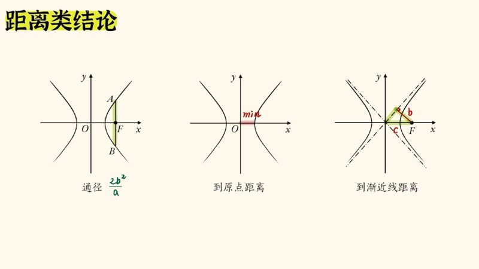
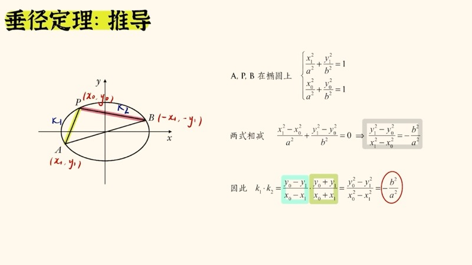
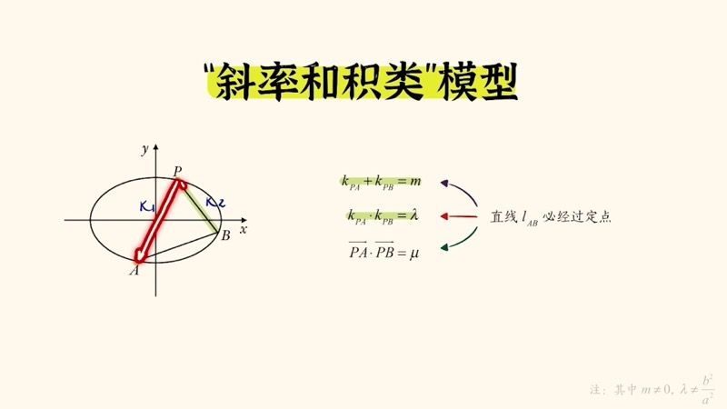
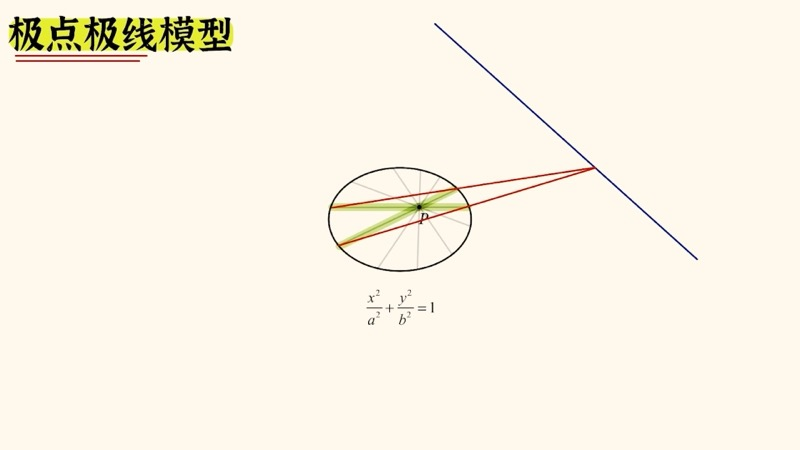

本课对高考圆锥曲线（conic sections）中出现频率最高的二级结论与常考模型进行大串讲。我们从距离类结论出发，逐步讲解焦点三角形面积公式、垂径定理（椭圆/双曲线第三定义）、切线方程改写规则，以及斜率和积模型、四点共圆模型和极点极线模型。这些结论覆盖椭圆、双曲线和抛物线三种曲线。

::: {.callout-note collapse="true"}
## 预备知识

- 椭圆标准方程：$\dfrac{x^2}{a^2} + \dfrac{y^2}{b^2} = 1\;(a>b>0)$，$c^2 = a^2 - b^2$
- 双曲线标准方程：$\dfrac{x^2}{a^2} - \dfrac{y^2}{b^2} = 1$，$c^2 = a^2 + b^2$
- 抛物线标准方程：$y^2 = 2px$，焦点 $\left(\dfrac{p}{2},0\right)$
- 焦半径公式（focal radius formula）
- 点差法（point-difference method）
- 余弦定理（Law of Cosines）
:::

## 本课内容

- 距离类结论：通径、焦半径公式、曲线上点到原点/焦点的距离范围
- 焦点三角形面积公式：椭圆 $S = b^2\tan\dfrac{\theta}{2}$，双曲线 $S = \dfrac{b^2}{\tan\frac{\theta}{2}}$
- 垂径定理（第三定义）：椭圆 $k_1 k_2 = -\dfrac{b^2}{a^2}$，双曲线 $k_1 k_2 = \dfrac{b^2}{a^2}$
- 切线方程的统一改写规则
- 常考模型：斜率和积模型、四点共圆模型、极点极线模型

## 课程视频

```{=html}
<div class="video-container">
  <iframe src="//player.bilibili.com/player.html?bvid=BV1K7q5YEEAR&page=1" title="一口气学完圆锥曲线二级结论" frameborder="0" scrolling="no" allowfullscreen></iframe>
</div>
```

## 课程关键帧









## 核心概念

### 一、距离类结论

#### 1. 通径（Semi-latus Rectum）

过焦点作垂直于长轴（实轴）的弦，其长度为：

$$
\text{椭圆/双曲线通径} = \frac{2b^2}{a}
$$

椭圆上通径端点的纵坐标为 $\pm\dfrac{b^2}{a}$（将 $x = c$ 代入椭圆方程即得）。

#### 2. 椭圆上点到原点的距离范围

$$
b \leqslant |PO| \leqslant a
$$

最大值在长轴端点取得，最小值在短轴端点取得。

#### 3. 椭圆上点到焦点的距离范围（焦半径）

$$
a - c \leqslant |PF| \leqslant a + c
$$

最大值和最小值分别在长轴的远端和近端取得（对应天体运动中的远日点和近日点）。

一般位置 $P(x_0, y_0)$ 的焦半径公式：

$$
|PF_1| = a + ex_0, \qquad |PF_2| = a - ex_0 \quad\text{（左加右减）}
$$

#### 4. 双曲线的特殊距离

- 通径：$\dfrac{2b^2}{a}$（与椭圆相同）
- 曲线上点到原点的最短距离：$a$（在实轴端点处取得）
- 焦点到渐近线的距离恒等于 $b$，因此焦点、渐近线上的垂足和原点构成直角三角形，三边为 $a$、$b$、$c$

双曲线焦半径公式（含绝对值）：

$$
|PF_1| = |a + ex_0|, \qquad |PF_2| = |a - ex_0|
$$

### 二、焦点三角形面积公式（Focal Triangle Area Formula）

设 $\angle F_1PF_2 = \theta$：

$$
\text{椭圆：} \quad S_{\triangle PF_1F_2} = b^2 \tan\frac{\theta}{2}
$$

$$
\text{双曲线：} \quad S_{\triangle PF_1F_2} = \frac{b^2}{\tan\frac{\theta}{2}}
$$

**推导要点**：设 $|PF_1| = m$，$|PF_2| = n$，利用椭圆定义 $m+n = 2a$（双曲线为 $|m-n| = 2a$）与余弦定理，配方后得 $mn$ 的表达式，再与面积公式 $S = \dfrac{1}{2}mn\sin\theta$ 结合，运用二倍角公式化简。

### 三、垂径定理（第三定义）

#### 椭圆

$A$、$B$ 关于中心对称（含左右顶点或上下顶点的特殊情况），$P$ 为椭圆上异于 $A$、$B$ 的任一点：

$$
k_{PA} \cdot k_{PB} = -\frac{b^2}{a^2}
$$

**推广**：若 $M$ 是任意弦 $PQ$ 的中点，则 $k_{PQ} \cdot k_{OM} = -\dfrac{b^2}{a^2}$（由中位线性质得出）。

#### 双曲线

$$
k_{PA} \cdot k_{PB} = \frac{b^2}{a^2} \quad\text{（正号！）}
$$

双曲线的垂径定理同样有多种形式：过原点的弦、左右顶点、弦中点与原点连线，甚至渐近线上两点与弦中点的斜率关系，均满足 $k_1 k_2 = \dfrac{b^2}{a^2}$。

::: {.callout-important}
## 椭圆与双曲线的符号区别
椭圆：$k_1 k_2 = -\dfrac{b^2}{a^2}$（**负号**）；双曲线：$k_1 k_2 = +\dfrac{b^2}{a^2}$（**正号**）。切勿混淆！
:::

### 四、切线方程的统一改写规则

设切点坐标为 $(x_0, y_0)$，切线方程的改写规则如下：

| 二次项 | 改写方式 |
|:-------|:---------|
| $x^2$ | $\to x_0 x$ |
| $y^2$ | $\to y_0 y$ |
| $x$（一次项） | $\to \dfrac{x_0 + x}{2}$ |
| $y$（一次项） | $\to \dfrac{y_0 + y}{2}$ |
| 常数项 | 不变 |

由此得到三种曲线的切线方程：

$$
\text{椭圆：} \quad \frac{x_0 x}{a^2} + \frac{y_0 y}{b^2} = 1
$$

$$
\text{双曲线：} \quad \frac{x_0 x}{a^2} - \frac{y_0 y}{b^2} = 1
$$

$$
\text{抛物线}\ (y^2 = 2px)\text{：} \quad y_0 y = p(x_0 + x)
$$

### 五、常考模型

#### 1. 斜率和积模型

过定点 $P$ 做两条弦，分别交圆锥曲线于 $A$、$B$，若 $k_1 + k_2 = \text{const}$、$k_1 \cdot k_2 = \text{const}$，或 $\overrightarrow{PA}\cdot\overrightarrow{PB} = \text{const}$，则直线 $AB$ 过某个定点。

**特殊情形**：当 $k_1 + k_2 = 0$（斜率互为相反数），直线 $AB$ 的斜率为定值（退化为切线斜率 $k = \dfrac{b^2 x_0}{a^2 y_0}$）。

#### 2. 四点共圆模型

圆锥曲线上四点 $A$、$B$、$C$、$D$ 共圆，则对角连线 $AC$ 与 $BD$ 的斜率之和 $k_1 + k_2 = 0$（互为相反数）。同理 $AD$ 与 $BC$ 的斜率之和也为零。

#### 3. 极点极线模型

给定圆锥曲线 $\dfrac{x^2}{a^2} + \dfrac{y^2}{b^2} = 1$ 和定点 $P(x_0, y_0)$，过 $P$ 任意做两弦，交叉连线的交点共线，该直线方程为：

$$
\frac{x_0 x}{a^2} + \frac{y_0 y}{b^2} = 1
$$

此直线称为 $P$ 的**极线**（polar），$P$ 称为该直线的**极点**（pole）。极点与极线一一对应，可由点推线，也可由线推点。

### 交互演示：距离类结论对比（Desmos）

```{=html}
<div id="calc-distance-compare" class="desmos-container"></div>
<script src="https://www.desmos.com/api/v1.9/calculator.js?apiKey=dcb31709b452b1cf9dc26972add0fda6"></script>
<script>
(function() {
  var elt = document.getElementById('calc-distance-compare');
  var calc = Desmos.GraphingCalculator(elt, {
    expressions: true, settingsMenu: false, xAxisLabel: 'x', yAxisLabel: 'y'
  });
  calc.setExpression({ id: 'a', latex: 'a = 3', sliderBounds: { min: 1.5, max: 5, step: 0.1 } });
  calc.setExpression({ id: 'b', latex: 'b = 2', sliderBounds: { min: 0.5, max: 4, step: 0.1 } });
  calc.setExpression({ id: 'ellipse', latex: '\\frac{x^2}{a^2} + \\frac{y^2}{b^2} = 1', color: '#2d70b3' });
  calc.setExpression({ id: 'c_val', latex: 'c_0 = \\sqrt{a^2 - b^2}' });
  calc.setExpression({ id: 'F1', latex: '(-c_0, 0)', color: '#c74440', pointSize: 10, label: 'F\u2081', showLabel: true });
  calc.setExpression({ id: 'F2', latex: '(c_0, 0)', color: '#c74440', pointSize: 10, label: 'F\u2082', showLabel: true });
  calc.setExpression({ id: 'latus', latex: 'x = c_0', color: '#388c46', lineWidth: 1.5, lineStyle: 'DASHED' });
  calc.setExpression({ id: 'latus_top', latex: '(c_0, b^2/a)', color: '#388c46', pointSize: 8, label: '通径端点', showLabel: true });
  calc.setExpression({ id: 'latus_bot', latex: '(c_0, -b^2/a)', color: '#388c46', pointSize: 8 });
  calc.setExpression({ id: 't', latex: 't = 0.8', sliderBounds: { min: 0.01, max: 3.14, step: 0.01 } });
  calc.setExpression({ id: 'P', latex: '(a\\cos(t), b\\sin(t))', color: '#fa7e19', pointSize: 12, label: 'P', showLabel: true });
  calc.setMathBounds({ left: -6, right: 6, bottom: -4, top: 4 });
})();
</script>
```

拖动 $t$ 移动椭圆上的点 $P$，观察通径（绿色虚线）位置。调节 $a$、$b$ 查看通径长度 $\dfrac{2b^2}{a}$ 的变化。

### 交互演示：垂径定理 — 斜率之积（Desmos）

```{=html}
<div id="calc-third-def-all" class="desmos-container"></div>
<script>
(function() {
  var elt = document.getElementById('calc-third-def-all');
  var calc = Desmos.GraphingCalculator(elt, {
    expressions: true, settingsMenu: false, xAxisLabel: 'x', yAxisLabel: 'y'
  });
  calc.setExpression({ id: 'a', latex: 'a = 3', sliderBounds: { min: 1.5, max: 5, step: 0.1 } });
  calc.setExpression({ id: 'b', latex: 'b = 2', sliderBounds: { min: 0.5, max: 4, step: 0.1 } });
  calc.setExpression({ id: 'ellipse', latex: '\\frac{x^2}{a^2} + \\frac{y^2}{b^2} = 1', color: '#2d70b3' });
  calc.setExpression({ id: 'A', latex: '(-a, 0)', color: '#c74440', pointSize: 12, label: 'A', showLabel: true });
  calc.setExpression({ id: 'B', latex: '(a, 0)', color: '#c74440', pointSize: 12, label: 'B', showLabel: true });
  calc.setExpression({ id: 't0', latex: 't_0 = 1.2', sliderBounds: { min: 0.05, max: 3.1, step: 0.01 } });
  calc.setExpression({ id: 'Px', latex: 'P_x = a\\cos(t_0)' });
  calc.setExpression({ id: 'Py', latex: 'P_y = b\\sin(t_0)' });
  calc.setExpression({ id: 'P', latex: '(P_x, P_y)', color: '#388c46', pointSize: 12, label: 'P', showLabel: true });
  calc.setExpression({ id: 'lineAP', latex: 'y = \\frac{P_y}{P_x+a}(x+a)', color: '#fa7e19', lineWidth: 1.5 });
  calc.setExpression({ id: 'lineBP', latex: 'y = \\frac{P_y}{P_x-a}(x-a)', color: '#6042a6', lineWidth: 1.5 });
  calc.setExpression({ id: 'k_prod', latex: 'k = \\frac{P_y}{P_x+a}\\cdot\\frac{P_y}{P_x-a}' });
  calc.setExpression({ id: 'target', latex: 'k_0 = -\\frac{b^2}{a^2}' });
  calc.setMathBounds({ left: -6, right: 6, bottom: -4, top: 4 });
})();
</script>
```

拖动 $t_0$ 移动点 $P$，验证 $k_{PA} \cdot k_{PB}$ 始终等于 $k_0 = -\dfrac{b^2}{a^2}$。

### 交互演示：切线方程改写规则（Desmos）

```{=html}
<div id="calc-tangent-rule" class="desmos-container"></div>
<script>
(function() {
  var elt = document.getElementById('calc-tangent-rule');
  var calc = Desmos.GraphingCalculator(elt, {
    expressions: true, settingsMenu: false, xAxisLabel: 'x', yAxisLabel: 'y'
  });
  calc.setExpression({ id: 'a', latex: 'a = 3', sliderBounds: { min: 1.5, max: 5, step: 0.1 } });
  calc.setExpression({ id: 'b', latex: 'b = 2', sliderBounds: { min: 0.5, max: 4, step: 0.1 } });
  calc.setExpression({ id: 'ellipse', latex: '\\frac{x^2}{a^2} + \\frac{y^2}{b^2} = 1', color: '#2d70b3' });
  calc.setExpression({ id: 't', latex: 't_0 = 0.8', sliderBounds: { min: 0.05, max: 6.2, step: 0.01 } });
  calc.setExpression({ id: 'x0', latex: 'x_0 = a\\cos(t_0)' });
  calc.setExpression({ id: 'y0', latex: 'y_0 = b\\sin(t_0)' });
  calc.setExpression({ id: 'P', latex: '(x_0, y_0)', color: '#388c46', pointSize: 12, label: 'P(x\u2080,y\u2080)', showLabel: true });
  calc.setExpression({ id: 'tangent', latex: '\\frac{x_0 x}{a^2} + \\frac{y_0 y}{b^2} = 1', color: '#c74440', lineWidth: 2 });
  calc.setMathBounds({ left: -6, right: 6, bottom: -4, top: 4 });
})();
</script>
```

拖动 $t_0$ 改变切点位置，观察切线方程 $\dfrac{x_0 x}{a^2} + \dfrac{y_0 y}{b^2} = 1$ 的实时变化。

### D3 动画：二级结论速查 — 点击结论名称高亮对应图形

```{=html}
<div class="d3-container" id="d3-conclusion-lookup">
  <svg id="svg-conclusion-lookup" width="600" height="420"></svg>
</div>
<script>
(function() {
  var W = 600, H = 420;
  var svg = d3.select('#svg-conclusion-lookup');
  svg.selectAll('*').remove();

  var a = 3, b = 2, c = Math.sqrt(a*a - b*b);
  var cx = W/2, cy = H/2 - 20;
  var sc = 50;

  function toS(x,y){ return [cx+x*sc, cy-y*sc]; }
  function ellPts(n){
    var pts=[];
    for(var i=0;i<=n;i++){var t=2*Math.PI*i/n; pts.push(toS(a*Math.cos(t),b*Math.sin(t)));}
    return pts;
  }

  var line = d3.line().x(function(d){return d[0];}).y(function(d){return d[1];});
  svg.append('path').attr('d',line(ellPts(200))).attr('fill','none').attr('stroke','#2d70b3').attr('stroke-width',2);

  // Static elements
  var f1=toS(-c,0), f2=toS(c,0), A=toS(-a,0), B=toS(a,0);
  svg.append('circle').attr('cx',f1[0]).attr('cy',f1[1]).attr('r',4).attr('fill','#c74440');
  svg.append('circle').attr('cx',f2[0]).attr('cy',f2[1]).attr('r',4).attr('fill','#c74440');
  svg.append('text').text('F\u2081').attr('x',f1[0]-15).attr('y',f1[1]+18).attr('font-size',12).attr('fill','#c74440');
  svg.append('text').text('F\u2082').attr('x',f2[0]+5).attr('y',f2[1]+18).attr('font-size',12).attr('fill','#c74440');

  // Highlight groups (initially hidden)
  var gLatus = svg.append('g').attr('opacity',0);
  var latusY = b*b/a;
  var lt1=toS(c,latusY), lt2=toS(c,-latusY);
  gLatus.append('line').attr('x1',lt1[0]).attr('y1',lt1[1]).attr('x2',lt2[0]).attr('y2',lt2[1]).attr('stroke','#388c46').attr('stroke-width',3);
  gLatus.append('text').text('2b\u00B2/a').attr('x',lt1[0]+8).attr('y',(lt1[1]+lt2[1])/2).attr('font-size',13).attr('fill','#388c46');

  var gFocalTri = svg.append('g').attr('opacity',0);
  var P=toS(a*Math.cos(1), b*Math.sin(1));
  gFocalTri.append('path').attr('d','M'+f1[0]+','+f1[1]+' L'+P[0]+','+P[1]+' L'+f2[0]+','+f2[1]+' Z').attr('fill','rgba(250,126,25,0.2)').attr('stroke','#fa7e19').attr('stroke-width',2);
  gFocalTri.append('circle').attr('cx',P[0]).attr('cy',P[1]).attr('r',5).attr('fill','#fa7e19');
  gFocalTri.append('text').text('S = b\u00B2tan(\u03B8/2)').attr('x',P[0]-30).attr('y',P[1]-15).attr('font-size',13).attr('fill','#fa7e19');

  var gThirdDef = svg.append('g').attr('opacity',0);
  var Q=toS(a*Math.cos(0.9), b*Math.sin(0.9));
  gThirdDef.append('line').attr('x1',A[0]).attr('y1',A[1]).attr('x2',Q[0]).attr('y2',Q[1]).attr('stroke','#6042a6').attr('stroke-width',2);
  gThirdDef.append('line').attr('x1',B[0]).attr('y1',B[1]).attr('x2',Q[0]).attr('y2',Q[1]).attr('stroke','#6042a6').attr('stroke-width',2);
  gThirdDef.append('circle').attr('cx',Q[0]).attr('cy',Q[1]).attr('r',5).attr('fill','#6042a6');
  gThirdDef.append('text').text('k\u2081k\u2082 = -b\u00B2/a\u00B2').attr('x',Q[0]+8).attr('y',Q[1]-10).attr('font-size',13).attr('fill','#6042a6');
  gThirdDef.append('circle').attr('cx',A[0]).attr('cy',A[1]).attr('r',4).attr('fill','#6042a6');
  gThirdDef.append('circle').attr('cx',B[0]).attr('cy',B[1]).attr('r',4).attr('fill','#6042a6');

  var gTangent = svg.append('g').attr('opacity',0);
  var T=toS(a*Math.cos(0.6), b*Math.sin(0.6));
  var tx0=a*Math.cos(0.6), ty0=b*Math.sin(0.6);
  // tangent line at T: x0*x/a^2 + y0*y/b^2 = 1
  var tanY1 = (1 - tx0*(-5)/a/a)*b*b/ty0;
  var tanY2 = (1 - tx0*5/a/a)*b*b/ty0;
  var tt1=toS(-5,tanY1), tt2=toS(5,tanY2);
  gTangent.append('line').attr('x1',tt1[0]).attr('y1',tt1[1]).attr('x2',tt2[0]).attr('y2',tt2[1]).attr('stroke','#c74440').attr('stroke-width',2.5);
  gTangent.append('circle').attr('cx',T[0]).attr('cy',T[1]).attr('r',5).attr('fill','#c74440');
  gTangent.append('text').text('x\u2080x/a\u00B2 + y\u2080y/b\u00B2 = 1').attr('x',tt2[0]-120).attr('y',tt2[1]-10).attr('font-size',12).attr('fill','#c74440');

  var groups = { 'latus': gLatus, 'focal': gFocalTri, 'third': gThirdDef, 'tangent': gTangent };

  // Buttons
  var buttons = [
    { id: 'latus', label: '\u901A\u5F84 (2b\u00B2/a)', color: '#388c46' },
    { id: 'focal', label: '\u7126\u70B9\u4E09\u89D2\u5F62\u9762\u79EF', color: '#fa7e19' },
    { id: 'third', label: '\u7B2C\u4E09\u5B9A\u4E49 (k\u2081k\u2082)', color: '#6042a6' },
    { id: 'tangent', label: '\u5207\u7EBF\u65B9\u7A0B', color: '#c74440' }
  ];

  var btnG = svg.append('g').attr('transform','translate(20,'+( H - 50)+')');
  var activeId = null;

  buttons.forEach(function(btn, i) {
    var g = btnG.append('g').attr('transform','translate('+(i*150)+',0)').attr('cursor','pointer');
    g.append('rect').attr('width',140).attr('height',32).attr('rx',6).attr('fill',btn.color).attr('opacity',0.15).attr('stroke',btn.color);
    g.append('text').text(btn.label).attr('x',70).attr('y',21).attr('text-anchor','middle').attr('font-size',12).attr('fill',btn.color);
    g.on('click', function() {
      Object.keys(groups).forEach(function(k){ groups[k].transition().duration(300).attr('opacity', k===btn.id ? 1 : 0); });
      activeId = btn.id;
    });
  });

})();
</script>
```

点击下方按钮，高亮显示对应的二级结论图形：通径、焦点三角形面积、第三定义斜率之积、切线方程。

### D3 动画：椭圆 / 双曲线 / 抛物线对比

```{=html}
<div class="d3-container" id="d3-conic-compare">
  <svg id="svg-conic-compare" width="600" height="400"></svg>
  <div class="d3-controls" id="controls-conic-compare">
    <label>a = <input type="range" id="cc-slider-a" min="1.5" max="4" step="0.1" value="2.5"><span id="cc-val-a">2.5</span></label>
    <label>b = <input type="range" id="cc-slider-b" min="0.5" max="3" step="0.1" value="1.5"><span id="cc-val-b">1.5</span></label>
    <label>p = <input type="range" id="cc-slider-p" min="0.5" max="4" step="0.1" value="2"><span id="cc-val-p">2.0</span></label>
  </div>
</div>
<script>
(function() {
  var W = 600, H = 400;
  var svg = d3.select('#svg-conic-compare');
  svg.selectAll('*').remove();

  var aVal = 2.5, bVal = 1.5, pVal = 2;

  // Three panels
  var panels = [
    { label: '\u692D\u5706', cx: 100, cy: H/2, sc: 28 },
    { label: '\u53CC\u66F2\u7EBF', cx: 300, cy: H/2, sc: 28 },
    { label: '\u629B\u7269\u7EBF', cx: 500, cy: H/2, sc: 28 }
  ];

  panels.forEach(function(p) {
    svg.append('text').text(p.label).attr('x',p.cx).attr('y',30).attr('text-anchor','middle').attr('font-size',15).attr('fill','#333').attr('font-weight','bold');
    svg.append('line').attr('x1',p.cx-80).attr('y1',p.cy).attr('x2',p.cx+80).attr('y2',p.cy).attr('stroke','#ddd');
    svg.append('line').attr('x1',p.cx).attr('y1',p.cy-120).attr('x2',p.cx).attr('y2',p.cy+120).attr('stroke','#ddd');
  });

  var ellPath = svg.append('path').attr('fill','none').attr('stroke','#2d70b3').attr('stroke-width',2);
  var hypPath1 = svg.append('path').attr('fill','none').attr('stroke','#c74440').attr('stroke-width',2);
  var hypPath2 = svg.append('path').attr('fill','none').attr('stroke','#c74440').attr('stroke-width',2);
  var parPath = svg.append('path').attr('fill','none').attr('stroke','#388c46').attr('stroke-width',2);

  var infoTexts = panels.map(function(p) {
    return svg.append('text').attr('x',p.cx).attr('y',H-20).attr('text-anchor','middle').attr('font-size',11).attr('fill','#666');
  });

  // Foci dots
  var ellF1 = svg.append('circle').attr('r',3).attr('fill','#c74440');
  var ellF2 = svg.append('circle').attr('r',3).attr('fill','#c74440');
  var hypF1 = svg.append('circle').attr('r',3).attr('fill','#c74440');
  var hypF2 = svg.append('circle').attr('r',3).attr('fill','#c74440');
  var parF = svg.append('circle').attr('r',3).attr('fill','#c74440');

  function update() {
    var cE = Math.sqrt(aVal*aVal - bVal*bVal > 0 ? aVal*aVal - bVal*bVal : 0.01);
    var cH = Math.sqrt(aVal*aVal + bVal*bVal);

    // Ellipse
    var ep = panels[0], pts = [];
    for (var i = 0; i <= 200; i++) {
      var t = 2*Math.PI*i/200;
      pts.push([ep.cx + aVal*Math.cos(t)*ep.sc, ep.cy - bVal*Math.sin(t)*ep.sc]);
    }
    ellPath.attr('d', d3.line()(pts));
    ellF1.attr('cx', ep.cx - cE*ep.sc).attr('cy', ep.cy);
    ellF2.attr('cx', ep.cx + cE*ep.sc).attr('cy', ep.cy);
    infoTexts[0].text('e=' + (cE/aVal).toFixed(2) + ' \u901A\u5F84=' + (2*bVal*bVal/aVal).toFixed(2));

    // Hyperbola
    var hp = panels[1], pts1 = [], pts2 = [];
    for (var i = -60; i <= 60; i++) {
      var t = i*0.05;
      var x = aVal*Math.cosh(t), y = bVal*Math.sinh(t);
      if (Math.abs(y)*hp.sc < 110) {
        pts1.push([hp.cx + x*hp.sc, hp.cy - y*hp.sc]);
        pts2.push([hp.cx - x*hp.sc, hp.cy - y*hp.sc]);
      }
    }
    hypPath1.attr('d', d3.line()(pts1));
    hypPath2.attr('d', d3.line()(pts2));
    hypF1.attr('cx', hp.cx - cH*hp.sc).attr('cy', hp.cy);
    hypF2.attr('cx', hp.cx + cH*hp.sc).attr('cy', hp.cy);
    infoTexts[1].text('e=' + (cH/aVal).toFixed(2) + ' \u901A\u5F84=' + (2*bVal*bVal/aVal).toFixed(2));

    // Parabola
    var pp = panels[2], ppts = [];
    for (var i = -80; i <= 80; i++) {
      var y = i*0.06;
      var x = y*y/(2*pVal);
      if (Math.abs(x)*pp.sc < 80 && Math.abs(y)*pp.sc < 110) {
        ppts.push([pp.cx + x*pp.sc, pp.cy - y*pp.sc]);
      }
    }
    parPath.attr('d', d3.line()(ppts));
    parF.attr('cx', pp.cx + pVal/2*pp.sc).attr('cy', pp.cy);
    infoTexts[2].text('p=' + pVal.toFixed(1) + ' \u901A\u5F84=' + (2*pVal).toFixed(1));
  }

  d3.select('#cc-slider-a').on('input', function() { aVal = +this.value; d3.select('#cc-val-a').text(aVal.toFixed(1)); if(bVal>=aVal){bVal=aVal-0.1; d3.select('#cc-slider-b').property('value',bVal); d3.select('#cc-val-b').text(bVal.toFixed(1));} update(); });
  d3.select('#cc-slider-b').on('input', function() { bVal = +this.value; d3.select('#cc-val-b').text(bVal.toFixed(1)); if(bVal>=aVal){bVal=aVal-0.1; d3.select('#cc-slider-b').property('value',bVal);} update(); });
  d3.select('#cc-slider-p').on('input', function() { pVal = +this.value; d3.select('#cc-val-p').text(pVal.toFixed(1)); update(); });

  update();
})();
</script>
```

同时显示椭圆、双曲线和抛物线。拖动滑块调整参数 $a$、$b$、$p$，对比三种曲线的形状变化、离心率和通径长度。

## 速查表

::: {.key-formula}

| 结论名称 | 椭圆 | 双曲线 | 抛物线 |
|:---------|:-----|:-------|:-------|
| 通径 | $\dfrac{2b^2}{a}$ | $\dfrac{2b^2}{a}$ | $2p$ |
| 到原点最短距离 | $b$ | $a$ | — |
| 焦半径 | $a \pm ex_0$ | $\|a \pm ex_0\|$ | $x_0 + \dfrac{p}{2}$ |
| 焦点三角形面积 | $b^2\tan\dfrac{\theta}{2}$ | $\dfrac{b^2}{\tan\frac{\theta}{2}}$ | — |
| 第三定义 $k_1 k_2$ | $-\dfrac{b^2}{a^2}$ | $+\dfrac{b^2}{a^2}$ | — |
| 切线方程 | $\dfrac{x_0 x}{a^2}+\dfrac{y_0 y}{b^2}=1$ | $\dfrac{x_0 x}{a^2}-\dfrac{y_0 y}{b^2}=1$ | $y_0 y = p(x_0+x)$ |
| 焦点到渐近线距离 | — | $b$ | — |

| 常考模型 | 条件 | 结论 |
|:---------|:-----|:-----|
| 斜率和积 | $k_1+k_2$ 或 $k_1 k_2$ 为定值 | 直线 $AB$ 过定点 |
| 斜率互为相反数 | $k_1+k_2=0$ | 直线 $AB$ 斜率为定值 |
| 四点共圆 | $A,B,C,D$ 共圆 | 对角连线斜率之和为 $0$ |
| 极点极线 | 过定点两弦交叉连线 | 交点共线，极线方程 $\dfrac{x_0 x}{a^2}+\dfrac{y_0 y}{b^2}=1$ |

:::
