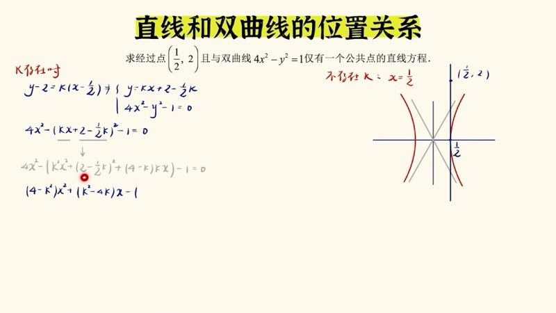
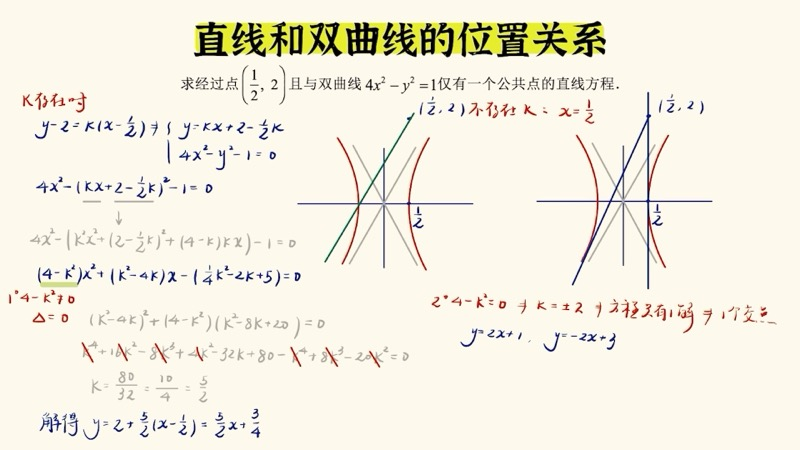
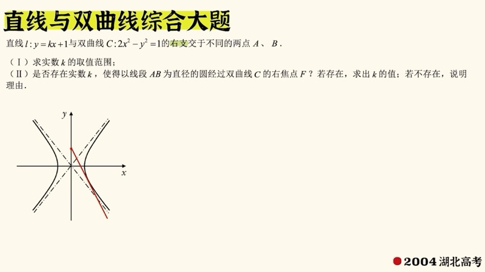
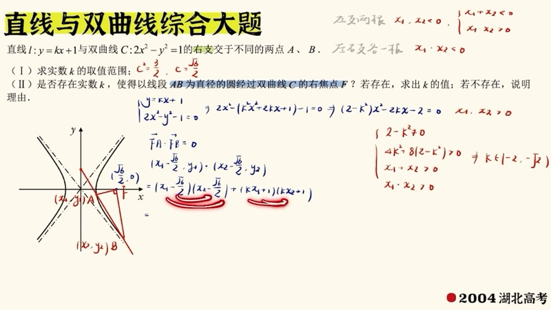

本课系统讲解直线与双曲线（hyperbola）位置关系的判定方法。与椭圆不同，直线与双曲线联立后的二次项系数可能为零，渐近线的存在也带来了新的讨论情形。我们从代数（判别式）和几何（画图观察）两个角度分析交点个数，并通过高考真题讲解韦达定理在限定交点所在支时的应用。

::: {.callout-note collapse="true"}
## 预备知识

- 双曲线（hyperbola）的标准方程：$\dfrac{x^2}{a^2} - \dfrac{y^2}{b^2} = 1$
- 渐近线（asymptote）方程：$y = \pm\dfrac{b}{a}x$
- 判别式（discriminant）$\Delta$ 与一元二次方程根的关系
- 韦达定理（Vieta's formulas）：$x_1 + x_2 = -\dfrac{B}{A}$，$x_1 x_2 = \dfrac{C}{A}$
- 直线与椭圆联立方程的基本方法
:::

## 本课内容

- 直线与双曲线联立：二次项系数可能为零的讨论
- 与渐近线平行时只有一个交点（非相切）
- 定点在双曲线"内部"vs"外部"的不同讨论策略
- 几何画图法判断交点个数
- 韦达定理的应用：限定交点在同一支或不同支
- 完整大题解题流程：画图 → 联立 → 翻译条件 → 韦达定理 → 计算

## 课程视频

```{=html}
<div class="video-container">
  <iframe src="//player.bilibili.com/player.html?bvid=BV1F615BpErW&page=1" title="直线与双曲线" frameborder="0" scrolling="no" allowfullscreen></iframe>
</div>
```

## 课程关键帧









## 核心概念

### 一、直线与椭圆 vs 直线与双曲线

对于椭圆 $\dfrac{x^2}{a^2} + \dfrac{y^2}{b^2} = 1$，将 $y = kx + m$ 代入后，$x^2$ 的系数为 $\dfrac{1}{a^2} + \dfrac{k^2}{b^2}$，两项均为正，**永远不为零**。因此只需讨论 $\Delta$ 的正负即可判断交点个数。

对于双曲线 $\dfrac{x^2}{a^2} - \dfrac{y^2}{b^2} = 1$，代入后 $x^2$ 的系数为：

$$
\frac{1}{a^2} - \frac{k^2}{b^2}
$$

当 $k = \pm\dfrac{b}{a}$（即直线平行于渐近线）时，此系数为零，方程退化为一次方程，只有一个解——此时直线与双曲线恰好有**一个交点**，但这**不是相切**。

::: {.callout-important}
## 三步讨论法
联立直线与双曲线后，必须按顺序讨论：

1. **斜率是否存在**（直线是否竖直）
2. **二次项系数是否为零**（直线是否平行于渐近线）
3. **$\Delta$ 的正负**（判别式判断交点个数）
:::

### 二、定点位置决定讨论策略

#### 定点在双曲线"外部"（渐近线之间的沙漏区域）

过该点的直线与双曲线有一个交点的情况包括：
- 与双曲线**相切**（$\Delta = 0$，需通过计算确定斜率）
- 与渐近线**平行**（$k = \pm\dfrac{b}{a}$，二次项系数为零）

因此"有且仅有一个公共点"可能有多组解。

#### 定点在双曲线"内部"（弧形包围的区域）

过该点的任何直线都至少与双曲线有交点，**不可能没有交点**。有且仅有一个交点的情况**只有**与渐近线平行这一种（不存在相切情况），此时可直接写出斜率，无需联立计算。

**例题（2024 北京高考）**：过点 $(3, 0)$ 的直线与双曲线 $x^2 - \dfrac{y^2}{?} = 1$ 有且仅有一个公共点。判断 $(3,0)$ 在双曲线内部，直接令 $k = \pm\dfrac{b}{a}$ 即可。

### 三、韦达定理限定交点所在支

**例题（2004 湖北高考）**：直线与双曲线右支有两个不同交点，求 $k$ 的取值范围。

**解题步骤**：

1. **二次项系数不为零**：保证联立后是二次方程
2. **$\Delta > 0$**：保证有两个实数根
3. **两根均大于零**（右支上 $x > 0$）：由韦达定理

$$
\begin{cases} x_1 + x_2 > 0 \\ x_1 \cdot x_2 > 0 \end{cases}
$$

四个条件取交集，得到 $k$ 的取值范围。

::: {.callout-note}
## 不同支的讨论
若要求两个交点分别在左支和右支：$x_1 \cdot x_2 < 0$（一正一负）。若要求都在左支：$x_1 + x_2 < 0$ 且 $x_1 \cdot x_2 > 0$。
:::

### 四、完整大题的解题流程

对于直线与双曲线的大题，我们遵循以下流程：

1. **画图**：确定渐近线位置、定点位置
2. **联立**：直线方程代入双曲线方程，整理成 $Ax^2 + Bx + C = 0$
3. **翻译条件**：将几何条件（如"以 $AB$ 为直径的圆过焦点"）转化为代数条件（如数量积为零 $\overrightarrow{FA}\cdot\overrightarrow{FB} = 0$）
4. **韦达定理**：用 $x_1+x_2$ 和 $x_1 x_2$ 表示条件
5. **计算求解**

### 交互演示：直线截双曲线（Desmos）

```{=html}
<div id="calc-line-hyp" class="desmos-container"></div>
<script src="https://www.desmos.com/api/v1.9/calculator.js?apiKey=dcb31709b452b1cf9dc26972add0fda6"></script>
<script>
(function() {
  var elt = document.getElementById('calc-line-hyp');
  var calc = Desmos.GraphingCalculator(elt, {
    expressions: true, settingsMenu: false, xAxisLabel: 'x', yAxisLabel: 'y'
  });
  calc.setExpression({ id: 'hyp', latex: 'x^2 - \\frac{y^2}{4} = 1', color: '#2d70b3' });
  calc.setExpression({ id: 'asym1', latex: 'y = 2x', color: '#999', lineWidth: 1, lineStyle: 'DASHED' });
  calc.setExpression({ id: 'asym2', latex: 'y = -2x', color: '#999', lineWidth: 1, lineStyle: 'DASHED' });
  calc.setExpression({ id: 'k', latex: 'k = 1.0', sliderBounds: { min: -4, max: 4, step: 0.1 } });
  calc.setExpression({ id: 'm', latex: 'm_0 = 0', sliderBounds: { min: -5, max: 5, step: 0.1 } });
  calc.setExpression({ id: 'line', latex: 'y = k x + m_0', color: '#c74440', lineWidth: 2 });
  calc.setMathBounds({ left: -6, right: 6, bottom: -6, top: 6 });
})();
</script>
```

拖动滑块 $k$ 和 $m_0$ 改变直线的斜率和截距，观察直线与双曲线的交点变化。当 $k = \pm 2$（渐近线斜率）时，直线与双曲线只有一个交点。

### 交互演示：韦达定理与交点分布（Desmos）

```{=html}
<div id="calc-vieta-hyp" class="desmos-container"></div>
<script>
(function() {
  var elt = document.getElementById('calc-vieta-hyp');
  var calc = Desmos.GraphingCalculator(elt, {
    expressions: true, settingsMenu: false, xAxisLabel: 'x', yAxisLabel: 'y'
  });
  calc.setExpression({ id: 'hyp', latex: '2x^2 - y^2 = 1', color: '#2d70b3' });
  calc.setExpression({ id: 'asym1', latex: 'y = \\sqrt{2}x', color: '#999', lineWidth: 1, lineStyle: 'DASHED' });
  calc.setExpression({ id: 'asym2', latex: 'y = -\\sqrt{2}x', color: '#999', lineWidth: 1, lineStyle: 'DASHED' });
  calc.setExpression({ id: 'k', latex: 'k = -1.5', sliderBounds: { min: -3, max: 3, step: 0.1 } });
  calc.setExpression({ id: 'line', latex: 'y = k x + 1', color: '#c74440', lineWidth: 2 });
  calc.setMathBounds({ left: -5, right: 5, bottom: -5, top: 5 });
})();
</script>
```

直线过定点 $(0, 1)$，改变斜率 $k$，观察交点在左支、右支的分布情况。注意渐近线斜率 $\pm\sqrt{2} \approx \pm 1.414$ 附近的临界行为。

### D3 动画：直线截双曲线 — 斜率控制与交点实时显示

```{=html}
<div class="d3-container" id="d3-line-hyp">
  <svg id="svg-line-hyp" width="600" height="400"></svg>
  <div class="d3-controls" id="controls-line-hyp">
    <label>斜率 k = <input type="range" id="lh-slider-k" min="-4" max="4" step="0.05" value="1"><span id="lh-val-k">1.00</span></label>
    <label>截距 m = <input type="range" id="lh-slider-m" min="-3" max="3" step="0.1" value="0.5"><span id="lh-val-m">0.5</span></label>
  </div>
  <div id="lh-info" style="font-family: 'KaTeX_Main', serif; font-size: 14px; padding: 8px; background: #f8f8f8; border-radius: 6px; margin-top: 6px;"></div>
</div>
<script src="https://d3js.org/d3.v7.min.js"></script>
<script>
(function() {
  var W = 600, H = 400, margin = 40;
  var svg = d3.select('#svg-line-hyp');
  svg.selectAll('*').remove();

  var aH = 1, bH = 2; // x^2 - y^2/4 = 1
  var kVal = 1, mVal = 0.5;
  var sc = 40, cx = W/2, cy = H/2;

  function toS(x,y){ return [cx+x*sc, cy-y*sc]; }

  // Axes
  svg.append('line').attr('x1',margin).attr('y1',cy).attr('x2',W-margin).attr('y2',cy).attr('stroke','#ddd');
  svg.append('line').attr('x1',cx).attr('y1',margin).attr('x2',cx).attr('y2',H-margin).attr('stroke','#ddd');

  // Asymptotes
  var as1 = svg.append('line').attr('stroke','#aaa').attr('stroke-width',1).attr('stroke-dasharray','5,4');
  var as2 = svg.append('line').attr('stroke','#aaa').attr('stroke-width',1).attr('stroke-dasharray','5,4');

  var hypR = svg.append('path').attr('fill','none').attr('stroke','#2d70b3').attr('stroke-width',2);
  var hypL = svg.append('path').attr('fill','none').attr('stroke','#2d70b3').attr('stroke-width',2);
  var linePath = svg.append('line').attr('stroke','#c74440').attr('stroke-width',2);
  var dotG = svg.append('g');

  var deltaText = svg.append('text').attr('x',20).attr('y',30).attr('font-size',13).attr('fill','#333');
  var coefText = svg.append('text').attr('x',20).attr('y',50).attr('font-size',13).attr('fill','#333');

  function hypPoints(sign, n) {
    var pts = [];
    for (var i = -n; i <= n; i++) {
      var t = i*0.04;
      var x = sign*aH*Math.cosh(t), y = bH*Math.sinh(t);
      if (Math.abs(x)*sc < W/2-margin && Math.abs(y)*sc < H/2-margin)
        pts.push(toS(x,y));
    }
    return pts;
  }

  function update() {
    var ln = d3.line().x(function(d){return d[0];}).y(function(d){return d[1];});
    hypR.attr('d', ln(hypPoints(1, 80)));
    hypL.attr('d', ln(hypPoints(-1, 80)));

    // Asymptotes
    var aslope = bH/aH;
    var p1=toS(-6,6*aslope), p2=toS(6,-6*aslope);
    as1.attr('x1',toS(-6,-6*aslope)[0]).attr('y1',toS(-6,-6*aslope)[1]).attr('x2',toS(6,6*aslope)[0]).attr('y2',toS(6,6*aslope)[1]);
    as2.attr('x1',toS(-6,6*aslope)[0]).attr('y1',toS(-6,6*aslope)[1]).attr('x2',toS(6,-6*aslope)[0]).attr('y2',toS(6,-6*aslope)[1]);

    // Line
    var lx1 = -7, lx2 = 7;
    var ly1 = kVal*lx1+mVal, ly2 = kVal*lx2+mVal;
    var s1=toS(lx1,ly1), s2=toS(lx2,ly2);
    linePath.attr('x1',s1[0]).attr('y1',s1[1]).attr('x2',s2[0]).attr('y2',s2[1]);

    // Solve: x^2/a^2 - (kx+m)^2/b^2 = 1
    // (1/a^2 - k^2/b^2)x^2 - 2km/b^2 x - m^2/b^2 - 1 = 0
    var A = 1/(aH*aH) - kVal*kVal/(bH*bH);
    var B = -2*kVal*mVal/(bH*bH);
    var C = -mVal*mVal/(bH*bH) - 1;

    dotG.selectAll('*').remove();

    var info = '';
    if (Math.abs(A) < 1e-10) {
      // Linear
      if (Math.abs(B) < 1e-10) {
        info = '\u4E8C\u6B21\u9879\u7CFB\u6570 = 0\uFF0C\u4E00\u6B21\u9879\u7CFB\u6570 = 0\uFF0C\u65E0\u4EA4\u70B9\u6216\u65E0\u7A77\u591A\u4EA4\u70B9';
      } else {
        var x0 = -C/B;
        var y0 = kVal*x0+mVal;
        var p = toS(x0,y0);
        dotG.append('circle').attr('cx',p[0]).attr('cy',p[1]).attr('r',6).attr('fill','#fa7e19');
        info = 'k = \u00B1b/a\uFF0C\u4E8C\u6B21\u9879\u7CFB\u6570 = 0 \u2192 \u4E00\u6B21\u65B9\u7A0B\uFF0C1\u4E2A\u4EA4\u70B9 (' + x0.toFixed(2) + ', ' + y0.toFixed(2) + ')';
      }
      coefText.text('A = 0 (\u76F4\u7EBF\u2225\u6E10\u8FD1\u7EBF)');
    } else {
      var delta = B*B - 4*A*C;
      coefText.text('A = ' + A.toFixed(3) + ', \u0394 = ' + delta.toFixed(3));
      if (delta < -1e-10) {
        info = '\u0394 < 0\uFF0C\u65E0\u4EA4\u70B9';
      } else if (delta < 1e-10) {
        var x0 = -B/(2*A);
        var y0 = kVal*x0+mVal;
        var p = toS(x0,y0);
        dotG.append('circle').attr('cx',p[0]).attr('cy',p[1]).attr('r',6).attr('fill','#388c46');
        info = '\u0394 = 0\uFF0C\u76F8\u5207\uFF0C1\u4E2A\u4EA4\u70B9 (' + x0.toFixed(2) + ', ' + y0.toFixed(2) + ')';
      } else {
        var x1 = (-B+Math.sqrt(delta))/(2*A);
        var x2 = (-B-Math.sqrt(delta))/(2*A);
        var y1 = kVal*x1+mVal, y2 = kVal*x2+mVal;
        var p1=toS(x1,y1), p2=toS(x2,y2);
        dotG.append('circle').attr('cx',p1[0]).attr('cy',p1[1]).attr('r',6).attr('fill','#388c46');
        dotG.append('circle').attr('cx',p2[0]).attr('cy',p2[1]).attr('r',6).attr('fill','#388c46');
        var branch1 = x1>0?'\u53F3\u652F':'\u5DE6\u652F';
        var branch2 = x2>0?'\u53F3\u652F':'\u5DE6\u652F';
        info = '\u0394 > 0\uFF0C2\u4E2A\u4EA4\u70B9: (' + x1.toFixed(2)+','+y1.toFixed(2)+') ['+branch1+'], ('+x2.toFixed(2)+','+y2.toFixed(2)+') ['+branch2+']';
      }
    }

    document.getElementById('lh-info').innerHTML = info;
    deltaText.text('y = ' + kVal.toFixed(2) + 'x + ' + mVal.toFixed(1) + ' \u2229 x\u00B2 - y\u00B2/4 = 1');
  }

  d3.select('#lh-slider-k').on('input', function() { kVal=+this.value; d3.select('#lh-val-k').text(kVal.toFixed(2)); update(); });
  d3.select('#lh-slider-m').on('input', function() { mVal=+this.value; d3.select('#lh-val-m').text(mVal.toFixed(1)); update(); });

  update();
})();
</script>
```

拖动斜率 $k$ 和截距 $m$ 滑块，实时观察直线与双曲线 $x^2 - \dfrac{y^2}{4} = 1$ 的交点位置、个数以及判别式 $\Delta$ 的值。当 $k = \pm 2$ 时，二次项系数为零，交点恰好一个（但非相切）。

### D3 动画：渐近线分区 — 直线在四个区域的相交情况

```{=html}
<div class="d3-container" id="d3-asymptote-regions">
  <svg id="svg-asymptote-regions" width="600" height="400"></svg>
  <div class="d3-controls" id="controls-asymptote-regions">
    <label>定点位置：</label>
    <select id="ar-position">
      <option value="inside">\u5185\u90E8\uFF08\u5F27\u5F62\u5305\u56F4\u533A\u57DF\uFF09</option>
      <option value="outside">\u5916\u90E8\uFF08\u6C99\u6F0F\u533A\u57DF\uFF09</option>
      <option value="on">\u5728\u66F2\u7EBF\u4E0A</option>
    </select>
    <label> \u65CB\u8F6C\u89D2\u5EA6 = <input type="range" id="ar-angle" min="0" max="360" step="2" value="30"><span id="ar-val-angle">30</span>\u00B0</label>
  </div>
  <div id="ar-info" style="font-family: 'KaTeX_Main', serif; font-size: 14px; padding: 8px; background: #f8f8f8; border-radius: 6px; margin-top: 6px;"></div>
</div>
<script>
(function() {
  var W = 600, H = 400, margin = 40;
  var svg = d3.select('#svg-asymptote-regions');
  svg.selectAll('*').remove();

  var aH = 1.5, bH = 1, sc = 50, cx = W/2, cy = H/2;
  var pos = 'inside', angleDeg = 30;

  function toS(x,y){ return [cx+x*sc, cy-y*sc]; }

  // Axes
  svg.append('line').attr('x1',margin).attr('y1',cy).attr('x2',W-margin).attr('y2',cy).attr('stroke','#eee');
  svg.append('line').attr('x1',cx).attr('y1',margin).attr('x2',cx).attr('y2',H-margin).attr('stroke','#eee');

  // Asymptote region shading
  var regions = svg.append('g');

  // Asymptotes
  var asG = svg.append('g');
  function drawAsymptotes() {
    asG.selectAll('*').remove();
    var s = bH/aH;
    var pts = [toS(-6,-6*s), toS(6,6*s)];
    asG.append('line').attr('x1',pts[0][0]).attr('y1',pts[0][1]).attr('x2',pts[1][0]).attr('y2',pts[1][1]).attr('stroke','#999').attr('stroke-width',1.5).attr('stroke-dasharray','6,3');
    pts = [toS(-6,6*s), toS(6,-6*s)];
    asG.append('line').attr('x1',pts[0][0]).attr('y1',pts[0][1]).attr('x2',pts[1][0]).attr('y2',pts[1][1]).attr('stroke','#999').attr('stroke-width',1.5).attr('stroke-dasharray','6,3');
    asG.append('text').text('y = (b/a)x').attr('x',toS(4.5,4.5*s)[0]+5).attr('y',toS(4.5,4.5*s)[1]).attr('font-size',11).attr('fill','#999');
  }

  var hypR = svg.append('path').attr('fill','none').attr('stroke','#2d70b3').attr('stroke-width',2.5);
  var hypL = svg.append('path').attr('fill','none').attr('stroke','#2d70b3').attr('stroke-width',2.5);
  var linePath = svg.append('line').attr('stroke','#c74440').attr('stroke-width',2);
  var dotP = svg.append('circle').attr('r',6).attr('fill','#fa7e19');
  var lblP = svg.append('text').text('P').attr('font-size',13).attr('fill','#fa7e19');
  var intDots = svg.append('g');

  function hypPoints(sign, n) {
    var pts = [];
    for (var i = -n; i <= n; i++) {
      var t = i*0.04;
      var x = sign*aH*Math.cosh(t), y = bH*Math.sinh(t);
      if (Math.abs(x)*sc < W/2-10 && Math.abs(y)*sc < H/2-10) pts.push(toS(x,y));
    }
    return pts;
  }

  function update() {
    drawAsymptotes();
    var ln = d3.line().x(function(d){return d[0];}).y(function(d){return d[1];});
    hypR.attr('d', ln(hypPoints(1, 80)));
    hypL.attr('d', ln(hypPoints(-1, 80)));

    var px, py;
    if (pos === 'inside') { px = 2; py = 0.5; }
    else if (pos === 'outside') { px = 0.3; py = 1.5; }
    else { px = aH*Math.cosh(0.8); py = bH*Math.sinh(0.8); }

    var ps = toS(px, py);
    dotP.attr('cx',ps[0]).attr('cy',ps[1]);
    lblP.attr('x',ps[0]+10).attr('y',ps[1]-8);

    var rad = angleDeg * Math.PI / 180;
    var dx = Math.cos(rad), dy = Math.sin(rad);
    var lx1 = px-8*dx, ly1 = py-8*dy, lx2 = px+8*dx, ly2 = py+8*dy;
    var s1=toS(lx1,ly1), s2=toS(lx2,ly2);
    linePath.attr('x1',s1[0]).attr('y1',s1[1]).attr('x2',s2[0]).attr('y2',s2[1]);

    // Solve intersection: parametric line x=px+t*dx, y=py+t*dy into hyperbola
    // (px+t*dx)^2/a^2 - (py+t*dy)^2/b^2 = 1
    var A = dx*dx/(aH*aH) - dy*dy/(bH*bH);
    var B = 2*(px*dx/(aH*aH) - py*dy/(bH*bH));
    var C = px*px/(aH*aH) - py*py/(bH*bH) - 1;

    intDots.selectAll('*').remove();
    var info = '';
    var count = 0;

    if (Math.abs(A) < 1e-10) {
      if (Math.abs(B) > 1e-10) {
        var t0 = -C/B;
        var ix=px+t0*dx, iy=py+t0*dy;
        var ip=toS(ix,iy);
        intDots.append('circle').attr('cx',ip[0]).attr('cy',ip[1]).attr('r',5).attr('fill','#388c46');
        count = 1;
        info = '\u2225\u6E10\u8FD1\u7EBF\uFF0C1\u4E2A\u4EA4\u70B9\uFF08\u975E\u76F8\u5207\uFF09';
      } else {
        info = '\u65E0\u4EA4\u70B9';
      }
    } else {
      var delta = B*B - 4*A*C;
      if (delta < -1e-10) {
        info = '\u0394 < 0\uFF0C\u65E0\u4EA4\u70B9';
      } else if (delta < 1e-10) {
        var t0 = -B/(2*A);
        var ix=px+t0*dx, iy=py+t0*dy;
        var ip=toS(ix,iy);
        intDots.append('circle').attr('cx',ip[0]).attr('cy',ip[1]).attr('r',5).attr('fill','#388c46');
        count = 1;
        info = '\u0394 = 0\uFF0C\u76F8\u5207\uFF0C1\u4E2A\u4EA4\u70B9';
      } else {
        var t1=(-B+Math.sqrt(delta))/(2*A), t2=(-B-Math.sqrt(delta))/(2*A);
        [[t1],[t2]].forEach(function(ts){
          var ix=px+ts[0]*dx, iy=py+ts[0]*dy;
          if(Math.abs(ix)*sc<W/2-5 && Math.abs(iy)*sc<H/2-5){
            var ip=toS(ix,iy);
            intDots.append('circle').attr('cx',ip[0]).attr('cy',ip[1]).attr('r',5).attr('fill','#388c46');
          }
        });
        count = 2;
        info = '\u0394 > 0\uFF0C2\u4E2A\u4EA4\u70B9';
      }
    }
    document.getElementById('ar-info').innerHTML = '\u5B9A\u70B9\u4F4D\u7F6E: ' + (pos==='inside'?'\u5185\u90E8':pos==='outside'?'\u5916\u90E8':'\u66F2\u7EBF\u4E0A') + ' &nbsp; | &nbsp; ' + info;
  }

  d3.select('#ar-position').on('change', function(){ pos=this.value; update(); });
  d3.select('#ar-angle').on('input', function(){ angleDeg=+this.value; d3.select('#ar-val-angle').text(angleDeg); update(); });

  update();
})();
</script>
```

选择定点位置（内部/外部/曲线上），旋转直线角度，观察不同区域内直线与双曲线的交点情况。注意内部定点不存在"无交点"和"相切"的情况。

## 速查表

::: {.key-formula}

| 讨论情形 | 条件 | 交点个数 |
|:---------|:-----|:---------|
| 斜率不存在 | 竖直线 $x = x_0$ | 单独验证（$0$ 或 $1$ 或 $2$ 个） |
| 平行于渐近线 | $k = \pm\dfrac{b}{a}$，二次项系数 $= 0$ | 恰好 $1$ 个（非相切） |
| 相切 | 二次项系数 $\neq 0$，$\Delta = 0$ | $1$ 个（相切） |
| 两个交点 | 二次项系数 $\neq 0$，$\Delta > 0$ | $2$ 个 |
| 无交点 | 二次项系数 $\neq 0$，$\Delta < 0$ | $0$ 个 |

| 交点限制 | 韦达定理条件 |
|:---------|:-------------|
| 都在右支 | $x_1 + x_2 > 0$ 且 $x_1 x_2 > 0$ |
| 都在左支 | $x_1 + x_2 < 0$ 且 $x_1 x_2 > 0$ |
| 左右各一个 | $x_1 x_2 < 0$ |

| 定点位置 | 特点 |
|:---------|:-----|
| 内部（弧形内） | 不存在无交点和相切情况，仅需讨论平行渐近线 |
| 外部（沙漏区域） | 需讨论相切（$\Delta=0$）+ 平行渐近线 + 斜率不存在 |

:::
