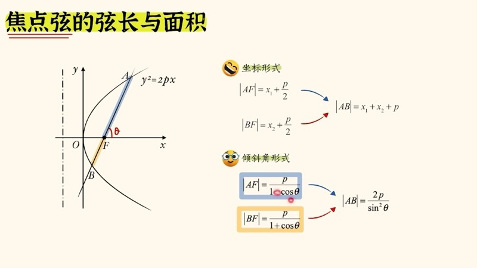
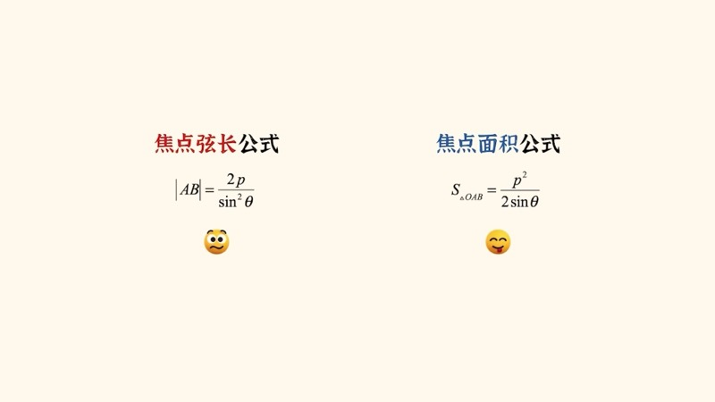
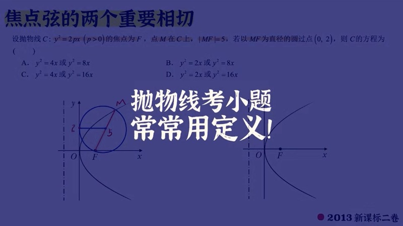
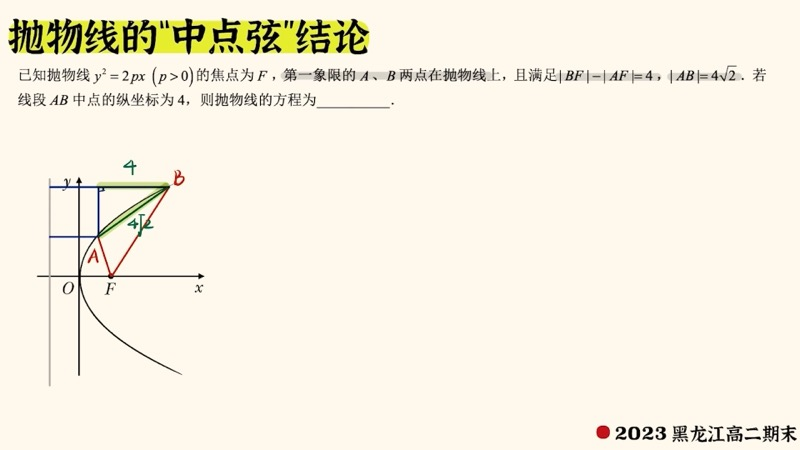

本课总结抛物线（parabola）在高考中出现频率最高的二级结论。我们从焦点弦的弦长公式（坐标形式与角度形式）出发，推导焦点弦三角形面积公式，然后讲解两个重要的"相切"结论：以焦点弦 $AB$ 为直径的圆与准线相切、以 $AF$（或 $BF$）为直径的圆与 $y$ 轴相切。这些结论在高考小题中可以秒杀计算。

::: {.callout-note collapse="true"}
## 预备知识

- 抛物线（parabola）标准方程：$y^2 = 2px\;(p>0)$
- 焦点坐标：$F\!\left(\dfrac{p}{2}, 0\right)$，准线方程：$x = -\dfrac{p}{2}$
- 抛物线的定义：到焦点的距离 $=$ 到准线的距离
- 三角函数基本公式：$\sin\theta$，$\cos\theta$，$\sin^2\theta$ 的关系
- 圆的相切条件：圆心到直线的距离 $=$ 半径
:::

## 本课内容

- 焦点弦长公式（坐标形式）：$|AB| = x_1 + x_2 + p$
- 焦点弦长公式（角度形式）：$|AB| = \dfrac{2p}{\sin^2\theta}$
- 焦半径的角度形式：$|AF| = \dfrac{p}{1-\cos\theta}$，$|BF| = \dfrac{p}{1+\cos\theta}$
- 焦点弦三角形面积公式：$S_{\triangle OAB} = \dfrac{p^2}{2\sin\theta}$
- 相切结论一：以 $AB$ 为直径的圆与准线相切
- 相切结论二：以 $AF$ 为直径的圆与 $y$ 轴相切

## 课程视频

```{=html}
<div class="video-container">
  <iframe src="//player.bilibili.com/player.html?bvid=BV14WDAYQEyy&page=1" title="抛物线二级结论" frameborder="0" scrolling="no" allowfullscreen></iframe>
</div>
```

## 课程关键帧









## 核心概念

### 一、焦点弦长公式

设过焦点 $F\!\left(\dfrac{p}{2},0\right)$ 的直线与抛物线 $y^2 = 2px$ 交于 $A(x_1,y_1)$、$B(x_2,y_2)$ 两点。

#### 坐标形式

由抛物线定义，$A$ 到焦点的距离等于 $A$ 到准线的距离：

$$
|AF| = x_1 + \frac{p}{2}, \qquad |BF| = x_2 + \frac{p}{2}
$$

因此焦点弦长：

$$
\boxed{|AB| = |AF| + |BF| = x_1 + x_2 + p}
$$

#### 角度形式

设焦点弦的倾斜角为 $\theta$，则：

$$
|AF| = \frac{p}{1 - \cos\theta}, \qquad |BF| = \frac{p}{1 + \cos\theta}
$$

**推导**：以 $|AF| = m$ 为例。做 $A$ 到准线的垂线段，由定义知该垂线段长等于 $m$。将此垂线段分为两段：$\dfrac{p}{2}$（焦点到准线的距离）和 $m\cos\theta$（利用倾斜角）。因此：

$$
m = \frac{p}{2} + \frac{p}{2} + m\cos\theta \implies m(1 - \cos\theta) = p \implies m = \frac{p}{1-\cos\theta}
$$

将 $|AF|$ 和 $|BF|$ 相加并通分：

$$
\boxed{|AB| = \frac{2p}{\sin^2\theta}}
$$

::: {.callout-tip}
## 记忆口诀
弦长公式分子是 $2p$（长度的一次方），面积公式分子是 $p^2$（长度的平方）——**弦长对应一次，面积对应平方**。
:::

### 二、焦点弦三角形面积公式

以原点 $O$、焦点弦端点 $A$、$B$ 构成的三角形 $\triangle OAB$，其面积为：

$$
\boxed{S_{\triangle OAB} = \frac{p^2}{2\sin\theta}}
$$

**推导**：底边取 $|AB| = \dfrac{2p}{\sin^2\theta}$，高为原点到直线 $AB$ 的距离。焦点 $F$ 到原点的距离为 $\dfrac{p}{2}$，由角 $\theta$ 的对顶角关系，高 $= \dfrac{p}{2}\sin\theta$。代入面积公式：

$$
S = \frac{1}{2} \cdot \frac{2p}{\sin^2\theta} \cdot \frac{p}{2}\sin\theta = \frac{p^2}{2\sin\theta}
$$

### 三、相切结论一：以 $AB$ 为直径的圆与准线相切

**定理**：过焦点的弦 $AB$ 为直径作圆，则此圆与准线 $x = -\dfrac{p}{2}$ 相切。

**证明**：圆心为 $AB$ 的中点 $G$，其横坐标为 $x_G = \dfrac{x_1+x_2}{2}$。圆心到准线的距离为：

$$
d = x_G + \frac{p}{2} = \frac{x_1+x_2}{2} + \frac{p}{2} = \frac{1}{2}(x_1+x_2+p) = \frac{|AB|}{2}
$$

而圆的半径 $r = \dfrac{|AB|}{2}$。因此 $d = r$，圆与准线相切。

### 四、相切结论二：以 $AF$ 为直径的圆与 $y$ 轴相切

**定理**：以焦半径 $AF$ 为直径作圆，则此圆与 $y$ 轴 $(x=0)$ 相切。

**证明**：圆心为 $AF$ 的中点 $G'$，其横坐标为：

$$
x_{G'} = \frac{x_1 + \frac{p}{2}}{2} = \frac{1}{2}\!\left(x_1 + \frac{p}{2}\right) = \frac{|AF|}{2}
$$

圆心到 $y$ 轴的距离为 $|x_{G'}| = \dfrac{|AF|}{2}$，恰好等于半径。因此圆与 $y$ 轴相切。

::: {.callout-important}
## 考试中的隐晦考法
考试不会直接问"以 $AF$ 为直径的圆与什么相切"。常见的包装方式是：给出"以 $MF$ 为直径的圆经过某点 $(0, y_0)$"——此时应识别出 $(0,y_0)$ 是 $y$ 轴上的点，即圆与 $y$ 轴的切点，切点纵坐标为 $y_0$。
:::

**例题（2013 新课标二卷）**：抛物线上点 $M$，$|MF| = 5$，以 $MF$ 为直径的圆经过点 $(0, 2)$。

识别：圆与 $y$ 轴相切，切点纵坐标为 $2$。由此切点到圆心的连线水平，利用圆心坐标和半径关系，结合直角三角形（$3$-$4$-$5$）求出 $p$ 值。

### 交互演示：焦点弦旋转（Desmos）

```{=html}
<div id="calc-parabola-chord" class="desmos-container"></div>
<script src="https://www.desmos.com/api/v1.9/calculator.js?apiKey=dcb31709b452b1cf9dc26972add0fda6"></script>
<script>
(function() {
  var elt = document.getElementById('calc-parabola-chord');
  var calc = Desmos.GraphingCalculator(elt, {
    expressions: true, settingsMenu: false, xAxisLabel: 'x', yAxisLabel: 'y'
  });
  calc.setExpression({ id: 'p', latex: 'p_0 = 2', sliderBounds: { min: 0.5, max: 4, step: 0.1 } });
  calc.setExpression({ id: 'parabola', latex: 'y^2 = 2 p_0 x', color: '#2d70b3' });
  calc.setExpression({ id: 'directrix', latex: 'x = -p_0/2', color: '#999', lineWidth: 1, lineStyle: 'DASHED' });
  calc.setExpression({ id: 'F', latex: '(p_0/2, 0)', color: '#c74440', pointSize: 10, label: 'F', showLabel: true });
  calc.setExpression({ id: 'theta', latex: '\\theta_0 = 1.2', sliderBounds: { min: 0.15, max: 2.99, step: 0.01 } });
  calc.setExpression({ id: 'lineChord', latex: 'y = \\tan(\\theta_0)(x - p_0/2)', color: '#c74440', lineWidth: 1.5 });
  calc.setMathBounds({ left: -4, right: 8, bottom: -5, top: 5 });
})();
</script>
```

拖动 $\theta_0$ 旋转焦点弦，拖动 $p_0$ 改变抛物线形状。观察弦两端与准线（虚线）的距离关系。

### 交互演示：以弦为直径的圆与准线相切（Desmos）

```{=html}
<div id="calc-chord-circle" class="desmos-container"></div>
<script>
(function() {
  var elt = document.getElementById('calc-chord-circle');
  var calc = Desmos.GraphingCalculator(elt, {
    expressions: true, settingsMenu: false, xAxisLabel: 'x', yAxisLabel: 'y'
  });
  calc.setExpression({ id: 'p', latex: 'p_0 = 2', sliderBounds: { min: 0.5, max: 4, step: 0.1 } });
  calc.setExpression({ id: 'parabola', latex: 'y^2 = 2 p_0 x', color: '#2d70b3' });
  calc.setExpression({ id: 'directrix', latex: 'x = -p_0/2', color: '#999', lineWidth: 1.5, lineStyle: 'DASHED' });
  calc.setExpression({ id: 'F', latex: '(p_0/2, 0)', color: '#c74440', pointSize: 8, label: 'F', showLabel: true });
  calc.setExpression({ id: 'theta', latex: '\\theta_0 = 1.0', sliderBounds: { min: 0.2, max: 2.9, step: 0.01 } });
  calc.setExpression({ id: 't1', latex: 't_1 = p_0\\tan(\\theta_0)' });
  calc.setExpression({ id: 'x1', latex: 'x_1 = t_1^2/(2p_0)' });
  calc.setExpression({ id: 'A', latex: '(x_1, t_1)', color: '#388c46', pointSize: 10, label: 'A', showLabel: true });
  calc.setExpression({ id: 't2', latex: 't_2 = -p_0/\\tan(\\theta_0)' });
  calc.setExpression({ id: 'x2', latex: 'x_2 = t_2^2/(2p_0)' });
  calc.setExpression({ id: 'B', latex: '(x_2, t_2)', color: '#388c46', pointSize: 10, label: 'B', showLabel: true });
  calc.setExpression({ id: 'circle', latex: '(x - (x_1+x_2)/2)^2 + (y - (t_1+t_2)/2)^2 = ((x_1-x_2)^2 + (t_1-t_2)^2)/4', color: '#fa7e19', lineWidth: 1.5 });
  calc.setMathBounds({ left: -5, right: 10, bottom: -6, top: 6 });
})();
</script>
```

拖动 $\theta_0$ 旋转焦点弦，观察以 $AB$ 为直径的橙色圆始终与准线（灰色虚线）相切。

### D3 动画：焦点弦旋转 — 弦长与焦半径实时更新

```{=html}
<div class="d3-container" id="d3-parabola-chord">
  <svg id="svg-parabola-chord" width="600" height="400"></svg>
  <div class="d3-controls" id="controls-parabola-chord">
    <label>倾斜角 θ = <input type="range" id="pc-slider-theta" min="10" max="170" step="1" value="60"><span id="pc-val-theta">60</span>°</label>
    <label>p = <input type="range" id="pc-slider-p" min="0.5" max="3" step="0.1" value="1.5"><span id="pc-val-p">1.5</span></label>
    <button id="pc-play">▶ 旋转</button>
    <button id="pc-pause">⏸ 暂停</button>
  </div>
  <div id="pc-info" style="font-family: 'KaTeX_Main', serif; font-size: 14px; padding: 8px; background: #f8f8f8; border-radius: 6px; margin-top: 6px;"></div>
</div>
<script>
(function() {
  var W = 600, H = 400, margin = 50;
  var svg = d3.select('#svg-parabola-chord');
  svg.selectAll('*').remove();

  var pVal = 1.5, thetaDeg = 60, animating = false, animTimer = null;
  var sc = 40, cx = 180, cy = H/2;

  function toS(x,y){ return [cx+x*sc, cy-y*sc]; }

  // Axes
  svg.append('line').attr('x1',30).attr('y1',cy).attr('x2',W-20).attr('y2',cy).attr('stroke','#ddd');
  svg.append('line').attr('x1',cx).attr('y1',30).attr('x2',cx).attr('y2',H-30).attr('stroke','#ddd');

  var parPath = svg.append('path').attr('fill','none').attr('stroke','#2d70b3').attr('stroke-width',2);
  var dirLine = svg.append('line').attr('stroke','#999').attr('stroke-width',1.5).attr('stroke-dasharray','5,3');
  var chordLine = svg.append('line').attr('stroke','#c74440').attr('stroke-width',2);
  var segAF = svg.append('line').attr('stroke','#fa7e19').attr('stroke-width',1.5).attr('stroke-dasharray','4,3');
  var segBF = svg.append('line').attr('stroke','#6042a6').attr('stroke-width',1.5).attr('stroke-dasharray','4,3');
  var dotF = svg.append('circle').attr('r',5).attr('fill','#c74440');
  var dotA = svg.append('circle').attr('r',6).attr('fill','#388c46');
  var dotB = svg.append('circle').attr('r',6).attr('fill','#388c46');
  var lblF = svg.append('text').text('F').attr('font-size',13).attr('fill','#c74440');
  var lblA = svg.append('text').text('A').attr('font-size',13).attr('fill','#388c46');
  var lblB = svg.append('text').text('B').attr('font-size',13).attr('fill','#388c46');

  // Bar chart
  var barG = svg.append('g').attr('transform','translate('+(W-120)+',60)');
  barG.append('text').text('焦半径').attr('font-size',12).attr('fill','#333').attr('x',0).attr('y',-8);
  var bar1 = barG.append('rect').attr('x',0).attr('y',0).attr('width',25).attr('fill','#fa7e19');
  var bar2 = barG.append('rect').attr('x',35).attr('y',0).attr('width',25).attr('fill','#6042a6');
  var barL1 = barG.append('text').attr('font-size',10).attr('fill','#fa7e19').attr('x',5);
  var barL2 = barG.append('text').attr('font-size',10).attr('fill','#6042a6').attr('x',40);
  var barMax = 120;

  function update() {
    var theta = thetaDeg * Math.PI / 180;
    var fp = pVal/2;

    // Parabola
    var pts = [];
    for (var i = -80; i <= 80; i++) {
      var y = i*0.08;
      var x = y*y/(2*pVal);
      if (x*sc < W-cx-20 && Math.abs(y)*sc < cy-30)
        pts.push(toS(x,y));
    }
    parPath.attr('d', d3.line().x(function(d){return d[0];}).y(function(d){return d[1];})(pts));

    // Directrix
    var dp = toS(-fp, -5);
    dirLine.attr('x1',toS(-fp,-5)[0]).attr('y1',toS(-fp,-5)[1]).attr('x2',toS(-fp,5)[0]).attr('y2',toS(-fp,5)[1]);

    // Focal chord
    var sinT = Math.sin(theta), cosT = Math.cos(theta);
    if (Math.abs(sinT) < 0.01) { thetaDeg = 10; theta = thetaDeg*Math.PI/180; sinT = Math.sin(theta); cosT = Math.cos(theta); }

    var AF = pVal/(1-cosT);
    var BF = pVal/(1+cosT);
    var ax = fp + AF*cosT, ay = AF*sinT;
    var bx = fp - BF*cosT, by = -BF*sinT;

    var sa=toS(ax,ay), sb=toS(bx,by), sf=toS(fp,0);

    chordLine.attr('x1',sa[0]).attr('y1',sa[1]).attr('x2',sb[0]).attr('y2',sb[1]);
    segAF.attr('x1',sf[0]).attr('y1',sf[1]).attr('x2',sa[0]).attr('y2',sa[1]);
    segBF.attr('x1',sf[0]).attr('y1',sf[1]).attr('x2',sb[0]).attr('y2',sb[1]);

    dotF.attr('cx',sf[0]).attr('cy',sf[1]);
    dotA.attr('cx',sa[0]).attr('cy',sa[1]);
    dotB.attr('cx',sb[0]).attr('cy',sb[1]);
    lblF.attr('x',sf[0]+8).attr('y',sf[1]+18);
    lblA.attr('x',sa[0]+8).attr('y',sa[1]-8);
    lblB.attr('x',sb[0]+8).attr('y',sb[1]+15);

    var AB = AF+BF;
    var maxLen = 2*pVal/(0.17*0.17); // approx max
    var h1 = Math.min(AF/8*barMax, barMax), h2 = Math.min(BF/8*barMax, barMax);
    bar1.attr('height',h1).attr('y',barMax-h1);
    bar2.attr('height',h2).attr('y',barMax-h2);
    barL1.attr('y',barMax+14).text('AF='+AF.toFixed(1));
    barL2.attr('y',barMax+14).text('BF='+BF.toFixed(1));

    var area = pVal*pVal/(2*sinT);
    document.getElementById('pc-info').innerHTML =
      '|AF| = p/(1\u2212cos\u03B8) = ' + AF.toFixed(3) +
      ' &nbsp; |BF| = p/(1+cos\u03B8) = ' + BF.toFixed(3) +
      '<br>|AB| = 2p/sin\u00B2\u03B8 = ' + AB.toFixed(3) +
      ' &nbsp; S\u25B3OAB = p\u00B2/(2sin\u03B8) = ' + area.toFixed(3);
  }

  d3.select('#pc-slider-theta').on('input', function() { thetaDeg=+this.value; d3.select('#pc-val-theta').text(thetaDeg); update(); });
  d3.select('#pc-slider-p').on('input', function() { pVal=+this.value; d3.select('#pc-val-p').text(pVal.toFixed(1)); update(); });

  function startAnim() {
    if(animating) return; animating=true;
    animTimer = d3.timer(function(elapsed){
      thetaDeg = 20 + 140*(0.5+0.5*Math.sin(elapsed*0.001));
      d3.select('#pc-slider-theta').property('value',thetaDeg);
      d3.select('#pc-val-theta').text(Math.round(thetaDeg));
      update();
    });
  }
  function stopAnim(){ animating=false; if(animTimer){animTimer.stop();animTimer=null;} }
  d3.select('#pc-play').on('click',startAnim);
  d3.select('#pc-pause').on('click',stopAnim);

  update();
})();
</script>
```

拖动倾斜角 $\theta$ 滑块（或点击"旋转"按钮），观察焦点弦绕焦点旋转时弦长 $|AB|$ 和焦半径 $|AF|$、$|BF|$ 的实时变化。当 $\theta = 90°$ 时弦长最短，等于通径 $2p$。

### D3 动画：抛物线反射性质 — 光线从焦点出发

```{=html}
<div class="d3-container" id="d3-parabola-reflect">
  <svg id="svg-parabola-reflect" width="600" height="400"></svg>
  <div class="d3-controls" id="controls-parabola-reflect">
    <label>p = <input type="range" id="pr-slider-p" min="0.5" max="3" step="0.1" value="1.5"><span id="pr-val-p">1.5</span></label>
    <button id="pr-fire">💡 发射光线</button>
    <button id="pr-reset">重置</button>
  </div>
</div>
<script>
(function() {
  var W = 600, H = 400;
  var svg = d3.select('#svg-parabola-reflect');
  svg.selectAll('*').remove();

  var pVal = 1.5, sc = 45, cx = 120, cy = H/2;
  var rays = [];

  function toS(x,y){ return [cx+x*sc, cy-y*sc]; }

  // Axes
  svg.append('line').attr('x1',20).attr('y1',cy).attr('x2',W-20).attr('y2',cy).attr('stroke','#eee');
  svg.append('line').attr('x1',cx).attr('y1',20).attr('x2',cx).attr('y2',H-20).attr('stroke','#eee');

  var parPath = svg.append('path').attr('fill','none').attr('stroke','#2d70b3').attr('stroke-width',2.5);
  var dotF = svg.append('circle').attr('r',6).attr('fill','#c74440');
  var lblF = svg.append('text').text('F').attr('font-size',13).attr('fill','#c74440');
  var rayG = svg.append('g');

  function drawParabola() {
    var pts = [];
    for (var i = -80; i <= 80; i++) {
      var y = i*0.07;
      var x = y*y/(2*pVal);
      if (x*sc < W-cx-10 && Math.abs(y)*sc < cy-20) pts.push(toS(x,y));
    }
    parPath.attr('d', d3.line().x(function(d){return d[0];}).y(function(d){return d[1];})(pts));
    var fp = toS(pVal/2, 0);
    dotF.attr('cx',fp[0]).attr('cy',fp[1]);
    lblF.attr('x',fp[0]-15).attr('y',fp[1]+20);
  }

  function fireRays() {
    rayG.selectAll('*').remove();
    var nRays = 12;
    for (var i = 0; i < nRays; i++) {
      var angle = -Math.PI*0.4 + Math.PI*0.8*i/(nRays-1);
      var cosA = Math.cos(angle), sinA = Math.sin(angle);

      // Find intersection with parabola: parametric from focus
      // x = p/2 + t*cosA, y = t*sinA
      // y^2 = 2p*x => t^2*sin^2A = 2p(p/2 + t*cosA)
      // t^2*sin^2A - 2p*t*cosA - p^2 = 0
      var A2 = sinA*sinA, B2 = -2*pVal*cosA, C2 = -pVal*pVal;
      var disc = B2*B2 - 4*A2*C2;
      if (disc < 0 || Math.abs(A2)<1e-10) continue;
      var t1 = (-B2+Math.sqrt(disc))/(2*A2);
      var t2 = (-B2-Math.sqrt(disc))/(2*A2);
      var t = (t1 > 0.01) ? t1 : t2;
      if (t < 0.01) continue;

      var ix = pVal/2 + t*cosA, iy = t*sinA;
      var sf = toS(pVal/2, 0), si = toS(ix, iy);
      var se = toS(ix + 5, iy); // reflected ray goes horizontal

      // Incoming ray (focus to surface)
      var ray1 = rayG.append('line')
        .attr('x1',sf[0]).attr('y1',sf[1]).attr('x2',sf[0]).attr('y2',sf[1])
        .attr('stroke','#fa7e19').attr('stroke-width',1.5);

      // Reflected ray (horizontal, going right)
      var ray2 = rayG.append('line')
        .attr('x1',si[0]).attr('y1',si[1]).attr('x2',si[0]).attr('y2',si[1])
        .attr('stroke','#388c46').attr('stroke-width',1.5).attr('opacity',0);

      // Dot at intersection
      rayG.append('circle').attr('cx',si[0]).attr('cy',si[1]).attr('r',3).attr('fill','#388c46').attr('opacity',0)
        .transition().delay(600+i*50).duration(200).attr('opacity',1);

      (function(r1,r2,six,siy,sfx,sfy,sex,sey,delay){
        r1.transition().delay(delay).duration(500)
          .attr('x2',six).attr('y2',siy);
        r2.transition().delay(delay+500).duration(300)
          .attr('opacity',1)
          .attr('x2',sex).attr('y2',sey);
      })(ray1,ray2,si[0],si[1],sf[0],sf[1],se[0],se[1],i*80);
    }
  }

  d3.select('#pr-slider-p').on('input', function() { pVal=+this.value; d3.select('#pr-val-p').text(pVal.toFixed(1)); drawParabola(); rayG.selectAll('*').remove(); });
  d3.select('#pr-fire').on('click', fireRays);
  d3.select('#pr-reset').on('click', function(){ rayG.selectAll('*').remove(); });

  drawParabola();
})();
</script>
```

点击"发射光线"按钮，观察从焦点 $F$ 出发的光线（橙色）到达抛物线表面后，反射光线（绿色）全部平行于对称轴。这就是抛物线的反射性质（reflective property），也是卫星天线和手电筒反射镜的原理。

## 速查表

::: {.key-formula}

| 结论名称 | 公式 | 条件 |
|:---------|:-----|:-----|
| 焦半径 | $\|AF\| = x_1 + \dfrac{p}{2}$ | $A(x_1,y_1)$ 在抛物线 $y^2=2px$ 上 |
| 焦半径（角度） | $\|AF\| = \dfrac{p}{1-\cos\theta}$，$\|BF\| = \dfrac{p}{1+\cos\theta}$ | $\theta$ 为倾斜角 |
| 焦点弦长（坐标） | $\|AB\| = x_1 + x_2 + p$ | 过焦点的弦 |
| 焦点弦长（角度） | $\|AB\| = \dfrac{2p}{\sin^2\theta}$ | 过焦点的弦，倾斜角 $\theta$ |
| 通径（最短焦点弦） | $2p$（当 $\theta = 90°$） | 垂直于对称轴的焦点弦 |
| 焦点弦三角形面积 | $S = \dfrac{p^2}{2\sin\theta}$ | 原点 $O$ 与焦点弦 $AB$ |
| 圆与准线相切 | 以 $AB$ 为直径的圆 $\perp$ 准线 | 过焦点的弦 $AB$ |
| 圆与 $y$ 轴相切 | 以 $AF$ 为直径的圆 $\perp$ $y$ 轴 | $A$ 在抛物线上，$F$ 为焦点 |
| 反射性质 | 焦点出发的光 $\to$ 反射后平行于轴 | 抛物线的光学性质 |

:::
