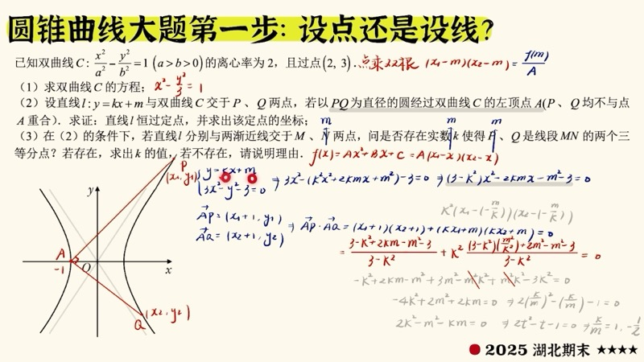
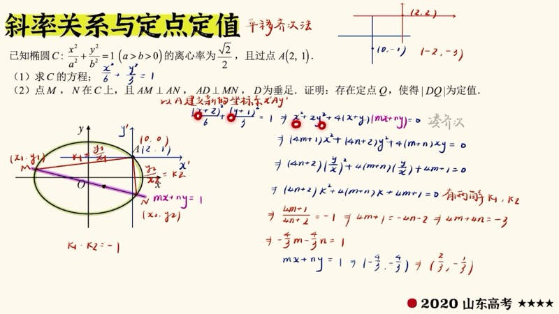
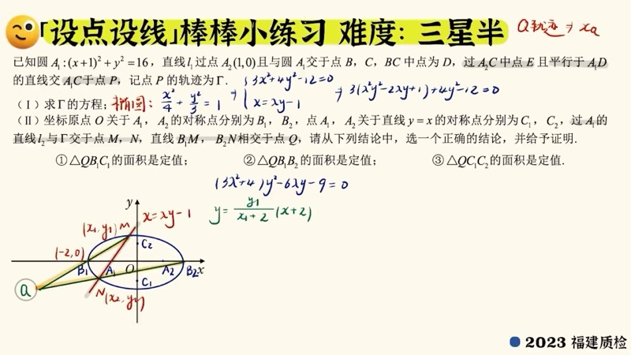
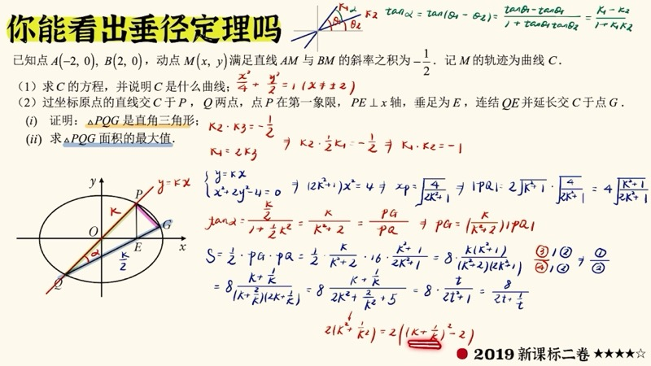

本课汇总圆锥曲线（conic section）大题中最实用的计算技巧，包括平移齐次化（homogenization after translation）、点乘双根法（dot-product double-root method）、椭圆垂径定理（perpendicular diameter theorem）、非对称韦达（asymmetric Vieta）以及三角代换（trigonometric substitution）。掌握这些方法可以在不同特征的题目中大幅缩短计算量。

::: {.callout-note collapse="true"}
## 预备知识

- 椭圆（ellipse）与双曲线（hyperbola）的标准方程
- 韦达定理（Vieta's formulas）：$x_1 + x_2 = -\dfrac{B}{A}$，$x_1 x_2 = \dfrac{C}{A}$
- 直线与圆锥曲线联立的基本流程
- 向量点积（dot product）与斜率（slope）的基本运算
:::

## 本课内容

- 设点法与设线法的选取策略
- 点乘双根法（dot-product double-root）：利用二次函数的因式分解快速计算 $(x_1 - m)(x_2 - m)$
- 齐次化（homogenization）：将非齐次方程化为齐次形式以简化斜率乘积运算
- 非对称韦达（asymmetric Vieta）：处理 $x_1$、$x_2$ 不对称出现的表达式
- 三角代换（trigonometric substitution）：用参数角简化椭圆上点的坐标表示

## 课程视频

```{=html}
<div class="video-container">
  <iframe src="//player.bilibili.com/player.html?bvid=BV1UXW4zNEBS&page=1" title="圆锥曲线技巧大全" frameborder="0" scrolling="no" allowfullscreen></iframe>
</div>
```

## 课程关键帧









## 核心概念

### 一、点乘双根法（Dot-Product Double-Root Method）

在圆锥曲线问题中，我们经常需要计算形如 $(x_1 + a)(x_2 + a)$ 的表达式，其中 $x_1$、$x_2$ 是联立方程的两个根。

设联立后的二次方程为：

$$
f(x) = Ax^2 + Bx + C = 0
$$

由于 $x_1$、$x_2$ 是 $f(x) = 0$ 的两个根，我们可以将 $f(x)$ 写成：

$$
f(x) = A(x - x_1)(x - x_2)
$$

因此，对任意常数 $m$，有：

$$
\boxed{(x_1 - m)(x_2 - m) = \frac{f(m)}{A}}
$$

::: {.callout-tip}
## 使用要点
只需将 $m$ 代入联立后的二次方程 $f(x)$，再除以二次项系数 $A$，即可直接得到 $(x_1 - m)(x_2 - m)$ 的值，无需展开后分别代入韦达定理。当 $m$ 是具体数值时，此法尤为高效。
:::

**应用场景**：当我们需要计算向量点积 $\overrightarrow{PA} \cdot \overrightarrow{PB}$ 时，其中 $P(m, n)$ 为定点，$A(x_1, y_1)$、$B(x_2, y_2)$ 在曲线上，展开后会出现 $(x_1 - m)(x_2 - m)$ 和 $(y_1 - n)(y_2 - n)$ 的形式，均可用点乘双根法快速处理。

### 交互演示：点乘双根法（Desmos）

```{=html}
<div id="calc-dot-double-root" class="desmos-container"></div>
<script src="https://www.desmos.com/api/v1.9/calculator.js?apiKey=dcb31709b452b1cf9dc26972add0fda6"></script>
<script>
(function() {
  var elt = document.getElementById('calc-dot-double-root');
  var calc = Desmos.GraphingCalculator(elt, {
    expressions: true, settingsMenu: false, xAxisLabel: 'x', yAxisLabel: 'y'
  });
  calc.setExpression({ id: 'ellipse', latex: '\\frac{x^2}{4} + y^2 = 1', color: '#2d70b3' });
  calc.setExpression({ id: 'k', latex: 'k_0 = 1.0', sliderBounds: { min: -3, max: 3, step: 0.05 } });
  calc.setExpression({ id: 'line', latex: 'y = k_0 x - 2k_0', color: '#fa7e19', lineWidth: 2 });
  calc.setExpression({ id: 'P', latex: '(2, 0)', color: '#c74440', pointSize: 12, label: 'P(2,0)', showLabel: true });
  calc.setExpression({ id: 'note', latex: '\\frac{x^2}{4}+(k_0 x-2k_0)^2=1', color: '#999', hidden: true });
  calc.setMathBounds({ left: -4, right: 4, bottom: -3, top: 3 });
})();
</script>
```

拖动滑块 $k_0$ 改变直线斜率，观察过定点 $P(2,0)$ 的直线与椭圆的交点变化。联立后可用点乘双根法快速计算 $(x_1 - 2)(x_2 - 2)$。

### 二、齐次化（Homogenization）

齐次化是处理"从定点引出两条动直线，斜率乘积为定值"这类问题的核心技巧。

**基本思想**：设从定点 $(x_0, y_0)$ 出发到曲线上两点 $A(x_1, y_1)$、$B(x_2, y_2)$ 的两条直线，斜率分别为 $k_1$、$k_2$。我们希望直接求出 $k_1 \cdot k_2$ 而不必分别求出两点坐标。

以椭圆 $\dfrac{x^2}{a^2} + \dfrac{y^2}{b^2} = 1$ 为例，若直线 $AB$ 过点 $(d, 0)$，设 $AB: x = ty + d$，代入椭圆并利用齐次化技巧，可以将 $k_1 \cdot k_2$ 表示为只含已知量的表达式，避免展开大量中间计算。

::: {.callout-important}
## 齐次化的核心步骤
1. 将直线方程写成 $\dfrac{x - d}{y} = t$ 或类似形式，使其成为关于 $\dfrac{x}{y}$ 的齐次表达
2. 代入曲线方程，消去非齐次项
3. 直接读出斜率乘积 $k_1 \cdot k_2$ 的值
:::

### D3 动画：齐次化过程

```{=html}
<div class="d3-container" id="d3-homogenization">
  <svg id="svg-homogenization" width="600" height="400"></svg>
  <div class="d3-controls" id="controls-homogenization">
    <label>变换步骤：<input type="range" id="homo-step" min="0" max="3" step="1" value="0"><span id="homo-step-val">0</span></label>
  </div>
  <div id="homo-info" style="font-family: 'KaTeX_Main', serif; font-size: 14px; padding: 8px; background: #f8f8f8; border-radius: 6px; margin-top: 6px;"></div>
</div>
<script src="https://d3js.org/d3.v7.min.js"></script>
<script>
(function() {
  var W = 600, H = 400;
  var svg = d3.select('#svg-homogenization');
  svg.selectAll('*').remove();

  var steps = [
    { eq: 'x²/a² + y²/b² = 1', desc: '第一步：写出椭圆标准方程', color: '#2d70b3' },
    { eq: 'x = ty + d  →  (x−d)/y = t', desc: '第二步：直线方程化为齐次比值形式', color: '#fa7e19' },
    { eq: '将 1 替换为 ((x−d)/(ty))²·t² 等齐次形式', desc: '第三步：用直线方程替换常数项 1，使方程齐次', color: '#388c46' },
    { eq: 'k₁·k₂ = y₁y₂/((x₁−d)(x₂−d)) = 定值', desc: '第四步：直接读出斜率乘积为定值', color: '#c74440' }
  ];

  var boxes = [];
  for (var i = 0; i < steps.length; i++) {
    var y = 40 + i * 85;
    var g = svg.append('g').attr('transform', 'translate(50,' + y + ')').attr('opacity', 0);
    g.append('rect').attr('width', 500).attr('height', 65).attr('rx', 10).attr('fill', '#fff').attr('stroke', steps[i].color).attr('stroke-width', 2.5);
    g.append('text').attr('x', 20).attr('y', 25).text(steps[i].eq).attr('font-size', 15).attr('font-family', 'KaTeX_Main, serif').attr('fill', '#333');
    g.append('text').attr('x', 20).attr('y', 50).text(steps[i].desc).attr('font-size', 13).attr('fill', '#666');
    if (i > 0) {
      svg.append('line').attr('x1', 300).attr('y1', y - 20).attr('x2', 300).attr('y2', y).attr('stroke', '#aaa').attr('stroke-width', 1.5).attr('marker-end', 'url(#arrow-homo)').attr('class', 'homo-arrow-' + i).attr('opacity', 0);
    }
    boxes.push(g);
  }

  svg.append('defs').append('marker').attr('id', 'arrow-homo').attr('viewBox', '0 0 10 10').attr('refX', 5).attr('refY', 5).attr('markerWidth', 6).attr('markerHeight', 6).attr('orient', 'auto').append('path').attr('d', 'M 0 0 L 10 5 L 0 10 z').attr('fill', '#aaa');

  function updateStep(step) {
    for (var i = 0; i < boxes.length; i++) {
      boxes[i].transition().duration(400).attr('opacity', i <= step ? 1 : 0);
      svg.selectAll('.homo-arrow-' + i).transition().duration(400).attr('opacity', i <= step ? 1 : 0);
    }
    document.getElementById('homo-step-val').textContent = step;
    document.getElementById('homo-info').innerHTML = step < steps.length ? '<b>' + steps[step].desc + '</b>' : '';
  }

  d3.select('#homo-step').on('input', function() { updateStep(+this.value); });
  updateStep(0);
})();
</script>
```

拖动滑块逐步查看齐次化的四个关键步骤：从写出标准方程，到将直线方程化为齐次形式，再到替换常数项，最终直接读出斜率乘积。

### 三、非对称韦达（Asymmetric Vieta）

当我们需要计算的目标表达式中 $x_1$、$x_2$（或 $y_1$、$y_2$）不对称出现时——例如 $\dfrac{x_1}{x_2}$ 或 $3x_1 + x_1 x_2 - 4x_2$ ——标准韦达定理无法直接代入。

**三种通解方法**：

1. **积和互化**（product-sum conversion）：观察 $x_1 + x_2$ 与 $x_1 x_2$ 的比值关系，例如若 $x_1 x_2 = \alpha (x_1 + x_2)$，则用和表示积，将所有 $x_1 x_2$ 替换为 $\alpha(x_1 + x_2)$，从而使分子分母中的 $x_1$、$x_2$ 可以提取公因子约去。

2. **配凑法**（rearrangement）：在分子或分母中加减 $(x_1 + x_2)$ 以凑出韦达定理可处理的形式，使不可用韦达的单独 $x_1$ 或 $x_2$ 项只保留一个未知量，最终结果表现为该未知量的比值。

3. **暴力求解**（direct substitution）：设 $x_1 = \dfrac{-B + \sqrt{\Delta}}{2A}$，$x_2 = \dfrac{-B - \sqrt{\Delta}}{2A}$，直接代入计算（计算量大，不推荐）。

::: {.callout-tip}
## 推荐策略
优先使用积和互化或配凑法。对于特殊题型（如涉及椭圆第三定义 $k_{PA} \cdot k_{PB} = -\dfrac{b^2}{a^2}$），可结合齐次化作为特解方法。
:::

### 交互演示：韦达定理与非对称表达式（Desmos）

```{=html}
<div id="calc-asymmetric-vieta" class="desmos-container"></div>
<script>
(function() {
  var elt = document.getElementById('calc-asymmetric-vieta');
  var calc = Desmos.GraphingCalculator(elt, {
    expressions: true, settingsMenu: false, xAxisLabel: 'x', yAxisLabel: 'y'
  });
  calc.setExpression({ id: 'ellipse', latex: '\\frac{x^2}{4} + y^2 = 1', color: '#2d70b3' });
  calc.setExpression({ id: 't', latex: 't_0 = 0.5', sliderBounds: { min: -3, max: 3, step: 0.05 } });
  calc.setExpression({ id: 'line', latex: 'x = t_0 y + 1', color: '#fa7e19', lineWidth: 2 });
  calc.setExpression({ id: 'A', latex: '(-2, 0)', color: '#c74440', pointSize: 12, label: 'A(−2,0)', showLabel: true });
  calc.setExpression({ id: 'B', latex: '(2, 0)', color: '#c74440', pointSize: 12, label: 'B(2,0)', showLabel: true });
  calc.setMathBounds({ left: -4, right: 4, bottom: -3, top: 3 });
})();
</script>
```

拖动滑块 $t_0$ 改变过点 $(1,0)$ 的直线，观察直线与椭圆交点 $C$、$D$ 的变化。可验证 $k_{AC} \cdot k_{BD}$ 等非对称表达式在变化过程中的值。

### D3 动画：点乘双根法图解

```{=html}
<div class="d3-container" id="d3-dot-double-root">
  <svg id="svg-dot-double-root" width="600" height="400"></svg>
  <div class="d3-controls" id="controls-dot-double-root">
    <label>直线斜率 k = <input type="range" id="ddr-slider-k" min="-2" max="2" step="0.05" value="0.8"><span id="ddr-val-k">0.8</span></label>
  </div>
  <div id="ddr-info" style="font-family: 'KaTeX_Main', serif; font-size: 14px; padding: 8px; background: #f8f8f8; border-radius: 6px; margin-top: 6px;"></div>
</div>
<script>
(function() {
  var W = 600, H = 400, margin = 50;
  var svg = d3.select('#svg-dot-double-root');
  svg.selectAll('*').remove();

  var a = 2, b = 1;
  var ox = 2, oy = 0;

  function toSVG(x, y) {
    var scale = (W - 2 * margin) / (2 * a * 1.6);
    return [W / 2 + x * scale, H / 2 - y * scale];
  }

  function ellipsePoints(n) {
    var pts = [];
    for (var i = 0; i <= n; i++) {
      var t = 2 * Math.PI * i / n;
      pts.push(toSVG(a * Math.cos(t), b * Math.sin(t)));
    }
    return pts;
  }

  svg.append('line').attr('x1', margin).attr('y1', H / 2).attr('x2', W - margin).attr('y2', H / 2).attr('stroke', '#ccc').attr('stroke-width', 1);
  svg.append('line').attr('x1', W / 2).attr('y1', margin).attr('x2', W / 2).attr('y2', H - margin).attr('stroke', '#ccc').attr('stroke-width', 1);

  var ellipsePath = svg.append('path').attr('fill', 'none').attr('stroke', '#2d70b3').attr('stroke-width', 2);
  var linePath = svg.append('line').attr('stroke', '#fa7e19').attr('stroke-width', 2);
  var lineOP1 = svg.append('line').attr('stroke', '#c74440').attr('stroke-width', 1.5).attr('stroke-dasharray', '4,3');
  var lineOP2 = svg.append('line').attr('stroke', '#388c46').attr('stroke-width', 1.5).attr('stroke-dasharray', '4,3');
  var dotO = svg.append('circle').attr('r', 6).attr('fill', '#6042a6');
  var dotP1 = svg.append('circle').attr('r', 5).attr('fill', '#c74440');
  var dotP2 = svg.append('circle').attr('r', 5).attr('fill', '#388c46');
  var lblO = svg.append('text').text('O(2,0)').attr('font-size', 12).attr('fill', '#6042a6');
  var lblP1 = svg.append('text').attr('font-size', 12).attr('fill', '#c74440');
  var lblP2 = svg.append('text').attr('font-size', 12).attr('fill', '#388c46');

  function solve(k) {
    var A = 1 + 4 * k * k;
    var B = -8 * k * k;
    var C = 4 * k * k - 4;
    // (1/4)x^2 + (kx - 2k)^2 = 1 => (1+4k^2)x^2 - 16k^2 x + 16k^2 -4 = 0 ... actually let me redo
    // x^2/4 + y^2 = 1, y = k(x-2) => x^2/4 + k^2(x-2)^2 = 1
    // x^2/4 + k^2 x^2 - 4k^2 x + 4k^2 = 1
    // (1/4 + k^2)x^2 - 4k^2 x + 4k^2 - 1 = 0
    var AA = 0.25 + k * k;
    var BB = -4 * k * k;
    var CC = 4 * k * k - 1;
    var disc = BB * BB - 4 * AA * CC;
    if (disc < 0) return null;
    var sq = Math.sqrt(disc);
    var x1 = (-BB + sq) / (2 * AA);
    var x2 = (-BB - sq) / (2 * AA);
    var y1 = k * (x1 - 2);
    var y2 = k * (x2 - 2);
    return { x1: x1, y1: y1, x2: x2, y2: y2, fm: CC / AA };
  }

  function update() {
    var k = +d3.select('#ddr-slider-k').property('value');
    d3.select('#ddr-val-k').text(k.toFixed(2));

    var line = d3.line().x(function(d) { return d[0]; }).y(function(d) { return d[1]; });
    ellipsePath.attr('d', line(ellipsePoints(200)));

    var o = toSVG(ox, oy);
    dotO.attr('cx', o[0]).attr('cy', o[1]);
    lblO.attr('x', o[0] + 8).attr('y', o[1] - 8);

    var sol = solve(k);
    if (!sol) {
      document.getElementById('ddr-info').innerHTML = 'Delta < 0，无交点';
      dotP1.attr('opacity', 0); dotP2.attr('opacity', 0);
      lineOP1.attr('opacity', 0); lineOP2.attr('opacity', 0);
      linePath.attr('opacity', 0);
      return;
    }

    var p1 = toSVG(sol.x1, sol.y1);
    var p2 = toSVG(sol.x2, sol.y2);

    linePath.attr('x1', p1[0]).attr('y1', p1[1]).attr('x2', p2[0]).attr('y2', p2[1]).attr('opacity', 1);
    dotP1.attr('cx', p1[0]).attr('cy', p1[1]).attr('opacity', 1);
    dotP2.attr('cx', p2[0]).attr('cy', p2[1]).attr('opacity', 1);
    lineOP1.attr('x1', o[0]).attr('y1', o[1]).attr('x2', p1[0]).attr('y2', p1[1]).attr('opacity', 1);
    lineOP2.attr('x1', o[0]).attr('y1', o[1]).attr('x2', p2[0]).attr('y2', p2[1]).attr('opacity', 1);
    lblP1.attr('x', p1[0] + 8).attr('y', p1[1] - 5).text('A(' + sol.x1.toFixed(2) + ',' + sol.y1.toFixed(2) + ')');
    lblP2.attr('x', p2[0] + 8).attr('y', p2[1] + 15).text('B(' + sol.x2.toFixed(2) + ',' + sol.y2.toFixed(2) + ')');

    var prod = (sol.x1 - ox) * (sol.x2 - ox);
    document.getElementById('ddr-info').innerHTML =
      'f(m) = Ax² + Bx + C, 其中 A = ' + (0.25 + k * k).toFixed(3) +
      '<br>(x₁ − 2)(x₂ − 2) = f(2)/A = ' + sol.fm.toFixed(4) +
      ' &nbsp; 直接计算: ' + prod.toFixed(4) +
      '<br>OA·OB 点积 = (x₁−2)(x₂−2) + y₁y₂ = ' + (prod + sol.y1 * sol.y2).toFixed(4);
  }

  d3.select('#ddr-slider-k').on('input', update);
  update();
})();
</script>
```

拖动滑块改变直线斜率 $k$，观察两交点 $A$、$B$ 与定点 $O(2,0)$ 的关系。下方显示用点乘双根法计算 $(x_1 - 2)(x_2 - 2) = \dfrac{f(2)}{A}$ 的结果与直接计算的对比。

## 速查表

::: {.key-formula}

| 技巧名称 | 核心公式/思路 | 适用场景 |
|:---------|:-------------|:---------|
| 点乘双根法 | $(x_1 - m)(x_2 - m) = \dfrac{f(m)}{A}$ | 向量点积、距离乘积等含 $(x_i - m)$ 的表达式 |
| 齐次化 | 用直线方程替换曲线方程中的常数项 $1$ | 从定点引两条动直线，求斜率乘积 |
| 积和互化 | 利用 $x_1x_2 = \alpha(x_1 + x_2)$ 统一为和式 | 非对称韦达，积与和的分母相同时 |
| 配凑法 | 加减 $(x_1 + x_2)$ 凑出韦达可处理的项 | 非对称韦达，只保留一个未知量 |
| 三角代换 | 设 $P = (a\cos\theta, b\sin\theta)$ | 椭圆上单动点问题，简化参数表达 |
| 设点法 | 设 $P(x_0, y_0)$，利用曲线方程消元 | 椭圆上单动点，最后一定用到曲线方程 |

:::
