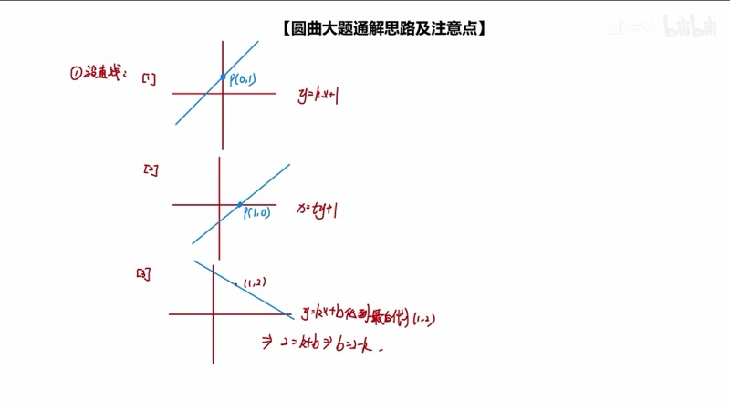
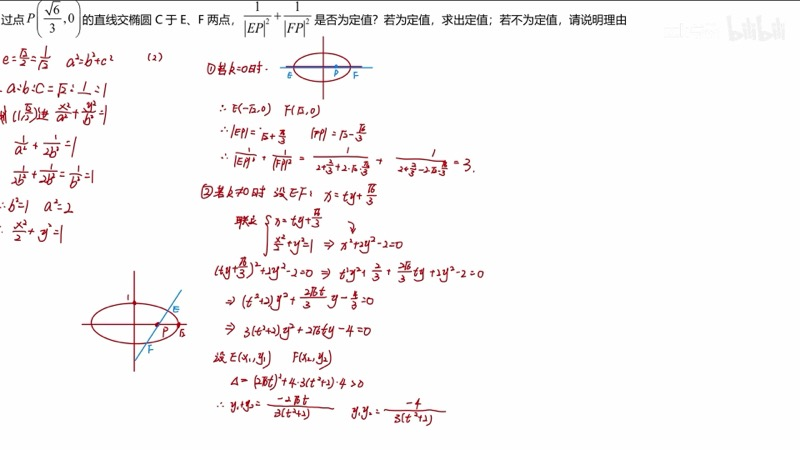
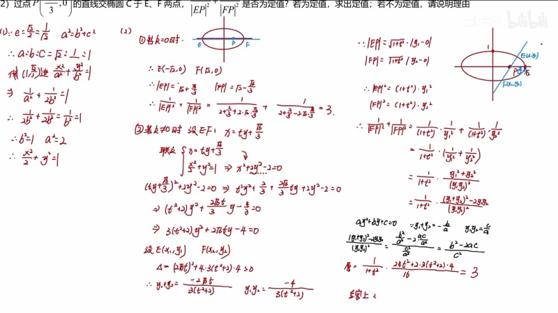
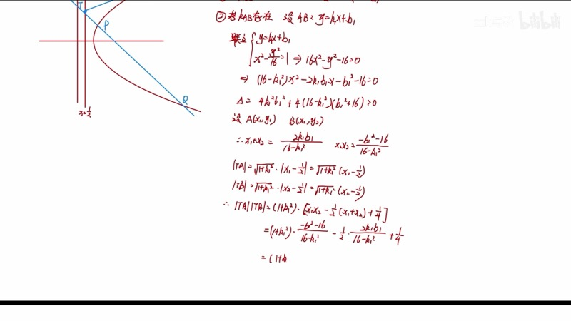

本课系统梳理圆锥曲线（conic section）大题的通用解题流程。我们将所有圆锥曲线第二问的本质归结为**直线与曲线的关系**，并给出"设→联→韦→代"的四步通解框架。无论题目如何包装，这一套流程都能帮助我们稳定拿到大部分分值。

::: {.callout-note collapse="true"}
## 预备知识

- 椭圆（ellipse）、双曲线（hyperbola）、抛物线（parabola）的标准方程
- 韦达定理（Vieta's formulas）的基本应用
- 判别式（discriminant）$\Delta = B^2 - 4AC$ 的几何意义
- 直线方程的三种设法及其适用条件
:::

## 本课内容

- 圆锥曲线大题第二问的本质：直线与曲线的关系
- 设直线的三种方式及特殊情况讨论
- "设→联→韦→代"四步通解流程
- 判别式 $\Delta > 0$ 的参数范围分析
- 利用特殊情况快速验证定值

## 课程视频

```{=html}
<div class="video-container">
  <iframe src="//player.bilibili.com/player.html?bvid=BV1GgZUYCEHu&page=1" title="圆锥曲线大题通解思路" frameborder="0" scrolling="no" allowfullscreen></iframe>
</div>
```

## 课程关键帧









## 核心概念

### 一、圆锥曲线大题的本质

所有圆锥曲线大题（第二问）的核心考点都是**直线与曲线的关系**。不论题目如何包装——定点、定值、最值、存在性——我们的解题流程本质上都是同一套：

$$
\boxed{\text{设直线} \;\longrightarrow\; \text{联立曲线} \;\longrightarrow\; \text{写韦达} \;\longrightarrow\; \text{代入条件}}
$$

### 二、设直线的三种方式

| 情形 | 设法 | 特殊情况 |
|:-----|:-----|:---------|
| 过 $y$ 轴上的点 $(0, m)$ | $y = kx + m$ | $k$ 不存在（直线为 $x = 0$） |
| 过 $x$ 轴上的点 $(d, 0)$ | $x = ty + d$ | $k = 0$（直线为 $y = 0$） |
| 过一般点 $(p, q)$ | $y = kx + b$（两参数） | $k$ 不存在 |

::: {.callout-important}
## 关键原则
1. **先讨论特殊情况**：在设直线之前，先处理该设法不能表示的特殊直线。这既是规范要求，也能快速得到一个特殊值用于后续验证。
2. **过 $x$ 轴上点时用 $x = ty + d$**：这样联立后计算量远小于 $y = kx + b$ 的形式。
3. **过一般点时设两参数**：设 $y = kx + b$，在化简到最后再代入点的坐标 $b = q - kp$，可以大幅减少中间计算量。
:::

### 三、联立方程与韦达定理

设直线 $y = kx + b$ 与椭圆 $\dfrac{x^2}{a^2} + \dfrac{y^2}{b_0^2} = 1$ 联立，代入消去 $y$ 得：

$$
\left(\frac{1}{a^2} + \frac{k^2}{b_0^2}\right)x^2 + \frac{2kb}{b_0^2}x + \frac{b^2}{b_0^2} - 1 = 0
$$

即 $Ax^2 + Bx + C = 0$，其中：

- $x_1 + x_2 = -\dfrac{B}{A}$
- $x_1 x_2 = \dfrac{C}{A}$
- $\Delta = B^2 - 4AC > 0$（保证有两个交点）

### 四、代入条件化简

**核心技巧**：将 $y_1$、$y_2$ 代入直线方程而非曲线方程：

$$
y_1 = kx_1 + b, \quad y_2 = kx_2 + b
$$

这样 $y_1 y_2 = k^2 x_1 x_2 + kb(x_1 + x_2) + b^2$，$y_1 + y_2 = k(x_1 + x_2) + 2b$，均可直接用韦达定理表达。

::: {.callout-tip}
## 特殊情况的妙用
如果题目问"是否为定值"，我们几乎可以确定答案是肯定的。利用特殊情况（如 $k = 0$ 或斜率不存在）算出的具体值，就是那个定值。即使后续通解计算出错，特殊情况的正确结果也能保底得分。
:::

### 交互演示：联立方程与韦达定理（Desmos）

```{=html}
<div id="calc-vieta-flow" class="desmos-container"></div>
<script src="https://www.desmos.com/api/v1.9/calculator.js?apiKey=dcb31709b452b1cf9dc26972add0fda6"></script>
<script>
(function() {
  var elt = document.getElementById('calc-vieta-flow');
  var calc = Desmos.GraphingCalculator(elt, {
    expressions: true, settingsMenu: false, xAxisLabel: 'x', yAxisLabel: 'y'
  });
  calc.setExpression({ id: 'ellipse', latex: '\\frac{x^2}{2} + y^2 = 1', color: '#2d70b3' });
  calc.setExpression({ id: 'k', latex: 'k_0 = 1', sliderBounds: { min: -3, max: 3, step: 0.05 } });
  calc.setExpression({ id: 'p', latex: 'p_0 = 0.47', sliderBounds: { min: -1.2, max: 1.2, step: 0.01 } });
  calc.setExpression({ id: 'line', latex: 'y = k_0(x - p_0)', color: '#fa7e19', lineWidth: 2 });
  calc.setExpression({ id: 'dot_p', latex: '(p_0, 0)', color: '#c74440', pointSize: 12, label: 'P', showLabel: true });
  calc.setMathBounds({ left: -3, right: 3, bottom: -2, top: 2 });
})();
</script>
```

拖动 $k_0$ 改变直线斜率，拖动 $p_0$ 改变直线过的 $x$ 轴上的点。观察直线与椭圆 $\dfrac{x^2}{2} + y^2 = 1$ 的两个交点如何随参数变化。

### 交互演示：判别式参数范围（Desmos）

```{=html}
<div id="calc-discriminant" class="desmos-container"></div>
<script>
(function() {
  var elt = document.getElementById('calc-discriminant');
  var calc = Desmos.GraphingCalculator(elt, {
    expressions: true, settingsMenu: false, xAxisLabel: 'k', yAxisLabel: 'Δ'
  });
  calc.setExpression({ id: 'a2', latex: 'a_0 = 2', sliderBounds: { min: 1, max: 5, step: 0.1 } });
  calc.setExpression({ id: 'b2', latex: 'b_0 = 1', sliderBounds: { min: 0.5, max: 4, step: 0.1 } });
  calc.setExpression({ id: 'm', latex: 'm_0 = 0.8', sliderBounds: { min: -2, max: 2, step: 0.05 } });
  calc.setExpression({ id: 'delta', latex: 'D(k) = 4k^2 m_0^2 b_0^2 a_0^2 - 4(b_0^2 + a_0^2 k^2)(m_0^2 b_0^2 - a_0^2 b_0^2)', color: '#c74440', lineWidth: 2 });
  calc.setExpression({ id: 'zero', latex: 'y = 0', color: '#999', lineStyle: 'DASHED' });
  calc.setMathBounds({ left: -5, right: 5, bottom: -20, top: 50 });
})();
</script>
```

调节 $a_0$、$b_0$（椭圆参数）和 $m_0$（直线过点横坐标），观察判别式 $\Delta$ 随斜率 $k$ 变化的曲线。$\Delta > 0$ 的 $k$ 取值范围即为直线与椭圆有两个交点的条件。

### D3 动画：解题流程图

```{=html}
<div class="d3-container" id="d3-flow-chart">
  <svg id="svg-flow-chart" width="600" height="320"></svg>
  <div class="d3-controls" id="controls-flow-chart">
    <label>步骤：<input type="range" id="flow-step" min="0" max="3" step="1" value="0"><span id="flow-step-val">0</span></label>
    <button id="flow-play">▶ 自动播放</button>
  </div>
</div>
<script src="https://d3js.org/d3.v7.min.js"></script>
<script>
(function() {
  var W = 600, H = 320;
  var svg = d3.select('#svg-flow-chart');
  svg.selectAll('*').remove();

  var steps = [
    { label: '设', detail: '设直线方程\n(先讨论特殊情况)', x: 75, color: '#2d70b3' },
    { label: '联', detail: '联立曲线方程\n(消去一个变量)', x: 225, color: '#fa7e19' },
    { label: '韦', detail: '写韦达定理\nx₁+x₂, x₁x₂', x: 375, color: '#388c46' },
    { label: '代', detail: '代入题目条件\n(y转x，再代韦达)', x: 525, color: '#c74440' }
  ];

  svg.append('defs').append('marker').attr('id', 'arrow-flow').attr('viewBox', '0 0 10 10').attr('refX', 10).attr('refY', 5).attr('markerWidth', 8).attr('markerHeight', 8).attr('orient', 'auto').append('path').attr('d', 'M 0 0 L 10 5 L 0 10 z').attr('fill', '#666');

  var groups = [];
  steps.forEach(function(s, i) {
    if (i > 0) {
      svg.append('line').attr('x1', steps[i - 1].x + 50).attr('y1', 100).attr('x2', s.x - 50).attr('y2', 100).attr('stroke', '#aaa').attr('stroke-width', 2).attr('marker-end', 'url(#arrow-flow)').attr('class', 'flow-arrow flow-arrow-' + i).attr('opacity', 0);
    }
    var g = svg.append('g').attr('class', 'flow-box flow-box-' + i);
    g.append('circle').attr('cx', s.x).attr('cy', 100).attr('r', 45).attr('fill', '#fff').attr('stroke', s.color).attr('stroke-width', 3).attr('opacity', 0.3);
    g.append('text').attr('x', s.x).attr('y', 108).attr('text-anchor', 'middle').attr('font-size', 28).attr('font-weight', 'bold').attr('fill', s.color).text(s.label).attr('opacity', 0.3);
    var lines = s.detail.split('\n');
    lines.forEach(function(ln, li) {
      g.append('text').attr('x', s.x).attr('y', 180 + li * 20).attr('text-anchor', 'middle').attr('font-size', 13).attr('fill', '#555').text(ln).attr('opacity', 0);
    });
    groups.push(g);
  });

  function updateStep(step) {
    steps.forEach(function(s, i) {
      var active = i <= step;
      svg.selectAll('.flow-box-' + i + ' circle').transition().duration(400).attr('opacity', active ? 1 : 0.3).attr('fill', active ? s.color + '15' : '#fff');
      svg.selectAll('.flow-box-' + i + ' text').transition().duration(400).attr('opacity', active ? 1 : 0.3);
      svg.selectAll('.flow-arrow-' + i).transition().duration(400).attr('opacity', active ? 1 : 0);
    });
    document.getElementById('flow-step-val').textContent = step;
  }

  d3.select('#flow-step').on('input', function() { updateStep(+this.value); });

  var playing = false, timer = null, currentStep = 0;
  d3.select('#flow-play').on('click', function() {
    if (playing) { clearInterval(timer); playing = false; return; }
    playing = true;
    currentStep = 0;
    updateStep(0);
    timer = setInterval(function() {
      currentStep++;
      if (currentStep > 3) { clearInterval(timer); playing = false; return; }
      d3.select('#flow-step').property('value', currentStep);
      updateStep(currentStep);
    }, 1200);
  });

  updateStep(0);
})();
</script>
```

拖动滑块或点击"自动播放"，观察"设→联→韦→代"四个步骤依次亮起。每一步都是圆锥曲线大题的标准操作。

### D3 动画：判别式与交点数

```{=html}
<div class="d3-container" id="d3-discriminant">
  <svg id="svg-discriminant" width="600" height="400"></svg>
  <div class="d3-controls" id="controls-discriminant">
    <label>斜率 k = <input type="range" id="disc-slider-k" min="-3" max="3" step="0.05" value="1"><span id="disc-val-k">1.00</span></label>
    <label>截距 m = <input type="range" id="disc-slider-m" min="-2" max="2" step="0.05" value="0.5"><span id="disc-val-m">0.50</span></label>
  </div>
  <div id="disc-info" style="font-family: 'KaTeX_Main', serif; font-size: 14px; padding: 8px; background: #f8f8f8; border-radius: 6px; margin-top: 6px;"></div>
</div>
<script>
(function() {
  var W = 600, H = 400, margin = 50;
  var svg = d3.select('#svg-discriminant');
  svg.selectAll('*').remove();
  var a = Math.sqrt(2), b = 1;

  function toSVG(x, y) {
    var scale = (W - 2 * margin) / (2 * a * 1.5);
    return [W / 2 + x * scale, H / 2 - y * scale];
  }

  svg.append('line').attr('x1', margin).attr('y1', H / 2).attr('x2', W - margin).attr('y2', H / 2).attr('stroke', '#ddd').attr('stroke-width', 1);
  svg.append('line').attr('x1', W / 2).attr('y1', margin).attr('x2', W / 2).attr('y2', H - margin).attr('stroke', '#ddd').attr('stroke-width', 1);

  var ellipsePath = svg.append('path').attr('fill', 'none').attr('stroke', '#2d70b3').attr('stroke-width', 2);
  var linePath = svg.append('line').attr('stroke', '#fa7e19').attr('stroke-width', 2);
  var dot1 = svg.append('circle').attr('r', 6).attr('fill', '#c74440');
  var dot2 = svg.append('circle').attr('r', 6).attr('fill', '#388c46');
  var lbl1 = svg.append('text').attr('font-size', 12).attr('fill', '#c74440');
  var lbl2 = svg.append('text').attr('font-size', 12).attr('fill', '#388c46');
  var deltaBox = svg.append('g').attr('transform', 'translate(420, 30)');
  deltaBox.append('rect').attr('width', 160).attr('height', 70).attr('rx', 8).attr('fill', '#f8f8f8').attr('stroke', '#ccc');
  var deltaText = deltaBox.append('text').attr('x', 10).attr('y', 25).attr('font-size', 14).attr('fill', '#333');
  var deltaStatus = deltaBox.append('text').attr('x', 10).attr('y', 50).attr('font-size', 16).attr('font-weight', 'bold');

  function update() {
    var k = +d3.select('#disc-slider-k').property('value');
    var m = +d3.select('#disc-slider-m').property('value');
    d3.select('#disc-val-k').text(k.toFixed(2));
    d3.select('#disc-val-m').text(m.toFixed(2));

    // Draw ellipse
    var pts = [];
    for (var i = 0; i <= 200; i++) {
      var t = 2 * Math.PI * i / 200;
      pts.push(toSVG(a * Math.cos(t), b * Math.sin(t)));
    }
    ellipsePath.attr('d', d3.line().x(function(d) { return d[0]; }).y(function(d) { return d[1]; })(pts));

    // x^2/2 + (kx+m)^2 = 1 => (1/2+k^2)x^2 + 2kmx + m^2-1 = 0
    var A = 0.5 + k * k;
    var B = 2 * k * m;
    var C = m * m - 1;
    var disc = B * B - 4 * A * C;

    // Draw line
    var lx1 = -3, lx2 = 3;
    var p1s = toSVG(lx1, k * lx1 + m);
    var p2s = toSVG(lx2, k * lx2 + m);
    linePath.attr('x1', p1s[0]).attr('y1', p1s[1]).attr('x2', p2s[0]).attr('y2', p2s[1]);

    deltaText.text('Δ = ' + disc.toFixed(3));
    if (disc > 0) {
      deltaStatus.text('Δ > 0: 两交点').attr('fill', '#388c46');
      var sq = Math.sqrt(disc);
      var x1 = (-B + sq) / (2 * A), x2 = (-B - sq) / (2 * A);
      var y1 = k * x1 + m, y2 = k * x2 + m;
      var s1 = toSVG(x1, y1), s2 = toSVG(x2, y2);
      dot1.attr('cx', s1[0]).attr('cy', s1[1]).attr('opacity', 1);
      dot2.attr('cx', s2[0]).attr('cy', s2[1]).attr('opacity', 1);
      lbl1.attr('x', s1[0] + 8).attr('y', s1[1] - 5).text('E').attr('opacity', 1);
      lbl2.attr('x', s2[0] + 8).attr('y', s2[1] + 15).text('F').attr('opacity', 1);
      document.getElementById('disc-info').innerHTML =
        'x₁ + x₂ = ' + (x1 + x2).toFixed(4) + ' = −B/A = ' + (-B / A).toFixed(4) +
        '<br>x₁x₂ = ' + (x1 * x2).toFixed(4) + ' = C/A = ' + (C / A).toFixed(4);
    } else if (disc === 0) {
      deltaStatus.text('Δ = 0: 相切').attr('fill', '#fa7e19');
      dot1.attr('opacity', 0); dot2.attr('opacity', 0);
      lbl1.attr('opacity', 0); lbl2.attr('opacity', 0);
      document.getElementById('disc-info').innerHTML = '直线与椭圆相切，只有一个交点';
    } else {
      deltaStatus.text('Δ < 0: 无交点').attr('fill', '#c74440');
      dot1.attr('opacity', 0); dot2.attr('opacity', 0);
      lbl1.attr('opacity', 0); lbl2.attr('opacity', 0);
      document.getElementById('disc-info').innerHTML = '直线与椭圆无交点';
    }
  }

  d3.select('#disc-slider-k').on('input', update);
  d3.select('#disc-slider-m').on('input', update);
  update();
})();
</script>
```

拖动斜率 $k$ 和截距 $m$，观察直线 $y = kx + m$ 与椭圆 $\dfrac{x^2}{2} + y^2 = 1$ 的交点情况。右上角实时显示判别式 $\Delta$ 的值及正负状态。

## 速查表

::: {.key-formula}

| 步骤 | 操作 | 注意事项 |
|:-----|:-----|:---------|
| 设 | 设直线方程（选择合适的设法） | 先讨论特殊情况（$k$ 不存在或 $k = 0$） |
| 联 | 代入曲线方程，消去一个变量 | 先将曲线方程化为无分式形式 |
| 韦 | 写 $x_1 + x_2 = -B/A$，$x_1 x_2 = C/A$ | 同时写 $\Delta > 0$ 作为约束 |
| 代 | $y_i$ 代入直线（非曲线），再代韦达 | 过一般点时，最后再代入点坐标 |
| 验 | 用特殊情况验证定值/定点 | 特殊情况算出的值就是最终答案 |

:::
