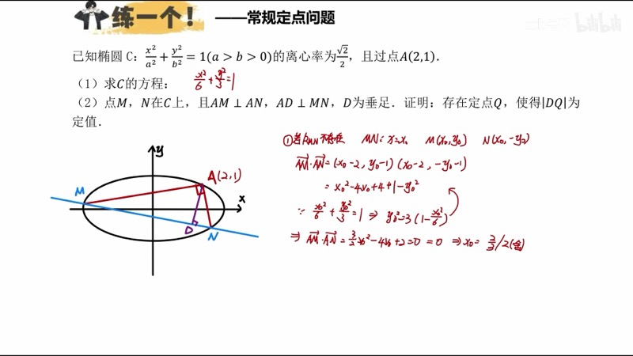
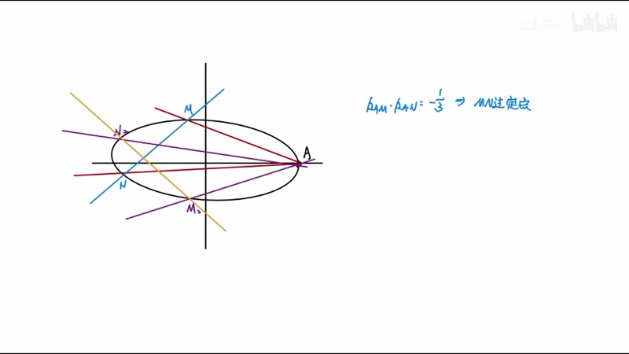
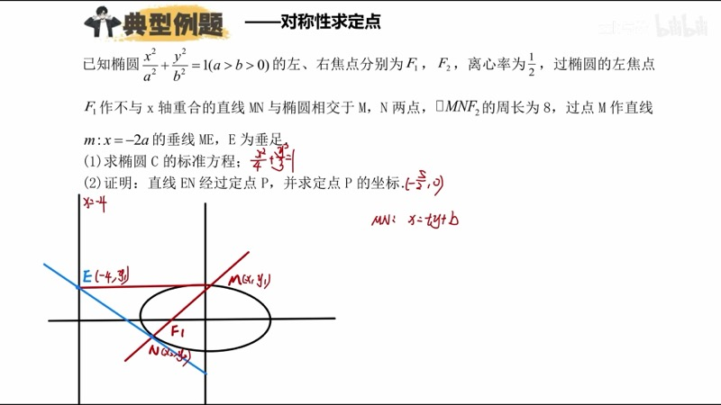
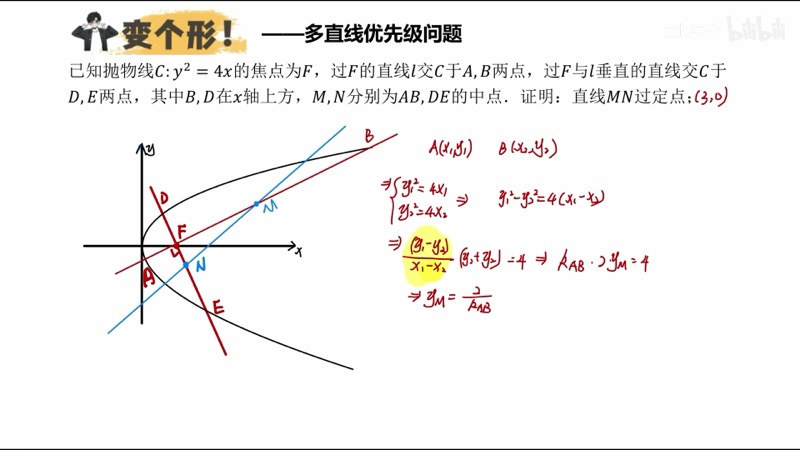

本课深入讲解圆锥曲线（conic section）大题中最常见的题型之一——定点问题（fixed point problem）。我们从"什么样的直线过定点"这一底层逻辑出发，梳理消参（parameter elimination）思想、对称性分析（symmetry analysis）以及三种常见的定点模型，并通过例题演练完整的计算流程。

::: {.callout-note collapse="true"}
## 预备知识

- 第十一课"设→联→韦→代"四步通解流程
- 韦达定理（Vieta's formulas）与判别式
- 直线方程的各种形式及参数含义
- 向量点积（dot product）表示垂直条件
:::

## 本课内容

- 定点问题的底层逻辑：含一个参数的直线过定点
- 消参思想：将两参数 $k$、$b$ 化为一参数
- 一定两动模型：$k_{AM} \cdot k_{AN} = \text{定值}$ 或 $k_{AM} + k_{AN} = \text{定值}$ $\Rightarrow$ $MN$ 过定点
- 对称性分析：利用曲线上下对称确定定点在 $x$ 轴上
- 隐藏条件的定点问题与多直线优先选取策略

## 课程视频

```{=html}
<div class="video-container">
  <iframe src="//player.bilibili.com/player.html?bvid=BV1GgZUYCEHu&page=2" title="圆锥曲线大题：定点问题" frameborder="0" scrolling="no" allowfullscreen></iframe>
</div>
```

## 课程关键帧









## 核心概念

### 一、什么样的直线过定点

一条含有一个参数的直线必过定点。例如：

- $y = kx + 2k$ 过定点 $(-2, 0)$——令 $k = 0$ 时 $y = 0$，令 $x = -2$ 时 $y = 0$ 恒成立
- $y = kx + 2k - 3$ 过定点 $(-2, -3)$

而 $y = kx + b$（两个独立参数）不过定点，因为我们无法同时消掉 $k$ 和 $b$。

::: {.callout-important}
## 定点问题的本质
定点问题考的就是直线 $y = kx + b$ 中 $k$ 与 $b$ 的关系。当我们利用题目条件推导出 $b = f(k)$（一次关系），直线就变成了含一个参数 $k$ 的形式，从而过定点。
:::

### 二、一定两动模型

设椭圆上有一个定点 $A$，两个动点 $M$、$N$ 满足：

$$
k_{AM} \cdot k_{AN} = c \quad \text{（定值）}
$$

则直线 $MN$ 必过定点。

**底层逻辑**：确定 $k_{AM}$ 就能确定 $M$ 点坐标（$A$ 在曲线上，一条直线与曲线联立，其中一根为 $A$，另一根即 $M$）。而 $k_{AM}$ 确定后，$k_{AN} = c / k_{AM}$ 也确定，从而 $N$ 也确定。因此整条直线 $MN$ 只由一个参数 $k_{AM}$ 决定——满足过定点的条件。

### 三、对称性确定定点位置

当椭圆关于 $x$ 轴对称时，若 $M$、$N$ 满足某种条件，将 $M$、$N$ 关于 $x$ 轴取对称点 $M'$、$N'$，条件同样成立。于是 $MN$ 和 $M'N'$ 都过同一个定点，而它们关于 $x$ 轴对称，因此：

$$
\boxed{\text{定点必在 } x \text{ 轴上}}
$$

::: {.callout-tip}
## 实战技巧
先讨论特殊情况（如直线斜率不存在），此时 $M$、$N$ 关于 $x$ 轴对称，可以直接解出 $x$ 坐标。结合对称性分析，定点坐标就已经确定了。后续的通解计算只是验证。
:::

### 交互演示：定点可视化（Desmos）

```{=html}
<div id="calc-fixed-point" class="desmos-container"></div>
<script src="https://www.desmos.com/api/v1.9/calculator.js?apiKey=dcb31709b452b1cf9dc26972add0fda6"></script>
<script>
(function() {
  var elt = document.getElementById('calc-fixed-point');
  var calc = Desmos.GraphingCalculator(elt, {
    expressions: true, settingsMenu: false, xAxisLabel: 'x', yAxisLabel: 'y'
  });
  calc.setExpression({ id: 'ellipse', latex: '\\frac{x^2}{6} + \\frac{y^2}{3} = 1', color: '#2d70b3' });
  calc.setExpression({ id: 'A', latex: '(2, 1)', color: '#c74440', pointSize: 12, label: 'A(2,1)', showLabel: true });
  calc.setExpression({ id: 'k', latex: 'k_0 = 0.5', sliderBounds: { min: -3, max: 3, step: 0.05 } });
  calc.setExpression({ id: 'lineAM', latex: 'y - 1 = k_0(x - 2)', color: '#fa7e19', lineWidth: 1.5 });
  calc.setExpression({ id: 'fixed', latex: '(\\frac{2}{3}, -\\frac{1}{3})', color: '#6042a6', pointSize: 12, label: 'G(2/3,−1/3)', showLabel: true });
  calc.setMathBounds({ left: -4, right: 4, bottom: -3, top: 3 });
})();
</script>
```

拖动滑块 $k_0$ 改变从定点 $A(2,1)$ 出发的直线斜率。当 $k_{AM} \cdot k_{AN} = -\dfrac{1}{2}$ 时，直线 $MN$ 始终过定点 $G\!\left(\dfrac{2}{3}, -\dfrac{1}{3}\right)$。

### 交互演示：定值验证（Desmos）

```{=html}
<div id="calc-fixed-value" class="desmos-container"></div>
<script>
(function() {
  var elt = document.getElementById('calc-fixed-value');
  var calc = Desmos.GraphingCalculator(elt, {
    expressions: true, settingsMenu: false, xAxisLabel: 'x', yAxisLabel: 'y'
  });
  calc.setExpression({ id: 'ellipse', latex: '\\frac{x^2}{4} + \\frac{y^2}{3} = 1', color: '#2d70b3' });
  calc.setExpression({ id: 'M', latex: '(2, 0)', color: '#c74440', pointSize: 12, label: 'M(2,0)', showLabel: true });
  calc.setExpression({ id: 't', latex: 't_0 = 1.0', sliderBounds: { min: 0.1, max: 3.0, step: 0.01 } });
  calc.setExpression({ id: 'Ax', latex: 'A_x = 2\\cos(t_0)' });
  calc.setExpression({ id: 'Ay', latex: 'A_y = \\sqrt{3}\\sin(t_0)' });
  calc.setExpression({ id: 'dotA', latex: '(A_x, A_y)', color: '#388c46', pointSize: 10, label: 'A', showLabel: true });
  calc.setExpression({ id: 'Bx', latex: 'B_x = 2\\cos(t_0 + \\pi)' });
  calc.setExpression({ id: 'By', latex: 'B_y = \\sqrt{3}\\sin(t_0 + \\pi)' });
  calc.setExpression({ id: 'dotB', latex: '(B_x, B_y)', color: '#388c46', pointSize: 10, label: 'B', showLabel: true });
  calc.setExpression({ id: 'kMA', latex: 'k_1 = \\frac{A_y}{A_x - 2}' });
  calc.setExpression({ id: 'kMB', latex: 'k_2 = \\frac{B_y}{B_x - 2}' });
  calc.setExpression({ id: 'prod', latex: 'k_1 \\cdot k_2' });
  calc.setMathBounds({ left: -4, right: 4, bottom: -3, top: 3 });
})();
</script>
```

拖动 $t_0$ 改变椭圆上关于原点对称的两点 $A$、$B$ 的位置。观察从右顶点 $M(2,0)$ 到这两点的斜率之积 $k_1 \cdot k_2$ 始终为定值 $-\dfrac{3}{4}$。

### D3 动画：直线族过定点

```{=html}
<div class="d3-container" id="d3-line-family">
  <svg id="svg-line-family" width="600" height="400"></svg>
  <div class="d3-controls" id="controls-line-family">
    <button id="lf-play">▶ 播放</button>
    <button id="lf-pause">⏸ 暂停</button>
    <label>  速度：<input type="range" id="lf-speed" min="0.5" max="3" step="0.1" value="1"><span id="lf-speed-val">1.0</span></label>
  </div>
  <div id="lf-info" style="font-family: 'KaTeX_Main', serif; font-size: 14px; padding: 8px; background: #f8f8f8; border-radius: 6px; margin-top: 6px;"></div>
</div>
<script>
(function() {
  var W = 600, H = 400, margin = 50;
  var svg = d3.select('#svg-line-family');
  svg.selectAll('*').remove();

  var a2 = 6, b2 = 3;
  var a = Math.sqrt(a2), b = Math.sqrt(b2);
  var fixedX = 2 / 3, fixedY = -1 / 3;

  function toSVG(x, y) {
    var scale = (W - 2 * margin) / (2 * a * 1.3);
    return [W / 2 + x * scale, H / 2 - y * scale];
  }

  svg.append('line').attr('x1', margin).attr('y1', H / 2).attr('x2', W - margin).attr('y2', H / 2).attr('stroke', '#ddd');
  svg.append('line').attr('x1', W / 2).attr('y1', margin).attr('x2', W / 2).attr('y2', H - margin).attr('stroke', '#ddd');

  // Ellipse
  var epts = [];
  for (var i = 0; i <= 200; i++) {
    var t = 2 * Math.PI * i / 200;
    epts.push(toSVG(a * Math.cos(t), b * Math.sin(t)));
  }
  svg.append('path').attr('d', d3.line().x(function(d) { return d[0]; }).y(function(d) { return d[1]; })(epts)).attr('fill', 'none').attr('stroke', '#2d70b3').attr('stroke-width', 2);

  // Fixed point
  var fp = toSVG(fixedX, fixedY);
  svg.append('circle').attr('cx', fp[0]).attr('cy', fp[1]).attr('r', 7).attr('fill', '#c74440');
  svg.append('text').attr('x', fp[0] + 10).attr('y', fp[1] - 8).text('定点 G').attr('font-size', 13).attr('fill', '#c74440');

  var trailGroup = svg.append('g');
  var currentLine = svg.append('line').attr('stroke', '#fa7e19').attr('stroke-width', 2.5);
  var dot1 = svg.append('circle').attr('r', 5).attr('fill', '#388c46');
  var dot2 = svg.append('circle').attr('r', 5).attr('fill', '#388c46');

  var angle = 0, animating = false, animTimer = null, speed = 1;
  var trails = [];

  function getLinePoints(ang) {
    var k = Math.tan(ang);
    var bv = fixedY - k * fixedX;
    var x1 = -a * 1.3, x2 = a * 1.3;
    return { p1: toSVG(x1, k * x1 + bv), p2: toSVG(x2, k * x2 + bv), k: k };
  }

  function update(ang) {
    var lp = getLinePoints(ang);
    currentLine.attr('x1', lp.p1[0]).attr('y1', lp.p1[1]).attr('x2', lp.p2[0]).attr('y2', lp.p2[1]);

    // Find intersections with ellipse
    var k = lp.k, bv = fixedY - k * fixedX;
    var A = 1 / a2 + k * k / b2;
    var B = 2 * k * bv / b2;
    var C = bv * bv / b2 - 1;
    var disc = B * B - 4 * A * C;
    if (disc >= 0) {
      var sq = Math.sqrt(disc);
      var xi1 = (-B + sq) / (2 * A), xi2 = (-B - sq) / (2 * A);
      var s1 = toSVG(xi1, k * xi1 + bv), s2 = toSVG(xi2, k * xi2 + bv);
      dot1.attr('cx', s1[0]).attr('cy', s1[1]).attr('opacity', 1);
      dot2.attr('cx', s2[0]).attr('cy', s2[1]).attr('opacity', 1);
    } else {
      dot1.attr('opacity', 0); dot2.attr('opacity', 0);
    }

    document.getElementById('lf-info').innerHTML = 'k = ' + lp.k.toFixed(3) + '，直线始终过定点 G(' + fixedX.toFixed(2) + ', ' + fixedY.toFixed(2) + ')';
  }

  function startAnim() {
    if (animating) return;
    animating = true;
    trails = [];
    trailGroup.selectAll('*').remove();
    animTimer = d3.timer(function(elapsed) {
      angle = (elapsed * 0.001 * speed) % Math.PI;
      if (trails.length < 20 && elapsed % 200 < 20) {
        var lp = getLinePoints(angle);
        trailGroup.append('line').attr('x1', lp.p1[0]).attr('y1', lp.p1[1]).attr('x2', lp.p2[0]).attr('y2', lp.p2[1]).attr('stroke', '#fa7e19').attr('stroke-width', 0.8).attr('opacity', 0.25);
        trails.push(1);
      }
      update(angle);
    });
  }

  function stopAnim() {
    animating = false;
    if (animTimer) { animTimer.stop(); animTimer = null; }
  }

  d3.select('#lf-play').on('click', startAnim);
  d3.select('#lf-pause').on('click', stopAnim);
  d3.select('#lf-speed').on('input', function() { speed = +this.value; d3.select('#lf-speed-val').text(speed.toFixed(1)); });

  update(0.5);
})();
</script>
```

点击"播放"观察直线族以不同斜率旋转，但始终过同一个定点 $G$。半透明轨迹线显示直线的历史位置，清晰展示"定点"的含义。

### D3 动画：定值验证

```{=html}
<div class="d3-container" id="d3-fixed-value">
  <svg id="svg-fixed-value" width="600" height="400"></svg>
  <div class="d3-controls" id="controls-fixed-value">
    <label>参数 θ = <input type="range" id="fv-slider-t" min="0.1" max="3.0" step="0.01" value="1.0"><span id="fv-val-t">1.00</span></label>
  </div>
  <div id="fv-info" style="font-family: 'KaTeX_Main', serif; font-size: 15px; padding: 8px; background: #f8f8f8; border-radius: 6px; margin-top: 6px;"></div>
</div>
<script>
(function() {
  var W = 600, H = 400, margin = 50;
  var svg = d3.select('#svg-fixed-value');
  svg.selectAll('*').remove();

  var a = 2, b = Math.sqrt(3);

  function toSVG(x, y) {
    var scale = (W - 2 * margin) / (2 * a * 1.4);
    return [W / 2 + x * scale, H / 2 - y * scale];
  }

  svg.append('line').attr('x1', margin).attr('y1', H / 2).attr('x2', W - margin).attr('y2', H / 2).attr('stroke', '#ddd');
  svg.append('line').attr('x1', W / 2).attr('y1', margin).attr('x2', W / 2).attr('y2', H - margin).attr('stroke', '#ddd');

  var epts = [];
  for (var i = 0; i <= 200; i++) {
    var t = 2 * Math.PI * i / 200;
    epts.push(toSVG(a * Math.cos(t), b * Math.sin(t)));
  }
  svg.append('path').attr('d', d3.line().x(function(d) { return d[0]; }).y(function(d) { return d[1]; })(epts)).attr('fill', 'none').attr('stroke', '#2d70b3').attr('stroke-width', 2);

  var Mx = a, My = 0;
  var Mp = toSVG(Mx, My);
  svg.append('circle').attr('cx', Mp[0]).attr('cy', Mp[1]).attr('r', 6).attr('fill', '#c74440');
  svg.append('text').attr('x', Mp[0] + 8).attr('y', Mp[1] + 18).text('M(2,0)').attr('font-size', 12).attr('fill', '#c74440');

  var lineMA = svg.append('line').attr('stroke', '#fa7e19').attr('stroke-width', 1.5).attr('stroke-dasharray', '4,3');
  var lineMB = svg.append('line').attr('stroke', '#6042a6').attr('stroke-width', 1.5).attr('stroke-dasharray', '4,3');
  var dotA = svg.append('circle').attr('r', 5).attr('fill', '#388c46');
  var dotB = svg.append('circle').attr('r', 5).attr('fill', '#388c46');
  var lblA = svg.append('text').attr('font-size', 12).attr('fill', '#388c46');
  var lblB = svg.append('text').attr('font-size', 12).attr('fill', '#388c46');

  // Value display bar
  var barG = svg.append('g').attr('transform', 'translate(440, 30)');
  barG.append('text').text('k₁·k₂').attr('font-size', 14).attr('fill', '#333');
  var valText = barG.append('text').attr('y', 30).attr('font-size', 22).attr('font-weight', 'bold').attr('fill', '#c74440');
  var targetText = barG.append('text').attr('y', 55).attr('font-size', 14).attr('fill', '#666').text('定值 = −3/4 = −0.750');

  function update() {
    var t = +d3.select('#fv-slider-t').property('value');
    d3.select('#fv-val-t').text(t.toFixed(2));

    var ax = a * Math.cos(t), ay = b * Math.sin(t);
    var bx = -ax, by = -ay;

    var sa = toSVG(ax, ay), sb = toSVG(bx, by);
    dotA.attr('cx', sa[0]).attr('cy', sa[1]);
    dotB.attr('cx', sb[0]).attr('cy', sb[1]);
    lblA.attr('x', sa[0] + 8).attr('y', sa[1] - 5).text('A');
    lblB.attr('x', sb[0] + 8).attr('y', sb[1] + 15).text('B');

    lineMA.attr('x1', Mp[0]).attr('y1', Mp[1]).attr('x2', sa[0]).attr('y2', sa[1]);
    lineMB.attr('x1', Mp[0]).attr('y1', Mp[1]).attr('x2', sb[0]).attr('y2', sb[1]);

    var k1 = ay / (ax - Mx);
    var k2 = by / (bx - Mx);
    var prod = k1 * k2;

    valText.text(prod.toFixed(6));

    document.getElementById('fv-info').innerHTML =
      'A = (' + ax.toFixed(3) + ', ' + ay.toFixed(3) + ')' +
      ' &nbsp; B = (' + bx.toFixed(3) + ', ' + by.toFixed(3) + ')' +
      '<br>k₁ = k_{MA} = ' + k1.toFixed(4) + ' &nbsp; k₂ = k_{MB} = ' + k2.toFixed(4) +
      '<br><b>k₁ · k₂ = ' + prod.toFixed(6) + ' = −3/4（定值）</b>';
  }

  d3.select('#fv-slider-t').on('input', update);
  update();
})();
</script>
```

拖动参数 $\theta$ 改变椭圆上对称两点 $A$、$B$ 的位置。观察从右顶点 $M(2,0)$ 出发的斜率之积 $k_1 \cdot k_2$ 在 $A$、$B$ 任意变化时始终保持常数 $-\dfrac{3}{4}$。

## 速查表

::: {.key-formula}

| 模型 | 条件 | 结论 |
|:-----|:-----|:-----|
| 含一参数的直线 | $y = kx + f(k)$（$b$ 可用 $k$ 表示） | 必过定点，令 $k$ 使系数为零即得 |
| 一定两动·斜率积 | $k_{AM} \cdot k_{AN} = c$，$A$ 在曲线上 | $MN$ 过定点 |
| 一定两动·斜率和 | $k_{AM} + k_{AN} = c$，$A$ 在曲线上 | $MN$ 过定点 |
| 对称性判定 | 曲线关于 $x$ 轴对称 | 定点必在 $x$ 轴上 |
| 特殊情况速算 | $k$ 不存在时直接求 $x_0$ | 定点横坐标 = 特殊情况的 $x_0$ |
| 因式分解验证 | $k$ 与 $b$ 关系式因式分解为两个线性因子 | 其中一个对应 $A$ 点（舍去），另一个给出定点 |

:::
