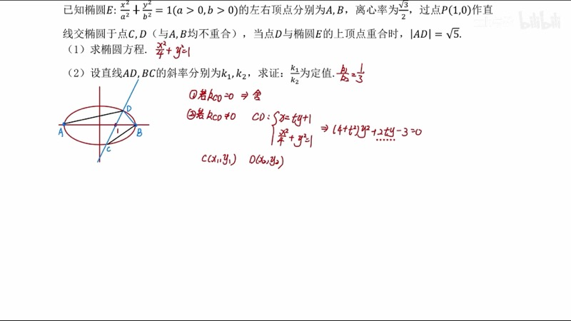
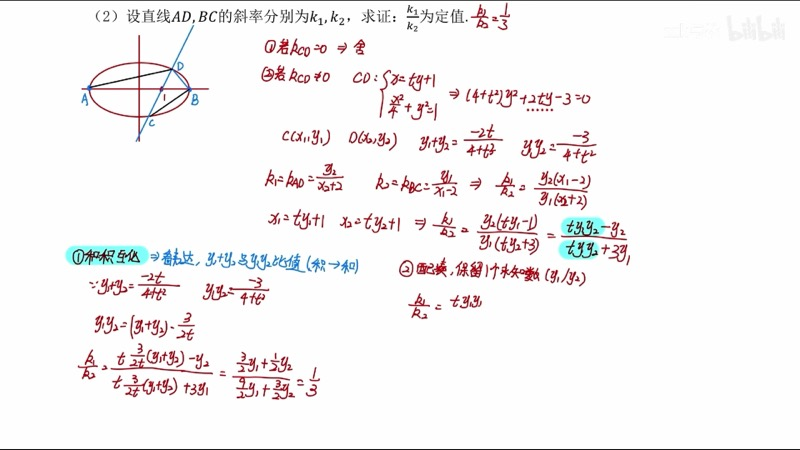
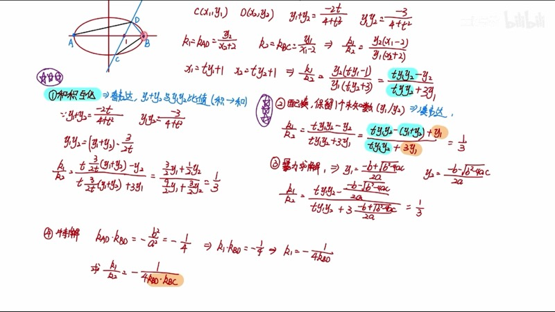
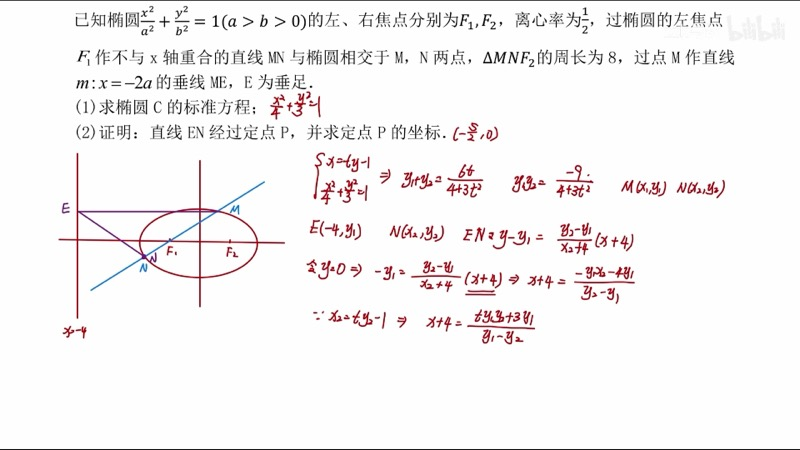

本课专门讲解圆锥曲线（conic section）大题中非对称韦达（asymmetric Vieta）的处理方法。当最终需要计算的表达式中 $x_1$、$x_2$（或 $y_1$、$y_2$）不对称出现时，标准韦达定理无法直接代入，我们需要额外的技巧。本课将介绍三种通解方法和一种特解方法，并通过完整例题演练。

::: {.callout-note collapse="true"}
## 预备知识

- 韦达定理（Vieta's formulas）：$x_1 + x_2$、$x_1 x_2$ 的标准应用
- 第十一课"设→联→韦→代"的通解流程
- 椭圆第三定义：$k_{PA} \cdot k_{PB} = -\dfrac{b^2}{a^2}$
- 齐次化（homogenization）的基本思想（第十课）
:::

## 本课内容

- 对称韦达 vs. 非对称韦达的区别
- 方法一：积和互化（product-sum conversion）
- 方法二：配凑法（rearrangement by Vieta）
- 方法三：暴力求解（direct substitution，不推荐）
- 方法四：二级结论特解（利用椭圆第三定义 + 齐次化）

## 课程视频

```{=html}
<div class="video-container">
  <iframe src="//player.bilibili.com/player.html?bvid=BV1GgZUYCEHu&page=3" title="圆锥曲线大题：非对称韦达" frameborder="0" scrolling="no" allowfullscreen></iframe>
</div>
```

## 课程关键帧









## 核心概念

### 一、对称韦达 vs. 非对称韦达

在标准的圆锥曲线问题中，我们联立直线与曲线后，利用韦达定理得到 $x_1 + x_2$ 和 $x_1 x_2$。需要计算的目标表达式通常是**对称**的：

$$
\text{对称：} \quad x_1 + x_2, \quad x_1 x_2, \quad y_1 + y_2, \quad y_1 y_2
$$

这些都可以直接用韦达定理表达。但有时候，目标表达式中 $x_1$、$x_2$ 不对称出现：

$$
\text{非对称：} \quad \frac{x_1}{x_2}, \quad 3x_1 + x_1 x_2 - 4x_2, \quad \frac{k_1}{k_2}
$$

此时需要特殊处理技巧。

### 二、方法一：积和互化（Product-Sum Conversion）

**核心思想**：观察 $x_1 + x_2$ 与 $x_1 x_2$ 的比值关系，将"积"统一转化为"和"的倍数。

设韦达定理给出：
$$
y_1 + y_2 = \frac{-2t}{4 + t^2}, \quad y_1 y_2 = \frac{-3}{4 + t^2}
$$

由于分母相同，可得：
$$
y_1 y_2 = \frac{3}{2t} \cdot (y_1 + y_2)
$$

将所有 $y_1 y_2$ 替换为 $\dfrac{3}{2t}(y_1 + y_2)$ 后，分子分母中的 $y_1$、$y_2$ 可以提取公因子 $(y_1 + y_2)$ 或类似形式，最终约去，得到定值。

::: {.callout-tip}
## 适用条件
当韦达定理给出的"和"与"积"的分母相同，且比值关系简洁（形如常数倍）时，积和互化最为高效。一般来说，我们将"积"化为"和"，因为加法结构比乘法更容易合并。
:::

### 三、方法二：配凑法（Rearrangement by Vieta）

**核心思想**：在不可用韦达的单独 $y_1$ 或 $y_2$ 项旁边加减 $(y_1 + y_2)$，凑出韦达可处理的形式。

例如，目标表达式的分子中有 $-y_2$，我们改写为：
$$
-y_2 = -(y_1 + y_2) + y_1
$$

其中 $-(y_1 + y_2)$ 可用韦达，$y_1$ 保留为单独未知量。同样处理分母中的单独项后，所有韦达可处理的部分代入后消去，剩余的 $y_1$ 在分子分母中形成比值，即为答案。

**示例**：设需要计算：
$$
\frac{ty_1 y_2 - y_2}{ty_1 y_2 + 3y_1}
$$

分子：$ty_1 y_2 - y_2 = ty_1 y_2 - (y_1 + y_2) + y_1$

分母：$ty_1 y_2 + 3y_1$

代入韦达后，韦达部分化为常数，单独的 $y_1$ 保留，最终得到 $y_1$ 的比值。

### 四、方法四：二级结论特解

当题目中涉及椭圆的左右顶点 $A(-a, 0)$、$B(a, 0)$ 时，可利用椭圆第三定义：

$$
k_{PA} \cdot k_{PB} = -\frac{b^2}{a^2}
$$

结合齐次化方法，将非对称韦达问题转化为斜率乘积的计算，从而避开复杂的代数运算。

::: {.callout-important}
## 方法选择建议
- **积和互化**与**配凑法**是通用方法，适用于所有非对称韦达题目
- **暴力求解**计算量大，仅作为备选
- **二级结论特解**仅在特定条件下可用（如涉及顶点斜率），但一旦可用则极为简洁
- 建议优先掌握前两种通解方法
:::

### 交互演示：韦达定理可视化（Desmos）

```{=html}
<div id="calc-vieta-visual" class="desmos-container"></div>
<script src="https://www.desmos.com/api/v1.9/calculator.js?apiKey=dcb31709b452b1cf9dc26972add0fda6"></script>
<script>
(function() {
  var elt = document.getElementById('calc-vieta-visual');
  var calc = Desmos.GraphingCalculator(elt, {
    expressions: true, settingsMenu: false, xAxisLabel: 't', yAxisLabel: '值'
  });
  calc.setExpression({ id: 'sum', latex: 'S(t) = \\frac{-2t}{4 + t^2}', color: '#2d70b3', lineWidth: 2 });
  calc.setExpression({ id: 'prod', latex: 'P(t) = \\frac{-3}{4 + t^2}', color: '#c74440', lineWidth: 2 });
  calc.setExpression({ id: 'ratio', latex: 'R(t) = \\frac{P(t)}{S(t)}', color: '#388c46', lineWidth: 2, lineStyle: 'DASHED' });
  calc.setExpression({ id: 'label_s', latex: '(2, S(2))', color: '#2d70b3', label: 'y₁+y₂', showLabel: true, pointSize: 0 });
  calc.setExpression({ id: 'label_p', latex: '(2, P(2))', color: '#c74440', label: 'y₁y₂', showLabel: true, pointSize: 0 });
  calc.setExpression({ id: 'label_r', latex: '(2, R(2))', color: '#388c46', label: 'y₁y₂/(y₁+y₂)', showLabel: true, pointSize: 0 });
  calc.setMathBounds({ left: -5, right: 5, bottom: -2, top: 2 });
})();
</script>
```

蓝线为 $y_1 + y_2$，红线为 $y_1 y_2$，绿色虚线为它们的比值 $\dfrac{y_1 y_2}{y_1 + y_2} = \dfrac{3}{2t}$，随参数 $t$ 变化。积和互化正是利用这一简洁的比值关系。

### 交互演示：非对称表达式跟踪（Desmos）

```{=html}
<div id="calc-asym-track" class="desmos-container"></div>
<script>
(function() {
  var elt = document.getElementById('calc-asym-track');
  var calc = Desmos.GraphingCalculator(elt, {
    expressions: true, settingsMenu: false, xAxisLabel: 'x', yAxisLabel: 'y'
  });
  calc.setExpression({ id: 'ellipse', latex: '\\frac{x^2}{4} + y^2 = 1', color: '#2d70b3' });
  calc.setExpression({ id: 'A', latex: '(-2, 0)', color: '#c74440', pointSize: 12, label: 'A(−2,0)', showLabel: true });
  calc.setExpression({ id: 'B', latex: '(2, 0)', color: '#c74440', pointSize: 12, label: 'B(2,0)', showLabel: true });
  calc.setExpression({ id: 'F', latex: '(1, 0)', color: '#6042a6', pointSize: 10, label: 'F(1,0)', showLabel: true });
  calc.setExpression({ id: 't', latex: 't_0 = 0.8', sliderBounds: { min: -3, max: 3, step: 0.05 } });
  calc.setExpression({ id: 'line', latex: 'x = t_0 y + 1', color: '#fa7e19', lineWidth: 2 });
  calc.setMathBounds({ left: -4, right: 4, bottom: -2.5, top: 2.5 });
})();
</script>
```

拖动 $t_0$ 改变过点 $F(1,0)$ 的直线。直线与椭圆交于 $C$、$D$ 两点，可用于研究 $\dfrac{k_1}{k_2}$（其中 $k_1 = k_{AC}$，$k_2 = k_{BC}$）等非对称表达式。

### D3 动画：韦达定理可视化

```{=html}
<div class="d3-container" id="d3-vieta-viz">
  <svg id="svg-vieta-viz" width="600" height="350"></svg>
  <div class="d3-controls" id="controls-vieta-viz">
    <label>参数 t = <input type="range" id="vv-slider-t" min="-3" max="3" step="0.05" value="1"><span id="vv-val-t">1.00</span></label>
  </div>
  <div id="vv-info" style="font-family: 'KaTeX_Main', serif; font-size: 14px; padding: 8px; background: #f8f8f8; border-radius: 6px; margin-top: 6px;"></div>
</div>
<script src="https://d3js.org/d3.v7.min.js"></script>
<script>
(function() {
  var W = 600, H = 350, margin = 60;
  var svg = d3.select('#svg-vieta-viz');
  svg.selectAll('*').remove();

  // Bar chart showing y1+y2, y1*y2, ratio as t changes
  var barW = 80, barGap = 40;
  var barArea = svg.append('g').attr('transform', 'translate(' + (W / 2 - 1.5 * (barW + barGap)) + ', 40)');

  var labels = ['y₁ + y₂', 'y₁ · y₂', '积/和'];
  var colors = ['#2d70b3', '#c74440', '#388c46'];
  var barGroups = [];
  labels.forEach(function(lbl, i) {
    var g = barArea.append('g').attr('transform', 'translate(' + (i * (barW + barGap)) + ', 0)');
    g.append('rect').attr('x', 0).attr('y', 130).attr('width', barW).attr('height', 0).attr('fill', colors[i]).attr('rx', 4);
    g.append('text').attr('x', barW / 2).attr('y', 270).attr('text-anchor', 'middle').attr('font-size', 14).attr('fill', colors[i]).text(lbl);
    g.append('text').attr('x', barW / 2).attr('y', 290).attr('text-anchor', 'middle').attr('font-size', 13).attr('fill', '#333').attr('class', 'bar-val');
    barGroups.push(g);
  });

  // Zero line
  barArea.append('line').attr('x1', -20).attr('y1', 130).attr('x2', 3 * (barW + barGap)).attr('y2', 130).attr('stroke', '#999').attr('stroke-dasharray', '3,3');
  barArea.append('text').attr('x', -15).attr('y', 135).text('0').attr('font-size', 11).attr('fill', '#999');

  var maxBarH = 120;

  function update() {
    var t = +d3.select('#vv-slider-t').property('value');
    d3.select('#vv-val-t').text(t.toFixed(2));

    var denom = 4 + t * t;
    var sum = -2 * t / denom;
    var prod = -3 / denom;
    var ratio = (Math.abs(sum) > 0.001) ? prod / sum : NaN;

    var vals = [sum, prod, isNaN(ratio) ? 0 : ratio];
    var maxAbs = Math.max(1, Math.abs(sum), Math.abs(prod), isNaN(ratio) ? 0 : Math.abs(ratio));

    vals.forEach(function(v, i) {
      var h = (v / maxAbs) * maxBarH;
      var rect = barGroups[i].select('rect');
      if (v >= 0) {
        rect.transition().duration(100).attr('y', 130 - h).attr('height', h);
      } else {
        rect.transition().duration(100).attr('y', 130).attr('height', -h);
      }
      barGroups[i].select('.bar-val').text(isNaN(v) ? '—' : v.toFixed(4));
    });

    document.getElementById('vv-info').innerHTML =
      't = ' + t.toFixed(2) +
      ' &nbsp; y₁+y₂ = ' + sum.toFixed(4) +
      ' &nbsp; y₁y₂ = ' + prod.toFixed(4) +
      ' &nbsp; 积/和 = ' + (isNaN(ratio) ? '未定义' : ratio.toFixed(4)) +
      (isNaN(ratio) ? '' : ' = 3/(2t) = ' + (3 / (2 * t)).toFixed(4));
  }

  d3.select('#vv-slider-t').on('input', update);
  update();
})();
</script>
```

拖动参数 $t$，观察 $y_1 + y_2$（蓝）和 $y_1 y_2$（红）随 $t$ 变化的柱状图。绿色柱为它们的比值，验证 $\dfrac{y_1 y_2}{y_1 + y_2} = \dfrac{3}{2t}$ 的关系。

### D3 动画：非对称表达式跟踪

```{=html}
<div class="d3-container" id="d3-asym-track">
  <svg id="svg-asym-track" width="600" height="400"></svg>
  <div class="d3-controls" id="controls-asym-track">
    <label>直线参数 t = <input type="range" id="at-slider-t" min="-3" max="3" step="0.05" value="1"><span id="at-val-t">1.00</span></label>
  </div>
  <div id="at-info" style="font-family: 'KaTeX_Main', serif; font-size: 14px; padding: 8px; background: #f8f8f8; border-radius: 6px; margin-top: 6px;"></div>
</div>
<script>
(function() {
  var W = 600, H = 400, margin = 50;
  var svg = d3.select('#svg-asym-track');
  svg.selectAll('*').remove();

  var a = 2, b = 1;

  function toSVG(x, y) {
    var scale = (W - 2 * margin) / (2 * a * 1.4);
    return [W / 2 + x * scale, H / 2 - y * scale];
  }

  svg.append('line').attr('x1', margin).attr('y1', H / 2).attr('x2', W - margin).attr('y2', H / 2).attr('stroke', '#ddd');
  svg.append('line').attr('x1', W / 2).attr('y1', margin).attr('x2', W / 2).attr('y2', H - margin).attr('stroke', '#ddd');

  var epts = [];
  for (var i = 0; i <= 200; i++) {
    var t = 2 * Math.PI * i / 200;
    epts.push(toSVG(a * Math.cos(t), b * Math.sin(t)));
  }
  svg.append('path').attr('d', d3.line().x(function(d) { return d[0]; }).y(function(d) { return d[1]; })(epts)).attr('fill', 'none').attr('stroke', '#2d70b3').attr('stroke-width', 2);

  var Ax = -a, Ay = 0, Bx = a, By = 0;
  var sA = toSVG(Ax, Ay), sB = toSVG(Bx, By);
  svg.append('circle').attr('cx', sA[0]).attr('cy', sA[1]).attr('r', 5).attr('fill', '#c74440');
  svg.append('text').attr('x', sA[0] - 15).attr('y', sA[1] + 18).text('A').attr('font-size', 13).attr('fill', '#c74440');
  svg.append('circle').attr('cx', sB[0]).attr('cy', sB[1]).attr('r', 5).attr('fill', '#c74440');
  svg.append('text').attr('x', sB[0] + 5).attr('y', sB[1] + 18).text('B').attr('font-size', 13).attr('fill', '#c74440');

  var lineL = svg.append('line').attr('stroke', '#fa7e19').attr('stroke-width', 2);
  var lineAC = svg.append('line').attr('stroke', '#388c46').attr('stroke-width', 1.5).attr('stroke-dasharray', '4,3');
  var lineBD = svg.append('line').attr('stroke', '#6042a6').attr('stroke-width', 1.5).attr('stroke-dasharray', '4,3');
  var dotC = svg.append('circle').attr('r', 5).attr('fill', '#388c46');
  var dotD = svg.append('circle').attr('r', 5).attr('fill', '#6042a6');
  var lblC = svg.append('text').attr('font-size', 12).attr('fill', '#388c46');
  var lblD = svg.append('text').attr('font-size', 12).attr('fill', '#6042a6');

  // Result display
  var resBox = svg.append('g').attr('transform', 'translate(420, 20)');
  resBox.append('rect').attr('width', 160).attr('height', 80).attr('rx', 8).attr('fill', '#f8f8f8').attr('stroke', '#ccc');
  var resT1 = resBox.append('text').attr('x', 10).attr('y', 22).attr('font-size', 12).attr('fill', '#388c46');
  var resT2 = resBox.append('text').attr('x', 10).attr('y', 42).attr('font-size', 12).attr('fill', '#6042a6');
  var resT3 = resBox.append('text').attr('x', 10).attr('y', 65).attr('font-size', 15).attr('font-weight', 'bold').attr('fill', '#c74440');

  function update() {
    var t = +d3.select('#at-slider-t').property('value');
    d3.select('#at-val-t').text(t.toFixed(2));

    // x = ty + 1, x^2/4 + y^2 = 1 => (ty+1)^2/4 + y^2 = 1
    // t^2 y^2 + 2ty + 1 + 4y^2 = 4
    // (t^2+4)y^2 + 2ty - 3 = 0
    var AA = t * t + 4;
    var BB = 2 * t;
    var CC = -3;
    var disc = BB * BB - 4 * AA * CC;
    if (disc < 0) { document.getElementById('at-info').innerHTML = '无交点'; return; }
    var sq = Math.sqrt(disc);
    var y1 = (-BB + sq) / (2 * AA), y2 = (-BB - sq) / (2 * AA);
    var x1 = t * y1 + 1, x2 = t * y2 + 1;

    var sC = toSVG(x1, y1), sD = toSVG(x2, y2);
    lineL.attr('x1', sC[0]).attr('y1', sC[1]).attr('x2', sD[0]).attr('y2', sD[1]);
    dotC.attr('cx', sC[0]).attr('cy', sC[1]);
    dotD.attr('cx', sD[0]).attr('cy', sD[1]);
    lblC.attr('x', sC[0] + 8).attr('y', sC[1] - 5).text('C');
    lblD.attr('x', sD[0] + 8).attr('y', sD[1] + 15).text('D');
    lineAC.attr('x1', sA[0]).attr('y1', sA[1]).attr('x2', sC[0]).attr('y2', sC[1]);
    lineBD.attr('x1', sB[0]).attr('y1', sB[1]).attr('x2', sD[0]).attr('y2', sD[1]);

    var kAC = y1 / (x1 - Ax);
    var kBD = y2 / (x2 - Bx);

    resT1.text('k_AC = ' + kAC.toFixed(4));
    resT2.text('k_BD = ' + kBD.toFixed(4));
    resT3.text('k_AC/k_BD = ' + (kBD !== 0 ? (kAC / kBD).toFixed(4) : '—'));

    document.getElementById('at-info').innerHTML =
      'C = (' + x1.toFixed(3) + ', ' + y1.toFixed(3) + ') &nbsp; D = (' + x2.toFixed(3) + ', ' + y2.toFixed(3) + ')' +
      '<br>k_{AC} = ' + kAC.toFixed(4) + ' &nbsp; k_{BD} = ' + kBD.toFixed(4) +
      '<br><b>k_{AC} / k_{BD} = ' + (kBD !== 0 ? (kAC / kBD).toFixed(4) : '—') + '（非对称表达式）</b>';
  }

  d3.select('#at-slider-t').on('input', update);
  update();
})();
</script>
```

拖动参数 $t$ 改变直线位置，实时观察 $C$、$D$ 两点坐标以及 $k_{AC}$、$k_{BD}$ 的单独值和它们的比值。这展示了非对称表达式如何随参数变化。

## 速查表

::: {.key-formula}

| 方法 | 核心操作 | 适用条件 |
|:-----|:---------|:---------|
| 积和互化 | 利用 $x_1x_2 = \alpha(x_1+x_2)$ 将积化为和 | 韦达"和"与"积"分母相同，比值简洁 |
| 配凑法 | 加减 $(x_1+x_2)$ 凑韦达，保留单个未知量 | 通用，最终结果为未知量的比值 |
| 暴力求解 | 设 $x_1 = \dfrac{-B+\sqrt{\Delta}}{2A}$ 直接代入 | 通用但计算量大，不推荐 |
| 二级结论特解 | 利用 $k_{PA} \cdot k_{PB} = -b^2/a^2$ + 齐次化 | 涉及顶点斜率的特殊题型 |
| 判断依据 | 目标表达式中 $x_1$、$x_2$ 是否对称出现 | 不对称则需用上述方法 |

:::
