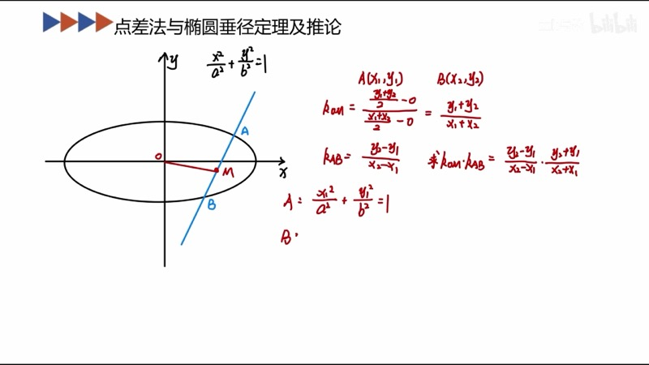
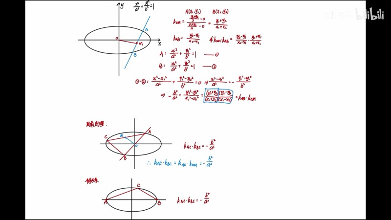
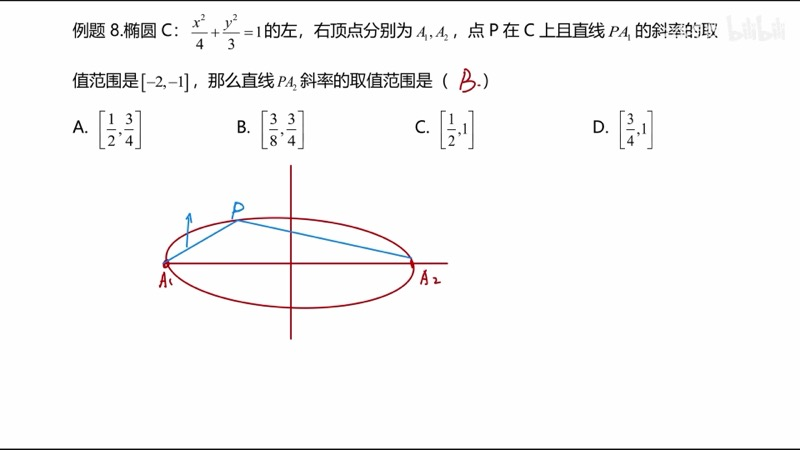
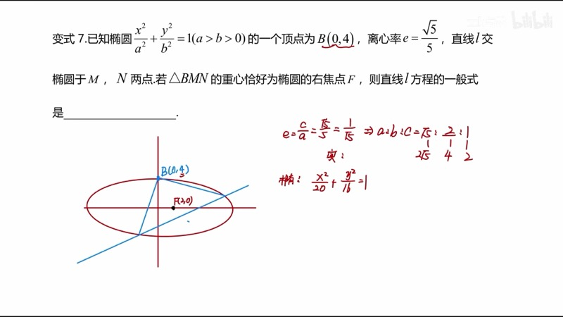

本课讲解点差法（point-difference method）及其在圆锥曲线中的广泛应用。我们将从最基础的"先写点，再相减"出发，推导椭圆的垂径定理（perpendicular diameter theorem）和周角定理（inscribed angle theorem for conics），并将结论推广到双曲线。这些二级结论在涉及斜率与中点的题目中可以极大简化计算。

::: {.callout-note collapse="true"}
## 预备知识

- 椭圆（ellipse）与双曲线（hyperbola）的标准方程
- 斜率（slope）的计算：$k = \dfrac{y_2 - y_1}{x_2 - x_1}$
- 中点坐标公式：$M = \left(\dfrac{x_1 + x_2}{2}, \dfrac{y_1 + y_2}{2}\right)$
- 平方差公式：$a^2 - b^2 = (a+b)(a-b)$
:::

## 本课内容

- 点差法的基本操作：两点代入曲线方程后相减
- 椭圆的垂径定理：$k_{AB} \cdot k_{OM} = -\dfrac{b^2}{a^2}$
- 椭圆的周角定理：$k_{AC} \cdot k_{BC} = -\dfrac{b^2}{a^2}$（$AB$ 过原点）
- 周角定理的特殊情况：$A$、$B$ 为左右顶点
- 双曲线的对应结论（符号取正）
- 典型应用题目

## 课程视频

```{=html}
<div class="video-container">
  <iframe src="//player.bilibili.com/player.html?bvid=BV1GgZUYCEHu&page=4" title="圆锥曲线大题：点差法及应用" frameborder="0" scrolling="no" allowfullscreen></iframe>
</div>
```

## 课程关键帧









## 核心概念

### 一、点差法（Point-Difference Method）

**基本操作**：设 $A(x_1, y_1)$、$B(x_2, y_2)$ 均在椭圆 $\dfrac{x^2}{a^2} + \dfrac{y^2}{b^2} = 1$ 上，则：

$$
\frac{x_1^2}{a^2} + \frac{y_1^2}{b^2} = 1 \qquad \cdots (1)
$$

$$
\frac{x_2^2}{a^2} + \frac{y_2^2}{b^2} = 1 \qquad \cdots (2)
$$

$(1) - (2)$ 得：

$$
\frac{x_1^2 - x_2^2}{a^2} + \frac{y_1^2 - y_2^2}{b^2} = 0
$$

利用平方差公式分解：

$$
\frac{(x_1 + x_2)(x_1 - x_2)}{a^2} + \frac{(y_1 + y_2)(y_1 - y_2)}{b^2} = 0
$$

整理得到关键等式：

$$
\boxed{\frac{y_1 - y_2}{x_1 - x_2} \cdot \frac{y_1 + y_2}{x_1 + x_2} = -\frac{b^2}{a^2}}
$$

即 $k_{AB} \cdot k_{OM} = -\dfrac{b^2}{a^2}$，其中 $M$ 是 $AB$ 的中点。

### 二、椭圆垂径定理（Perpendicular Diameter Theorem）

在椭圆 $\dfrac{x^2}{a^2} + \dfrac{y^2}{b^2} = 1$ 中，$AB$ 为任意一条弦，$M$ 为 $AB$ 的中点，$O$ 为椭圆中心。则：

$$
k_{AB} \cdot k_{OM} = -\frac{b^2}{a^2}
$$

::: {.callout-tip}
## 与圆的类比
在圆中，弦的中点与圆心的连线垂直于弦（$k_{AB} \cdot k_{OM} = -1$）。椭圆的垂径定理是其推广，只是常数由 $-1$ 变为 $-\dfrac{b^2}{a^2}$。
:::

### 三、周角定理（Inscribed Angle Theorem for Conics）

设 $A$、$B$ 是椭圆上关于中心 $O$ 对称的两点（即 $AB$ 过原点），$C$ 是椭圆上异于 $A$、$B$ 的任意一点。则：

$$
k_{AC} \cdot k_{BC} = -\frac{b^2}{a^2}
$$

**证明思路**：取 $AC$ 的中点 $M$，由于 $O$ 是 $AB$ 的中点，$OM$ 是三角形 $ABC$ 的中位线，故 $k_{OM} = k_{BC}$。又由垂径定理 $k_{AC} \cdot k_{OM} = -\dfrac{b^2}{a^2}$，代入即得。

**特殊情况**：当 $A(-a, 0)$、$B(a, 0)$ 为左右顶点时，对椭圆上任意一点 $C$，有：

$$
k_{AC} \cdot k_{BC} = -\frac{b^2}{a^2} = -(1 - e^2)
$$

这正是椭圆的**第三定义**。

### 四、双曲线的对应结论

对双曲线 $\dfrac{x^2}{a^2} - \dfrac{y^2}{b^2} = 1$，用同样的点差法可得：

$$
k_{AB} \cdot k_{OM} = \frac{b^2}{a^2} \qquad (\text{注意符号为正})
$$

同理，周角定理和特殊情况的结论也全部取正号。

::: {.callout-important}
## 六图速记法
椭圆三个结论（垂径、周角、特殊）和双曲线三个结论共六个图。记忆要点：
- 数值都是 $\dfrac{b^2}{a^2}$
- **椭圆取负**，**双曲线取正**
- 直观判断：看两条线的斜率同号还是异号
:::

### 交互演示：点差法与垂径定理（Desmos）

```{=html}
<div id="calc-point-diff" class="desmos-container"></div>
<script src="https://www.desmos.com/api/v1.9/calculator.js?apiKey=dcb31709b452b1cf9dc26972add0fda6"></script>
<script>
(function() {
  var elt = document.getElementById('calc-point-diff');
  var calc = Desmos.GraphingCalculator(elt, {
    expressions: true, settingsMenu: false, xAxisLabel: 'x', yAxisLabel: 'y'
  });
  calc.setExpression({ id: 'a', latex: 'a = 4', sliderBounds: { min: 2, max: 6, step: 0.1 } });
  calc.setExpression({ id: 'b', latex: 'b = 2', sliderBounds: { min: 1, max: 5, step: 0.1 } });
  calc.setExpression({ id: 'ellipse', latex: '\\frac{x^2}{a} + \\frac{y^2}{b} = 1', color: '#2d70b3' });
  calc.setExpression({ id: 'k', latex: 'k_0 = 1.0', sliderBounds: { min: -3, max: 3, step: 0.05 } });
  calc.setExpression({ id: 'm', latex: 'm_0 = 0.3', sliderBounds: { min: -2, max: 2, step: 0.05 } });
  calc.setExpression({ id: 'line', latex: 'y = k_0 x + m_0', color: '#fa7e19', lineWidth: 2 });
  calc.setExpression({ id: 'O', latex: '(0, 0)', color: '#333', pointSize: 8, label: 'O', showLabel: true });
  calc.setMathBounds({ left: -5, right: 5, bottom: -3, top: 3 });
})();
</script>
```

调节 $a$、$b$ 改变椭圆形状（注意这里 $a$、$b$ 表示 $a^2$、$b^2$），调节 $k_0$、$m_0$ 改变弦。中点 $M$ 与原点 $O$ 的连线斜率和弦斜率的乘积始终为 $-\dfrac{b}{a}$（即 $-\dfrac{b^2}{a^2}$）。

### 交互演示：周角定理（Desmos）

```{=html}
<div id="calc-inscribed-angle" class="desmos-container"></div>
<script>
(function() {
  var elt = document.getElementById('calc-inscribed-angle');
  var calc = Desmos.GraphingCalculator(elt, {
    expressions: true, settingsMenu: false, xAxisLabel: 'x', yAxisLabel: 'y'
  });
  calc.setExpression({ id: 'ellipse', latex: '\\frac{x^2}{16} + \\frac{y^2}{4} = 1', color: '#2d70b3' });
  calc.setExpression({ id: 'A', latex: '(-4, 0)', color: '#c74440', pointSize: 12, label: 'A(−4,0)', showLabel: true });
  calc.setExpression({ id: 'B', latex: '(4, 0)', color: '#c74440', pointSize: 12, label: 'B(4,0)', showLabel: true });
  calc.setExpression({ id: 't', latex: 't_0 = 1.2', sliderBounds: { min: 0.05, max: 3.1, step: 0.01 } });
  calc.setExpression({ id: 'Cx', latex: 'C_x = 4\\cos(t_0)' });
  calc.setExpression({ id: 'Cy', latex: 'C_y = 2\\sin(t_0)' });
  calc.setExpression({ id: 'C', latex: '(C_x, C_y)', color: '#388c46', pointSize: 12, label: 'C', showLabel: true });
  calc.setExpression({ id: 'lineAC', latex: 'y = \\frac{C_y}{C_x + 4}(x + 4)', color: '#fa7e19', lineWidth: 1.5 });
  calc.setExpression({ id: 'lineBC', latex: 'y = \\frac{C_y}{C_x - 4}(x - 4)', color: '#6042a6', lineWidth: 1.5 });
  calc.setExpression({ id: 'k_prod', latex: 'k = \\frac{C_y}{C_x+4} \\cdot \\frac{C_y}{C_x-4}' });
  calc.setExpression({ id: 'target', latex: 'k_0 = -\\frac{4}{16}' });
  calc.setMathBounds({ left: -6, right: 6, bottom: -4, top: 4 });
})();
</script>
```

拖动 $t_0$ 移动点 $C$ 在椭圆上的位置。$k_{AC} \cdot k_{BC}$ 的值始终等于 $-\dfrac{b^2}{a^2} = -\dfrac{4}{16} = -\dfrac{1}{4}$。

### D3 动画：点差法过程

```{=html}
<div class="d3-container" id="d3-point-diff">
  <svg id="svg-point-diff" width="600" height="400"></svg>
  <div class="d3-controls" id="controls-point-diff">
    <label>步骤：<input type="range" id="pd-step" min="0" max="4" step="1" value="0"><span id="pd-step-val">0</span></label>
  </div>
  <div id="pd-info" style="font-family: 'KaTeX_Main', serif; font-size: 14px; padding: 8px; background: #f8f8f8; border-radius: 6px; margin-top: 6px;"></div>
</div>
<script src="https://d3js.org/d3.v7.min.js"></script>
<script>
(function() {
  var W = 600, H = 400;
  var svg = d3.select('#svg-point-diff');
  svg.selectAll('*').remove();

  var steps = [
    { eq: 'x₁²/a² + y₁²/b² = 1  ···  (1)', desc: '将点 A(x₁,y₁) 代入椭圆方程', color: '#2d70b3' },
    { eq: 'x₂²/a² + y₂²/b² = 1  ···  (2)', desc: '将点 B(x₂,y₂) 代入椭圆方程', color: '#388c46' },
    { eq: '(x₁²−x₂²)/a² + (y₁²−y₂²)/b² = 0', desc: '(1)−(2)：两式相减', color: '#fa7e19' },
    { eq: '(x₁+x₂)(x₁−x₂)/a² + (y₁+y₂)(y₁−y₂)/b² = 0', desc: '平方差分解', color: '#6042a6' },
    { eq: 'k_AB · k_OM = −b²/a²', desc: '整理得垂径定理', color: '#c74440' }
  ];

  svg.append('defs').append('marker').attr('id', 'arrow-pd').attr('viewBox', '0 0 10 10').attr('refX', 5).attr('refY', 5).attr('markerWidth', 6).attr('markerHeight', 6).attr('orient', 'auto').append('path').attr('d', 'M 0 0 L 10 5 L 0 10 z').attr('fill', '#aaa');

  var boxes = [];
  steps.forEach(function(s, i) {
    var y = 20 + i * 72;
    var g = svg.append('g').attr('opacity', 0);
    g.append('rect').attr('x', 40).attr('y', y).attr('width', 520).attr('height', 55).attr('rx', 8).attr('fill', '#fff').attr('stroke', s.color).attr('stroke-width', 2);
    g.append('text').attr('x', 60).attr('y', y + 22).text(s.eq).attr('font-size', 14).attr('font-family', 'KaTeX_Main, serif').attr('fill', '#333');
    g.append('text').attr('x', 60).attr('y', y + 44).text(s.desc).attr('font-size', 12).attr('fill', '#888');
    if (i > 0) {
      svg.append('line').attr('x1', 300).attr('y1', y - 17).attr('x2', 300).attr('y2', y).attr('stroke', '#aaa').attr('stroke-width', 1.5).attr('marker-end', 'url(#arrow-pd)').attr('class', 'pd-arrow-' + i).attr('opacity', 0);
    }
    boxes.push(g);
  });

  function updateStep(step) {
    boxes.forEach(function(g, i) {
      g.transition().duration(400).attr('opacity', i <= step ? 1 : 0);
      svg.selectAll('.pd-arrow-' + i).transition().duration(400).attr('opacity', i <= step ? 1 : 0);
    });
    document.getElementById('pd-step-val').textContent = step;
    document.getElementById('pd-info').innerHTML = '<b>' + steps[Math.min(step, steps.length - 1)].desc + '</b>';
  }

  d3.select('#pd-step').on('input', function() { updateStep(+this.value); });
  updateStep(0);
})();
</script>
```

拖动滑块逐步查看点差法的五个步骤：从两点分别代入椭圆方程，到相减、平方差分解，最终得出垂径定理。

### D3 动画：中点弦斜率关系

```{=html}
<div class="d3-container" id="d3-midpoint-slope">
  <svg id="svg-midpoint-slope" width="600" height="400"></svg>
  <div class="d3-controls" id="controls-midpoint-slope">
    <label>弦斜率 k = <input type="range" id="ms-slider-k" min="-3" max="3" step="0.05" value="1"><span id="ms-val-k">1.00</span></label>
    <label>截距 m = <input type="range" id="ms-slider-m" min="-1.5" max="1.5" step="0.05" value="0.3"><span id="ms-val-m">0.30</span></label>
  </div>
  <div id="ms-info" style="font-family: 'KaTeX_Main', serif; font-size: 14px; padding: 8px; background: #f8f8f8; border-radius: 6px; margin-top: 6px;"></div>
</div>
<script>
(function() {
  var W = 600, H = 400, margin = 50;
  var svg = d3.select('#svg-midpoint-slope');
  svg.selectAll('*').remove();

  var a2 = 16, b2 = 4;
  var a = 4, b = 2;

  function toSVG(x, y) {
    var scale = (W - 2 * margin) / (2 * a * 1.3);
    return [W / 2 + x * scale, H / 2 - y * scale];
  }

  svg.append('line').attr('x1', margin).attr('y1', H / 2).attr('x2', W - margin).attr('y2', H / 2).attr('stroke', '#ddd');
  svg.append('line').attr('x1', W / 2).attr('y1', margin).attr('x2', W / 2).attr('y2', H - margin).attr('stroke', '#ddd');

  // Draw ellipse
  var epts = [];
  for (var i = 0; i <= 200; i++) {
    var t = 2 * Math.PI * i / 200;
    epts.push(toSVG(a * Math.cos(t), b * Math.sin(t)));
  }
  svg.append('path').attr('d', d3.line().x(function(d) { return d[0]; }).y(function(d) { return d[1]; })(epts)).attr('fill', 'none').attr('stroke', '#2d70b3').attr('stroke-width', 2);

  var dotO = svg.append('circle').attr('r', 4).attr('fill', '#333');
  var pO = toSVG(0, 0);
  dotO.attr('cx', pO[0]).attr('cy', pO[1]);
  svg.append('text').attr('x', pO[0] + 5).attr('y', pO[1] + 15).text('O').attr('font-size', 12).attr('fill', '#333');

  var chordLine = svg.append('line').attr('stroke', '#fa7e19').attr('stroke-width', 2);
  var omLine = svg.append('line').attr('stroke', '#c74440').attr('stroke-width', 2).attr('stroke-dasharray', '5,3');
  var dotA = svg.append('circle').attr('r', 5).attr('fill', '#388c46');
  var dotB = svg.append('circle').attr('r', 5).attr('fill', '#388c46');
  var dotM = svg.append('circle').attr('r', 6).attr('fill', '#c74440');
  var lblA = svg.append('text').attr('font-size', 12).attr('fill', '#388c46');
  var lblB = svg.append('text').attr('font-size', 12).attr('fill', '#388c46');
  var lblM = svg.append('text').attr('font-size', 12).attr('fill', '#c74440');

  // Angle display
  var angleText = svg.append('text').attr('x', 420).attr('y', 30).attr('font-size', 14).attr('fill', '#333');
  var prodText = svg.append('text').attr('x', 420).attr('y', 55).attr('font-size', 16).attr('font-weight', 'bold').attr('fill', '#c74440');

  function update() {
    var k = +d3.select('#ms-slider-k').property('value');
    var m = +d3.select('#ms-slider-m').property('value');
    d3.select('#ms-val-k').text(k.toFixed(2));
    d3.select('#ms-val-m').text(m.toFixed(2));

    // y = kx + m, x^2/16 + y^2/4 = 1
    // x^2/16 + (kx+m)^2/4 = 1
    // (1/16 + k^2/4)x^2 + km/2 x + m^2/4 - 1 = 0
    var A = 1 / 16 + k * k / 4;
    var B = k * m / 2;
    var C = m * m / 4 - 1;
    var disc = B * B - 4 * A * C;

    if (disc < 0) {
      dotA.attr('opacity', 0); dotB.attr('opacity', 0); dotM.attr('opacity', 0);
      chordLine.attr('opacity', 0); omLine.attr('opacity', 0);
      document.getElementById('ms-info').innerHTML = '无交点（Δ < 0）';
      return;
    }

    var sq = Math.sqrt(disc);
    var x1 = (-B + sq) / (2 * A), x2 = (-B - sq) / (2 * A);
    var y1 = k * x1 + m, y2 = k * x2 + m;
    var mx = (x1 + x2) / 2, my = (y1 + y2) / 2;

    var sA = toSVG(x1, y1), sB = toSVG(x2, y2), sM = toSVG(mx, my);
    chordLine.attr('x1', sA[0]).attr('y1', sA[1]).attr('x2', sB[0]).attr('y2', sB[1]).attr('opacity', 1);
    dotA.attr('cx', sA[0]).attr('cy', sA[1]).attr('opacity', 1);
    dotB.attr('cx', sB[0]).attr('cy', sB[1]).attr('opacity', 1);
    dotM.attr('cx', sM[0]).attr('cy', sM[1]).attr('opacity', 1);
    omLine.attr('x1', pO[0]).attr('y1', pO[1]).attr('x2', sM[0]).attr('y2', sM[1]).attr('opacity', 1);

    lblA.attr('x', sA[0] + 8).attr('y', sA[1] - 5).text('A').attr('opacity', 1);
    lblB.attr('x', sB[0] + 8).attr('y', sB[1] + 15).text('B').attr('opacity', 1);
    lblM.attr('x', sM[0] + 8).attr('y', sM[1] - 8).text('M(中点)').attr('opacity', 1);

    var kAB = k;
    var kOM = (Math.abs(mx) > 0.001) ? my / mx : Infinity;
    var prod = kAB * kOM;

    angleText.text('k_AB = ' + kAB.toFixed(3) + '  k_OM = ' + (isFinite(kOM) ? kOM.toFixed(3) : '∞'));
    prodText.text('k_AB · k_OM = ' + (isFinite(prod) ? prod.toFixed(4) : '—') + '  (定值 = −' + (b2 / a2).toFixed(4) + ')');

    document.getElementById('ms-info').innerHTML =
      'A = (' + x1.toFixed(2) + ', ' + y1.toFixed(2) + ') &nbsp; B = (' + x2.toFixed(2) + ', ' + y2.toFixed(2) + ')' +
      '<br>中点 M = (' + mx.toFixed(2) + ', ' + my.toFixed(2) + ')' +
      '<br><b>k_{AB} · k_{OM} = ' + (isFinite(prod) ? prod.toFixed(4) : '—') + ' = −b²/a² = −1/4</b>';
  }

  d3.select('#ms-slider-k').on('input', update);
  d3.select('#ms-slider-m').on('input', update);
  update();
})();
</script>
```

拖动弦的斜率 $k$ 和截距 $m$，观察弦 $AB$（橙色）的中点 $M$（红色）与原点 $O$ 的连线（红色虚线）。无论弦如何变化，$k_{AB} \cdot k_{OM}$ 始终等于 $-\dfrac{b^2}{a^2} = -\dfrac{1}{4}$。

## 速查表

::: {.key-formula}

| 结论名称 | 椭圆 | 双曲线 |
|:---------|:-----|:-------|
| 垂径定理 | $k_{AB} \cdot k_{OM} = -\dfrac{b^2}{a^2}$ | $k_{AB} \cdot k_{OM} = \dfrac{b^2}{a^2}$ |
| 周角定理 | $k_{AC} \cdot k_{BC} = -\dfrac{b^2}{a^2}$（$AB$ 过原点） | $k_{AC} \cdot k_{BC} = \dfrac{b^2}{a^2}$（$AB$ 过原点） |
| 特殊情况 | $k_{AC} \cdot k_{BC} = -\dfrac{b^2}{a^2}$（$A$、$B$ 为顶点） | $k_{AC} \cdot k_{BC} = \dfrac{b^2}{a^2}$（$A$、$B$ 为顶点） |
| 点差法操作 | 两点代入曲线 → 相减 → 平方差分解 | 同左，注意符号 |
| 符号记忆 | 椭圆取**负** | 双曲线取**正** |
| 数值记忆 | 六个结论数值都是 $\dfrac{b^2}{a^2}$ | 同左 |

:::
