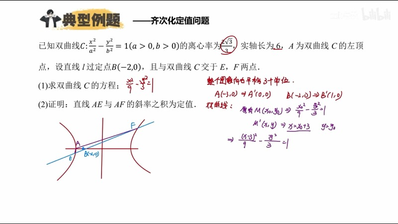
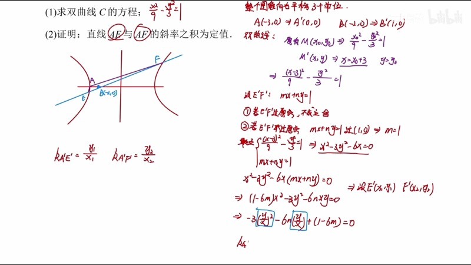
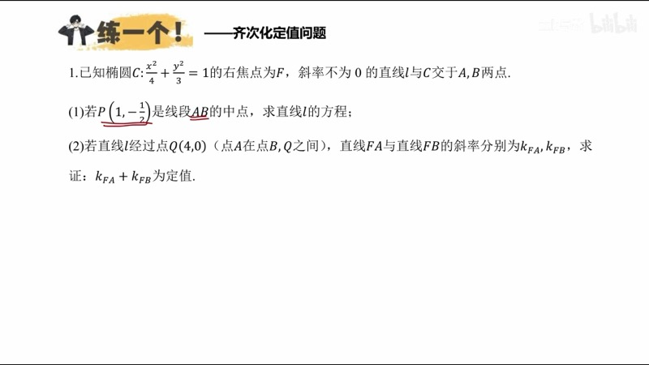
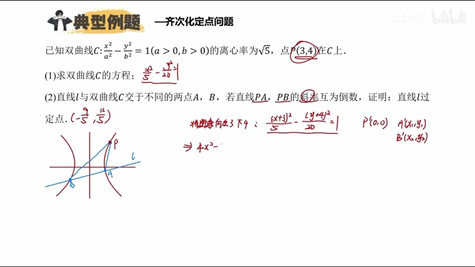

本课介绍齐次化（homogenization）这一强大的计算简化技巧。在圆锥曲线大题中，当我们需要求两条斜率之积 $k_1 k_2$ 或斜率之和 $k_1 + k_2$ 时，齐次化方法可以将复杂的韦达定理（Vieta's formulas）运算转化为关于 $\dfrac{y}{x}$ 的二次方程，直接利用韦达定理读取结果。

::: {.callout-note collapse="true"}
## 预备知识

- 椭圆（ellipse）与双曲线（hyperbola）的标准方程
- 直线的截距式（intercept form）：$mx + ny = 1$
- 韦达定理（Vieta's formulas）：根与系数的关系
- 相关点法（related point method）与平移变换
- 齐次多项式（homogeneous polynomial）的概念
:::

## 本课内容

- 齐次化的适用范围：一定两动（one fixed, two moving）的斜率问题
- 平移定点到原点的操作与"加点坐标"快捷方法
- 设截距式 $mx + ny = 1$ 并利用齐次化连立曲线
- 将方程化为关于 $\dfrac{y}{x}$ 的二次方程，用韦达定理直接读取 $k_1 + k_2$ 或 $k_1 k_2$
- 定值问题与定点问题的处理差异

## 课程视频

```{=html}
<div class="video-container">
  <iframe src="//player.bilibili.com/player.html?bvid=BV1GgZUYCEHu&page=5" title="齐次化简化计算" frameborder="0" scrolling="no" allowfullscreen></iframe>
</div>
```

## 课程关键帧









## 核心概念

### 一、齐次化的适用范围与基本思路

齐次化方法适用于**一定两动**（one fixed point, two moving points）的斜率问题。具体来说：

- 有一个**定点** $A$，两个**动点** $E$、$F$ 在圆锥曲线上
- 需要求 $k_{AE} \cdot k_{AF}$（斜率之积）或 $k_{AE} + k_{AF}$（斜率之和）是否为定值
- 也适用于 $\dfrac{1}{k_{AE}} + \dfrac{1}{k_{AF}}$ 等变形（通分后归结为积与和的问题）

::: {.callout-tip}
## 核心思想
如果定点 $A$ 在原点，则 $k_{AE} = \dfrac{y_1}{x_1}$，$k_{AF} = \dfrac{y_2}{x_2}$，计算大幅简化。因此我们首先**平移定点到原点**。
:::

### 二、齐次化操作步骤

**第一步：平移定点到原点。** 设定点为 $A(x_0, y_0)$，将整个图像平移使 $A$ 移到原点。曲线方程中用"加点坐标"法快速变换：将所有 $x$ 替换为 $x + x_0$，$y$ 替换为 $y + y_0$。

例如，要将 $A(-3, 0)$ 移到原点，双曲线 $\dfrac{x^2}{9} - \dfrac{y^2}{3} = 1$ 变为：

$$
\frac{(x-3)^2}{9} - \frac{y^2}{3} = 1
$$

**第二步：设截距式。** 设动点所在直线为 $mx + ny = 1$（截距式），并先讨论该直线是否过原点（若过原点则不满足题意，舍去）。将已知过定点的条件代入求出 $m$ 或 $m$ 与 $n$ 的关系。

**第三步：齐次化连立。** 将平移后的曲线方程展开化简，设其为：

$$
\alpha x^2 + \beta y^2 + \gamma x + \delta y + \varepsilon = 0
$$

其中二次项保持不变，一次项乘以 $(mx + ny)$（相当于乘以 $1$），常数项乘以 $(mx + ny)^2$，使所有项变为二次齐次式：

$$
\alpha x^2 + \beta y^2 + \gamma x(mx + ny) + \delta y(mx+ny) + \varepsilon(mx + ny)^2 = 0
$$

**第四步：除以 $x^2$，化为关于 $\dfrac{y}{x}$ 的二次方程。** 设 $t = \dfrac{y}{x}$，得到：

$$
At^2 + Bt + C = 0
$$

其中 $t_1 = \dfrac{y_1}{x_1} = k_{A'E'}$，$t_2 = \dfrac{y_2}{x_2} = k_{A'F'}$。由韦达定理直接读取：

$$
k_1 + k_2 = -\frac{B}{A}, \qquad k_1 \cdot k_2 = \frac{C}{A}
$$

由于平移不改变斜率，所以 $k_{AE} + k_{AF} = k_{A'E'} + k_{A'F'}$，$k_{AE} \cdot k_{AF} = k_{A'E'} \cdot k_{A'F'}$。

### 交互演示：齐次化变换过程（Desmos）

```{=html}
<div id="calc-homogenization" class="desmos-container"></div>
<script src="https://www.desmos.com/api/v1.9/calculator.js?apiKey=dcb31709b452b1cf9dc26972add0fda6"></script>
<script>
(function() {
  var elt = document.getElementById('calc-homogenization');
  var calc = Desmos.GraphingCalculator(elt, {
    expressions: true, settingsMenu: false, xAxisLabel: 'x', yAxisLabel: 'y'
  });
  // Original hyperbola: x^2/9 - y^2/3 = 1
  calc.setExpression({ id: 'hyp', latex: '\\frac{x^2}{9} - \\frac{y^2}{3} = 1', color: '#2d70b3', lineWidth: 2 });
  // Fixed point A(-3, 0)
  calc.setExpression({ id: 'A', latex: '(-3, 0)', color: '#c74440', pointSize: 12, label: 'A(-3,0)', showLabel: true });
  // Point B(-2, 0) through which line passes
  calc.setExpression({ id: 'B', latex: '(-2, 0)', color: '#6042a6', pointSize: 10, label: 'B(-2,0)', showLabel: true });
  // Parameter for line through B
  calc.setExpression({ id: 'k_line', latex: 'k_0 = 1.5', sliderBounds: { min: -5, max: 5, step: 0.1 } });
  calc.setExpression({ id: 'line_EF', latex: 'y = k_0(x + 2)', color: '#fa7e19', lineWidth: 1.5 });
  // Parametric point on hyperbola
  calc.setExpression({ id: 't1', latex: 't_1 = 0.8', sliderBounds: { min: 0.01, max: 3, step: 0.01 } });
  calc.setExpression({ id: 'E', latex: '(3\\cosh(t_1), \\sqrt{3}\\sinh(t_1))', color: '#388c46', pointSize: 10, label: 'E', showLabel: true });
  calc.setMathBounds({ left: -8, right: 8, bottom: -6, top: 6 });
})();
</script>
```

调节滑块 $k_0$ 改变过点 $B(-2,0)$ 的直线斜率，观察直线与双曲线的交点变化。

### D3 动画：齐次化变换步骤动画

```{=html}
<div class="d3-container" id="d3-homog-steps">
  <svg id="svg-homog-steps" width="600" height="420"></svg>
  <div class="d3-controls" id="controls-homog-steps">
    <button id="homog-step-btn">下一步</button>
    <button id="homog-reset-btn">重置</button>
    <span id="homog-step-label" style="margin-left:12px; font-size:15px; color:#333;">第 0 步：原始方程</span>
  </div>
</div>
<script src="https://d3js.org/d3.v7.min.js"></script>
<script>
(function() {
  var W = 600, H = 420, pad = 30;
  var svg = d3.select('#svg-homog-steps');
  svg.selectAll('*').remove();

  var steps = [
    { title: '第 0 步：原始方程', eq: 'x²/9 − y²/3 = 1，定点 A(−3, 0)', color: '#2d70b3' },
    { title: '第 1 步：平移定点到原点', eq: '(x−3)²/9 − y²/3 = 1\n展开: x² − 3y² − 6x = 0', color: '#388c46' },
    { title: '第 2 步：设截距式 mx+ny=1', eq: '直线 E′F′: mx + ny = 1\n过 B′(1,0) → m = 1', color: '#fa7e19' },
    { title: '第 3 步：齐次化', eq: 'x² − 3y² − 6x·(mx+ny) = 0\n→ (1−6m)x² − 3y² − 6nxy = 0', color: '#c74440' },
    { title: '第 4 步：除以 x²，化为 y/x 的方程', eq: '−3(y/x)² − 6n(y/x) + (1−6m) = 0\n韦达: k₁k₂ = (1−6m)/(−3)', color: '#6042a6' },
    { title: '第 5 步：代入 m=1，得定值', eq: 'k₁k₂ = (1−6)/(−3) = 5/3\n平移不改变斜率 → k_AE·k_AF = 5/3', color: '#000' }
  ];

  var currentStep = 0;

  var titleText = svg.append('text').attr('x', W/2).attr('y', 40).attr('text-anchor', 'middle')
    .attr('font-size', 17).attr('font-weight', 'bold').attr('fill', '#333');

  var eqGroup = svg.append('g').attr('transform', 'translate(' + W/2 + ',' + H/2 + ')');

  function renderStep(idx) {
    var s = steps[idx];
    titleText.text(s.title).attr('fill', s.color);
    eqGroup.selectAll('*').remove();
    var lines = s.eq.split('\n');
    lines.forEach(function(line, i) {
      eqGroup.append('text').text(line)
        .attr('x', 0).attr('y', i * 36 - (lines.length - 1) * 18)
        .attr('text-anchor', 'middle')
        .attr('font-size', 18).attr('font-family', "'KaTeX_Main', serif")
        .attr('fill', s.color)
        .attr('opacity', 0)
        .transition().duration(500).delay(i * 200).attr('opacity', 1);
    });
    d3.select('#homog-step-label').text(s.title);
  }

  // Draw step indicator circles
  var indicatorG = svg.append('g').attr('transform', 'translate(' + (W/2 - (steps.length-1)*25) + ',' + (H - 30) + ')');
  steps.forEach(function(s, i) {
    indicatorG.append('circle').attr('cx', i * 50).attr('cy', 0).attr('r', 8)
      .attr('fill', i === 0 ? '#2d70b3' : '#ddd').attr('stroke', '#999').attr('id', 'homog-ind-' + i);
  });

  function updateIndicators() {
    steps.forEach(function(s, i) {
      d3.select('#homog-ind-' + i).attr('fill', i <= currentStep ? steps[i].color : '#ddd');
    });
  }

  d3.select('#homog-step-btn').on('click', function() {
    if (currentStep < steps.length - 1) {
      currentStep++;
      renderStep(currentStep);
      updateIndicators();
    }
  });

  d3.select('#homog-reset-btn').on('click', function() {
    currentStep = 0;
    renderStep(currentStep);
    updateIndicators();
  });

  renderStep(0);
  updateIndicators();
})();
</script>
```

点击"下一步"按钮逐步查看齐次化变换的完整流程：从原始方程到平移、设截距式、齐次化、化为 $\dfrac{y}{x}$ 的方程，最后用韦达定理读取结果。

### 三、应用实例

**例 1（定值问题）**：椭圆 $\dfrac{x^2}{4} + \dfrac{y^2}{3} = 1$，$F(1,0)$ 为右焦点，直线 $l$ 过 $Q(4,0)$ 交椭圆于 $A$、$B$ 两点，求 $k_{FA} + k_{FB}$。

**解**：将 $F(1,0)$ 平移到原点，曲线变为 $\dfrac{(x+1)^2}{4} + \dfrac{y^2}{3} = 1$，展开得 $3x^2 + 4y^2 + 6x - 9 = 0$。

设 $A'B'$: $mx + ny = 1$，过 $Q'(3,0)$ 得 $m = \dfrac{1}{3}$。

齐次化：$3x^2 + 4y^2 + 6x(mx+ny) - 9(mx+ny)^2 = 0$，合并得：

$$
(3 + 6m - 9m^2)x^2 + (4 - 9n^2)y^2 + (6n - 18mn)xy = 0
$$

除以 $x^2$，韦达定理得：

$$
k_1 + k_2 = -\frac{6n - 18mn}{4 - 9n^2}
$$

代入 $m = \dfrac{1}{3}$，分子为 $6n - 6n = 0$，故 $k_{FA} + k_{FB} = 0$。

**例 2（定点问题）**：求出斜率关系后，需要将坐标**平移回去**。若在新坐标系中直线 $E'F'$ 过某点 $(x', y')$，则原坐标系中过 $(x' + x_0, y' + y_0)$。

### 交互演示：斜率之积/和的实时计算（Desmos）

```{=html}
<div id="calc-slope-product" class="desmos-container"></div>
<script>
(function() {
  var elt = document.getElementById('calc-slope-product');
  var calc = Desmos.GraphingCalculator(elt, {
    expressions: true, settingsMenu: false, xAxisLabel: 'x', yAxisLabel: 'y'
  });
  // Ellipse x^2/4 + y^2/3 = 1
  calc.setExpression({ id: 'ell', latex: '\\frac{x^2}{4} + \\frac{y^2}{3} = 1', color: '#2d70b3' });
  calc.setExpression({ id: 'F', latex: '(1, 0)', color: '#c74440', pointSize: 12, label: 'F(1,0)', showLabel: true });
  calc.setExpression({ id: 'Q', latex: '(4, 0)', color: '#6042a6', pointSize: 10, label: 'Q(4,0)', showLabel: true });
  calc.setExpression({ id: 'k_l', latex: 'k_l = 0.8', sliderBounds: { min: -3, max: 3, step: 0.05 } });
  calc.setExpression({ id: 'line_l', latex: 'y = k_l(x - 4)', color: '#fa7e19', lineWidth: 1.5 });
  calc.setMathBounds({ left: -5, right: 6, bottom: -4, top: 4 });
})();
</script>
```

调节滑块 $k_l$ 改变过点 $Q(4,0)$ 的直线斜率，观察直线与椭圆交点变化。无论斜率如何变化，$k_{FA} + k_{FB}$ 始终为 $0$。

### D3 动画：齐次方程中斜率之积/和的读取

```{=html}
<div class="d3-container" id="d3-homog-vieta">
  <svg id="svg-homog-vieta" width="600" height="380"></svg>
  <div class="d3-controls" id="controls-homog-vieta">
    <label>m = <input type="range" id="hv-slider-m" min="0.1" max="2" step="0.05" value="0.33"><span id="hv-val-m">0.33</span></label>
    <label>n = <input type="range" id="hv-slider-n" min="-2" max="2" step="0.05" value="0.5"><span id="hv-val-n">0.50</span></label>
  </div>
  <div id="hv-info" style="font-family: 'KaTeX_Main', serif; font-size: 15px; padding: 8px; background: #f8f8f8; border-radius: 6px; margin-top: 6px;"></div>
</div>
<script>
(function() {
  var W = 600, H = 380, margin = 50;
  var svg = d3.select('#svg-homog-vieta');
  svg.selectAll('*').remove();

  // Coefficients for the ellipse example: 3x^2 + 4y^2 + 6x - 9 = 0
  // After homogenization: (3+6m-9m^2)x^2 + (4-9n^2)y^2 + (6n-18mn)xy = 0
  // Divide by x^2: (4-9n^2)(y/x)^2 + (6n-18mn)(y/x) + (3+6m-9m^2) = 0

  var titleText = svg.append('text').attr('x', W/2).attr('y', 30)
    .attr('text-anchor', 'middle').attr('font-size', 16).attr('font-weight', 'bold').attr('fill', '#2d70b3')
    .text('齐次方程: A(y/x)² + B(y/x) + C = 0');

  var eqA = svg.append('text').attr('x', margin).attr('y', 70).attr('font-size', 15).attr('fill', '#333');
  var eqB = svg.append('text').attr('x', margin).attr('y', 100).attr('font-size', 15).attr('fill', '#333');
  var eqC = svg.append('text').attr('x', margin).attr('y', 130).attr('font-size', 15).attr('fill', '#333');

  var sumText = svg.append('text').attr('x', margin).attr('y', 180).attr('font-size', 18).attr('font-weight', 'bold');
  var prodText = svg.append('text').attr('x', margin).attr('y', 215).attr('font-size', 18).attr('font-weight', 'bold');

  // Visual: parabola graph of the equation in t = y/x
  var plotG = svg.append('g').attr('transform', 'translate(' + W/2 + ',' + 310 + ')');
  var plotW = 400, plotH = 120;
  plotG.append('line').attr('x1', -plotW/2).attr('y1', 0).attr('x2', plotW/2).attr('y2', 0).attr('stroke', '#999');
  plotG.append('line').attr('x1', 0).attr('y1', -plotH/2).attr('x2', 0).attr('y2', plotH/2).attr('stroke', '#999');
  plotG.append('text').text('t = y/x').attr('x', plotW/2 - 40).attr('y', -5).attr('font-size', 12).attr('fill', '#666');
  var curvePath = plotG.append('path').attr('fill', 'none').attr('stroke', '#c74440').attr('stroke-width', 2);
  var root1dot = plotG.append('circle').attr('r', 5).attr('fill', '#388c46');
  var root2dot = plotG.append('circle').attr('r', 5).attr('fill', '#388c46');
  var root1label = plotG.append('text').attr('font-size', 11).attr('fill', '#388c46');
  var root2label = plotG.append('text').attr('font-size', 11).attr('fill', '#388c46');

  function update() {
    var m = +d3.select('#hv-slider-m').property('value');
    var n = +d3.select('#hv-slider-n').property('value');
    d3.select('#hv-val-m').text(m.toFixed(2));
    d3.select('#hv-val-n').text(n.toFixed(2));

    var A = 4 - 9*n*n;
    var B = 6*n - 18*m*n;
    var C = 3 + 6*m - 9*m*m;

    eqA.text('A = 4 - 9n² = ' + A.toFixed(3));
    eqB.text('B = 6n - 18mn = ' + B.toFixed(3));
    eqC.text('C = 3 + 6m - 9m² = ' + C.toFixed(3));

    var sum_val = A !== 0 ? -B/A : NaN;
    var prod_val = A !== 0 ? C/A : NaN;

    sumText.text('k₁ + k₂ = -B/A = ' + (isNaN(sum_val) ? 'undefined' : sum_val.toFixed(4)))
      .attr('fill', '#2d70b3');
    prodText.text('k₁ · k₂ = C/A = ' + (isNaN(prod_val) ? 'undefined' : prod_val.toFixed(4)))
      .attr('fill', '#c74440');

    // Draw parabola At^2 + Bt + C
    var scaleX = plotW / 8;
    var scaleY = plotH / 20;
    var pts = [];
    for (var t = -4; t <= 4; t += 0.05) {
      var val = A*t*t + B*t + C;
      if (Math.abs(val) < 50) {
        pts.push([t * scaleX, -val * scaleY]);
      }
    }
    var line = d3.line().x(function(d){return d[0];}).y(function(d){return d[1];});
    curvePath.attr('d', line(pts));

    // Roots
    var disc = B*B - 4*A*C;
    if (disc >= 0 && A !== 0) {
      var r1 = (-B - Math.sqrt(disc)) / (2*A);
      var r2 = (-B + Math.sqrt(disc)) / (2*A);
      root1dot.attr('cx', r1*scaleX).attr('cy', 0).attr('visibility', 'visible');
      root2dot.attr('cx', r2*scaleX).attr('cy', 0).attr('visibility', 'visible');
      root1label.text('k₁=' + r1.toFixed(2)).attr('x', r1*scaleX - 15).attr('y', 18).attr('visibility', 'visible');
      root2label.text('k₂=' + r2.toFixed(2)).attr('x', r2*scaleX - 15).attr('y', 18).attr('visibility', 'visible');
    } else {
      root1dot.attr('visibility', 'hidden');
      root2dot.attr('visibility', 'hidden');
      root1label.attr('visibility', 'hidden');
      root2label.attr('visibility', 'hidden');
    }

    document.getElementById('hv-info').innerHTML =
      '齐次方程: ' + A.toFixed(2) + '·(y/x)² + ' + B.toFixed(2) + '·(y/x) + ' + C.toFixed(2) + ' = 0' +
      '<br>斜率之和 = ' + (isNaN(sum_val) ? '—' : sum_val.toFixed(4)) +
      ' &nbsp;&nbsp; 斜率之积 = ' + (isNaN(prod_val) ? '—' : prod_val.toFixed(4));
  }

  d3.select('#hv-slider-m').on('input', update);
  d3.select('#hv-slider-n').on('input', update);
  update();
})();
</script>
```

拖动滑块 $m$ 和 $n$ 观察齐次方程的系数变化。下方曲线展示了关于 $t = \dfrac{y}{x}$ 的二次函数图像，绿色点标记两个根 $k_1$、$k_2$，可直观验证韦达定理给出的和与积。

### 四、定值问题与定点问题的区别

| 问题类型 | 处理方式 |
|:---------|:---------|
| **定值问题** | 齐次化后直接用韦达定理读取 $k_1+k_2$ 或 $k_1 k_2$，平移不改变斜率，结果即为答案 |
| **定点问题** | 齐次化后得到 $m$、$n$ 的关系，写出截距式 $mx + ny = 1$，消参求交点，最后**平移回原坐标** |

::: {.callout-important}
## 定点问题的关键
在新坐标系中求出直线过定点 $(x', y')$ 后，必须加回平移量：原坐标系中的定点为 $(x' + x_0, y' + y_0)$。
:::

## 速查表

::: {.key-formula}

| 结论名称 | 公式 / 方法 | 适用条件 |
|:---------|:------------|:---------|
| 齐次化适用范围 | 一定两动的斜率之积/和问题 | $k_1 k_2$、$k_1 + k_2$、$\frac{1}{k_1}+\frac{1}{k_2}$ 等 |
| 平移定点到原点 | $x \to x + x_0$，$y \to y + y_0$（加点坐标） | 定点 $(x_0, y_0)$ |
| 设截距式 | $mx + ny = 1$，需先排除过原点的情况 | 为齐次化做准备 |
| 齐次化操作 | 一次项 $\times(mx+ny)$，常数项 $\times(mx+ny)^2$ | 使所有项变为二次 |
| 韦达定理读取 | $k_1+k_2 = -\dfrac{B}{A}$，$k_1 k_2 = \dfrac{C}{A}$ | $A\!\left(\frac{y}{x}\right)^2 + B\!\left(\frac{y}{x}\right) + C = 0$ |
| 定点问题还原 | 新坐标 $(x', y')$ → 原坐标 $(x'+x_0, y'+y_0)$ | 求过定点时需平移回去 |

:::
