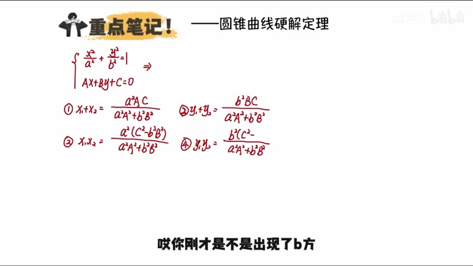
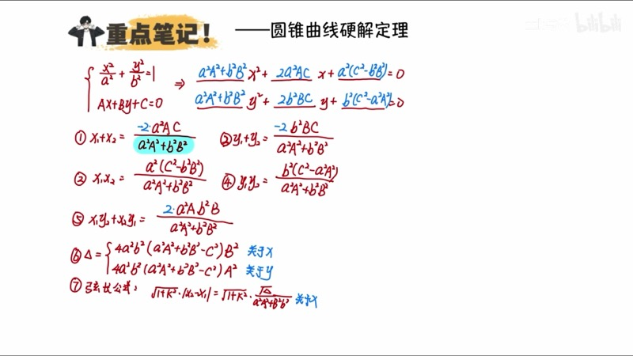
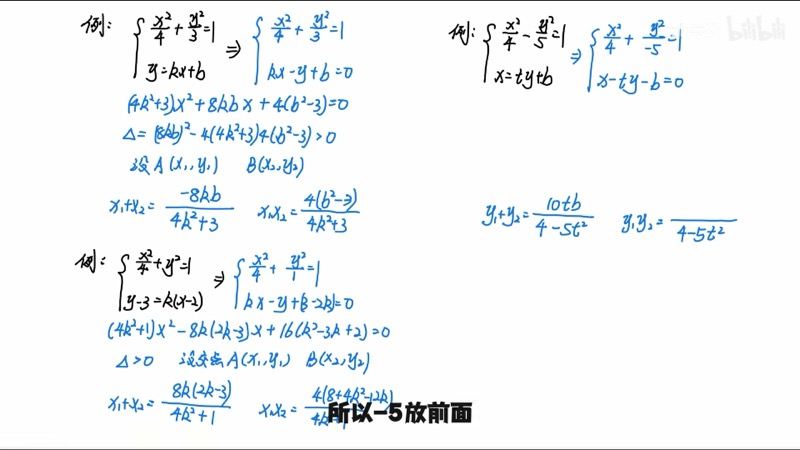
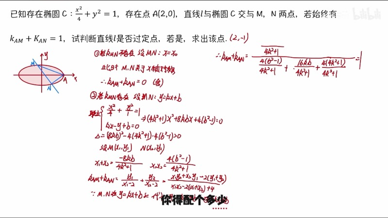

本课介绍硬解定理（hard-solve theorem），这是一种将圆锥曲线与直线联立后的韦达定理（Vieta's formulas）结果用参数直接表示的记忆方法。掌握硬解定理后，我们可以在答题卡上直接写出 $x_1 + x_2$、$x_1 x_2$、$y_1 + y_2$、$y_1 y_2$、$x_1 y_2 + x_2 y_1$ 以及联立方程，大幅节省计算时间。

::: {.callout-note collapse="true"}
## 预备知识

- 椭圆（ellipse）标准方程：$\dfrac{x^2}{a^2} + \dfrac{y^2}{b^2} = 1$
- 双曲线（hyperbola）标准方程：$\dfrac{x^2}{a^2} - \dfrac{y^2}{b^2} = 1$
- 韦达定理（Vieta's formulas）：$x_1 + x_2 = -\dfrac{B}{A}$，$x_1 x_2 = \dfrac{C}{A}$
- 弦长公式（chord length formula）：$|PQ| = \sqrt{1+k^2}\,|x_1 - x_2|$
- 判别式（discriminant）：$\Delta = B^2 - 4AC > 0$
:::

## 本课内容

- 硬解定理的核心思想：用位置参数直接表示联立结果
- 五个核心公式：$x_1+x_2$、$x_1 x_2$、$y_1+y_2$、$y_1 y_2$、$x_1 y_2 + x_2 y_1$
- 系数的记忆方法：将 $x_1$、$x_2$、$y_1$、$y_2$ 全部当做 $-1$ 来确定系数
- 分母统一为 $\mathscr{A}^2\mathscr{a}^2 + \mathscr{B}^2\mathscr{b}^2$
- 联立方程与弦长公式的快速书写
- 椭圆与双曲线的统一处理

## 课程视频

```{=html}
<div class="video-container">
  <iframe src="//player.bilibili.com/player.html?bvid=BV1GgZUYCEHu&page=6" title="硬解定理简化计算" frameborder="0" scrolling="no" allowfullscreen></iframe>
</div>
```

## 课程关键帧









## 核心概念

### 一、硬解定理的基本框架

设圆锥曲线 $\dfrac{x^2}{\mathscr{A}^2} + \dfrac{y^2}{\mathscr{B}^2} = 1$（椭圆取正号，双曲线在 $y^2$ 前取负号）与直线 $kx - y + c = 0$（即 $y = kx + c$）联立。

::: {.callout-tip}
## 关键约定
我们始终将曲线写成 $\dfrac{x^2}{\mathscr{A}^2} + \dfrac{y^2}{\mathscr{B}^2} = 1$ 的形式（双曲线中 $\mathscr{B}^2$ 为负数），直线写成一般式 $kx - y + c = 0$，其中 $k$ 对应 $x$ 的系数、$-1$ 对应 $y$ 的系数、$c$ 为常数项。**记忆的是位置，而非数值。**
:::

**统一分母**：所有韦达定理结果的分母均为

$$
\mathscr{A}^2 k^2 + \mathscr{B}^2 \cdot (-1)^2 = \mathscr{A}^2 k^2 + \mathscr{B}^2
$$

::: {.callout-important}
## 椭圆 vs 双曲线
- 椭圆：分母为 $\mathscr{A}^2 k^2 + \mathscr{B}^2$（加号）
- 双曲线：将 $\mathscr{B}^2$ 替换为负值后，分母变为减号形式
:::

### 二、五个核心公式

设直线与曲线交于 $A(x_1, y_1)$、$B(x_2, y_2)$。

**1. $x_1 + x_2$**（不要 $y$，保留 $\mathscr{A}^2$、$k$、$c$）：

$$
x_1 + x_2 = \frac{-2 \cdot \mathscr{A}^2 k c}{\mathscr{A}^2 k^2 + \mathscr{B}^2}
$$

系数 $-2$：将 $x_1$、$x_2$ 当做 $-1$，得 $(-1) + (-1) = -2$。

**2. $x_1 x_2$**（$x$ 在同一位置，取 $\mathscr{A}^2$，乘 $c^2$ 减另一半）：

$$
x_1 x_2 = \frac{\mathscr{A}^2(c^2 - \mathscr{B}^2)}{\mathscr{A}^2 k^2 + \mathscr{B}^2}
$$

系数 $1$：$(-1) \times (-1) = 1$。

**3. $y_1 + y_2$**（不要 $x$，保留 $\mathscr{B}^2$、$(-1)$、$c$）：

$$
y_1 + y_2 = \frac{-2 \cdot \mathscr{B}^2 \cdot (-1) \cdot c}{\mathscr{A}^2 k^2 + \mathscr{B}^2} = \frac{2\mathscr{B}^2 c}{\mathscr{A}^2 k^2 + \mathscr{B}^2}
$$

系数 $-2$：$(-1) + (-1) = -2$。

**4. $y_1 y_2$**（$y$ 在同一位置，取 $\mathscr{B}^2$，乘 $c^2$ 减另一半）：

$$
y_1 y_2 = \frac{\mathscr{B}^2(c^2 - \mathscr{A}^2 k^2)}{\mathscr{A}^2 k^2 + \mathscr{B}^2}
$$

系数 $1$：$(-1) \times (-1) = 1$。减的"另一半"是分母中不含 $\mathscr{B}^2$ 的那部分。

**5. $x_1 y_2 + x_2 y_1$**（四个位置全要：$\mathscr{A}^2$、$k$、$\mathscr{B}^2$、$(-1)$）：

$$
x_1 y_2 + x_2 y_1 = \frac{2 \cdot \mathscr{A}^2 k \cdot \mathscr{B}^2 \cdot (-1)}{\mathscr{A}^2 k^2 + \mathscr{B}^2} = \frac{-2\mathscr{A}^2 \mathscr{B}^2 k}{\mathscr{A}^2 k^2 + \mathscr{B}^2}
$$

系数 $2$：$(-1)(-1) + (-1)(-1) = 2$。

### 交互演示：硬解定理公式验证（Desmos）

```{=html}
<div id="calc-hard-solve" class="desmos-container"></div>
<script src="https://www.desmos.com/api/v1.9/calculator.js?apiKey=dcb31709b452b1cf9dc26972add0fda6"></script>
<script>
(function() {
  var elt = document.getElementById('calc-hard-solve');
  var calc = Desmos.GraphingCalculator(elt, {
    expressions: true, settingsMenu: false, xAxisLabel: 'x', yAxisLabel: 'y'
  });
  calc.setExpression({ id: 'ell', latex: '\\frac{x^2}{4} + \\frac{y^2}{3} = 1', color: '#2d70b3' });
  calc.setExpression({ id: 'k_val', latex: 'k_0 = 1', sliderBounds: { min: -3, max: 3, step: 0.1 } });
  calc.setExpression({ id: 'c_val', latex: 'c_0 = 0.5', sliderBounds: { min: -2, max: 2, step: 0.1 } });
  calc.setExpression({ id: 'line', latex: 'y = k_0 x + c_0', color: '#fa7e19', lineWidth: 2 });
  // Vieta results (displayed as labels)
  calc.setExpression({ id: 'denom', latex: 'd_0 = 4k_0^2 + 3' });
  calc.setExpression({ id: 'sum_x', latex: 's_x = \\frac{-2 \\cdot 4 \\cdot k_0 \\cdot c_0}{d_0}' });
  calc.setExpression({ id: 'prod_x', latex: 'p_x = \\frac{4(c_0^2 - 3)}{d_0}' });
  calc.setMathBounds({ left: -4, right: 4, bottom: -3, top: 3 });
})();
</script>
```

调节滑块 $k_0$ 和 $c_0$，观察直线与椭圆 $\dfrac{x^2}{4} + \dfrac{y^2}{3} = 1$ 的交点变化。Desmos 内部计算的 $s_x$（即 $x_1+x_2$）和 $p_x$（即 $x_1 x_2$）即为硬解定理公式的结果。

### D3 动画：硬解定理公式推导动画

```{=html}
<div class="d3-container" id="d3-hard-solve-derive">
  <svg id="svg-hard-solve-derive" width="600" height="400"></svg>
  <div class="d3-controls" id="controls-hard-solve-derive">
    <button id="hs-derive-next">下一步</button>
    <button id="hs-derive-reset">重置</button>
    <span id="hs-derive-label" style="margin-left:12px; font-size:14px; color:#555;"></span>
  </div>
</div>
<script src="https://d3js.org/d3.v7.min.js"></script>
<script>
(function() {
  var W = 600, H = 400;
  var svg = d3.select('#svg-hard-solve-derive');
  svg.selectAll('*').remove();

  var steps = [
    { title: '设定', lines: [
      '曲线: x²/A² + y²/B² = 1',
      '直线: kx − y + c = 0  (即 y = kx + c)'
    ], color: '#2d70b3' },
    { title: '代入联立', lines: [
      '将 y = kx + c 代入曲线方程:',
      'x²/A² + (kx+c)²/B² = 1'
    ], color: '#388c46' },
    { title: '展开整理', lines: [
      '(A²k² + B²)x² + 2A²kc·x + A²(c²−B²) = 0',
      '分母 = A²k² + B²'
    ], color: '#fa7e19' },
    { title: '韦达定理', lines: [
      'x₁+x₂ = −2A²kc / (A²k²+B²)',
      'x₁x₂ = A²(c²−B²) / (A²k²+B²)'
    ], color: '#c74440' },
    { title: '同理得 y 的结果', lines: [
      'y₁+y₂ = 2B²c / (A²k²+B²)',
      'y₁y₂ = B²(c²−A²k²) / (A²k²+B²)'
    ], color: '#6042a6' },
    { title: '交叉项', lines: [
      'x₁y₂+x₂y₁ = −2A²B²k / (A²k²+B²)',
      '系数记忆: (−1)(−1)+(−1)(−1) = 2'
    ], color: '#000' }
  ];

  var currentStep = 0;
  var titleText = svg.append('text').attr('x', W/2).attr('y', 35).attr('text-anchor', 'middle')
    .attr('font-size', 18).attr('font-weight', 'bold');
  var lineGroup = svg.append('g');

  // Step indicators
  var indG = svg.append('g').attr('transform', 'translate(' + (W/2 - (steps.length-1)*22) + ',' + (H-25) + ')');
  steps.forEach(function(s, i) {
    indG.append('circle').attr('cx', i*44).attr('cy', 0).attr('r', 7)
      .attr('fill', '#ddd').attr('stroke', '#aaa').attr('id', 'hs-ind-' + i);
  });

  function render(idx) {
    var s = steps[idx];
    titleText.text(s.title).attr('fill', s.color);
    lineGroup.selectAll('*').remove();
    s.lines.forEach(function(line, i) {
      lineGroup.append('text').text(line)
        .attr('x', W/2).attr('y', 100 + i * 45)
        .attr('text-anchor', 'middle')
        .attr('font-size', 16).attr('font-family', "'KaTeX_Main', serif")
        .attr('fill', s.color).attr('opacity', 0)
        .transition().duration(400).delay(i*200).attr('opacity', 1);
    });
    steps.forEach(function(_, i) {
      d3.select('#hs-ind-' + i).attr('fill', i <= idx ? steps[i].color : '#ddd');
    });
    d3.select('#hs-derive-label').text('(' + (idx+1) + '/' + steps.length + ')');
  }

  d3.select('#hs-derive-next').on('click', function() {
    if (currentStep < steps.length - 1) { currentStep++; render(currentStep); }
  });
  d3.select('#hs-derive-reset').on('click', function() {
    currentStep = 0; render(0);
  });

  render(0);
})();
</script>
```

点击"下一步"查看硬解定理从联立方程到韦达定理结果的完整推导过程。

### 三、联立方程与弦长公式的快速书写

联立后得到的关于 $x$ 的二次方程可以直接写出：

$$
(\mathscr{A}^2 k^2 + \mathscr{B}^2)\,x^2 + 2\mathscr{A}^2 kc\,x + \mathscr{A}^2(c^2 - \mathscr{B}^2) = 0
$$

::: {.callout-tip}
## 答题卡上的书写顺序
1. 写出曲线（统一形式）和直线（一般式）
2. **空两三行**留给联立方程和判别式
3. 直接写 $x_1+x_2$、$x_1 x_2$ 等韦达定理结果
4. 设交点 $A(x_1,y_1)$、$B(x_2,y_2)$
5. **回填**联立方程和 $\Delta > 0$
:::

**弦长公式**（chord length formula）：

$$
|AB| = \sqrt{1 + k^2} \cdot |x_1 - x_2| = \sqrt{1+k^2} \cdot \frac{\sqrt{\Delta}}{\mathscr{A}^2 k^2 + \mathscr{B}^2}
$$

其中 $\Delta$ 直接从联立方程中的 $B^2 - 4AC$ 计算即可，无需额外记忆。

### 交互演示：弦长公式与韦达的快速连接（Desmos）

```{=html}
<div id="calc-chord-length" class="desmos-container"></div>
<script>
(function() {
  var elt = document.getElementById('calc-chord-length');
  var calc = Desmos.GraphingCalculator(elt, {
    expressions: true, settingsMenu: false, xAxisLabel: 'x', yAxisLabel: 'y'
  });
  calc.setExpression({ id: 'ell', latex: '\\frac{x^2}{4} + y^2 = 1', color: '#2d70b3' });
  calc.setExpression({ id: 'k_val', latex: 'k_0 = 1', sliderBounds: { min: -4, max: 4, step: 0.1 } });
  calc.setExpression({ id: 'c_val', latex: 'c_0 = 0.3', sliderBounds: { min: -1.5, max: 1.5, step: 0.05 } });
  calc.setExpression({ id: 'line', latex: 'y = k_0 x + c_0', color: '#fa7e19', lineWidth: 2 });
  // Denominator
  calc.setExpression({ id: 'denom', latex: 'd_0 = 4 k_0^2 + 1' });
  // x1+x2, x1x2
  calc.setExpression({ id: 'sx', latex: 's_x = \\frac{-8 k_0 c_0}{d_0}' });
  calc.setExpression({ id: 'px', latex: 'p_x = \\frac{4(c_0^2 - 1)}{d_0}' });
  // |x1-x2|^2
  calc.setExpression({ id: 'diff_sq', latex: 'D = s_x^2 - 4p_x' });
  // chord length
  calc.setExpression({ id: 'chord', latex: 'L = \\sqrt{(1+k_0^2) \\cdot D}' });
  calc.setMathBounds({ left: -4, right: 4, bottom: -3, top: 3 });
})();
</script>
```

调节 $k_0$ 和 $c_0$ 观察弦长 $L$ 的变化。Desmos 内部使用硬解定理公式计算 $x_1+x_2$（$s_x$）和 $x_1 x_2$（$p_x$），再通过 $(x_1-x_2)^2 = (x_1+x_2)^2 - 4x_1 x_2$ 得到弦长。

### D3 动画：弦长公式与韦达的快速连接

```{=html}
<div class="d3-container" id="d3-chord-vieta">
  <svg id="svg-chord-vieta" width="600" height="400"></svg>
  <div class="d3-controls" id="controls-chord-vieta">
    <label>k = <input type="range" id="cv-slider-k" min="-3" max="3" step="0.1" value="1"><span id="cv-val-k">1.0</span></label>
    <label>c = <input type="range" id="cv-slider-c" min="-1.5" max="1.5" step="0.05" value="0.3"><span id="cv-val-c">0.3</span></label>
  </div>
  <div id="cv-info" style="font-family: 'KaTeX_Main', serif; font-size: 14px; padding: 8px; background: #f8f8f8; border-radius: 6px; margin-top: 6px;"></div>
</div>
<script>
(function() {
  var W = 600, H = 400, margin = 50;
  var svg = d3.select('#svg-chord-vieta');
  svg.selectAll('*').remove();

  // Ellipse: x^2/4 + y^2 = 1, a^2=4, b^2=1
  var A2 = 4, B2 = 1;
  var scX = (W - 2*margin) / 6, scY = (H - 2*margin) / 4;
  function toSVG(x, y) { return [W/2 + x*scX, H/2 - y*scY]; }

  // Draw axes
  svg.append('line').attr('x1', margin).attr('y1', H/2).attr('x2', W-margin).attr('y2', H/2).attr('stroke', '#ccc');
  svg.append('line').attr('x1', W/2).attr('y1', margin).attr('x2', W/2).attr('y2', H-margin).attr('stroke', '#ccc');

  // Ellipse path
  var ellPath = svg.append('path').attr('fill', 'none').attr('stroke', '#2d70b3').attr('stroke-width', 2);
  var pts = [];
  for (var i = 0; i <= 200; i++) {
    var th = 2*Math.PI*i/200;
    pts.push(toSVG(2*Math.cos(th), Math.sin(th)));
  }
  ellPath.attr('d', d3.line().x(function(d){return d[0];}).y(function(d){return d[1];})(pts));

  var linePath = svg.append('line').attr('stroke', '#fa7e19').attr('stroke-width', 2);
  var chordLine = svg.append('line').attr('stroke', '#c74440').attr('stroke-width', 3);
  var dotA = svg.append('circle').attr('r', 6).attr('fill', '#388c46');
  var dotB = svg.append('circle').attr('r', 6).attr('fill', '#388c46');
  var lblA = svg.append('text').text('A').attr('font-size', 13).attr('fill', '#388c46');
  var lblB = svg.append('text').text('B').attr('font-size', 13).attr('fill', '#388c46');

  function update() {
    var k = +d3.select('#cv-slider-k').property('value');
    var c = +d3.select('#cv-slider-c').property('value');
    d3.select('#cv-val-k').text(k.toFixed(1));
    d3.select('#cv-val-c').text(c.toFixed(2));

    var denom = A2*k*k + B2;
    var sumX = -2*A2*k*c / denom;
    var prodX = A2*(c*c - B2) / denom;
    var disc = sumX*sumX - 4*prodX;

    // Draw line from x=-3 to x=3
    var lp1 = toSVG(-3, k*(-3)+c), lp2 = toSVG(3, k*3+c);
    linePath.attr('x1', lp1[0]).attr('y1', lp1[1]).attr('x2', lp2[0]).attr('y2', lp2[1]);

    if (disc >= 0) {
      var x1 = (sumX - Math.sqrt(disc)) / 2;
      var x2 = (sumX + Math.sqrt(disc)) / 2;
      var y1 = k*x1+c, y2 = k*x2+c;
      var p1 = toSVG(x1, y1), p2 = toSVG(x2, y2);
      dotA.attr('cx', p1[0]).attr('cy', p1[1]).attr('visibility', 'visible');
      dotB.attr('cx', p2[0]).attr('cy', p2[1]).attr('visibility', 'visible');
      lblA.attr('x', p1[0]-15).attr('y', p1[1]-10).attr('visibility', 'visible');
      lblB.attr('x', p2[0]+8).attr('y', p2[1]-10).attr('visibility', 'visible');
      chordLine.attr('x1', p1[0]).attr('y1', p1[1]).attr('x2', p2[0]).attr('y2', p2[1]).attr('visibility', 'visible');

      var chordLen = Math.sqrt((1+k*k)*disc);
      document.getElementById('cv-info').innerHTML =
        '分母 = A²k² + B² = ' + denom.toFixed(3) +
        '<br>x₁+x₂ = ' + sumX.toFixed(4) + ' &nbsp; x₁x₂ = ' + prodX.toFixed(4) +
        '<br>(x₁−x₂)² = ' + disc.toFixed(4) +
        '<br><span style="color:#c74440">弦长 |AB| = √(1+k²)·|x₁−x₂| = ' + chordLen.toFixed(4) + '</span>';
    } else {
      dotA.attr('visibility', 'hidden');
      dotB.attr('visibility', 'hidden');
      lblA.attr('visibility', 'hidden');
      lblB.attr('visibility', 'hidden');
      chordLine.attr('visibility', 'hidden');
      document.getElementById('cv-info').innerHTML = '<span style="color:red">Δ < 0，直线与椭圆无交点</span>';
    }
  }

  d3.select('#cv-slider-k').on('input', update);
  d3.select('#cv-slider-c').on('input', update);
  update();
})();
</script>
```

拖动滑块调节直线 $y = kx + c$ 的参数，观察椭圆 $\dfrac{x^2}{4} + y^2 = 1$ 上交点 $A$、$B$ 及弦长的实时变化。红色线段显示弦长，下方信息面板展示硬解定理公式的计算结果。

### 四、椭圆与双曲线的统一处理

对于双曲线 $\dfrac{x^2}{\mathscr{A}^2} - \dfrac{y^2}{\mathscr{B}^2} = 1$，我们只需将其写成：

$$
\frac{x^2}{\mathscr{A}^2} + \frac{y^2}{-\mathscr{B}^2} = 1
$$

然后将 $-\mathscr{B}^2$ 作为"$\mathscr{B}^2$"的位置值代入所有公式即可。

::: {.callout-tip}
## 快速检验
- **椭圆**：分母 $= \mathscr{A}^2 k^2 + \mathscr{B}^2$，为**加号**
- **双曲线**：分母 $= \mathscr{A}^2 k^2 - \mathscr{B}^2$，为**减号**

如果你算出来的分母符号与此不符，说明计算有误。
:::

### 五、应用实例

**例**：椭圆 $\dfrac{x^2}{4} + y^2 = 1$，$A(2,0)$ 为右顶点，直线 $l$ 与椭圆交于 $M$、$N$ 两点，始终有 $k_{AM} + k_{AN} = 1$，判断 $l$ 是否过定点。

**解**：设 $l$: $y = kx + b$，即 $kx - y + b = 0$。

硬解定理直接写出（$\mathscr{A}^2 = 4$，$\mathscr{B}^2 = 1$）：

- 分母：$4k^2 + 1$
- $x_1 + x_2 = \dfrac{-8kb}{4k^2+1}$，$x_1 x_2 = \dfrac{4(b^2-1)}{4k^2+1}$
- $x_1 y_2 + x_2 y_1 = \dfrac{-8k}{4k^2+1}$，$y_1 + y_2 = \dfrac{2b}{4k^2+1}$

通分化简 $k_{AM} + k_{AN}$ 后，利用上述公式代入，最终因式分解得 $b = -2k - 1$，即 $l$: $y = k(x-2) - 1$，过定点 $(2, -1)$。

## 速查表

::: {.key-formula}

| 公式名称 | 表达式 | 记忆要点 |
|:---------|:-------|:---------|
| 统一分母 | $\mathscr{A}^2 k^2 + \mathscr{B}^2$ | 椭圆为加，双曲线为减 |
| $x_1 + x_2$ | $\dfrac{-2\mathscr{A}^2 kc}{\mathscr{A}^2 k^2 + \mathscr{B}^2}$ | 不要 $y$，系数 $-2$ |
| $x_1 x_2$ | $\dfrac{\mathscr{A}^2(c^2 - \mathscr{B}^2)}{\mathscr{A}^2 k^2 + \mathscr{B}^2}$ | 同位置取 $\mathscr{A}^2$，$c^2$ 减另一半 |
| $y_1 + y_2$ | $\dfrac{2\mathscr{B}^2 c}{\mathscr{A}^2 k^2 + \mathscr{B}^2}$ | 不要 $x$，系数 $-2$ |
| $y_1 y_2$ | $\dfrac{\mathscr{B}^2(c^2 - \mathscr{A}^2 k^2)}{\mathscr{A}^2 k^2 + \mathscr{B}^2}$ | 同位置取 $\mathscr{B}^2$，$c^2$ 减另一半 |
| $x_1 y_2 + x_2 y_1$ | $\dfrac{-2\mathscr{A}^2\mathscr{B}^2 k}{\mathscr{A}^2 k^2 + \mathscr{B}^2}$ | 四个位置全要，系数 $2$ |
| 弦长公式 | $\|AB\| = \sqrt{1+k^2} \cdot \dfrac{\sqrt{\Delta}}{\mathscr{A}^2 k^2 + \mathscr{B}^2}$ | $\Delta$ 从联立方程直接算 |

:::
