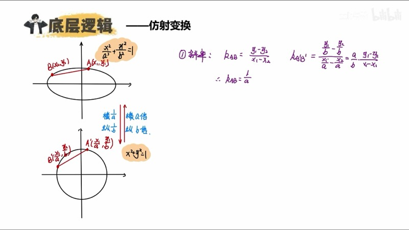
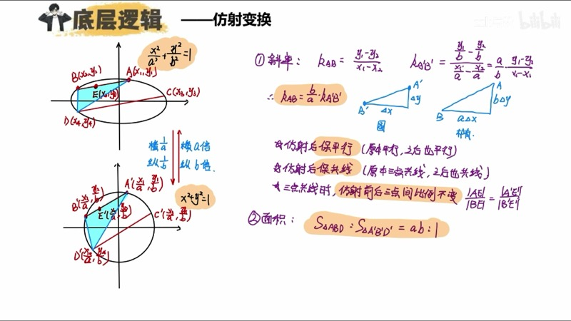
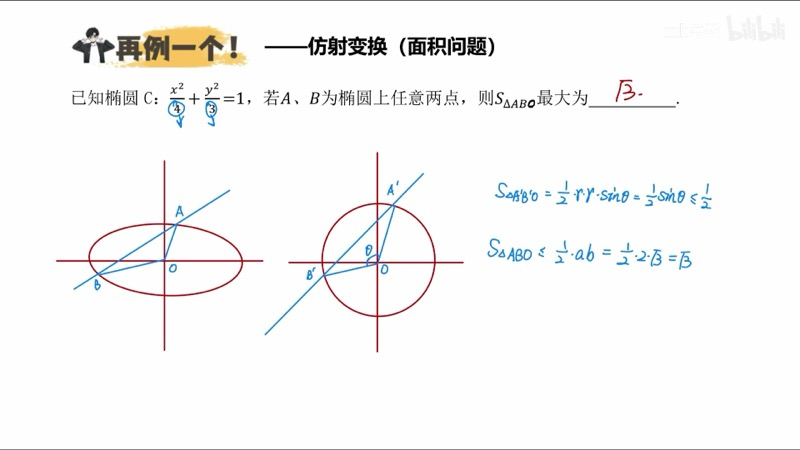
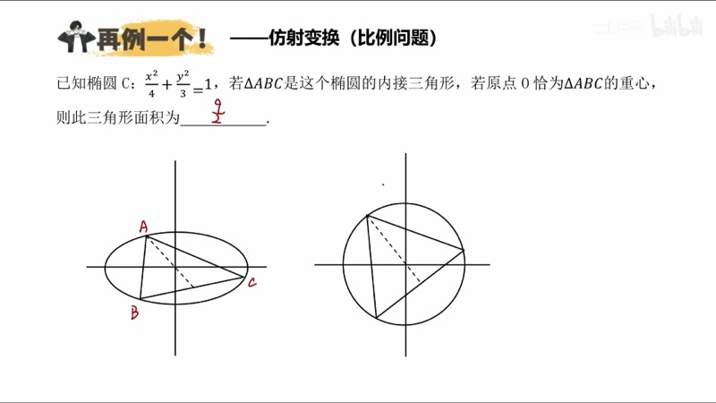

本课介绍仿射变换（affine transformation）在椭圆（ellipse）问题中的应用。通过将横坐标压缩为 $\dfrac{1}{a}$ 倍、纵坐标压缩为 $\dfrac{1}{b}$ 倍，我们可以将椭圆变换为单位圆（unit circle），从而利用圆的丰富性质快速解决斜率、面积和比例问题。

::: {.callout-note collapse="true"}
## 预备知识

- 椭圆标准方程：$\dfrac{x^2}{a^2} + \dfrac{y^2}{b^2} = 1\;(a > b > 0)$
- 圆的基本性质：直径所对圆周角为直角、垂径定理等
- 映射（mapping）的概念：一一对应
- 椭圆的垂径定理（perpendicular diameter theorem）：$k_{OE} \cdot k_{MN} = -\dfrac{b^2}{a^2}$
:::

## 本课内容

- 仿射变换的定义：椭圆 $\leftrightarrow$ 单位圆的坐标压缩映射
- 斜率变换关系：$k_{\text{椭圆}} = \dfrac{b}{a} \cdot k_{\text{圆}}$
- 仿射变换保平行（parallelism preserved）、保共线（collinearity preserved）、保比例（ratio preserved）
- 面积比 $S_{\text{椭圆}} : S_{\text{圆}} = ab : 1$
- 弦长（chord length）无法直接用仿射变换处理
- 应用场景：斜率问题、面积问题、比例问题

## 课程视频

```{=html}
<div class="video-container">
  <iframe src="//player.bilibili.com/player.html?bvid=BV1GgZUYCEHu&page=7" title="仿射变换" frameborder="0" scrolling="no" allowfullscreen></iframe>
</div>
```

## 课程关键帧









## 核心概念

### 一、仿射变换的定义

设椭圆方程为 $\dfrac{x^2}{a^2} + \dfrac{y^2}{b^2} = 1$。令：

$$
x' = \frac{x}{a}, \qquad y' = \frac{y}{b}
$$

则 $x'^2 + y'^2 = 1$，即变为**单位圆**。

椭圆上的点 $P(x_0, y_0)$ 对应圆上的点 $P'\!\left(\dfrac{x_0}{a}, \dfrac{y_0}{b}\right)$。

反过来，圆变回椭圆时：$x = ax'$，$y = by'$（横坐标扩大 $a$ 倍，纵坐标扩大 $b$ 倍）。

### 二、斜率变换关系（Slope Transformation）

设椭圆上两点 $A(x_1, y_1)$、$B(x_2, y_2)$ 对应圆上 $A'\!\left(\dfrac{x_1}{a}, \dfrac{y_1}{b}\right)$、$B'\!\left(\dfrac{x_2}{a}, \dfrac{y_2}{b}\right)$。

$$
k_{A'B'} = \frac{\frac{y_1}{b} - \frac{y_2}{b}}{\frac{x_1}{a} - \frac{x_2}{a}} = \frac{a}{b} \cdot \frac{y_1 - y_2}{x_1 - x_2} = \frac{a}{b} \cdot k_{AB}
$$

因此：

$$
\boxed{k_{\text{椭圆}} = \frac{b}{a} \cdot k_{\text{圆}}}
$$

::: {.callout-tip}
## 直观记忆
画一个斜率三角形：圆到椭圆时，$\Delta x$ 变为 $a\,\Delta x$，$\Delta y$ 变为 $b\,\Delta y$，所以斜率乘以 $\dfrac{b}{a}$。
:::

### 三、仿射变换的三大保持性质

| 性质 | 含义 | 原因 |
|:-----|:-----|:-----|
| **保平行** | 椭圆中平行 $\Leftrightarrow$ 圆中平行 | 所有斜率乘以相同倍数 $\dfrac{b}{a}$ |
| **保共线** | 三点共线关系不变 | 同一直线上的点仿射后斜率仍相等 |
| **保比例** | 共线三点的分比不变：$AE:EB = A'E':E'B'$ | 由保共线直接推出 |

### 交互演示：仿射变换——椭圆与圆的压缩映射（Desmos）

```{=html}
<div id="calc-affine" class="desmos-container"></div>
<script src="https://www.desmos.com/api/v1.9/calculator.js?apiKey=dcb31709b452b1cf9dc26972add0fda6"></script>
<script>
(function() {
  var elt = document.getElementById('calc-affine');
  var calc = Desmos.GraphingCalculator(elt, {
    expressions: true, settingsMenu: false, xAxisLabel: 'x', yAxisLabel: 'y'
  });
  // Ellipse
  calc.setExpression({ id: 'a_val', latex: 'a_0 = 3', sliderBounds: { min: 1.5, max: 5, step: 0.1 } });
  calc.setExpression({ id: 'b_val', latex: 'b_0 = 2', sliderBounds: { min: 0.5, max: 4, step: 0.1 } });
  calc.setExpression({ id: 'ell', latex: '\\frac{x^2}{a_0^2} + \\frac{y^2}{b_0^2} = 1', color: '#2d70b3', lineWidth: 2 });
  // Unit circle (shown offset for comparison)
  calc.setExpression({ id: 'circ', latex: 'x^2 + y^2 = 1', color: '#c74440', lineWidth: 2, lineStyle: 'DASHED' });
  // Point on ellipse
  calc.setExpression({ id: 't_val', latex: 't_0 = 1.0', sliderBounds: { min: 0, max: 6.28, step: 0.01 } });
  calc.setExpression({ id: 'P_ell', latex: '(a_0 \\cos(t_0), b_0 \\sin(t_0))', color: '#388c46', pointSize: 10, label: 'P(椭圆)', showLabel: true });
  calc.setExpression({ id: 'P_circ', latex: '(\\cos(t_0), \\sin(t_0))', color: '#c74440', pointSize: 10, label: "P'(圆)", showLabel: true });
  // Connecting dashed line
  calc.setExpression({ id: 'connect', latex: '(1-s)(\\cos(t_0), \\sin(t_0)) + s(a_0\\cos(t_0), b_0\\sin(t_0))', color: '#999', lineWidth: 1, lineStyle: 'DASHED', parametricDomain: {min:0, max:1} });
  calc.setMathBounds({ left: -6, right: 6, bottom: -4, top: 4 });
})();
</script>
```

调节滑块 $a_0$、$b_0$ 改变椭圆形状，拖动 $t_0$ 观察椭圆上的点 $P$ 与单位圆上对应点 $P'$ 的一一对应关系。虚线连接对应点。

### D3 动画：仿射变换动画——椭圆与圆的压缩映射

```{=html}
<div class="d3-container" id="d3-affine-anim">
  <svg id="svg-affine-anim" width="600" height="400"></svg>
  <div class="d3-controls" id="controls-affine-anim">
    <button id="affine-morph-btn">播放变换动画</button>
    <button id="affine-reset-btn">重置</button>
    <label>a = <input type="range" id="af-slider-a" min="1.5" max="4" step="0.1" value="3"><span id="af-val-a">3.0</span></label>
    <label>b = <input type="range" id="af-slider-b" min="0.5" max="3" step="0.1" value="2"><span id="af-val-b">2.0</span></label>
  </div>
</div>
<script src="https://d3js.org/d3.v7.min.js"></script>
<script>
(function() {
  var W = 600, H = 400, cx = W/2, cy = H/2;
  var svg = d3.select('#svg-affine-anim');
  svg.selectAll('*').remove();

  var a = 3, b = 2;
  var morphT = 1; // 1 = ellipse, 0 = circle

  var scale = 70;
  function toSVG(x, y) { return [cx + x*scale, cy - y*scale]; }

  // Axes
  svg.append('line').attr('x1',50).attr('y1',cy).attr('x2',W-50).attr('y2',cy).attr('stroke','#ddd');
  svg.append('line').attr('x1',cx).attr('y1',30).attr('x2',cx).attr('y2',H-30).attr('stroke','#ddd');

  var curvePath = svg.append('path').attr('fill','none').attr('stroke','#2d70b3').attr('stroke-width',2.5);

  // Three sample points and triangle
  var angles = [0.5, 2.0, 4.0];
  var triPath = svg.append('path').attr('fill','rgba(56,140,70,0.15)').attr('stroke','#388c46').attr('stroke-width',2);
  var dots = angles.map(function(_, i) {
    return svg.append('circle').attr('r', 6).attr('fill', ['#c74440','#6042a6','#fa7e19'][i]);
  });
  var labels = ['A','B','C'];
  var lbls = angles.map(function(_, i) {
    return svg.append('text').text(labels[i]).attr('font-size', 14).attr('fill', ['#c74440','#6042a6','#fa7e19'][i]);
  });

  var titleText = svg.append('text').attr('x', cx).attr('y', 25).attr('text-anchor','middle')
    .attr('font-size', 16).attr('font-weight','bold').attr('fill','#2d70b3');

  function draw(t) {
    // t=1 -> ellipse, t=0 -> circle
    var ra = 1 + (a - 1) * t;
    var rb = 1 + (b - 1) * t;

    // Curve
    var pts = [];
    for (var i = 0; i <= 200; i++) {
      var th = 2*Math.PI*i/200;
      pts.push(toSVG(ra*Math.cos(th), rb*Math.sin(th)));
    }
    curvePath.attr('d', d3.line().x(function(d){return d[0];}).y(function(d){return d[1];})(pts));

    // Points
    var triPts = angles.map(function(ang) { return toSVG(ra*Math.cos(ang), rb*Math.sin(ang)); });
    triPath.attr('d', 'M'+triPts[0][0]+','+triPts[0][1]+' L'+triPts[1][0]+','+triPts[1][1]+' L'+triPts[2][0]+','+triPts[2][1]+' Z');

    triPts.forEach(function(p, i) {
      dots[i].attr('cx', p[0]).attr('cy', p[1]);
      lbls[i].attr('x', p[0]+10).attr('y', p[1]-8);
    });

    if (t > 0.5) {
      titleText.text('椭圆 (a=' + ra.toFixed(1) + ', b=' + rb.toFixed(1) + ')');
    } else {
      titleText.text('单位圆 (r=1)');
    }
  }

  var animating = false;
  d3.select('#affine-morph-btn').on('click', function() {
    if (animating) return;
    animating = true;
    var startT = morphT;
    var endT = startT > 0.5 ? 0 : 1;
    var dur = 1500;
    var t0 = Date.now();
    function step() {
      var elapsed = Date.now() - t0;
      var frac = Math.min(elapsed / dur, 1);
      var eased = frac * frac * (3 - 2 * frac); // smoothstep
      morphT = startT + (endT - startT) * eased;
      draw(morphT);
      if (frac < 1) requestAnimationFrame(step);
      else animating = false;
    }
    step();
  });

  d3.select('#affine-reset-btn').on('click', function() {
    morphT = 1;
    a = +d3.select('#af-slider-a').property('value');
    b = +d3.select('#af-slider-b').property('value');
    draw(1);
  });

  d3.select('#af-slider-a').on('input', function() {
    a = +this.value; d3.select('#af-val-a').text(a.toFixed(1));
    if (b >= a) { b = a - 0.1; d3.select('#af-slider-b').property('value', b); d3.select('#af-val-b').text(b.toFixed(1)); }
    morphT = 1; draw(1);
  });
  d3.select('#af-slider-b').on('input', function() {
    b = +this.value;
    if (b >= a) { b = a - 0.1; d3.select('#af-slider-b').property('value', b); }
    d3.select('#af-val-b').text(b.toFixed(1));
    morphT = 1; draw(1);
  });

  draw(1);
})();
</script>
```

点击"播放变换动画"按钮观察椭圆平滑地压缩为单位圆（或反向扩展）。三角形 $ABC$ 在变换过程中保持共线、保持顶点比例关系，但形状会改变——这就是仿射变换的直观体现。

### 四、面积比（Area Ratio）

仿射变换前后，**任何封闭图形的面积之比**为：

$$
\boxed{\frac{S_{\text{椭圆中的图形}}}{S_{\text{圆中的图形}}} = ab}
$$

**证明**：将图形沿平行于坐标轴的方向分割为小三角形。每个三角形的底（平行于 $x$ 轴）变为 $a$ 倍，高（平行于 $y$ 轴）变为 $b$ 倍，面积变为 $ab$ 倍。所有三角形求和后，总面积比仍为 $ab : 1$。

::: {.callout-note}
## 椭圆面积公式
单位圆面积 $= \pi$，所以 $S_{\text{椭圆}} = \pi ab$。
:::

### 五、弦长问题的限制

仿射变换**不能**直接用于求弦长之比。设圆中弦长为 $\sqrt{\Delta x^2 + \Delta y^2}$，变换后为 $\sqrt{a^2\Delta x^2 + b^2 \Delta y^2}$，无法提取统一的比例因子。

$$
|AB|_{\text{椭圆}} = \sqrt{a^2 \Delta x^2 + b^2 \Delta y^2} \neq \text{const} \cdot |A'B'|_{\text{圆}}
$$

::: {.callout-warning}
## 弦长无法用仿射变换
只有平行于 $x$ 轴的长度比为 $a:1$，平行于 $y$ 轴的长度比为 $b:1$。斜向弦长没有固定比例关系。
:::

### 交互演示：圆中结论到椭圆结论的对应（Desmos）

```{=html}
<div id="calc-affine-slope" class="desmos-container"></div>
<script>
(function() {
  var elt = document.getElementById('calc-affine-slope');
  var calc = Desmos.GraphingCalculator(elt, {
    expressions: true, settingsMenu: false, xAxisLabel: 'x', yAxisLabel: 'y'
  });
  // Ellipse
  calc.setExpression({ id: 'ell', latex: '\\frac{x^2}{4} + \\frac{y^2}{3} = 1', color: '#2d70b3' });
  // Chord through origin
  calc.setExpression({ id: 'k_ch', latex: 'k_c = 0.8', sliderBounds: { min: -3, max: 3, step: 0.05 } });
  calc.setExpression({ id: 'chord', latex: 'y = k_c x', color: '#fa7e19', lineWidth: 2 });
  // Midpoint and OM line
  calc.setExpression({ id: 't1', latex: 't_1 = 1.5', sliderBounds: { min: 0.1, max: 3, step: 0.01 } });
  calc.setExpression({ id: 'Mx', latex: 'M_x = 2\\cos(t_1)' });
  calc.setExpression({ id: 'My', latex: 'M_y = \\sqrt{3}\\sin(t_1)' });
  calc.setExpression({ id: 'M', latex: '(M_x, M_y)', color: '#388c46', pointSize: 10, label: 'M', showLabel: true });
  calc.setExpression({ id: 'N', latex: '(-M_x, -M_y)', color: '#388c46', pointSize: 10, label: 'N', showLabel: true });
  // Midpoint E
  calc.setExpression({ id: 'E', latex: '(0, 0)', color: '#c74440', pointSize: 8, label: 'O', showLabel: true });
  // k_MN * k_OE visual
  calc.setExpression({ id: 'lineMN', latex: 'y - M_y = \\frac{M_y - (-M_y)}{M_x - (-M_x)}(x - M_x)', color: '#6042a6', lineWidth: 1.5 });
  calc.setMathBounds({ left: -5, right: 5, bottom: -4, top: 4 });
})();
</script>
```

拖动 $t_1$ 改变弦 $MN$ 的位置。由椭圆垂径定理（通过仿射变换从圆的垂径定理得到），$k_{OE} \cdot k_{MN} = -\dfrac{b^2}{a^2} = -\dfrac{3}{4}$ 始终成立。

### D3 动画：圆中结论到椭圆结论的对应

```{=html}
<div class="d3-container" id="d3-circle-to-ellipse">
  <svg id="svg-circle-to-ellipse" width="600" height="400"></svg>
  <div class="d3-controls" id="controls-circle-to-ellipse">
    <label>角度 θ = <input type="range" id="c2e-slider-t" min="0.2" max="3" step="0.02" value="1.2"><span id="c2e-val-t">1.20</span></label>
  </div>
  <div id="c2e-info" style="font-family: 'KaTeX_Main', serif; font-size: 14px; padding: 8px; background: #f8f8f8; border-radius: 6px; margin-top: 6px;"></div>
</div>
<script>
(function() {
  var W = 600, H = 400;
  var svg = d3.select('#svg-circle-to-ellipse');
  svg.selectAll('*').remove();

  var a = 2, b = Math.sqrt(3);
  // Left panel: circle, Right panel: ellipse
  var cxL = 160, cxR = 440, cy = 200, sc = 90;

  // Titles
  svg.append('text').text('单位圆').attr('x', cxL).attr('y', 25).attr('text-anchor','middle').attr('font-size',15).attr('font-weight','bold').attr('fill','#c74440');
  svg.append('text').text('椭圆').attr('x', cxR).attr('y', 25).attr('text-anchor','middle').attr('font-size',15).attr('font-weight','bold').attr('fill','#2d70b3');
  svg.append('text').text('→ 仿射 →').attr('x', W/2).attr('y', cy+5).attr('text-anchor','middle').attr('font-size',14).attr('fill','#666');

  // Draw circle
  svg.append('circle').attr('cx', cxL).attr('cy', cy).attr('r', sc).attr('fill','none').attr('stroke','#c74440').attr('stroke-width',2);
  // Draw ellipse
  svg.append('ellipse').attr('cx', cxR).attr('cy', cy).attr('rx', a*sc/2).attr('ry', b*sc/2).attr('fill','none').attr('stroke','#2d70b3').attr('stroke-width',2);

  // Points on circle
  var dotAc = svg.append('circle').attr('r',5).attr('fill','#388c46');
  var dotBc = svg.append('circle').attr('r',5).attr('fill','#388c46');
  var lineABc = svg.append('line').attr('stroke','#fa7e19').attr('stroke-width',1.5);
  var lineMidOc = svg.append('line').attr('stroke','#6042a6').attr('stroke-width',1.5).attr('stroke-dasharray','4,3');
  var dotMc = svg.append('circle').attr('r',4).attr('fill','#6042a6');

  // Points on ellipse
  var dotAe = svg.append('circle').attr('r',5).attr('fill','#388c46');
  var dotBe = svg.append('circle').attr('r',5).attr('fill','#388c46');
  var lineABe = svg.append('line').attr('stroke','#fa7e19').attr('stroke-width',1.5);
  var lineMidOe = svg.append('line').attr('stroke','#6042a6').attr('stroke-width',1.5).attr('stroke-dasharray','4,3');
  var dotMe = svg.append('circle').attr('r',4).attr('fill','#6042a6');

  function update() {
    var t = +d3.select('#c2e-slider-t').property('value');
    d3.select('#c2e-val-t').text(t.toFixed(2));

    // Circle points: A'(cos t, sin t), B'(-cos t, -sin t) = diameter
    var ax = Math.cos(t), ay = Math.sin(t);

    // On circle: pick a chord, show midpoint and perpendicularity
    // Chord: A'B' as diameter, pick another point P'
    var pt = t + 1.2;
    var px = Math.cos(pt), py = Math.sin(pt);
    var qx = -px, qy = -py; // Q' is opposite

    // Midpoint of PQ on circle
    var mx = (px+qx)/2, my = (py+qy)/2; // = (0,0) since diameter

    // Use non-diametric chord instead
    var t2 = t + 0.8;
    var p1x = Math.cos(t), p1y = Math.sin(t);
    var p2x = Math.cos(t2), p2y = Math.sin(t2);
    var midx = (p1x+p2x)/2, midy = (p1y+p2y)/2;

    // Circle display
    dotAc.attr('cx', cxL + p1x*sc).attr('cy', cy - p1y*sc);
    dotBc.attr('cx', cxL + p2x*sc).attr('cy', cy - p2y*sc);
    lineABc.attr('x1', cxL+p1x*sc).attr('y1', cy-p1y*sc).attr('x2', cxL+p2x*sc).attr('y2', cy-p2y*sc);
    dotMc.attr('cx', cxL + midx*sc).attr('cy', cy - midy*sc);
    lineMidOc.attr('x1', cxL).attr('y1', cy).attr('x2', cxL+midx*sc).attr('y2', cy-midy*sc);

    // Ellipse: scale by (a, b)
    var ep1x = a*p1x, ep1y = b*p1y;
    var ep2x = a*p2x, ep2y = b*p2y;
    var emx = (ep1x+ep2x)/2, emy = (ep1y+ep2y)/2;
    var escX = sc/2, escY = sc/2;

    dotAe.attr('cx', cxR + ep1x*escX).attr('cy', cy - ep1y*escY);
    dotBe.attr('cx', cxR + ep2x*escX).attr('cy', cy - ep2y*escY);
    lineABe.attr('x1', cxR+ep1x*escX).attr('y1', cy-ep1y*escY).attr('x2', cxR+ep2x*escX).attr('y2', cy-ep2y*escY);
    dotMe.attr('cx', cxR + emx*escX).attr('cy', cy - emy*escY);
    lineMidOe.attr('x1', cxR).attr('y1', cy).attr('x2', cxR+emx*escX).attr('y2', cy-emy*escY);

    // Slopes
    var kABc = (p2y - p1y) / (p2x - p1x);
    var kOMc = midy / midx;
    var kABe = (ep2y - ep1y) / (ep2x - ep1x);
    var kOMe = emy / emx;

    document.getElementById('c2e-info').innerHTML =
      '<b>圆中:</b> k<sub>A\'B\'</sub> = ' + kABc.toFixed(3) +
      ', k<sub>O\'M\'</sub> = ' + kOMc.toFixed(3) +
      ', 乘积 = ' + (kABc*kOMc).toFixed(3) + ' (应为 −1)' +
      '<br><b>椭圆中:</b> k<sub>AB</sub> = ' + kABe.toFixed(3) +
      ', k<sub>OM</sub> = ' + kOMe.toFixed(3) +
      ', 乘积 = ' + (kABe*kOMe).toFixed(3) + ' (应为 −b²/a² = ' + (-b*b/(a*a)).toFixed(3) + ')';
  }

  d3.select('#c2e-slider-t').on('input', update);
  update();
})();
</script>
```

拖动滑块改变弦的位置。左侧圆中 $k_{A'B'} \cdot k_{O'M'} = -1$（垂径定理），右侧椭圆中对应为 $k_{AB} \cdot k_{OM} = -\dfrac{b^2}{a^2}$。两条斜率各乘以 $\dfrac{b}{a}$，乘积变为原来的 $\dfrac{b^2}{a^2}$ 倍。

### 六、应用场景总结

**可以用仿射变换的问题**：

1. **斜率问题**：椭圆的第三定义（$k_{PA} \cdot k_{PB} = -\dfrac{b^2}{a^2}$）直接由圆中直径所对圆周角为直角得到
2. **垂径定理**：$k_{OE} \cdot k_{MN} = -\dfrac{b^2}{a^2}$ 由圆的垂径定理得到
3. **面积问题**：椭圆内图形面积 $= ab \times$ 对应圆内图形面积
4. **比例问题**：中点、重心等比例关系在仿射后不变

**不能用仿射变换的问题**：

- **弦长问题**：斜向弦长没有固定比例关系

## 速查表

::: {.key-formula}

| 结论名称 | 圆中结论 | 椭圆中结论 | 变换关系 |
|:---------|:---------|:-----------|:---------|
| 坐标映射 | $(x', y')$ | $(ax', by')$ | $x = ax'$，$y = by'$ |
| 斜率关系 | $k'$ | $k = \dfrac{b}{a} k'$ | 圆→椭圆乘 $\dfrac{b}{a}$ |
| 直径对角 | $k_1' \cdot k_2' = -1$ | $k_1 \cdot k_2 = -\dfrac{b^2}{a^2}$ | 第三定义 |
| 垂径定理 | $k_{OM}' \cdot k_{AB}' = -1$ | $k_{OM} \cdot k_{AB} = -\dfrac{b^2}{a^2}$ | 椭圆垂径定理 |
| 面积比 | $S'$ | $S = ab \cdot S'$ | 任何封闭图形 |
| 椭圆面积 | $\pi r^2 = \pi$ | $S = \pi ab$ | 单位圆 $\to$ 椭圆 |
| 保平行 | 平行 | 仍平行 | 斜率同乘 $\dfrac{b}{a}$ |
| 保比例 | $AE:EB$ | $= A'E':E'B'$ | 共线三点比不变 |
| 弦长 | — | **无法使用** | 斜向弦无固定比例 |

:::
