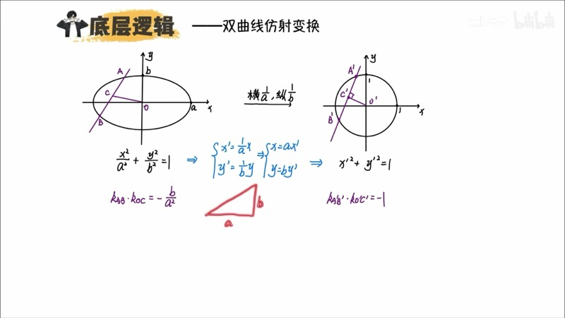
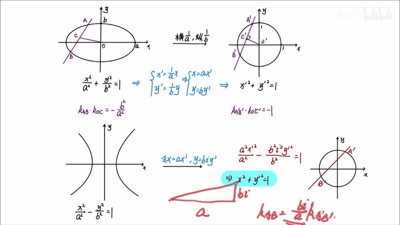
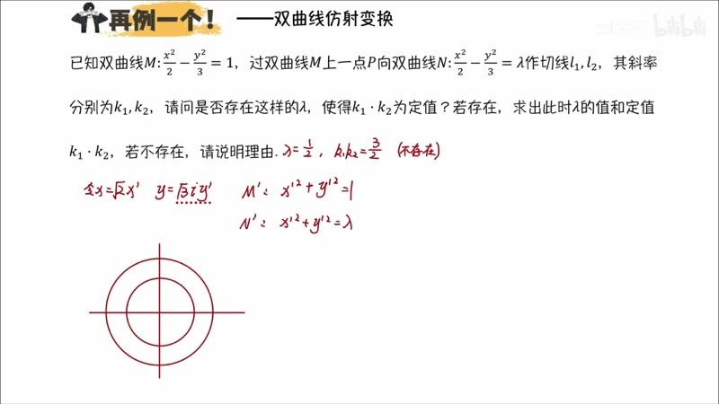
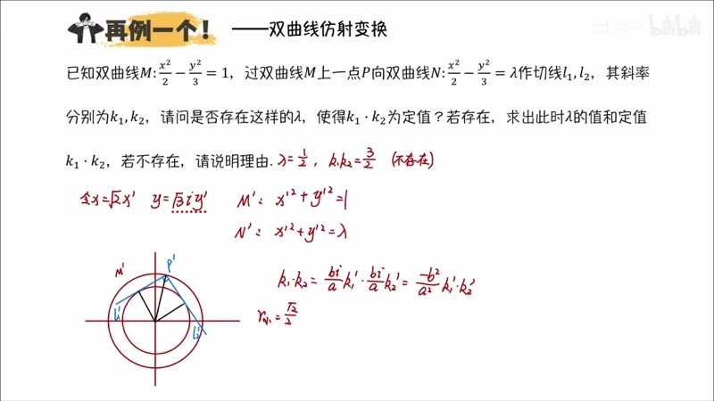

本课将仿射变换（affine transformation）的思路从椭圆（ellipse）推广到双曲线（hyperbola）。由于双曲线方程中含有负号，我们无法直接通过实数伸缩将其变为圆。但通过引入虚数单位 $i$，令 $y = bi \cdot y'$，可以在形式上将双曲线化为单位圆，从而利用圆的性质快速求解斜率之积等问题。

::: {.callout-note collapse="true"}
## 预备知识

- 双曲线标准方程：$\dfrac{x^2}{a^2} - \dfrac{y^2}{b^2} = 1$
- 复数（complex number）的基本概念：$i^2 = -1$
- 椭圆仿射变换的基本原理（第十七课）
- 圆的垂径定理（perpendicular diameter theorem）
- 切线的基本性质
:::

## 本课内容

- 双曲线仿射变换的代数原理：$x = ax'$，$y = bi \cdot y'$ 使得 $x'^2 + y'^2 = 1$
- 双曲线中的垂径定理：$k_{OC} \cdot k_{AB} = \dfrac{b^2}{a^2}$（注意正号）
- 斜率之积的变换：$k_1 \cdot k_2 = \dfrac{a^2}{-b^2} \cdot k_1' \cdot k_2'$（两个 $\dfrac{b}{a} \cdot i$ 的乘积消去虚部）
- 实际应用与限制：理论可行但需验证几何意义的存在性

## 课程视频

```{=html}
<div class="video-container">
  <iframe src="//player.bilibili.com/player.html?bvid=BV1GgZUYCEHu&page=8" title="双曲线仿射变换" frameborder="0" scrolling="no" allowfullscreen></iframe>
</div>
```

## 课程关键帧









## 核心概念

### 一、双曲线仿射变换的代数原理

对于椭圆 $\dfrac{x^2}{a^2} + \dfrac{y^2}{b^2} = 1$，令 $x = ax'$，$y = by'$ 即可化为单位圆 $x'^2 + y'^2 = 1$。

对于双曲线 $\dfrac{x^2}{a^2} - \dfrac{y^2}{b^2} = 1$，由于减号的存在，直接令 $y = by'$ 会得到 $x'^2 - y'^2 = 1$（等轴双曲线），而非圆。

**关键思路**：令 $y = bi \cdot y'$（引入虚数单位 $i$），则：

$$
\frac{x'^2 \cdot a^2}{a^2} - \frac{(bi \cdot y')^2}{b^2} = x'^2 - \frac{b^2 i^2 y'^2}{b^2} = x'^2 - i^2 y'^2 = x'^2 + y'^2 = 1
$$

因此，双曲线在形式上也可以化为单位圆。

::: {.callout-warning}
## 注意
这里的"单位圆"是形式上的。$y = bi \cdot y'$ 中的 $i$ 意味着我们不能对单条直线的斜率赋予直接的几何含义。但是，当我们计算**两条斜率的乘积**时，$i^2 = -1$ 会消去虚部，得到实数结果。
:::

### 二、双曲线中的斜率变换

在双曲线仿射中，圆到双曲线的坐标变换为：$x = ax'$，$y = bi \cdot y'$。

对于圆上的一条直线，斜率为 $k' = \dfrac{\Delta y'}{\Delta x'}$。对应到双曲线中：

$$
k = \frac{bi \cdot \Delta y'}{a \cdot \Delta x'} = \frac{bi}{a} \cdot k'
$$

单条直线的斜率含有虚数 $i$，没有直接的几何意义。但对于**两条直线斜率的乘积**：

$$
k_1 \cdot k_2 = \frac{bi}{a} \cdot k_1' \cdot \frac{bi}{a} \cdot k_2' = \frac{b^2 i^2}{a^2} \cdot k_1' k_2' = -\frac{b^2}{a^2} \cdot k_1' k_2'
$$

这是一个实数！因此双曲线仿射变换主要用于求解**斜率之积**是否为定值的问题。

### 三、双曲线垂径定理

在圆中，弦 $A'B'$ 的中点 $C'$ 与圆心 $O$ 的连线满足 $k_{A'B'} \cdot k_{O'C'} = -1$。

通过双曲线仿射变换：

$$
k_{AB} \cdot k_{OC} = -\frac{b^2}{a^2} \cdot (-1) = \frac{b^2}{a^2}
$$

::: {.callout-important}
## 椭圆 vs 双曲线的垂径定理
- **椭圆**：$k_{AB} \cdot k_{OC} = -\dfrac{b^2}{a^2}$（负号）
- **双曲线**：$k_{AB} \cdot k_{OC} = +\dfrac{b^2}{a^2}$（正号）

双曲线多出的正号来源于 $i^2 = -1$ 的效应。
:::

### 交互演示：等轴双曲线到一般双曲线的仿射（Desmos）

```{=html}
<div id="calc-hyp-affine" class="desmos-container"></div>
<script src="https://www.desmos.com/api/v1.9/calculator.js?apiKey=dcb31709b452b1cf9dc26972add0fda6"></script>
<script>
(function() {
  var elt = document.getElementById('calc-hyp-affine');
  var calc = Desmos.GraphingCalculator(elt, {
    expressions: true, settingsMenu: false, xAxisLabel: 'x', yAxisLabel: 'y'
  });
  calc.setExpression({ id: 'a_val', latex: 'a_0 = \\sqrt{2}', sliderBounds: { min: 1, max: 3, step: 0.1 } });
  calc.setExpression({ id: 'b_val', latex: 'b_0 = \\sqrt{3}', sliderBounds: { min: 1, max: 3, step: 0.1 } });
  calc.setExpression({ id: 'hyp', latex: '\\frac{x^2}{a_0^2} - \\frac{y^2}{b_0^2} = 1', color: '#2d70b3', lineWidth: 2 });
  // Chord
  calc.setExpression({ id: 'k_ch', latex: 'k_c = 2', sliderBounds: { min: -5, max: 5, step: 0.1 } });
  calc.setExpression({ id: 'b_ch', latex: 'b_c = 0', sliderBounds: { min: -3, max: 3, step: 0.1 } });
  calc.setExpression({ id: 'chord', latex: 'y = k_c x + b_c', color: '#fa7e19', lineWidth: 1.5 });
  calc.setExpression({ id: 'origin', latex: '(0, 0)', color: '#c74440', pointSize: 10, label: 'O', showLabel: true });
  calc.setMathBounds({ left: -5, right: 5, bottom: -5, top: 5 });
})();
</script>
```

调节 $a_0$、$b_0$ 改变双曲线形状，拖动 $k_c$ 和 $b_c$ 改变弦的位置。对于过原点的弦（$b_c = 0$），其中点 $C$ 与 $O$ 连线的斜率满足 $k_{AB} \cdot k_{OC} = \dfrac{b_0^2}{a_0^2}$。

### D3 动画：等轴双曲线到一般双曲线的仿射

```{=html}
<div class="d3-container" id="d3-hyp-affine-anim">
  <svg id="svg-hyp-affine-anim" width="600" height="400"></svg>
  <div class="d3-controls" id="controls-hyp-affine-anim">
    <label>a = <input type="range" id="ha-slider-a" min="1" max="3" step="0.1" value="1.41"><span id="ha-val-a">1.41</span></label>
    <label>b = <input type="range" id="ha-slider-b" min="1" max="3" step="0.1" value="1.73"><span id="ha-val-b">1.73</span></label>
    <label>弦斜率 k = <input type="range" id="ha-slider-k" min="2" max="5" step="0.1" value="3"><span id="ha-val-k">3.0</span></label>
  </div>
  <div id="ha-info" style="font-family: 'KaTeX_Main', serif; font-size: 14px; padding: 8px; background: #f8f8f8; border-radius: 6px; margin-top: 6px;"></div>
</div>
<script src="https://d3js.org/d3.v7.min.js"></script>
<script>
(function() {
  var W = 600, H = 400, cx = W/2, cy = H/2, sc = 60;
  var svg = d3.select('#svg-hyp-affine-anim');
  svg.selectAll('*').remove();

  function toSVG(x, y) { return [cx + x*sc, cy - y*sc]; }

  // Axes
  svg.append('line').attr('x1',40).attr('y1',cy).attr('x2',W-40).attr('y2',cy).attr('stroke','#ddd');
  svg.append('line').attr('x1',cx).attr('y1',20).attr('x2',cx).attr('y2',H-20).attr('stroke','#ddd');

  var hypPath1 = svg.append('path').attr('fill','none').attr('stroke','#2d70b3').attr('stroke-width',2);
  var hypPath2 = svg.append('path').attr('fill','none').attr('stroke','#2d70b3').attr('stroke-width',2);
  var chordLine = svg.append('line').attr('stroke','#fa7e19').attr('stroke-width',2);
  var midLine = svg.append('line').attr('stroke','#6042a6').attr('stroke-width',1.5).attr('stroke-dasharray','5,3');
  var dotA = svg.append('circle').attr('r',5).attr('fill','#388c46');
  var dotB = svg.append('circle').attr('r',5).attr('fill','#388c46');
  var dotM = svg.append('circle').attr('r',4).attr('fill','#6042a6');
  var dotO = svg.append('circle').attr('r',4).attr('fill','#c74440');
  var lblA = svg.append('text').text('A').attr('font-size',12).attr('fill','#388c46');
  var lblB = svg.append('text').text('B').attr('font-size',12).attr('fill','#388c46');
  var lblM = svg.append('text').text('M(中点)').attr('font-size',11).attr('fill','#6042a6');

  var titleText = svg.append('text').attr('x', cx).attr('y', 20).attr('text-anchor','middle')
    .attr('font-size',15).attr('font-weight','bold').attr('fill','#2d70b3');

  function update() {
    var a = +d3.select('#ha-slider-a').property('value');
    var b = +d3.select('#ha-slider-b').property('value');
    var kLine = +d3.select('#ha-slider-k').property('value');
    d3.select('#ha-val-a').text(a.toFixed(2));
    d3.select('#ha-val-b').text(b.toFixed(2));
    d3.select('#ha-val-k').text(kLine.toFixed(1));

    titleText.text('双曲线 x²/' + (a*a).toFixed(1) + ' − y²/' + (b*b).toFixed(1) + ' = 1');

    // Draw hyperbola branches
    var pts1 = [], pts2 = [];
    for (var t = -2.5; t <= 2.5; t += 0.02) {
      var xv = a * Math.cosh(t), yv = b * Math.sinh(t);
      var p1 = toSVG(xv, yv), p2 = toSVG(-xv, -yv);
      // Only if in bounds
      if (Math.abs(xv) < 5 && Math.abs(yv) < 5) pts1.push(p1);
      if (Math.abs(xv) < 5 && Math.abs(yv) < 5) pts2.push(p2);
    }
    var line = d3.line().x(function(d){return d[0];}).y(function(d){return d[1];});
    hypPath1.attr('d', line(pts1));
    hypPath2.attr('d', line(pts2));

    // Chord: y = kLine * x through origin → intersects right branch
    // x^2/a^2 - k^2*x^2/b^2 = 1 → x^2(1/a^2 - k^2/b^2) = 1
    var coeff = 1/(a*a) - kLine*kLine/(b*b);
    if (coeff > 0) {
      // intersects real branch
      var x1 = 1/Math.sqrt(coeff), y1 = kLine*x1;
      var x2 = -x1, y2 = -y1;
      var p1 = toSVG(x1, y1), p2 = toSVG(x2, y2);
      var mx = 0, my = 0; // midpoint is origin for line through O

      dotA.attr('cx', p1[0]).attr('cy', p1[1]).attr('visibility','visible');
      dotB.attr('cx', p2[0]).attr('cy', p2[1]).attr('visibility','visible');
      lblA.attr('x', p1[0]+8).attr('y', p1[1]-8).attr('visibility','visible');
      lblB.attr('x', p2[0]+8).attr('y', p2[1]+15).attr('visibility','visible');
      chordLine.attr('x1', p1[0]).attr('y1', p1[1]).attr('x2', p2[0]).attr('y2', p2[1]).attr('visibility','visible');

      // For non-origin chord, use b_ch = 1
      var bc = 1;
      // x^2/a^2 - (kx+bc)^2/b^2 = 1
      var A2 = 1/(a*a) - kLine*kLine/(b*b);
      var B2 = -2*kLine*bc/(b*b);
      var C2 = -bc*bc/(b*b) - 1;
      var disc = B2*B2 - 4*A2*C2;
      if (disc >= 0 && A2 !== 0) {
        var xa = (-B2 + Math.sqrt(disc))/(2*A2);
        var xb = (-B2 - Math.sqrt(disc))/(2*A2);
        var ya = kLine*xa + bc, yb = kLine*xb + bc;
        var mxc = (xa+xb)/2, myc = (ya+yb)/2;
        var pa = toSVG(xa, ya), pb = toSVG(xb, yb), pm = toSVG(mxc, myc);

        dotA.attr('cx', pa[0]).attr('cy', pa[1]);
        dotB.attr('cx', pb[0]).attr('cy', pb[1]);
        lblA.attr('x', pa[0]+8).attr('y', pa[1]-8);
        lblB.attr('x', pb[0]+8).attr('y', pb[1]+15);
        chordLine.attr('x1', pa[0]).attr('y1', pa[1]).attr('x2', pb[0]).attr('y2', pb[1]);
        dotM.attr('cx', pm[0]).attr('cy', pm[1]).attr('visibility','visible');
        lblM.attr('x', pm[0]+8).attr('y', pm[1]-5).attr('visibility','visible');
        var po = toSVG(0, 0);
        dotO.attr('cx', po[0]).attr('cy', po[1]);
        midLine.attr('x1', po[0]).attr('y1', po[1]).attr('x2', pm[0]).attr('y2', pm[1]).attr('visibility','visible');

        var kAB = (yb - ya) / (xb - xa);
        var kOM = myc / mxc;
        var product = kAB * kOM;
        var expected = b*b/(a*a);

        document.getElementById('ha-info').innerHTML =
          'k<sub>AB</sub> = ' + kAB.toFixed(4) +
          ' &nbsp; k<sub>OM</sub> = ' + kOM.toFixed(4) +
          ' &nbsp; <b>k<sub>AB</sub>·k<sub>OM</sub> = ' + product.toFixed(4) + '</b>' +
          '<br>理论值 b²/a² = ' + expected.toFixed(4) +
          ' &nbsp; ' + (Math.abs(product - expected) < 0.01 ? '<span style="color:green">验证通过</span>' : '');
      } else {
        dotA.attr('visibility','hidden'); dotB.attr('visibility','hidden');
        dotM.attr('visibility','hidden'); midLine.attr('visibility','hidden');
        lblA.attr('visibility','hidden'); lblB.attr('visibility','hidden'); lblM.attr('visibility','hidden');
        document.getElementById('ha-info').innerHTML = '<span style="color:red">该斜率下直线与双曲线无两个交点</span>';
      }
    } else {
      dotA.attr('visibility','hidden'); dotB.attr('visibility','hidden');
      dotM.attr('visibility','hidden'); midLine.attr('visibility','hidden');
      lblA.attr('visibility','hidden'); lblB.attr('visibility','hidden'); lblM.attr('visibility','hidden');
      document.getElementById('ha-info').innerHTML = '<span style="color:red">该斜率下直线与双曲线无两个交点</span>';
    }
  }

  d3.select('#ha-slider-a').on('input', update);
  d3.select('#ha-slider-b').on('input', update);
  d3.select('#ha-slider-k').on('input', update);
  update();
})();
</script>
```

拖动滑块调节双曲线参数 $a$、$b$ 和弦的斜率 $k$。信息面板实时验证双曲线垂径定理 $k_{AB} \cdot k_{OM} = \dfrac{b^2}{a^2}$（正号）。

### 四、应用实例：切线斜率之积

**例**：双曲线 $M$: $\dfrac{x^2}{2} - \dfrac{y^2}{3} = 1$ 与双曲线 $N$: $\dfrac{x^2}{2} - \dfrac{y^2}{3} = \lambda$（$0 < \lambda < 1$），从 $M$ 上一点 $P$ 向 $N$ 作两条切线 $l_1$、$l_2$，求 $\lambda$ 使得 $k_1 \cdot k_2$ 为定值。

**解**：令 $x = \sqrt{2}\,x'$，$y = \sqrt{3}\,i \cdot y'$，则 $M$ 变为 $x'^2 + y'^2 = 1$（单位圆），$N$ 变为 $x'^2 + y'^2 = \lambda$（半径为 $\sqrt{\lambda}$ 的圆）。

在圆的图像中，从大圆 $M'$ 上一点向小圆 $N'$ 作切线，两条切线的夹角随 $P$ 点移动而变化。$k_1' \cdot k_2'$ 一般不是定值——除非两条切线**互相垂直**（此时 $k_1' k_2' = -1$）。

互相垂直时，$P'$、两切点与圆心构成正方形，因此 $\sqrt{\lambda} = \dfrac{1}{\sqrt{2}}$，得 $\lambda = \dfrac{1}{2}$。

此时 $k_1 \cdot k_2 = -\dfrac{b^2}{a^2} \cdot k_1' k_2' = -\dfrac{3}{2} \cdot (-1) = \dfrac{3}{2}$。

::: {.callout-warning}
## 验证几何存在性
虽然代数上得到了 $\lambda = \dfrac{1}{2}$，但需要验证从 $M$ 上的点确实能向 $N$ 作出两条切线。当 $N$ 的"尺寸"过大或形状不适合时，切线可能不存在。在本例中，$\lambda = \dfrac{1}{2}$ 意味着 $N$ 更"靠近" $y$ 轴，需要检查具体构型是否成立。
:::

### 交互演示：双曲线中的切线（Desmos）

```{=html}
<div id="calc-hyp-tangent" class="desmos-container"></div>
<script>
(function() {
  var elt = document.getElementById('calc-hyp-tangent');
  var calc = Desmos.GraphingCalculator(elt, {
    expressions: true, settingsMenu: false, xAxisLabel: 'x', yAxisLabel: 'y'
  });
  calc.setExpression({ id: 'M', latex: '\\frac{x^2}{2} - \\frac{y^2}{3} = 1', color: '#2d70b3', lineWidth: 2 });
  calc.setExpression({ id: 'lam', latex: '\\lambda_0 = 0.5', sliderBounds: { min: 0.1, max: 0.9, step: 0.05 } });
  calc.setExpression({ id: 'N', latex: '\\frac{x^2}{2} - \\frac{y^2}{3} = \\lambda_0', color: '#c74440', lineWidth: 2, lineStyle: 'DASHED' });
  calc.setExpression({ id: 't_p', latex: 't_p = 0.5', sliderBounds: { min: 0.01, max: 2.5, step: 0.01 } });
  calc.setExpression({ id: 'Px', latex: 'P_x = \\sqrt{2}\\cosh(t_p)' });
  calc.setExpression({ id: 'Py', latex: 'P_y = \\sqrt{3}\\sinh(t_p)' });
  calc.setExpression({ id: 'P', latex: '(P_x, P_y)', color: '#388c46', pointSize: 10, label: 'P', showLabel: true });
  calc.setMathBounds({ left: -5, right: 5, bottom: -5, top: 5 });
})();
</script>
```

调节 $\lambda_0$ 改变内双曲线 $N$ 的大小，拖动 $t_p$ 改变点 $P$ 在外双曲线 $M$ 上的位置。

### D3 动画：双曲线中特殊结论的可视化

```{=html}
<div class="d3-container" id="d3-hyp-special">
  <svg id="svg-hyp-special" width="600" height="400"></svg>
  <div class="d3-controls" id="controls-hyp-special">
    <button id="hyp-sp-next">下一条结论</button>
    <button id="hyp-sp-reset">重置</button>
    <span id="hyp-sp-label" style="margin-left:12px; font-size:14px; color:#555;"></span>
  </div>
</div>
<script>
(function() {
  var W = 600, H = 400;
  var svg = d3.select('#svg-hyp-special');
  svg.selectAll('*').remove();

  var conclusions = [
    { title: '双曲线垂径定理',
      text: 'k_AB · k_OC = b²/a²（正号）',
      detail: '弦 AB 中点 C 与原点连线斜率之积',
      color: '#2d70b3' },
    { title: '椭圆 vs 双曲线对比',
      text: '椭圆: k₁k₂ = −b²/a²\n双曲线: k₁k₂ = +b²/a²',
      detail: '差异来源于 i² = −1',
      color: '#c74440' },
    { title: '斜率之积的仿射',
      text: 'k₁k₂ = (bi/a)² · k₁\'k₂\' = −(b²/a²) · k₁\'k₂\'',
      detail: '两个虚数因子相乘得实数',
      color: '#388c46' },
    { title: '应用限制',
      text: '仿射结果需验证几何存在性\n形式解不一定对应真实构型',
      detail: '例：切线可能不存在',
      color: '#fa7e19' }
  ];

  var currentIdx = 0;
  var titleText = svg.append('text').attr('x', W/2).attr('y', 50).attr('text-anchor','middle')
    .attr('font-size', 20).attr('font-weight','bold');
  var contentG = svg.append('g');
  var detailText = svg.append('text').attr('x', W/2).attr('y', H-40).attr('text-anchor','middle')
    .attr('font-size', 13).attr('fill','#888');

  // Indicators
  var indG = svg.append('g').attr('transform','translate('+(W/2-(conclusions.length-1)*20)+','+(H-15)+')');
  conclusions.forEach(function(_, i) {
    indG.append('circle').attr('cx', i*40).attr('cy', 0).attr('r', 6)
      .attr('fill','#ddd').attr('stroke','#aaa').attr('id','hyp-sp-ind-'+i);
  });

  function render(idx) {
    var c = conclusions[idx];
    titleText.text(c.title).attr('fill', c.color);
    contentG.selectAll('*').remove();
    var lines = c.text.split('\n');
    lines.forEach(function(line, i) {
      contentG.append('text').text(line)
        .attr('x', W/2).attr('y', 140 + i*50)
        .attr('text-anchor','middle')
        .attr('font-size', 22).attr('font-family',"'KaTeX_Main', serif")
        .attr('fill', c.color)
        .attr('opacity', 0)
        .transition().duration(500).delay(i*200).attr('opacity', 1);
    });
    detailText.text(c.detail);
    conclusions.forEach(function(_, i) {
      d3.select('#hyp-sp-ind-'+i).attr('fill', i<=idx ? conclusions[i].color : '#ddd');
    });
    d3.select('#hyp-sp-label').text('(' + (idx+1) + '/' + conclusions.length + ') ' + c.title);
  }

  d3.select('#hyp-sp-next').on('click', function() {
    if (currentIdx < conclusions.length - 1) { currentIdx++; render(currentIdx); }
  });
  d3.select('#hyp-sp-reset').on('click', function() {
    currentIdx = 0; render(0);
  });

  render(0);
})();
</script>
```

点击"下一条结论"依次查看双曲线仿射变换的核心结论对比。

### 五、椭圆与双曲线仿射变换对比

| 特性 | 椭圆仿射 | 双曲线仿射 |
|:-----|:---------|:-----------|
| 变换 | $x=ax'$，$y=by'$ | $x=ax'$，$y=bi\cdot y'$ |
| 目标图形 | 单位圆（真实） | 单位圆（形式上） |
| 单斜率 | $k = \dfrac{b}{a} k'$（实数） | $k = \dfrac{bi}{a} k'$（含虚数） |
| 斜率之积 | $k_1 k_2 = \dfrac{b^2}{a^2} k_1' k_2'$ | $k_1 k_2 = -\dfrac{b^2}{a^2} k_1' k_2'$ |
| 垂径定理 | $k_{AB} \cdot k_{OC} = -\dfrac{b^2}{a^2}$ | $k_{AB} \cdot k_{OC} = +\dfrac{b^2}{a^2}$ |
| 面积比 | $ab : 1$ | 不适用（涉及虚数） |
| 实际验证 | 通常不需要 | **必须验证几何存在性** |

## 速查表

::: {.key-formula}

| 结论名称 | 公式 | 适用条件 |
|:---------|:-----|:---------|
| 仿射变换 | $x = ax'$，$y = bi \cdot y'$ | 双曲线 $\dfrac{x^2}{a^2} - \dfrac{y^2}{b^2} = 1$ |
| 化为圆 | $x'^2 + y'^2 = 1$ | 形式上的单位圆 |
| 斜率变换 | $k = \dfrac{bi}{a} \cdot k'$ | 单条斜率含虚数 |
| 斜率之积 | $k_1 k_2 = -\dfrac{b^2}{a^2} \cdot k_1' k_2'$ | 两条斜率之积为实数 |
| 垂径定理 | $k_{AB} \cdot k_{OC} = +\dfrac{b^2}{a^2}$ | 正号（区别于椭圆） |
| 垂直切线条件 | $k_1' k_2' = -1 \Rightarrow k_1 k_2 = \dfrac{b^2}{a^2}$ | 圆中互相垂直时 |
| 注意事项 | 形式解需验证几何存在性 | 切线、交点是否真实存在 |

:::
