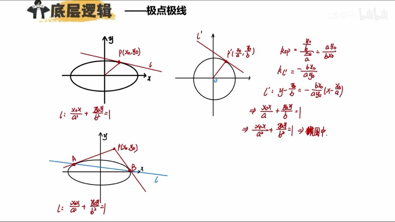
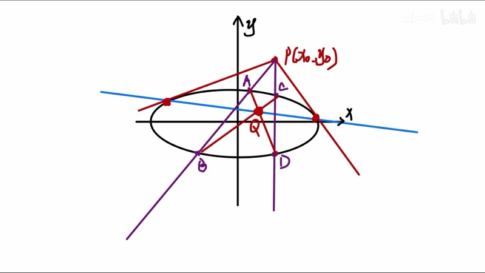
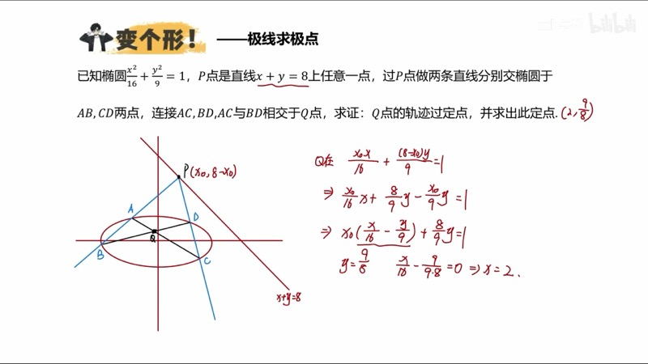
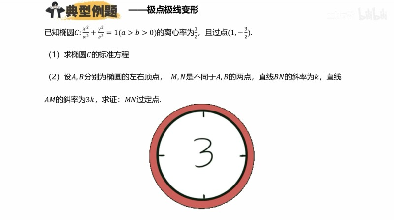

本课介绍圆锥曲线中极点与极线（pole and polar）的概念及其应用。我们从椭圆的切线方程出发，推导切点弦公式，建立极点极线的定义，并通过典型例题展示如何利用极点极线快速判断动点轨迹与过定点问题。极点极线是一种辅助工具，能帮助我们"看出"答案，但解题过程仍需用常规方法书写。

::: {.callout-note collapse="true"}
## 预备知识

- 椭圆（ellipse）标准方程：$\dfrac{x^2}{a^2} + \dfrac{y^2}{b^2} = 1\;(a > b > 0)$
- 椭圆上一点 $P(x_0, y_0)$ 处的切线方程：$\dfrac{x_0 x}{a^2} + \dfrac{y_0 y}{b^2} = 1$
- 仿射变换（affine transformation）的基本思想（参见第十七课）
- 圆的垂径定理与公共弦
:::

## 本课内容

- 椭圆切线方程的"代一半"法则（substitution rule）
- 切点弦（chord of contact）方程及其推导
- 极点（pole）与极线（polar）的定义与性质
- 自极三角形（self-polar triangle）：三个顶点互为极点极线
- 调和点列（harmonic range）与极点极线的关联
- 典型例题：求动点轨迹、过定点问题的秒杀技巧

## 课程视频

```{=html}
<div class="video-container">
  <iframe src="//player.bilibili.com/player.html?bvid=BV1GgZUYCEHu&page=9" title="圆锥曲线大题：极点极线" frameborder="0" scrolling="no" allowfullscreen></iframe>
</div>
```

## 课程关键帧









## 核心概念

### 一、切线方程与"代一半"法则（Substitution Rule）

设椭圆 $\dfrac{x^2}{a^2} + \dfrac{y^2}{b^2} = 1$ 上有一点 $P(x_0, y_0)$，则过 $P$ 的切线方程为：

$$
\frac{x_0 x}{a^2} + \frac{y_0 y}{b^2} = 1
$$

记忆方法：将椭圆方程中的 $x^2$ 替换为 $x_0 x$，$y^2$ 替换为 $y_0 y$，即**代一半**。

::: {.callout-tip}
## 推导思路
利用仿射变换将椭圆映射为单位圆 $x^2 + y^2 = 1$，在圆中由垂径定理求切线，再逆变换回椭圆坐标系。
:::

### 二、切点弦方程（Chord of Contact）

若点 $P(x_0, y_0)$ 在椭圆**外部**，过 $P$ 做两条切线，切点分别为 $A$、$B$，则切点弦 $AB$ 的方程同样为：

$$
\frac{x_0 x}{a^2} + \frac{y_0 y}{b^2} = 1
$$

**推导**：利用仿射变换将椭圆映射为单位圆。在圆中，以 $OP'$ 为直径作辅助圆，与单位圆的公共弦即为 $A'B'$。两圆方程相减即得切点弦方程，再逆变换回原坐标系。

### 三、极点与极线的定义（Pole and Polar）

**定义**：给定椭圆 $\dfrac{x^2}{a^2} + \dfrac{y^2}{b^2} = 1$ 和一个不在曲线上的点 $P(x_0, y_0)$（称为**极点**），则直线

$$
\ell:\;\frac{x_0 x}{a^2} + \frac{y_0 y}{b^2} = 1
$$

称为点 $P$ 关于该椭圆的**极线**。

**核心性质**：过极点 $P$ 做任意两条割线，分别与椭圆交于 $A$、$B$ 和 $C$、$D$ 四点。将 $AD$ 与 $BC$（交叉连接）的交点记为 $Q$，则 $Q$ 必在极线 $\ell$ 上。无论如何选取两条割线，$Q$ 始终在同一条直线上。

::: {.callout-important}
## 极点极线是辅助工具
极点极线只用于**看出答案**或在小题中快速秒杀。大题的解题过程仍需使用常规方法（联立、韦达定理等）来书写。
:::

### 四、自极三角形（Self-Polar Triangle）

过极点 $P$ 做两条割线，产生四个交点 $A$、$B$、$C$、$D$。将所有连线画出后，除 $P$ 外还会产生两个新的交点 $Q$ 和 $G$。这三个点 $P$、$Q$、$G$ 构成的三角形称为**自极三角形**，其性质为：

- $P$ 的极线是 $QG$ 所在直线
- $Q$ 的极线是 $PG$ 所在直线
- $G$ 的极线是 $PQ$ 所在直线

即三角形的每个顶点与其对边互为极点极线。

### 交互演示：极点极线动画（Desmos）

```{=html}
<div id="calc-pole-polar" class="desmos-container"></div>
<script src="https://www.desmos.com/api/v1.9/calculator.js?apiKey=dcb31709b452b1cf9dc26972add0fda6"></script>
<script>
(function() {
  var elt = document.getElementById('calc-pole-polar');
  var calc = Desmos.GraphingCalculator(elt, {
    expressions: true, settingsMenu: false, xAxisLabel: 'x', yAxisLabel: 'y'
  });
  calc.setExpression({ id: 'a', latex: 'a = 2', sliderBounds: { min: 1.5, max: 4, step: 0.1 } });
  calc.setExpression({ id: 'b', latex: 'b = 1.5', sliderBounds: { min: 0.5, max: 3, step: 0.1 } });
  calc.setExpression({ id: 'ellipse', latex: '\\frac{x^2}{a^2} + \\frac{y^2}{b^2} = 1', color: '#2d70b3' });
  calc.setExpression({ id: 'x0', latex: 'x_0 = 4', sliderBounds: { min: -6, max: 6, step: 0.1 } });
  calc.setExpression({ id: 'y0', latex: 'y_0 = 3', sliderBounds: { min: -5, max: 5, step: 0.1 } });
  calc.setExpression({ id: 'P', latex: '(x_0, y_0)', color: '#c74440', pointSize: 12, label: 'P (极点)', showLabel: true });
  calc.setExpression({ id: 'polar', latex: '\\frac{x_0 x}{a^2} + \\frac{y_0 y}{b^2} = 1', color: '#388c46', lineWidth: 3 });
  calc.setMathBounds({ left: -6, right: 6, bottom: -4, top: 4 });
})();
</script>
```

拖动滑块 $x_0$、$y_0$ 改变极点 $P$ 的位置，观察极线（绿色直线）如何实时变化。极线方程始终为 $\dfrac{x_0 x}{a^2} + \dfrac{y_0 y}{b^2} = 1$。

### D3 动画：极点极线动画 — 拖动极点，极线实时更新

```{=html}
<div class="d3-container" id="d3-pole-polar">
  <svg id="svg-pole-polar" width="600" height="400"></svg>
  <div class="d3-controls" id="controls-pole-polar">
    <label>拖动红色极点 P，观察绿色极线的变化</label><br>
    <label>a = <input type="range" id="pp-slider-a" min="1.5" max="4" step="0.1" value="2"><span id="pp-val-a">2.0</span></label>
    <label>b = <input type="range" id="pp-slider-b" min="0.5" max="3" step="0.1" value="1.5"><span id="pp-val-b">1.5</span></label>
  </div>
  <div id="pp-info" style="font-family: 'KaTeX_Main', serif; font-size: 15px; padding: 8px; background: #f8f8f8; border-radius: 6px; margin-top: 6px;"></div>
</div>
<script src="https://d3js.org/d3.v7.min.js"></script>
<script>
(function() {
  var W = 600, H = 400, margin = 40;
  var svg = d3.select('#svg-pole-polar');
  svg.selectAll('*').remove();

  var a = 2, b = 1.5;
  var px = 4, py = 3;
  var scaleX = (W - 2*margin) / 12;
  var scaleY = (H - 2*margin) / 8;

  function toSVG(x, y) {
    return [W/2 + x * scaleX, H/2 - y * scaleY];
  }
  function fromSVG(sx, sy) {
    return [(sx - W/2) / scaleX, -(sy - H/2) / scaleY];
  }

  function ellipsePoints(a, b, n) {
    var pts = [];
    for (var i = 0; i <= n; i++) {
      var t = 2 * Math.PI * i / n;
      pts.push(toSVG(a * Math.cos(t), b * Math.sin(t)));
    }
    return pts;
  }

  // Axes
  svg.append('line').attr('x1', margin).attr('y1', H/2).attr('x2', W-margin).attr('y2', H/2).attr('stroke','#ccc').attr('stroke-width',1);
  svg.append('line').attr('x1', W/2).attr('y1', margin).attr('x2', W/2).attr('y2', H-margin).attr('stroke','#ccc').attr('stroke-width',1);

  var ellipsePath = svg.append('path').attr('fill','none').attr('stroke','#2d70b3').attr('stroke-width',2);
  var polarLine = svg.append('line').attr('stroke','#388c46').attr('stroke-width',2.5);
  var dotP = svg.append('circle').attr('r',8).attr('fill','#c74440').attr('cursor','pointer');
  var labelP = svg.append('text').text('P (极点)').attr('font-size',13).attr('fill','#c74440');

  function update() {
    var pts = ellipsePoints(a, b, 200);
    var line = d3.line().x(function(d){return d[0];}).y(function(d){return d[1];});
    ellipsePath.attr('d', line(pts));

    var p = toSVG(px, py);
    dotP.attr('cx', p[0]).attr('cy', p[1]);
    labelP.attr('x', p[0]+12).attr('y', p[1]-10);

    // Polar line: x0*x/a^2 + y0*y/b^2 = 1
    // Solve for two endpoints at view bounds
    var xL = -6, xR = 6;
    var yL = (1 - px*xL/(a*a)) * (b*b) / py;
    var yR = (1 - px*xR/(a*a)) * (b*b) / py;
    if (!isFinite(yL) || !isFinite(yR)) {
      // y0 ~ 0, line is vertical: x = a^2/x0
      var xv = a*a/px;
      var pA = toSVG(xv, -4);
      var pB = toSVG(xv, 4);
      polarLine.attr('x1',pA[0]).attr('y1',pA[1]).attr('x2',pB[0]).attr('y2',pB[1]);
    } else {
      var pA = toSVG(xL, yL);
      var pB = toSVG(xR, yR);
      polarLine.attr('x1',pA[0]).attr('y1',pA[1]).attr('x2',pB[0]).attr('y2',pB[1]);
    }

    document.getElementById('pp-info').innerHTML =
      '极点 P = (' + px.toFixed(1) + ', ' + py.toFixed(1) + ')' +
      ' &nbsp;&nbsp; 极线: ' + (px/(a*a)).toFixed(3) + 'x + ' + (py/(b*b)).toFixed(3) + 'y = 1';
  }

  var drag = d3.drag().on('drag', function(event) {
    var c = fromSVG(event.x, event.y);
    px = Math.max(-5.5, Math.min(5.5, c[0]));
    py = Math.max(-3.5, Math.min(3.5, c[1]));
    update();
  });
  dotP.call(drag);

  d3.select('#pp-slider-a').on('input', function() {
    a = +this.value; if (b >= a) { b = a-0.1; d3.select('#pp-slider-b').property('value',b); d3.select('#pp-val-b').text(b.toFixed(1)); }
    d3.select('#pp-val-a').text(a.toFixed(1)); update();
  });
  d3.select('#pp-slider-b').on('input', function() {
    b = +this.value; if (b >= a) { b = a-0.1; d3.select('#pp-slider-b').property('value',b); }
    d3.select('#pp-val-b').text(b.toFixed(1)); update();
  });

  update();
})();
</script>
```

拖动红色点 $P$（极点）在平面上移动，观察绿色极线如何随之变化。当极点远离椭圆时，极线靠近椭圆中心；当极点靠近椭圆时，极线远离中心。

### 五、应用示例

**例题 1**：椭圆 $\dfrac{x^2}{4} + \dfrac{y^2}{3} = 1$，点 $P(4, 3)$ 在椭圆外。过 $P$ 做两条割线，四个交点交叉连线交于点 $Q$。求 $Q$ 的轨迹。

**秒杀**：$Q$ 在 $P$ 的极线上，即 $\dfrac{4x}{4} + \dfrac{3y}{3} = 1$，化简得 $x + y = 1$。

**例题 2**：椭圆 $\dfrac{x^2}{4} + \dfrac{y^2}{3} = 1$，$P(4, 0)$ 在椭圆外。过 $P$ 做两条割线，交叉连线交于 $Q$。求 $Q$ 的轨迹。

**秒杀**：$Q$ 在极线 $\dfrac{4x}{4} + \dfrac{0 \cdot y}{3} = 1$ 上，即 $x = 1$。

### 交互演示：切点弦与割线模型（Desmos）

```{=html}
<div id="calc-secant-model" class="desmos-container"></div>
<script>
(function() {
  var elt = document.getElementById('calc-secant-model');
  var calc = Desmos.GraphingCalculator(elt, {
    expressions: true, settingsMenu: false, xAxisLabel: 'x', yAxisLabel: 'y'
  });
  calc.setExpression({ id: 'ellipse', latex: '\\frac{x^2}{4} + \\frac{y^2}{3} = 1', color: '#2d70b3' });
  calc.setExpression({ id: 'P', latex: '(4, 0)', color: '#c74440', pointSize: 12, label: 'P', showLabel: true });
  calc.setExpression({ id: 'polar', latex: 'x = 1', color: '#388c46', lineWidth: 3 });
  calc.setExpression({ id: 'note', latex: '', label: '极线 x=1', showLabel: true });
  calc.setExpression({ id: 't1', latex: 't_1 = 0.5', sliderBounds: { min: -2, max: 2, step: 0.01 } });
  calc.setExpression({ id: 'secant1', latex: 'y = t_1(x - 4)', color: '#fa7e19', lineWidth: 1.5 });
  calc.setExpression({ id: 't2', latex: 't_2 = -0.8', sliderBounds: { min: -2, max: 2, step: 0.01 } });
  calc.setExpression({ id: 'secant2', latex: 'y = t_2(x - 4)', color: '#6042a6', lineWidth: 1.5 });
  calc.setMathBounds({ left: -4, right: 6, bottom: -4, top: 4 });
})();
</script>
```

调节斜率 $t_1$、$t_2$ 改变两条割线，观察交叉连线的交点始终落在极线 $x = 1$ 上。

### D3 动画：调和点列 — 四点共线的交比可视化

```{=html}
<div class="d3-container" id="d3-harmonic-range">
  <svg id="svg-harmonic-range" width="600" height="300"></svg>
  <div class="d3-controls" id="controls-harmonic-range">
    <label>λ = <input type="range" id="hr-slider-lambda" min="0.2" max="4" step="0.05" value="1.5"><span id="hr-val-lambda">1.5</span></label>
    <label>&nbsp;&nbsp;拖动滑块改变内分比</label>
  </div>
  <div id="hr-info" style="font-family: 'KaTeX_Main', serif; font-size: 15px; padding: 8px; background: #f8f8f8; border-radius: 6px; margin-top: 6px;"></div>
</div>
<script>
(function() {
  var W = 600, H = 300, margin = 60;
  var svg = d3.select('#svg-harmonic-range');
  svg.selectAll('*').remove();

  var xA = 1, xB = 5;
  var lambda = 1.5;

  function toSX(x) { return margin + (x - (-2)) / 20 * (W - 2*margin); }
  var cy = H / 2;

  // Main line
  svg.append('line').attr('x1', margin).attr('y1', cy).attr('x2', W-margin).attr('y2', cy).attr('stroke','#999').attr('stroke-width',1);

  var dotA = svg.append('circle').attr('r',6).attr('fill','#2d70b3').attr('cy', cy);
  var dotB = svg.append('circle').attr('r',6).attr('fill','#2d70b3').attr('cy', cy);
  var dotC = svg.append('circle').attr('r',7).attr('fill','#388c46').attr('cy', cy);
  var dotD = svg.append('circle').attr('r',7).attr('fill','#c74440').attr('cy', cy);

  var lblA = svg.append('text').text('A').attr('font-size',14).attr('fill','#2d70b3').attr('y', cy+25);
  var lblB = svg.append('text').text('B').attr('font-size',14).attr('fill','#2d70b3').attr('y', cy+25);
  var lblC = svg.append('text').text('C (内分)').attr('font-size',13).attr('fill','#388c46').attr('y', cy-15);
  var lblD = svg.append('text').text('D (外分)').attr('font-size',13).attr('fill','#c74440').attr('y', cy-15);

  var segAC = svg.append('line').attr('y1',cy-5).attr('y2',cy-5).attr('stroke','#388c46').attr('stroke-width',3);
  var segCB = svg.append('line').attr('y1',cy+5).attr('y2',cy+5).attr('stroke','#fa7e19').attr('stroke-width',3);
  var segAD = svg.append('line').attr('y1',cy-10).attr('y2',cy-10).attr('stroke','#c74440').attr('stroke-width',2).attr('stroke-dasharray','4,3');
  var segDB = svg.append('line').attr('y1',cy+10).attr('y2',cy+10).attr('stroke','#6042a6').attr('stroke-width',2).attr('stroke-dasharray','4,3');

  function update() {
    var xC = (xA + lambda * xB) / (1 + lambda);
    var xD = (xA - lambda * xB) / (1 - lambda);
    // Clamp D for display
    var xDdisp = Math.max(-1, Math.min(18, xD));

    dotA.attr('cx', toSX(xA));
    dotB.attr('cx', toSX(xB));
    dotC.attr('cx', toSX(xC));
    dotD.attr('cx', toSX(xDdisp));

    lblA.attr('x', toSX(xA)-5);
    lblB.attr('x', toSX(xB)-5);
    lblC.attr('x', toSX(xC)-20);
    lblD.attr('x', toSX(xDdisp)-20);

    segAC.attr('x1', toSX(xA)).attr('x2', toSX(xC));
    segCB.attr('x1', toSX(xC)).attr('x2', toSX(xB));
    segAD.attr('x1', toSX(xA)).attr('x2', toSX(xDdisp));
    segDB.attr('x1', toSX(xDdisp)).attr('x2', toSX(xB));

    var acCB = (xC - xA) / (xB - xC);
    var adDB = Math.abs(lambda) < 0.999 ? Math.abs((xD - xA) / (xB - xD)) : Infinity;
    var adDBstr = isFinite(adDB) ? adDB.toFixed(3) : '∞';

    document.getElementById('hr-info').innerHTML =
      'A = ' + xA.toFixed(1) + ', B = ' + xB.toFixed(1) +
      ', C = ' + xC.toFixed(2) + ', D = ' + (isFinite(xD) ? xD.toFixed(2) : '∞') +
      '<br>AC/CB = ' + acCB.toFixed(3) + ' &nbsp;&nbsp; AD/DB = ' + adDBstr +
      ' &nbsp;&nbsp; λ = ' + lambda.toFixed(2);

    if (Math.abs(lambda - 1) < 0.06) {
      lblD.text('D → ∞');
    } else {
      lblD.text('D (外分)');
    }
  }

  d3.select('#hr-slider-lambda').on('input', function() {
    lambda = +this.value;
    d3.select('#hr-val-lambda').text(lambda.toFixed(2));
    update();
  });

  update();
})();
</script>
```

调节 $\lambda$ 改变内分比 $AC:CB = \lambda$，观察外分点 $D$ 的位置变化。当 $\lambda = 1$（$C$ 为中点）时，$D$ 趋于无穷远，此时 $A$、$B$、$C$、$D$ 构成特殊的调和点列。

## 速查表

::: {.key-formula}

| 结论名称 | 公式 | 适用条件 |
|:---------|:-----|:---------|
| 切线方程（代一半） | $\dfrac{x_0 x}{a^2} + \dfrac{y_0 y}{b^2} = 1$ | $P(x_0,y_0)$ 在椭圆上 |
| 切点弦（极线）方程 | $\dfrac{x_0 x}{a^2} + \dfrac{y_0 y}{b^2} = 1$ | $P(x_0,y_0)$ 为极点（不在曲线上） |
| 极点极线性质 | 过极点任意两条割线，交叉连线的交点在极线上 | 椭圆、双曲线、抛物线均适用 |
| 自极三角形 | 三个顶点各自的极线为对边所在直线 | 由完全四边形产生的三个顶点 |
| 调和点列 | $\dfrac{AC}{CB} = \dfrac{AD}{DB}$ | 极点、极线上的点与曲线上两点共线 |
| 秒杀公式 | 极点 $(x_0,y_0)$ → 极线方程直接代入 | 适用于求动点轨迹、过定点问题 |

:::
