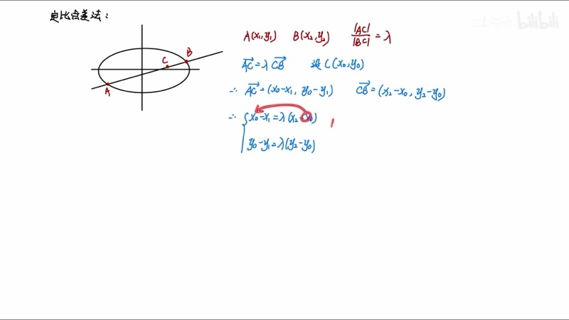
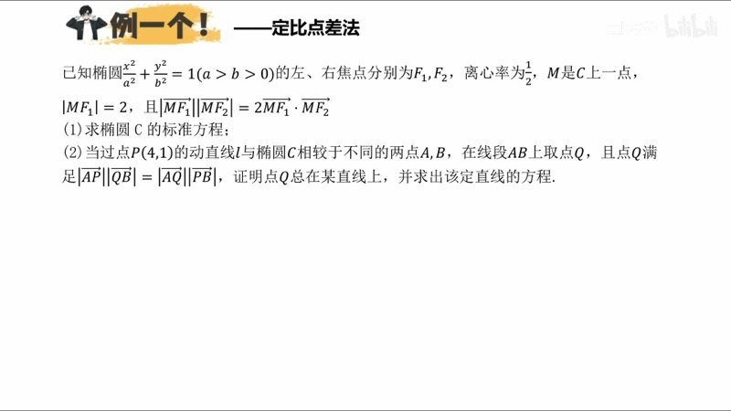
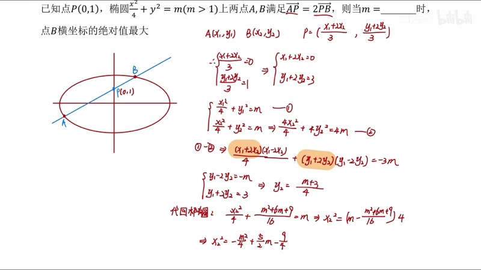
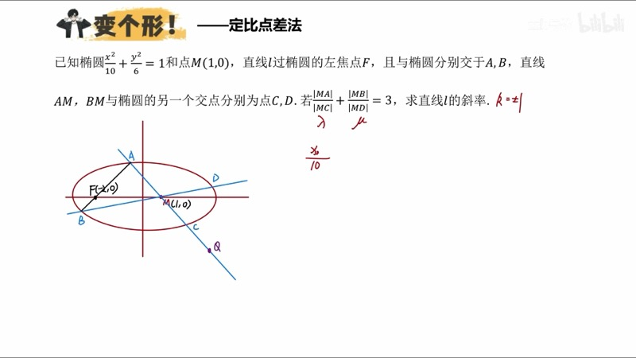

本课在点差法（point-difference method）的基础上，引入**定比点差法**（ratio point-difference method）。当弦上的已知点不再是中点，而是某个比例分点时，我们依然可以建立坐标之间的优雅关系。我们将推导核心公式 $\dfrac{x_C x_D}{a^2} + \dfrac{y_C y_D}{b^2} = 1$，并展示如何在没有"外部点"时主动构造辅助点来简化计算。

::: {.callout-note collapse="true"}
## 预备知识

- 椭圆标准方程：$\dfrac{x^2}{a^2} + \dfrac{y^2}{b^2} = 1\;(a > b > 0)$
- 点差法（point-difference method）：$k_{AB} \cdot k_{OC} = -\dfrac{b^2}{a^2}$（$C$ 为 $AB$ 中点）
- 向量的定比分点公式
- 极点极线的基本概念（参见第十九课）
:::

## 本课内容

- 点差法回顾：中点与斜率的乘积关系
- 定比点差法的推导：从 $\lambda$ 等分点出发
- 核心结论：$\dfrac{x_C x_D}{a^2} + \dfrac{y_C y_D}{b^2} = 1$
- 调和点（harmonic conjugate）与极点极线的关联
- 反解技巧：由 $C$、$D$ 坐标反求 $A$、$B$ 坐标
- 无外部点时的构造方法：主动引入辅助点

## 课程视频

```{=html}
<div class="video-container">
  <iframe src="//player.bilibili.com/player.html?bvid=BV1GgZUYCEHu&page=10" title="圆锥曲线大题：定比点差" frameborder="0" scrolling="no" allowfullscreen></iframe>
</div>
```

## 课程关键帧









## 核心概念

### 一、点差法回顾（Point-Difference Method）

设直线 $AB$ 与椭圆 $\dfrac{x^2}{a^2} + \dfrac{y^2}{b^2} = 1$ 交于 $A(x_1, y_1)$ 和 $B(x_2, y_2)$，$C$ 为 $AB$ 的中点。将 $A$、$B$ 分别代入椭圆方程后相减，利用平方差分解可得：

$$
k_{AB} \cdot k_{OC} = -\frac{b^2}{a^2}
$$

其中 $k_{OC} = \dfrac{y_C}{x_C}$ 是原点 $O$ 与中点 $C$ 连线的斜率。

### 二、定比点差法（Ratio Point-Difference Method）

当 $C$ 不是中点，而是满足 $\overrightarrow{AC} = \lambda \overrightarrow{CB}$ 的分点时，我们需要推广上述方法。

**设定**：$A(x_1, y_1)$、$B(x_2, y_2)$ 在椭圆上，$C$ 为内分点满足 $\overrightarrow{AC} = \lambda \overrightarrow{CB}$，$D$ 为外分点满足 $\overrightarrow{AD} = -\lambda \overrightarrow{DB}$。

**坐标公式**：

$$
x_C = \frac{x_1 + \lambda x_2}{1 + \lambda}, \quad y_C = \frac{y_1 + \lambda y_2}{1 + \lambda}
$$

$$
x_D = \frac{x_1 - \lambda x_2}{1 - \lambda}, \quad y_D = \frac{y_1 - \lambda y_2}{1 - \lambda}
$$

**推导过程**：

1. $A$、$B$ 在椭圆上：$\dfrac{x_1^2}{a^2} + \dfrac{y_1^2}{b^2} = 1$，$\dfrac{x_2^2}{a^2} + \dfrac{y_2^2}{b^2} = 1$

2. 将第二式乘以 $\lambda^2$，得第三式

3. 第一式减第三式，利用平方差分解：

$$
\frac{(x_1 + \lambda x_2)(x_1 - \lambda x_2)}{a^2(1+\lambda)(1-\lambda)} + \frac{(y_1 + \lambda y_2)(y_1 - \lambda y_2)}{b^2(1+\lambda)(1-\lambda)} = 1
$$

4. 认出分子恰好是 $x_C \cdot x_D$ 和 $y_C \cdot y_D$，得到：

$$
\boxed{\frac{x_C \cdot x_D}{a^2} + \frac{y_C \cdot y_D}{b^2} = 1}
$$

::: {.callout-important}
## 与极点极线的关系
此公式形式与极线方程 $\dfrac{x_0 x}{a^2} + \dfrac{y_0 y}{b^2} = 1$ 完全一致。这说明 $C$ 点在 $D$ 点的极线上，$D$ 点在 $C$ 点的极线上——即 $C$ 和 $D$ 互为**调和共轭点**（harmonic conjugates）。
:::

### 三、反解公式：由 C、D 求 A、B

在实际解题中，有时我们需要从 $C$（内分点）和 $D$（外分点）的坐标反推弦端点 $A$、$B$。联立定比分点的方程组，解得：

$$
x_1 = \frac{x_C + x_D}{2} + \frac{(x_C - x_D)\lambda}{2}, \quad x_2 = \frac{x_C + x_D}{2} + \frac{x_C - x_D}{2\lambda}
$$

$y_1$、$y_2$ 具有完全相同的结构。其中 $x_1$ 对应 $CD$ **外部**的点（乘 $\lambda$），$x_2$ 对应 $CD$ **内部**的点（除 $\lambda$）。

### 交互演示：定比分点动画（Desmos）

```{=html}
<div id="calc-ratio-point" class="desmos-container"></div>
<script src="https://www.desmos.com/api/v1.9/calculator.js?apiKey=dcb31709b452b1cf9dc26972add0fda6"></script>
<script>
(function() {
  var elt = document.getElementById('calc-ratio-point');
  var calc = Desmos.GraphingCalculator(elt, {
    expressions: true, settingsMenu: false, xAxisLabel: 'x', yAxisLabel: 'y'
  });
  calc.setExpression({ id: 'ellipse', latex: '\\frac{x^2}{4} + \\frac{y^2}{3} = 1', color: '#2d70b3' });
  calc.setExpression({ id: 'lam', latex: '\\lambda = 2', sliderBounds: { min: 0.2, max: 5, step: 0.1 } });
  calc.setExpression({ id: 't', latex: 't_0 = 0.8', sliderBounds: { min: 0.1, max: 3, step: 0.01 } });
  calc.setExpression({ id: 'x1', latex: 'x_1 = 2\\cos(t_0)' });
  calc.setExpression({ id: 'y1', latex: 'y_1 = \\sqrt{3}\\sin(t_0)' });
  calc.setExpression({ id: 'x2', latex: 'x_2 = 2\\cos(t_0 + 2)' });
  calc.setExpression({ id: 'y2', latex: 'y_2 = \\sqrt{3}\\sin(t_0 + 2)' });
  calc.setExpression({ id: 'A', latex: '(x_1, y_1)', color: '#2d70b3', pointSize: 10, label: 'A', showLabel: true });
  calc.setExpression({ id: 'B', latex: '(x_2, y_2)', color: '#2d70b3', pointSize: 10, label: 'B', showLabel: true });
  calc.setExpression({ id: 'xc', latex: 'x_c = \\frac{x_1 + \\lambda x_2}{1 + \\lambda}' });
  calc.setExpression({ id: 'yc', latex: 'y_c = \\frac{y_1 + \\lambda y_2}{1 + \\lambda}' });
  calc.setExpression({ id: 'C', latex: '(x_c, y_c)', color: '#388c46', pointSize: 10, label: 'C (内分)', showLabel: true });
  calc.setExpression({ id: 'chord', latex: '(1-s)(x_1,y_1)+s(x_2,y_2)', color: '#fa7e19', parametricDomain: {min:0,max:1}, lineWidth: 2 });
  calc.setMathBounds({ left: -4, right: 4, bottom: -3, top: 3 });
})();
</script>
```

拖动滑块 $\lambda$ 改变分比，拖动 $t_0$ 改变弦的位置，观察内分点 $C$（绿色）在弦 $AB$ 上按比例 $\lambda$ 移动。

### D3 动画：定比分点 — 点在线段上按比例移动

```{=html}
<div class="d3-container" id="d3-ratio-division">
  <svg id="svg-ratio-division" width="600" height="350"></svg>
  <div class="d3-controls" id="controls-ratio-division">
    <label>λ = <input type="range" id="rd-slider-lam" min="0.2" max="5" step="0.1" value="2"><span id="rd-val-lam">2.0</span></label>
    <label>&nbsp;&nbsp;弦角度 θ = <input type="range" id="rd-slider-t" min="0.1" max="3" step="0.01" value="0.8"><span id="rd-val-t">0.80</span></label>
  </div>
  <div id="rd-info" style="font-family: 'KaTeX_Main', serif; font-size: 15px; padding: 8px; background: #f8f8f8; border-radius: 6px; margin-top: 6px;"></div>
</div>
<script>
(function() {
  var W = 600, H = 350, margin = 50;
  var svg = d3.select('#svg-ratio-division');
  svg.selectAll('*').remove();

  var a2 = 4, b2 = 3, a = 2, b = Math.sqrt(3);
  var lambda = 2, tParam = 0.8;
  var sc = (W - 2*margin) / (2*a*1.6);

  function toSVG(x, y) { return [W/2 + x*sc, H/2 - y*sc]; }

  function ellipsePoints(n) {
    var pts = [];
    for (var i = 0; i <= n; i++) {
      var t = 2*Math.PI*i/n;
      pts.push(toSVG(a*Math.cos(t), b*Math.sin(t)));
    }
    return pts;
  }

  svg.append('line').attr('x1',margin).attr('y1',H/2).attr('x2',W-margin).attr('y2',H/2).attr('stroke','#ccc').attr('stroke-width',1);
  svg.append('line').attr('x1',W/2).attr('y1',margin).attr('x2',W/2).attr('y2',H-margin).attr('stroke','#ccc').attr('stroke-width',1);

  var ellipsePath = svg.append('path').attr('fill','none').attr('stroke','#2d70b3').attr('stroke-width',2);
  var chordLine = svg.append('line').attr('stroke','#fa7e19').attr('stroke-width',2);
  var dotA = svg.append('circle').attr('r',6).attr('fill','#2d70b3');
  var dotB = svg.append('circle').attr('r',6).attr('fill','#2d70b3');
  var dotC = svg.append('circle').attr('r',7).attr('fill','#388c46');
  var dotD = svg.append('circle').attr('r',7).attr('fill','#c74440');
  var lblA = svg.append('text').text('A').attr('font-size',13).attr('fill','#2d70b3');
  var lblB = svg.append('text').text('B').attr('font-size',13).attr('fill','#2d70b3');
  var lblC = svg.append('text').text('C').attr('font-size',13).attr('fill','#388c46');
  var lblD = svg.append('text').text('D').attr('font-size',13).attr('fill','#c74440');

  function update() {
    var pts = ellipsePoints(200);
    var line = d3.line().x(function(d){return d[0];}).y(function(d){return d[1];});
    ellipsePath.attr('d', line(pts));

    var x1 = a*Math.cos(tParam), y1 = b*Math.sin(tParam);
    var x2 = a*Math.cos(tParam+2), y2 = b*Math.sin(tParam+2);

    var xc = (x1 + lambda*x2)/(1+lambda);
    var yc = (y1 + lambda*y2)/(1+lambda);
    var xd = lambda !== 1 ? (x1 - lambda*x2)/(1-lambda) : 999;
    var yd = lambda !== 1 ? (y1 - lambda*y2)/(1-lambda) : 999;

    var pA = toSVG(x1,y1), pB = toSVG(x2,y2), pC = toSVG(xc,yc);
    var xdClamp = Math.max(-5, Math.min(5, xd));
    var ydClamp = Math.max(-4, Math.min(4, yd));
    var pD = toSVG(xdClamp, ydClamp);

    chordLine.attr('x1',pA[0]).attr('y1',pA[1]).attr('x2',pB[0]).attr('y2',pB[1]);
    dotA.attr('cx',pA[0]).attr('cy',pA[1]);
    dotB.attr('cx',pB[0]).attr('cy',pB[1]);
    dotC.attr('cx',pC[0]).attr('cy',pC[1]);
    dotD.attr('cx',pD[0]).attr('cy',pD[1]);
    lblA.attr('x',pA[0]+8).attr('y',pA[1]-8);
    lblB.attr('x',pB[0]+8).attr('y',pB[1]-8);
    lblC.attr('x',pC[0]+8).attr('y',pC[1]-8);
    lblD.attr('x',pD[0]+8).attr('y',pD[1]-8);

    var val = xc*xd/a2 + yc*yd/b2;
    document.getElementById('rd-info').innerHTML =
      'A = (' + x1.toFixed(2) + ', ' + y1.toFixed(2) + ')' +
      ' &nbsp; B = (' + x2.toFixed(2) + ', ' + y2.toFixed(2) + ')' +
      '<br>C (内分) = (' + xc.toFixed(2) + ', ' + yc.toFixed(2) + ')' +
      ' &nbsp; D (外分) = (' + (Math.abs(xd)<50?xd.toFixed(2):'∞') + ', ' + (Math.abs(yd)<50?yd.toFixed(2):'∞') + ')' +
      '<br>x_C·x_D/a² + y_C·y_D/b² = ' + (isFinite(val)?val.toFixed(4):'∞') + ' (应为 1)';
  }

  d3.select('#rd-slider-lam').on('input', function() {
    lambda = +this.value; d3.select('#rd-val-lam').text(lambda.toFixed(1)); update();
  });
  d3.select('#rd-slider-t').on('input', function() {
    tParam = +this.value; d3.select('#rd-val-t').text(tParam.toFixed(2)); update();
  });

  update();
})();
</script>
```

调节 $\lambda$ 和弦角度 $\theta$，观察内分点 $C$（绿色）和外分点 $D$（红色）的位置变化，并验证 $\dfrac{x_C x_D}{a^2} + \dfrac{y_C y_D}{b^2}$ 始终等于 $1$。

### D3 动画：定比点差法求解过程可视化

```{=html}
<div class="d3-container" id="d3-ratio-solve">
  <svg id="svg-ratio-solve" width="600" height="350"></svg>
  <div class="d3-controls" id="controls-ratio-solve">
    <label>P点坐标 x = <input type="range" id="rs-slider-px" min="-1.8" max="1.8" step="0.1" value="0"><span id="rs-val-px">0.0</span></label>
    <label>&nbsp;y = <input type="range" id="rs-slider-py" min="0.2" max="1.6" step="0.1" value="1"><span id="rs-val-py">1.0</span></label>
    <label>&nbsp;λ = <input type="range" id="rs-slider-lam2" min="1.2" max="4" step="0.1" value="2"><span id="rs-val-lam2">2.0</span></label>
  </div>
  <div id="rs-info" style="font-family: 'KaTeX_Main', serif; font-size: 15px; padding: 8px; background: #f8f8f8; border-radius: 6px; margin-top: 6px;"></div>
</div>
<script>
(function() {
  var W = 600, H = 350, margin = 50;
  var svg = d3.select('#svg-ratio-solve');
  svg.selectAll('*').remove();

  var a = 2, b = Math.sqrt(3), a2 = 4, b2 = 3;
  var ppx = 0, ppy = 1, lam = 2;
  var sc = (W - 2*margin) / (2*a*1.6);

  function toSVG(x, y) { return [W/2 + x*sc, H/2 - y*sc]; }

  function ellipsePoints(n) {
    var pts = [];
    for (var i = 0; i <= n; i++) {
      var t = 2*Math.PI*i/n;
      pts.push(toSVG(a*Math.cos(t), b*Math.sin(t)));
    }
    return pts;
  }

  svg.append('line').attr('x1',margin).attr('y1',H/2).attr('x2',W-margin).attr('y2',H/2).attr('stroke','#ccc').attr('stroke-width',1);
  svg.append('line').attr('x1',W/2).attr('y1',margin).attr('x2',W/2).attr('y2',H-margin).attr('stroke','#ccc').attr('stroke-width',1);

  var ellipsePath = svg.append('path').attr('fill','none').attr('stroke','#2d70b3').attr('stroke-width',2);
  var polarLine = svg.append('line').attr('stroke','#388c46').attr('stroke-width',2).attr('stroke-dasharray','6,3');
  var dotP = svg.append('circle').attr('r',7).attr('fill','#fa7e19');
  var lblP = svg.append('text').text('P (已知点)').attr('font-size',12).attr('fill','#fa7e19');

  function update() {
    var pts = ellipsePoints(200);
    var line = d3.line().x(function(d){return d[0];}).y(function(d){return d[1];});
    ellipsePath.attr('d', line(pts));

    var p = toSVG(ppx, ppy);
    dotP.attr('cx',p[0]).attr('cy',p[1]);
    lblP.attr('x',p[0]+10).attr('y',p[1]-10);

    // Q point from formula: xP*xQ/a2 + yP*yQ/b2 = 1
    // yQ = (1 - xP*xQ/a2)*b2/yP — parametric on xQ
    var xL = -4, xR = 4;
    if (Math.abs(ppy) > 0.01) {
      var yL = (1 - ppx*xL/a2)*b2/ppy;
      var yR = (1 - ppx*xR/a2)*b2/ppy;
      var pA = toSVG(xL,yL), pB = toSVG(xR,yR);
      polarLine.attr('x1',pA[0]).attr('y1',pA[1]).attr('x2',pB[0]).attr('y2',pB[1]);
    }

    document.getElementById('rs-info').innerHTML =
      'P = (' + ppx.toFixed(1) + ', ' + ppy.toFixed(1) + ')' +
      ' &nbsp; λ = ' + lam.toFixed(1) +
      '<br>Q点轨迹（极线）: ' + (ppx/a2).toFixed(3) + 'x + ' + (ppy/b2).toFixed(3) + 'y = 1' +
      '<br>即 Q 在 P 的极线上运动，代入 P 坐标即可得到 Q 的轨迹方程';
  }

  d3.select('#rs-slider-px').on('input', function() {
    ppx = +this.value; d3.select('#rs-val-px').text(ppx.toFixed(1)); update();
  });
  d3.select('#rs-slider-py').on('input', function() {
    ppy = +this.value; d3.select('#rs-val-py').text(ppy.toFixed(1)); update();
  });
  d3.select('#rs-slider-lam2').on('input', function() {
    lam = +this.value; d3.select('#rs-val-lam2').text(lam.toFixed(1)); update();
  });

  update();
})();
</script>
```

调节已知点 $P$ 的坐标，观察对应的极线（虚线）位置。当已知 $\overrightarrow{AP} = \lambda \overrightarrow{PB}$ 时，外部调和共轭点 $Q$ 就在此极线上运动。

### 四、解题流程总结

1. **有外部点 $D$**：直接使用 $\dfrac{x_C x_D}{a^2} + \dfrac{y_C y_D}{b^2} = 1$
2. **无外部点**：主动设一个辅助点 $Q$（外分点），利用公式建立方程，然后通过反解公式将所需的 $A$ 或 $B$ 用 $C$、$Q$ 表示
3. **结合韦达定理**：当需要求斜率或极值时，将反解得到的坐标代回椭圆方程，利用韦达定理完成计算

### 交互演示：定比点差核心公式验证（Desmos）

```{=html}
<div id="calc-ratio-verify" class="desmos-container"></div>
<script>
(function() {
  var elt = document.getElementById('calc-ratio-verify');
  var calc = Desmos.GraphingCalculator(elt, {
    expressions: true, settingsMenu: false, xAxisLabel: 'x', yAxisLabel: 'y'
  });
  calc.setExpression({ id: 'ellipse', latex: '\\frac{x^2}{4} + \\frac{y^2}{3} = 1', color: '#2d70b3' });
  calc.setExpression({ id: 'lam', latex: '\\lambda = 2', sliderBounds: { min: 0.2, max: 5, step: 0.1 } });
  calc.setExpression({ id: 't', latex: 't_0 = 0.8', sliderBounds: { min: 0.1, max: 3, step: 0.01 } });
  calc.setExpression({ id: 'x1', latex: 'x_1 = 2\\cos(t_0)' });
  calc.setExpression({ id: 'y1', latex: 'y_1 = \\sqrt{3}\\sin(t_0)' });
  calc.setExpression({ id: 'x2', latex: 'x_2 = 2\\cos(t_0 + 2)' });
  calc.setExpression({ id: 'y2', latex: 'y_2 = \\sqrt{3}\\sin(t_0 + 2)' });
  calc.setExpression({ id: 'xc', latex: 'x_c = \\frac{x_1 + \\lambda x_2}{1 + \\lambda}' });
  calc.setExpression({ id: 'yc', latex: 'y_c = \\frac{y_1 + \\lambda y_2}{1 + \\lambda}' });
  calc.setExpression({ id: 'xd', latex: 'x_d = \\frac{x_1 - \\lambda x_2}{1 - \\lambda}' });
  calc.setExpression({ id: 'yd', latex: 'y_d = \\frac{y_1 - \\lambda y_2}{1 - \\lambda}' });
  calc.setExpression({ id: 'verify', latex: 'V = \\frac{x_c \\cdot x_d}{4} + \\frac{y_c \\cdot y_d}{3}' });
  calc.setExpression({ id: 'A', latex: '(x_1, y_1)', color: '#2d70b3', pointSize: 10, label: 'A', showLabel: true });
  calc.setExpression({ id: 'B', latex: '(x_2, y_2)', color: '#2d70b3', pointSize: 10, label: 'B', showLabel: true });
  calc.setExpression({ id: 'C', latex: '(x_c, y_c)', color: '#388c46', pointSize: 10, label: 'C', showLabel: true });
  calc.setExpression({ id: 'D', latex: '(x_d, y_d)', color: '#c74440', pointSize: 10, label: 'D', showLabel: true });
  calc.setMathBounds({ left: -5, right: 5, bottom: -4, top: 4 });
})();
</script>
```

调节 $\lambda$ 和 $t_0$，观察验证值 $V = \dfrac{x_C x_D}{a^2} + \dfrac{y_C y_D}{b^2}$ 始终等于 $1$。

## 速查表

::: {.key-formula}

| 结论名称 | 公式 | 适用条件 |
|:---------|:-----|:---------|
| 点差法（中点） | $k_{AB} \cdot k_{OC} = -\dfrac{b^2}{a^2}$ | $C$ 为弦 $AB$ 的中点 |
| 定比分点坐标 | $x_C = \dfrac{x_1 + \lambda x_2}{1 + \lambda}$ | $\overrightarrow{AC} = \lambda\overrightarrow{CB}$ |
| 定比点差核心公式 | $\dfrac{x_C x_D}{a^2} + \dfrac{y_C y_D}{b^2} = 1$ | $C$ 内分、$D$ 外分，比值均为 $\lambda$ |
| 反解 $A$ 点 | $x_1 = \dfrac{x_C + x_D}{2} + \dfrac{(x_C - x_D)\lambda}{2}$ | $A$ 在 $CD$ 外部（乘 $\lambda$） |
| 反解 $B$ 点 | $x_2 = \dfrac{x_C + x_D}{2} + \dfrac{x_C - x_D}{2\lambda}$ | $B$ 在 $CD$ 内部（除 $\lambda$） |
| 与极线的关系 | $C$ 在 $D$ 的极线上，$D$ 在 $C$ 的极线上 | $C$、$D$ 互为调和共轭点 |

:::
