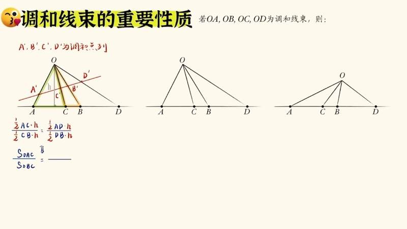
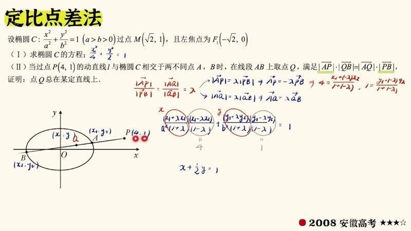
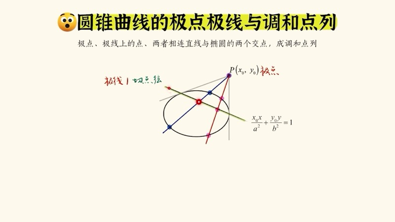
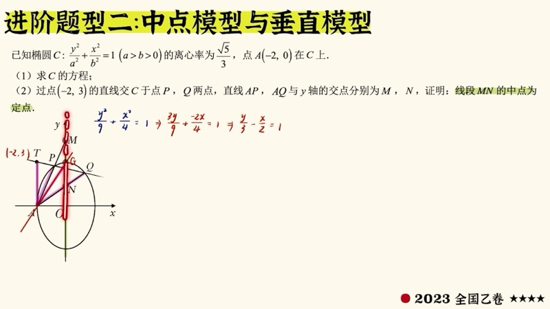

本课深入讲解射影几何（projective geometry）中与高考圆锥曲线密切相关的核心概念。我们从调和点列（harmonic range）出发，引入调和线束（harmonic pencil）及其三大性质（截线性质、平行→中点模型、角平分线→垂直模型），再通过完全四边形（complete quadrilateral）建立与极点极线的几何联系。这些出题背景知识能帮助我们在考试中直接看出答案，大幅简化解题过程。

::: {.callout-note collapse="true"}
## 预备知识

- 椭圆、双曲线标准方程
- 极点与极线的代数定义（参见第十九课）
- 定比点差法（参见第二十课）
- 三角形面积的两面夹一角公式：$S = \dfrac{1}{2}ab\sin C$
- 赛瓦定理（Ceva's theorem）与梅涅劳斯定理（Menelaus' theorem）的基本概念
:::

## 本课内容

- 调和点列（harmonic range）：定义、计算与特殊情况（中点→无穷远点）
- 调和线束（harmonic pencil）：定义与三大性质
- 完全四边形（complete quadrilateral）：三条对角线互相调和分割
- 极点极线的几何解释：自极三角形与完全四边形
- 三大常考模型：小叉叉模型（定点/定线）、中点模型、垂直模型
- 经典高考真题的出题背景解析

## 课程视频

```{=html}
<div class="video-container">
  <iframe src="//player.bilibili.com/player.html?bvid=BV19YUwBEEX7&page=1" title="射影几何：调和点列与极点极线" frameborder="0" scrolling="no" allowfullscreen></iframe>
</div>
```

## 课程关键帧









## 核心概念

### 一、调和点列（Harmonic Range）

**定义**：若直线上四点 $A$、$B$、$C$、$D$ 满足：

$$
\frac{AC}{CB} = \frac{AD}{DB}
$$

则称 $A$、$B$、$C$、$D$ 为**调和点列**，也称 $C$ 和 $D$ **调和分割**线段 $AB$。其中 $C$ 是 $AB$ 的内分点，$D$ 是外分点。

::: {.callout-tip}
## 对称性
调和点列具有对称性：若 $C$、$D$ 调和分割 $AB$，则 $A$、$B$ 也调和分割 $CD$。三种说法等价。
:::

**特殊情况**：若 $C$ 是 $AB$ 的中点（内分比 $1:1$），则外分点 $D$ 在**无穷远处**。直观理解：当 $D$ 趋于无穷远时，$AD$ 与 $DB$ 的比值趋于 $1:1$。

**计算示例**：$A = 0$，$B = 5$，$C = 3$，则 $AC:CB = 3:2$。设 $D$ 的坐标为 $d$，由 $AD:DB = 3:2$ 解得 $d = 15$。

### 二、调和线束（Harmonic Pencil）

**定义**：若 $A$、$B$、$C$、$D$ 为调和点列，取直线外一点 $O$，则 $OA$、$OB$、$OC$、$OD$ 四条射线称为**调和线束**。

**三大性质**：

**性质一（截线性质）**：任作一条截线与四条调和线束相交，所得四个新交点仍为调和点列。

推导关键：将边长比转化为三角形面积比，再用两面夹一角公式，所有边长约去后只剩角度条件：

$$
\frac{\sin\alpha}{\sin\beta} = \frac{\sin(\alpha+\beta+\gamma)}{\sin\gamma}
$$

此角度条件与截线位置无关，因此对任意截线均成立。

**性质二（平行→中点模型）**：若截线平行于其中一条调和线束，则第四个交点在无穷远处，另外三个交点构成**中点关系**。

$$
\text{调和线束中一条线与截线平行} \implies \text{另外三个交点有中点关系}
$$

此模型在 2018、2022、2023 年高考中均有考查。

**性质三（角平分线→垂直模型）**：若 $OC$ 是 $\angle AOB$ 的角平分线（即 $\alpha = \beta$），则 $OC \perp OD$。

推导：由 $\sin\alpha = \sin\beta$ 和角度条件推得 $\beta + \gamma = 90°$，即 $OC$ 与 $OD$ 垂直。

### 交互演示：射影变换与调和线束（Desmos）

```{=html}
<div id="calc-projective" class="desmos-container"></div>
<script src="https://www.desmos.com/api/v1.9/calculator.js?apiKey=dcb31709b452b1cf9dc26972add0fda6"></script>
<script>
(function() {
  var elt = document.getElementById('calc-projective');
  var calc = Desmos.GraphingCalculator(elt, {
    expressions: true, settingsMenu: false, xAxisLabel: 'x', yAxisLabel: 'y'
  });
  // Four collinear points forming harmonic range
  calc.setExpression({ id: 'xA', latex: 'x_A = 0' });
  calc.setExpression({ id: 'xB', latex: 'x_B = 6' });
  calc.setExpression({ id: 'lam', latex: '\\lambda = 1.5', sliderBounds: { min: 0.3, max: 4, step: 0.1 } });
  calc.setExpression({ id: 'xC', latex: 'x_C = \\frac{x_A + \\lambda x_B}{1 + \\lambda}' });
  calc.setExpression({ id: 'xD', latex: 'x_D = \\frac{x_A - \\lambda x_B}{1 - \\lambda}' });
  calc.setExpression({ id: 'A', latex: '(x_A, 0)', color: '#2d70b3', pointSize: 10, label: 'A', showLabel: true });
  calc.setExpression({ id: 'B', latex: '(x_B, 0)', color: '#2d70b3', pointSize: 10, label: 'B', showLabel: true });
  calc.setExpression({ id: 'C', latex: '(x_C, 0)', color: '#388c46', pointSize: 10, label: 'C', showLabel: true });
  calc.setExpression({ id: 'D', latex: '(x_D, 0)', color: '#c74440', pointSize: 10, label: 'D', showLabel: true });
  // Point O for pencil
  calc.setExpression({ id: 'Ox', latex: 'O_x = 3', sliderBounds: { min: -2, max: 8, step: 0.1 } });
  calc.setExpression({ id: 'Oy', latex: 'O_y = 4', sliderBounds: { min: 1, max: 8, step: 0.1 } });
  calc.setExpression({ id: 'O', latex: '(O_x, O_y)', color: '#fa7e19', pointSize: 12, label: 'O', showLabel: true });
  // Pencil lines
  calc.setExpression({ id: 'OA', latex: 'y = \\frac{O_y}{O_x - x_A}(x - x_A)', color: '#2d70b3', lineWidth: 1 });
  calc.setExpression({ id: 'OB', latex: 'y = \\frac{O_y}{O_x - x_B}(x - x_B)', color: '#2d70b3', lineWidth: 1 });
  calc.setExpression({ id: 'OC', latex: 'y = \\frac{O_y}{O_x - x_C}(x - x_C)', color: '#388c46', lineWidth: 1.5 });
  calc.setExpression({ id: 'OD', latex: 'y = \\frac{O_y}{O_x - x_D}(x - x_D)', color: '#c74440', lineWidth: 1.5 });
  calc.setMathBounds({ left: -8, right: 20, bottom: -2, top: 8 });
})();
</script>
```

调节 $\lambda$ 改变调和分比，移动点 $O$ 的位置，观察四条调和线束。无论 $O$ 在何处，任意截线与这四条线的交点始终构成调和点列。

### 三、完全四边形（Complete Quadrilateral）

**定义**：由一个凸四边形 $ABDF$ 的四条边两两延长所得的六个点、四条线构成**完全四边形**。它有三条对角线：$AD$、$BF$ 以及两组对边延长线的交点连线 $CE$。

**核心性质**：完全四边形的三条对角线所在直线**互相调和分割**。即每条对角线上都能找到四个点构成调和点列。

进一步地，完全四边形共有七条线（四条边 + 三条对角线），**每条线上都能找到调和点列**。

### 四、极点极线的几何解释

给定椭圆和极点 $P$，过 $P$ 引两条割线，与椭圆交于四点 $A$、$B$、$C$、$D$，构成完全四边形。由完全四边形的性质：

1. 对角线的交叉连接产生**自极三角形**的三个顶点 $P$、$Q$、$G$
2. 极点 $P$ 的极线就是 $QG$ 所在直线
3. 极点、极线上的点与曲线上两点共线时，四点成调和点列

**小叉叉模型识别**：当题目出现"椭圆外一点引两条割线，四个交点交叉连接求交点轨迹"的结构时，直接使用极点极线秒杀。

### D3 动画：射影变换 — 透视投影下直线到曲线

```{=html}
<div class="d3-container" id="d3-projective-transform">
  <svg id="svg-projective-transform" width="600" height="400"></svg>
  <div class="d3-controls" id="controls-projective-transform">
    <label>投影中心高度 h = <input type="range" id="pt-slider-h" min="2" max="8" step="0.2" value="4"><span id="pt-val-h">4.0</span></label>
    <label>&nbsp;&nbsp;截线位置 d = <input type="range" id="pt-slider-d" min="1" max="6" step="0.2" value="2"><span id="pt-val-d">2.0</span></label>
    <button id="pt-play">▶ 动画</button>
    <button id="pt-pause">⏸ 暂停</button>
  </div>
  <div id="pt-info" style="font-family: 'KaTeX_Main', serif; font-size: 14px; padding: 8px; background: #f8f8f8; border-radius: 6px; margin-top: 6px;"></div>
</div>
<script>
(function() {
  var W = 600, H = 400, margin = 40;
  var svg = d3.select('#svg-projective-transform');
  svg.selectAll('*').remove();

  var projH = 4, cutD = 2;
  var animating = false, animTimer = null, tAnim = 0;

  // Coordinate system: x horizontal, y vertical (up)
  var scX = 50, scY = 50;
  function toSVG(x, y) { return [W/2 + x*scX, H - margin - y*scY]; }

  // Draw base line (y=0)
  svg.append('line').attr('x1',margin).attr('y1',H-margin).attr('x2',W-margin).attr('y2',H-margin).attr('stroke','#999').attr('stroke-width',1);

  var projCenter = svg.append('circle').attr('r',7).attr('fill','#c74440');
  var lblO = svg.append('text').text('O (投影中心)').attr('font-size',12).attr('fill','#c74440');

  // Cut line
  var cutLine = svg.append('line').attr('stroke','#388c46').attr('stroke-width',2).attr('stroke-dasharray','6,3');
  var lblCut = svg.append('text').text('截线').attr('font-size',12).attr('fill','#388c46');

  // Points on base
  var basePoints = [];
  var projPoints = [];
  var projLines = [];
  var nPts = 9;
  for (var i = 0; i < nPts; i++) {
    projLines.push(svg.append('line').attr('stroke','#ddd').attr('stroke-width',1));
    basePoints.push(svg.append('circle').attr('r',4).attr('fill','#2d70b3'));
    projPoints.push(svg.append('circle').attr('r',5).attr('fill','#fa7e19'));
  }

  // Harmonic highlight
  var harmDots = [];
  for (var i = 0; i < 4; i++) {
    harmDots.push(svg.append('circle').attr('r',6).attr('fill','none').attr('stroke','#6042a6').attr('stroke-width',2));
  }

  function update() {
    var oc = toSVG(0, projH);
    projCenter.attr('cx',oc[0]).attr('cy',oc[1]);
    lblO.attr('x',oc[0]+10).attr('y',oc[1]-5);

    // Cut line at y = cutD
    var cl1 = toSVG(-5, cutD), cl2 = toSVG(5, cutD);
    cutLine.attr('x1',cl1[0]).attr('y1',cl1[1]).attr('x2',cl2[0]).attr('y2',cl2[1]);
    lblCut.attr('x',cl2[0]+5).attr('y',cl2[1]);

    // Base points evenly spaced
    var baseXs = [];
    for (var i = 0; i < nPts; i++) {
      baseXs.push(-3 + 6*i/(nPts-1));
    }

    for (var i = 0; i < nPts; i++) {
      var bx = baseXs[i];
      var bp = toSVG(bx, 0);
      basePoints[i].attr('cx',bp[0]).attr('cy',bp[1]);

      // Project through O onto cut line
      // Line from O(0,projH) to (bx, 0): parametric
      // x(t) = bx*t, y(t) = projH*(1-t)
      // y = cutD → t = (projH-cutD)/projH
      var t = (projH - cutD) / projH;
      var px = bx * t / (1 - (1-t)*0); // Actually: from (0,projH) to (bx,0), at y=cutD
      // parametric: P + t*(Q-P) = (0,projH) + t*(bx-0, 0-projH) = (t*bx, projH - t*projH)
      // projH - t*projH = cutD → t = (projH-cutD)/projH
      var projX = t * bx;
      var pp = toSVG(projX, cutD);
      projPoints[i].attr('cx',pp[0]).attr('cy',pp[1]);

      projLines[i].attr('x1',oc[0]).attr('y1',oc[1]).attr('x2',bp[0]).attr('y2',bp[1]);
    }

    // Highlight harmonic set: points 1,3,5,7 (0-indexed)
    var indices = [1,3,5,7];
    for (var j = 0; j < 4; j++) {
      var idx = indices[j];
      var bx = baseXs[idx];
      var t = (projH - cutD) / projH;
      var projX = t * bx;
      var pp = toSVG(projX, cutD);
      harmDots[j].attr('cx',pp[0]).attr('cy',pp[1]);
    }

    document.getElementById('pt-info').innerHTML =
      '从投影中心 O 向底线上等距点投射到截线上，原来等距的点变为不等距。' +
      '<br>但调和点列的性质在投影下保持不变（射影不变量）。';
  }

  function startAnim() {
    if (animating) return;
    animating = true;
    animTimer = d3.timer(function(elapsed) {
      cutD = 1 + 2.5 * (0.5 + 0.5*Math.sin(elapsed*0.001));
      d3.select('#pt-slider-d').property('value', cutD);
      d3.select('#pt-val-d').text(cutD.toFixed(1));
      update();
    });
  }
  function stopAnim() {
    animating = false;
    if (animTimer) { animTimer.stop(); animTimer = null; }
  }

  d3.select('#pt-play').on('click', startAnim);
  d3.select('#pt-pause').on('click', stopAnim);
  d3.select('#pt-slider-h').on('input', function() {
    projH = +this.value; d3.select('#pt-val-h').text(projH.toFixed(1)); stopAnim(); update();
  });
  d3.select('#pt-slider-d').on('input', function() {
    cutD = +this.value; d3.select('#pt-val-d').text(cutD.toFixed(1)); stopAnim(); update();
  });

  update();
})();
</script>
```

观察从投影中心 $O$ 向底线上等距点投影到截线上时，点的间距发生变化，但调和点列的比例关系（紫色圈标记）在投影下**保持不变**——这就是射影不变量（projective invariant）。

### 五、三大常考模型

**模型一：小叉叉（定点 ↔ 定线）**

椭圆外/内一点 $P$，过 $P$ 做两条割线，四个交点交叉连接的交点 $G$ 在 $P$ 的极线上。反之，若 $G$ 在一条定线上运动，则 $P$ 为定点。

**模型二：平行→中点**

调和线束中，若截线平行于其中一条线束，则另外三个交点中有**中点关系**。（2018、2022、2023 高考）

**模型三：角平分线→垂直**

若调和线束中有角平分线关系（$\alpha = \beta$），则对应的第四条线束与角平分线**垂直**。

### 交互演示：完全四边形与调和点列（Desmos）

```{=html}
<div id="calc-complete-quad" class="desmos-container"></div>
<script>
(function() {
  var elt = document.getElementById('calc-complete-quad');
  var calc = Desmos.GraphingCalculator(elt, {
    expressions: true, settingsMenu: false, xAxisLabel: 'x', yAxisLabel: 'y'
  });
  calc.setExpression({ id: 'ellipse', latex: '\\frac{x^2}{9} + \\frac{y^2}{4} = 1', color: '#2d70b3' });
  calc.setExpression({ id: 't1', latex: 't_1 = 0.5', sliderBounds: { min: 0.1, max: 3, step: 0.01 } });
  calc.setExpression({ id: 't2', latex: 't_2 = 1.5', sliderBounds: { min: 0.5, max: 2.8, step: 0.01 } });
  calc.setExpression({ id: 't3', latex: 't_3 = 3.5', sliderBounds: { min: 3.2, max: 5.5, step: 0.01 } });
  calc.setExpression({ id: 't4', latex: 't_4 = 5', sliderBounds: { min: 4, max: 6, step: 0.01 } });
  calc.setExpression({ id: 'A', latex: '(3\\cos(t_1), 2\\sin(t_1))', color: '#2d70b3', pointSize: 8, label: 'A', showLabel: true });
  calc.setExpression({ id: 'B', latex: '(3\\cos(t_2), 2\\sin(t_2))', color: '#388c46', pointSize: 8, label: 'B', showLabel: true });
  calc.setExpression({ id: 'D', latex: '(3\\cos(t_3), 2\\sin(t_3))', color: '#fa7e19', pointSize: 8, label: 'D', showLabel: true });
  calc.setExpression({ id: 'F', latex: '(3\\cos(t_4), 2\\sin(t_4))', color: '#c74440', pointSize: 8, label: 'F', showLabel: true });
  calc.setMathBounds({ left: -6, right: 6, bottom: -4, top: 4 });
})();
</script>
```

调节 $t_1, t_2, t_3, t_4$ 改变椭圆上四点的位置，形成完全四边形。对角线上的四个交点始终构成调和点列。

### D3 动画：调和共轭点对的动态演示

```{=html}
<div class="d3-container" id="d3-harmonic-conjugate">
  <svg id="svg-harmonic-conjugate" width="600" height="400"></svg>
  <div class="d3-controls" id="controls-harmonic-conjugate">
    <label>拖动椭圆上的割线观察调和点列</label><br>
    <label>极点 x₀ = <input type="range" id="hc-slider-x0" min="-5" max="5" step="0.1" value="4"><span id="hc-val-x0">4.0</span></label>
    <label>&nbsp;y₀ = <input type="range" id="hc-slider-y0" min="-4" max="4" step="0.1" value="1"><span id="hc-val-y0">1.0</span></label>
    <label>&nbsp;割线角度 = <input type="range" id="hc-slider-angle" min="0" max="3.14" step="0.02" value="1.2"><span id="hc-val-angle">1.20</span></label>
  </div>
  <div id="hc-info" style="font-family: 'KaTeX_Main', serif; font-size: 14px; padding: 8px; background: #f8f8f8; border-radius: 6px; margin-top: 6px;"></div>
</div>
<script>
(function() {
  var W = 600, H = 400, margin = 40;
  var svg = d3.select('#svg-harmonic-conjugate');
  svg.selectAll('*').remove();

  var a = 3, b = 2, a2 = 9, b2 = 4;
  var px = 4, py = 1, angle = 1.2;
  var sc = (W - 2*margin) / 12;

  function toSVG(x, y) { return [W/2 + x*sc, H/2 - y*sc]; }

  function ellipsePoints(n) {
    var pts = [];
    for (var i = 0; i <= n; i++) {
      var t = 2*Math.PI*i/n;
      pts.push(toSVG(a*Math.cos(t), b*Math.sin(t)));
    }
    return pts;
  }

  // Find intersections of line through (px,py) with direction angle with ellipse
  function lineEllipseIntersect(px, py, angle) {
    var dx = Math.cos(angle), dy = Math.sin(angle);
    // (px+t*dx)^2/a2 + (py+t*dy)^2/b2 = 1
    var A = dx*dx/a2 + dy*dy/b2;
    var B = 2*(px*dx/a2 + py*dy/b2);
    var C = px*px/a2 + py*py/b2 - 1;
    var disc = B*B - 4*A*C;
    if (disc < 0) return null;
    var t1 = (-B - Math.sqrt(disc))/(2*A);
    var t2 = (-B + Math.sqrt(disc))/(2*A);
    return [
      [px+t1*dx, py+t1*dy, t1],
      [px+t2*dx, py+t2*dy, t2]
    ];
  }

  svg.append('line').attr('x1',margin).attr('y1',H/2).attr('x2',W-margin).attr('y2',H/2).attr('stroke','#ccc').attr('stroke-width',1);
  svg.append('line').attr('x1',W/2).attr('y1',margin).attr('x2',W/2).attr('y2',H-margin).attr('stroke','#ccc').attr('stroke-width',1);

  var ellipsePath = svg.append('path').attr('fill','none').attr('stroke','#2d70b3').attr('stroke-width',2);
  var secantLine = svg.append('line').attr('stroke','#fa7e19').attr('stroke-width',1.5);
  var polarLine = svg.append('line').attr('stroke','#388c46').attr('stroke-width',2).attr('stroke-dasharray','6,3');

  var dotP = svg.append('circle').attr('r',7).attr('fill','#c74440');
  var dotM = svg.append('circle').attr('r',6).attr('fill','#2d70b3');
  var dotN = svg.append('circle').attr('r',6).attr('fill','#2d70b3');
  var dotQ = svg.append('circle').attr('r',6).attr('fill','#6042a6');

  var lblP = svg.append('text').text('P (极点)').attr('font-size',12).attr('fill','#c74440');
  var lblM = svg.append('text').text('M').attr('font-size',12).attr('fill','#2d70b3');
  var lblN = svg.append('text').text('N').attr('font-size',12).attr('fill','#2d70b3');
  var lblQ = svg.append('text').text('Q (极线上)').attr('font-size',12).attr('fill','#6042a6');

  function update() {
    var pts = ellipsePoints(200);
    var line = d3.line().x(function(d){return d[0];}).y(function(d){return d[1];});
    ellipsePath.attr('d', line(pts));

    var p = toSVG(px, py);
    dotP.attr('cx',p[0]).attr('cy',p[1]);
    lblP.attr('x',p[0]+10).attr('y',p[1]-8);

    // Polar line
    var xL = -5, xR = 5;
    if (Math.abs(py) > 0.01) {
      var yL2 = (1 - px*xL/a2)*b2/py;
      var yR2 = (1 - px*xR/a2)*b2/py;
      var pL = toSVG(xL,yL2), pR = toSVG(xR,yR2);
      polarLine.attr('x1',pL[0]).attr('y1',pL[1]).attr('x2',pR[0]).attr('y2',pR[1]).attr('visibility','visible');
    } else {
      var xv = a2/px;
      var pL = toSVG(xv,-4), pR = toSVG(xv,4);
      polarLine.attr('x1',pL[0]).attr('y1',pL[1]).attr('x2',pR[0]).attr('y2',pR[1]).attr('visibility','visible');
    }

    // Secant
    var inter = lineEllipseIntersect(px, py, angle);
    if (inter) {
      var m = inter[0], n = inter[1];
      var pm = toSVG(m[0],m[1]), pn = toSVG(n[0],n[1]);
      secantLine.attr('x1',pm[0]).attr('y1',pm[1]).attr('x2',pn[0]).attr('y2',pn[1]).attr('visibility','visible');
      dotM.attr('cx',pm[0]).attr('cy',pm[1]).attr('visibility','visible');
      dotN.attr('cx',pn[0]).attr('cy',pn[1]).attr('visibility','visible');
      lblM.attr('x',pm[0]-15).attr('y',pm[1]-10).attr('visibility','visible');
      lblN.attr('x',pn[0]+8).attr('y',pn[1]-10).attr('visibility','visible');

      // Q = harmonic conjugate of P w.r.t. M,N
      // PM/MN ratio
      var pm_t = m[2], pn_t = n[2]; // t-params, P is at t=0
      // Internal ratio: PM:PN, P divides MN externally
      // Q divides MN internally with same ratio
      var lambda = Math.abs(pm_t / pn_t);
      var qx = (m[0] + lambda*n[0])/(1+lambda);
      var qy = (m[1] + lambda*n[1])/(1+lambda);
      var pq = toSVG(qx, qy);
      dotQ.attr('cx',pq[0]).attr('cy',pq[1]).attr('visibility','visible');
      lblQ.attr('x',pq[0]+8).attr('y',pq[1]+15).attr('visibility','visible');

      var pmDist = Math.sqrt((px-m[0])*(px-m[0])+(py-m[1])*(py-m[1]));
      var pnDist = Math.sqrt((px-n[0])*(px-n[0])+(py-n[1])*(py-n[1]));
      var qmDist = Math.sqrt((qx-m[0])*(qx-m[0])+(qy-m[1])*(qy-m[1]));
      var qnDist = Math.sqrt((qx-n[0])*(qx-n[0])+(qy-n[1])*(qy-n[1]));

      document.getElementById('hc-info').innerHTML =
        'P、M、N、Q 四点共线构成调和点列' +
        '<br>PM/PN = ' + (pmDist/pnDist).toFixed(3) +
        ' &nbsp; QM/QN = ' + (qmDist/qnDist).toFixed(3) +
        '<br>Q 始终在极线（绿色虚线）上';
    } else {
      secantLine.attr('visibility','hidden');
      dotM.attr('visibility','hidden');
      dotN.attr('visibility','hidden');
      dotQ.attr('visibility','hidden');
      lblM.attr('visibility','hidden');
      lblN.attr('visibility','hidden');
      lblQ.attr('visibility','hidden');
      document.getElementById('hc-info').innerHTML = '割线未与椭圆相交，请调整角度';
    }
  }

  d3.select('#hc-slider-x0').on('input', function() {
    px = +this.value; d3.select('#hc-val-x0').text(px.toFixed(1)); update();
  });
  d3.select('#hc-slider-y0').on('input', function() {
    py = +this.value; d3.select('#hc-val-y0').text(py.toFixed(1)); update();
  });
  d3.select('#hc-slider-angle').on('input', function() {
    angle = +this.value; d3.select('#hc-val-angle').text(angle.toFixed(2)); update();
  });

  update();
})();
</script>
```

调节极点 $P$ 的位置和割线角度，观察：(1) 割线与椭圆的两个交点 $M$、$N$；(2) 调和共轭点 $Q$（紫色）始终在极线（绿色虚线）上；(3) $PM:PN = QM:QN$（调和比例不变）。

## 速查表

::: {.key-formula}

| 结论名称 | 内容 | 备注 |
|:---------|:-----|:-----|
| 调和点列 | $\dfrac{AC}{CB} = \dfrac{AD}{DB}$ | $C$ 内分、$D$ 外分线段 $AB$ |
| 特殊调和 | $C$ 为中点 $\Rightarrow$ $D$ 在无穷远 | 中点模型的根源 |
| 调和线束截线性质 | 任意截线得到的四个交点仍为调和点列 | 射影不变量 |
| 平行→中点 | 截线平行于一条线束 $\Rightarrow$ 另三交点有中点关系 | 2018/2022/2023 高考 |
| 角平分线→垂直 | $OC$ 平分 $\angle AOB$ $\Rightarrow$ $OC \perp OD$ | 垂直模型 |
| 完全四边形 | 三条对角线互相调和分割 | 七条线上均有调和点列 |
| 极点极线几何性质 | 极点、极线上点、曲线上两点四点成调和点列 | 小叉叉模型的理论基础 |
| 秒杀：定点→定线 | $P$ 为定点 $\Rightarrow$ $G$ 在极线上 | 极线方程：代一半 |
| 秒杀：定线→定点 | $G$ 在定线上 $\Rightarrow$ $P$ 为定点 | 逆命题同样成立 |

:::
