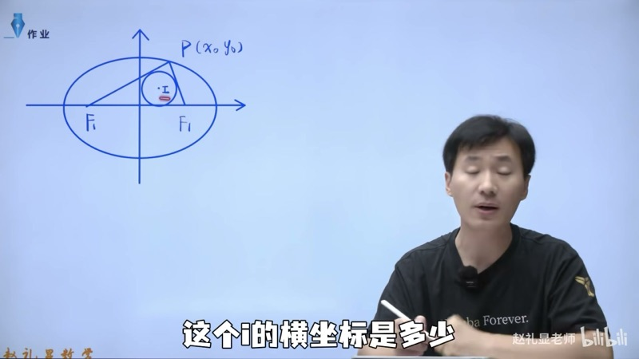
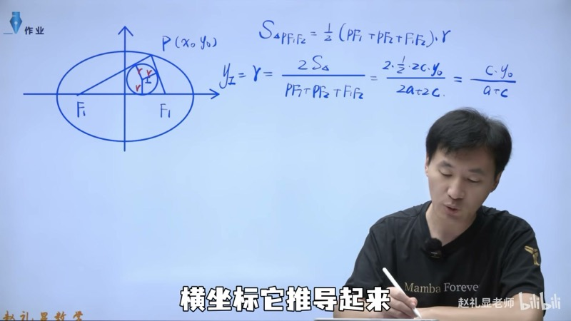
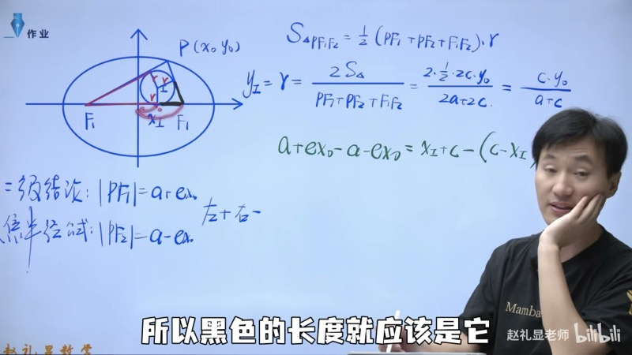
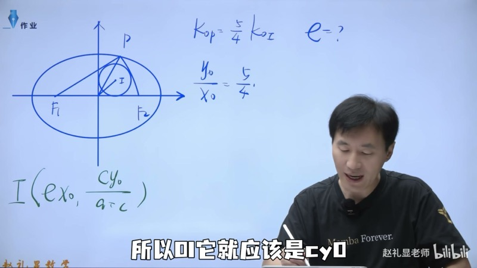

本课跟随赵礼显老师，系统推导椭圆焦点三角形（focal triangle）的**内切圆**（inscribed circle）相关结论。我们利用等面积法求内切圆半径，利用切线长相等求内心横坐标，最终得到内心坐标公式。这些结论在高考压轴小题中频繁出现，掌握推导过程比死记硬背更加可靠。

::: {.callout-note collapse="true"}
## 预备知识

- 椭圆标准方程：$\dfrac{x^2}{a^2} + \dfrac{y^2}{b^2} = 1\;(a > b > 0)$
- 焦半径公式（focal radius formula）：$|PF_1| = a + ex_0$，$|PF_2| = a - ex_0$（左加右减）
- 三角形内切圆与等面积法
- 圆外一点的切线长相等
- 焦点三角形面积公式：$S = b^2\tan\dfrac{\theta}{2}$（参见第一课）
:::

## 本课内容

- 焦点三角形内切圆半径 $r$ 的推导（等面积法）
- 内心横坐标 $x_I = ex_0$ 的推导（切线长相等）
- 内心纵坐标 $y_I = \dfrac{c \cdot y_0}{a + c}$ 的推导
- 内心坐标公式的应用：斜率关系求离心率
- 高考焦点三角形问题的常见考法

## 课程视频

```{=html}
<div class="video-container">
  <iframe src="//player.bilibili.com/player.html?bvid=BV1US4FzAEeD&page=1" title="椭圆焦点三角形与内切圆" frameborder="0" scrolling="no" allowfullscreen></iframe>
</div>
```

## 课程关键帧









## 核心概念

### 一、内切圆半径（Inradius of Focal Triangle）

设椭圆 $\dfrac{x^2}{a^2} + \dfrac{y^2}{b^2} = 1$ 的两个焦点为 $F_1(-c,0)$ 和 $F_2(c,0)$，$P(x_0, y_0)$ 是椭圆上的一点（$y_0 \neq 0$），$\triangle PF_1F_2$ 的内切圆圆心为 $I$，半径为 $r$。

**等面积法推导**：内切圆将 $\triangle PF_1F_2$ 分为三个小三角形，每个小三角形以内切圆半径 $r$ 为高：

$$
S_{\triangle PF_1F_2} = \frac{1}{2}\big(|PF_1| + |PF_2| + |F_1F_2|\big) \cdot r
$$

其中：
- $|PF_1| + |PF_2| = 2a$（椭圆定义）
- $|F_1F_2| = 2c$
- $S_{\triangle PF_1F_2} = \dfrac{1}{2} \cdot 2c \cdot |y_0| = c|y_0|$（以 $F_1F_2$ 为底，$|y_0|$ 为高）

因此：

$$
\boxed{r = \frac{c \cdot |y_0|}{a + c}}
$$

### 二、内心横坐标（x-coordinate of Incenter）

**利用切线长相等推导**：

设内切圆与 $PF_1$、$PF_2$、$F_1F_2$ 分别切于三点。由圆外一点的切线长相等：

- $P$ 到两切点的切线长相等
- $F_1$ 到两切点的切线长相等
- $F_2$ 到两切点的切线长相等

内切圆圆心 $I$ 在 $F_1F_2$（即 $x$ 轴）上的投影为 $x_I$。由切线长关系：

$$
|PF_1| - |PF_2| = (x_I + c) - (c - x_I) = 2x_I
$$

其中左边利用了：从 $F_1$ 到切点的长度为 $x_I + c$，从 $F_2$ 到切点的长度为 $c - x_I$。

而 $|PF_1| - |PF_2| = (a + ex_0) - (a - ex_0) = 2ex_0$，因此：

$$
\boxed{x_I = ex_0}
$$

### 三、内心纵坐标（y-coordinate of Incenter）

内心 $I$ 在 $\triangle PF_1F_2$ 内部，其纵坐标 $y_I$ 就是内切圆半径 $r$（因为 $I$ 到 $x$ 轴的距离等于 $r$）：

$$
\boxed{y_I = \frac{c \cdot y_0}{a + c}}
$$

（当 $y_0 > 0$ 时 $y_I > 0$，当 $y_0 < 0$ 时 $y_I < 0$。）

::: {.callout-tip}
## 内心坐标总结
$$
I = \left(ex_0,\; \frac{c \cdot y_0}{a + c}\right)
$$
不需要死记，理解推导过程后现场推导即可。
:::

### 四、应用示例

**题目**：椭圆 $\dfrac{x^2}{a^2} + \dfrac{y^2}{b^2} = 1$，焦点三角形 $\triangle PF_1F_2$ 的内心为 $I$，已知 $k_{OP} = \dfrac{5}{4} k_{OI}$，求离心率 $e$。

**解法**：

$$
k_{OP} = \frac{y_0}{x_0}, \qquad k_{OI} = \frac{y_I}{x_I} = \frac{\dfrac{c \cdot y_0}{a+c}}{ex_0} = \frac{c \cdot y_0}{(a+c) \cdot ex_0}
$$

因此：

$$
\frac{k_{OP}}{k_{OI}} = \frac{y_0/x_0}{\dfrac{c \cdot y_0}{(a+c) \cdot ex_0}} = \frac{(a+c) \cdot e}{c} = \frac{(a+c) \cdot \frac{c}{a}}{c} = \frac{a+c}{a} = 1 + e
$$

由 $k_{OP} = \dfrac{5}{4} k_{OI}$ 得 $1 + e = \dfrac{5}{4}$，所以 $e = \dfrac{1}{4}$。

### 交互演示：焦点三角形内切圆（Desmos）

```{=html}
<div id="calc-incircle" class="desmos-container"></div>
<script src="https://www.desmos.com/api/v1.9/calculator.js?apiKey=dcb31709b452b1cf9dc26972add0fda6"></script>
<script>
(function() {
  var elt = document.getElementById('calc-incircle');
  var calc = Desmos.GraphingCalculator(elt, {
    expressions: true, settingsMenu: false, xAxisLabel: 'x', yAxisLabel: 'y'
  });
  calc.setExpression({ id: 'a', latex: 'a = 3', sliderBounds: { min: 1.5, max: 5, step: 0.1 } });
  calc.setExpression({ id: 'b', latex: 'b = 2', sliderBounds: { min: 0.5, max: 4, step: 0.1 } });
  calc.setExpression({ id: 'ellipse', latex: '\\frac{x^2}{a^2} + \\frac{y^2}{b^2} = 1', color: '#2d70b3' });
  calc.setExpression({ id: 'c_val', latex: 'c_0 = \\sqrt{a^2 - b^2}' });
  calc.setExpression({ id: 'e_val', latex: 'e_0 = c_0 / a' });
  calc.setExpression({ id: 'F1', latex: '(-c_0, 0)', color: '#c74440', pointSize: 10, label: 'F₁', showLabel: true });
  calc.setExpression({ id: 'F2', latex: '(c_0, 0)', color: '#c74440', pointSize: 10, label: 'F₂', showLabel: true });
  calc.setExpression({ id: 't', latex: 't = 1.2', sliderBounds: { min: 0.1, max: 3.05, step: 0.01 } });
  calc.setExpression({ id: 'Px', latex: 'P_x = a\\cos(t)' });
  calc.setExpression({ id: 'Py', latex: 'P_y = b\\sin(t)' });
  calc.setExpression({ id: 'P', latex: '(P_x, P_y)', color: '#388c46', pointSize: 10, label: 'P', showLabel: true });
  calc.setExpression({ id: 'Ix', latex: 'I_x = e_0 \\cdot P_x' });
  calc.setExpression({ id: 'Iy', latex: 'I_y = \\frac{c_0 \\cdot P_y}{a + c_0}' });
  calc.setExpression({ id: 'r_val', latex: 'r_0 = \\frac{c_0 \\cdot |P_y|}{a + c_0}' });
  calc.setExpression({ id: 'I', latex: '(I_x, I_y)', color: '#fa7e19', pointSize: 10, label: 'I (内心)', showLabel: true });
  calc.setExpression({ id: 'incircle', latex: '(x - I_x)^2 + (y - I_y)^2 = r_0^2', color: '#fa7e19', lineWidth: 2 });
  calc.setExpression({ id: 'seg1', latex: '(1-s)(-c_0,0)+s(P_x,P_y)', color: '#999', parametricDomain: {min:0,max:1}, lineWidth: 1.5 });
  calc.setExpression({ id: 'seg2', latex: '(1-s)(c_0,0)+s(P_x,P_y)', color: '#999', parametricDomain: {min:0,max:1}, lineWidth: 1.5 });
  calc.setExpression({ id: 'seg3', latex: '(1-s)(-c_0,0)+s(c_0,0)', color: '#999', parametricDomain: {min:0,max:1}, lineWidth: 1.5 });
  calc.setMathBounds({ left: -6, right: 6, bottom: -4, top: 4 });
})();
</script>
```

拖动滑块 $t$ 移动点 $P$，观察内切圆（橙色）随 $P$ 的位置实时变化。内心 $I$ 的横坐标 $x_I = ex_0$，纵坐标 $y_I = \dfrac{c \cdot y_0}{a + c}$。

### D3 动画：焦点三角形内切圆 — P 点移动，内切圆实时变化

```{=html}
<div class="d3-container" id="d3-incircle-anim">
  <svg id="svg-incircle-anim" width="600" height="400"></svg>
  <div class="d3-controls" id="controls-incircle-anim">
    <label>拖动 P 点观察内切圆变化</label><br>
    <label>a = <input type="range" id="ic-slider-a" min="2" max="5" step="0.1" value="3"><span id="ic-val-a">3</span></label>
    <label>b = <input type="range" id="ic-slider-b" min="1" max="4" step="0.1" value="2"><span id="ic-val-b">2</span></label>
    <button id="ic-play">▶ 播放</button>
    <button id="ic-pause">⏸ 暂停</button>
  </div>
  <div id="ic-info" style="font-family: 'KaTeX_Main', serif; font-size: 14px; padding: 8px; background: #f8f8f8; border-radius: 6px; margin-top: 6px;"></div>
</div>
<script>
(function() {
  var W = 600, H = 400, margin = 40;
  var svg = d3.select('#svg-incircle-anim');
  svg.selectAll('*').remove();

  var a = 3, b = 2, tAngle = 1.2;
  var animating = false, animTimer = null;

  function c() { return Math.sqrt(a*a - b*b); }
  function e() { return c()/a; }

  var scFactor = 1.3;
  function toSVG(x, y) {
    var sc = (W - 2*margin)/(2*a*scFactor);
    return [W/2 + x*sc, H/2 - y*sc];
  }
  function fromSVG(sx, sy) {
    var sc = (W - 2*margin)/(2*a*scFactor);
    return [(sx - W/2)/sc, -(sy - H/2)/sc];
  }

  function ellipsePoints(n) {
    var pts = [];
    for (var i = 0; i <= n; i++) {
      var t = 2*Math.PI*i/n;
      pts.push(toSVG(a*Math.cos(t), b*Math.sin(t)));
    }
    return pts;
  }

  svg.append('line').attr('x1',margin).attr('y1',H/2).attr('x2',W-margin).attr('y2',H/2).attr('stroke','#ccc').attr('stroke-width',1);
  svg.append('line').attr('x1',W/2).attr('y1',margin).attr('x2',W/2).attr('y2',H-margin).attr('stroke','#ccc').attr('stroke-width',1);

  var ellipsePath = svg.append('path').attr('fill','none').attr('stroke','#2d70b3').attr('stroke-width',2);
  var triPath = svg.append('path').attr('fill','rgba(150,150,150,0.1)').attr('stroke','#999').attr('stroke-width',1.5);
  var incircle = svg.append('circle').attr('fill','rgba(250,126,25,0.12)').attr('stroke','#fa7e19').attr('stroke-width',2);

  var dotF1 = svg.append('circle').attr('r',5).attr('fill','#c74440');
  var dotF2 = svg.append('circle').attr('r',5).attr('fill','#c74440');
  var dotP = svg.append('circle').attr('r',7).attr('fill','#388c46').attr('cursor','pointer');
  var dotI = svg.append('circle').attr('r',5).attr('fill','#fa7e19');

  var lblF1 = svg.append('text').text('F₁').attr('font-size',13).attr('fill','#c74440');
  var lblF2 = svg.append('text').text('F₂').attr('font-size',13).attr('fill','#c74440');
  var lblP = svg.append('text').text('P').attr('font-size',13).attr('fill','#388c46');
  var lblI = svg.append('text').text('I').attr('font-size',13).attr('fill','#fa7e19');

  function update() {
    var cv = c(), ecc = e();
    var px = a*Math.cos(tAngle), py = b*Math.sin(tAngle);

    var ix = ecc*px;
    var iy = cv*py/(a+cv);
    var r = cv*Math.abs(py)/(a+cv);

    var sc = (W - 2*margin)/(2*a*scFactor);
    var rSVG = r * sc;

    var pts = ellipsePoints(200);
    var line = d3.line().x(function(d){return d[0];}).y(function(d){return d[1];});
    ellipsePath.attr('d', line(pts));

    var f1 = toSVG(-cv,0), f2 = toSVG(cv,0), p = toSVG(px,py), ipt = toSVG(ix,iy);

    triPath.attr('d', 'M'+f1[0]+','+f1[1]+' L'+p[0]+','+p[1]+' L'+f2[0]+','+f2[1]+' Z');

    incircle.attr('cx',ipt[0]).attr('cy',ipt[1]).attr('r',rSVG);

    dotF1.attr('cx',f1[0]).attr('cy',f1[1]);
    dotF2.attr('cx',f2[0]).attr('cy',f2[1]);
    dotP.attr('cx',p[0]).attr('cy',p[1]);
    dotI.attr('cx',ipt[0]).attr('cy',ipt[1]);

    lblF1.attr('x',f1[0]-18).attr('y',f1[1]+20);
    lblF2.attr('x',f2[0]+8).attr('y',f2[1]+20);
    lblP.attr('x',p[0]+10).attr('y',p[1]-10);
    lblI.attr('x',ipt[0]+10).attr('y',ipt[1]-10);

    document.getElementById('ic-info').innerHTML =
      'P = (' + px.toFixed(2) + ', ' + py.toFixed(2) + ')' +
      ' &nbsp; e = ' + ecc.toFixed(3) +
      '<br>I = (ex₀, cy₀/(a+c)) = (' + ix.toFixed(3) + ', ' + iy.toFixed(3) + ')' +
      '<br>r = c|y₀|/(a+c) = ' + r.toFixed(3) +
      ' &nbsp; S = c·|y₀| = ' + (cv*Math.abs(py)).toFixed(3);
  }

  var drag = d3.drag().on('drag', function(event) {
    var c0 = fromSVG(event.x, event.y);
    tAngle = Math.atan2(c0[1]/b, c0[0]/a);
    if (Math.sin(tAngle) < 0.05) tAngle = 0.05;
    stopAnim();
    update();
  });
  dotP.call(drag);

  function startAnim() {
    if (animating) return;
    animating = true;
    var startT = tAngle;
    animTimer = d3.timer(function(elapsed) {
      tAngle = 0.1 + (elapsed*0.0008) % 2.9;
      update();
    });
  }
  function stopAnim() {
    animating = false;
    if (animTimer) { animTimer.stop(); animTimer = null; }
  }

  d3.select('#ic-play').on('click', startAnim);
  d3.select('#ic-pause').on('click', stopAnim);

  d3.select('#ic-slider-a').on('input', function() {
    a = +this.value;
    if (b >= a) { b = a-0.1; d3.select('#ic-slider-b').property('value',b); d3.select('#ic-val-b').text(b.toFixed(1)); }
    d3.select('#ic-val-a').text(a.toFixed(1)); stopAnim(); update();
  });
  d3.select('#ic-slider-b').on('input', function() {
    b = +this.value;
    if (b >= a) { b = a-0.1; d3.select('#ic-slider-b').property('value',b); }
    d3.select('#ic-val-b').text(b.toFixed(1)); stopAnim(); update();
  });

  update();
})();
</script>
```

拖动绿色点 $P$ 或点击播放按钮，观察焦点三角形的内切圆随 $P$ 运动而实时变化。当 $P$ 靠近长轴时，内切圆缩小；$P$ 靠近短轴顶点时，内切圆最大。

### 交互演示：内切圆半径与面积关系（Desmos）

```{=html}
<div id="calc-radius-area" class="desmos-container"></div>
<script>
(function() {
  var elt = document.getElementById('calc-radius-area');
  var calc = Desmos.GraphingCalculator(elt, {
    expressions: true, settingsMenu: false, xAxisLabel: 't (参数)', yAxisLabel: '值'
  });
  calc.setExpression({ id: 'a', latex: 'a = 3', sliderBounds: { min: 1.5, max: 5, step: 0.1 } });
  calc.setExpression({ id: 'b', latex: 'b = 2', sliderBounds: { min: 0.5, max: 4, step: 0.1 } });
  calc.setExpression({ id: 'c_val', latex: 'c_0 = \\sqrt{a^2 - b^2}' });
  calc.setExpression({ id: 'r_curve', latex: 'y = \\frac{c_0 \\cdot b \\sin(x)}{a + c_0}', color: '#fa7e19', lineWidth: 2.5 });
  calc.setExpression({ id: 'S_curve', latex: 'y = c_0 \\cdot b \\sin(x)', color: '#388c46', lineWidth: 2 });
  calc.setExpression({ id: 'r_label', latex: '(1.5, 0.8)', label: 'r(t) = c·b·sin(t)/(a+c)', showLabel: true, color: '#fa7e19', pointSize: 0 });
  calc.setExpression({ id: 'S_label', latex: '(1.5, 2.5)', label: 'S(t) = c·b·sin(t)', showLabel: true, color: '#388c46', pointSize: 0 });
  calc.setMathBounds({ left: -0.5, right: 3.5, bottom: -0.5, top: 5 });
})();
</script>
```

观察内切圆半径 $r(t)$（橙色）与三角形面积 $S(t)$（绿色）随参数 $t$ 的变化。两者形状相似（都与 $\sin t$ 成正比），在 $t = \dfrac{\pi}{2}$（$P$ 在短轴顶点）时同时取最大值。

### D3 动画：内切圆半径与面积的关系图

```{=html}
<div class="d3-container" id="d3-radius-area">
  <svg id="svg-radius-area" width="600" height="300"></svg>
  <div class="d3-controls" id="controls-radius-area">
    <label>a = <input type="range" id="ra-slider-a" min="2" max="5" step="0.1" value="3"><span id="ra-val-a">3</span></label>
    <label>b = <input type="range" id="ra-slider-b" min="1" max="4" step="0.1" value="2"><span id="ra-val-b">2</span></label>
    <label>&nbsp;参数 t = <input type="range" id="ra-slider-t" min="0.05" max="3.1" step="0.01" value="1.2"><span id="ra-val-t">1.20</span></label>
  </div>
  <div id="ra-info" style="font-family: 'KaTeX_Main', serif; font-size: 14px; padding: 8px; background: #f8f8f8; border-radius: 6px; margin-top: 6px;"></div>
</div>
<script>
(function() {
  var W = 600, H = 300, margin = 50;
  var svg = d3.select('#svg-radius-area');
  svg.selectAll('*').remove();

  var a = 3, b = 2, tParam = 1.2;

  function cv() { return Math.sqrt(a*a - b*b); }

  // Plot area: t from 0 to pi, values from 0 to max
  var plotL = margin, plotR = W - margin, plotT = margin, plotB = H - margin;
  function toPlot(t, v, vMax) {
    var x = plotL + t / Math.PI * (plotR - plotL);
    var y = plotB - (v / vMax) * (plotB - plotT);
    return [x, y];
  }

  // Axes
  svg.append('line').attr('x1',plotL).attr('y1',plotB).attr('x2',plotR).attr('y2',plotB).attr('stroke','#999').attr('stroke-width',1);
  svg.append('line').attr('x1',plotL).attr('y1',plotT).attr('x2',plotL).attr('y2',plotB).attr('stroke','#999').attr('stroke-width',1);
  svg.append('text').text('0').attr('x',plotL-5).attr('y',plotB+15).attr('font-size',11).attr('fill','#666');
  svg.append('text').text('π').attr('x',plotR-5).attr('y',plotB+15).attr('font-size',11).attr('fill','#666');
  svg.append('text').text('t').attr('x',plotR+5).attr('y',plotB+5).attr('font-size',12).attr('fill','#666');

  var rCurve = svg.append('path').attr('fill','none').attr('stroke','#fa7e19').attr('stroke-width',2.5);
  var sCurve = svg.append('path').attr('fill','none').attr('stroke','#388c46').attr('stroke-width',2);
  var markerR = svg.append('circle').attr('r',5).attr('fill','#fa7e19');
  var markerS = svg.append('circle').attr('r',5).attr('fill','#388c46');
  var vertLine = svg.append('line').attr('stroke','#999').attr('stroke-width',1).attr('stroke-dasharray','3,3');

  var lblR = svg.append('text').text('r(t)').attr('font-size',12).attr('fill','#fa7e19');
  var lblS = svg.append('text').text('S(t)').attr('font-size',12).attr('fill','#388c46');

  function update() {
    var c0 = cv();
    var sMax = c0 * b * 1.2; // max of S curve plus margin

    // R curve
    var rPts = [];
    for (var i = 0; i <= 200; i++) {
      var t = Math.PI * i / 200;
      var rVal = c0 * b * Math.sin(t) / (a + c0);
      rPts.push(toPlot(t, rVal, sMax));
    }
    var line = d3.line().x(function(d){return d[0];}).y(function(d){return d[1];});
    rCurve.attr('d', line(rPts));

    // S curve
    var sPts = [];
    for (var i = 0; i <= 200; i++) {
      var t = Math.PI * i / 200;
      var sVal = c0 * b * Math.sin(t);
      sPts.push(toPlot(t, sVal, sMax));
    }
    sCurve.attr('d', line(sPts));

    // Current markers
    var rNow = c0 * b * Math.sin(tParam) / (a + c0);
    var sNow = c0 * b * Math.sin(tParam);
    var mR = toPlot(tParam, rNow, sMax);
    var mS = toPlot(tParam, sNow, sMax);
    markerR.attr('cx',mR[0]).attr('cy',mR[1]);
    markerS.attr('cx',mS[0]).attr('cy',mS[1]);

    var vx = toPlot(tParam, 0, sMax);
    vertLine.attr('x1',vx[0]).attr('y1',plotT).attr('x2',vx[0]).attr('y2',plotB);

    lblR.attr('x', plotR-60).attr('y', plotT+20);
    lblS.attr('x', plotR-60).attr('y', plotT+38);

    document.getElementById('ra-info').innerHTML =
      't = ' + tParam.toFixed(2) +
      ' &nbsp; r = ' + rNow.toFixed(3) +
      ' &nbsp; S = ' + sNow.toFixed(3) +
      ' &nbsp; r/S = 1/(a+c) = ' + (1/(a+c0)).toFixed(4) +
      '<br>r 与 S 成正比，比例系数为 1/(a+c) = ' + (1/(a+c0)).toFixed(4);
  }

  d3.select('#ra-slider-a').on('input', function() {
    a = +this.value;
    if (b >= a) { b = a-0.1; d3.select('#ra-slider-b').property('value',b); d3.select('#ra-val-b').text(b.toFixed(1)); }
    d3.select('#ra-val-a').text(a.toFixed(1)); update();
  });
  d3.select('#ra-slider-b').on('input', function() {
    b = +this.value;
    if (b >= a) { b = a-0.1; d3.select('#ra-slider-b').property('value',b); }
    d3.select('#ra-val-b').text(b.toFixed(1)); update();
  });
  d3.select('#ra-slider-t').on('input', function() {
    tParam = +this.value; d3.select('#ra-val-t').text(tParam.toFixed(2)); update();
  });

  update();
})();
</script>
```

$r(t)$ 与 $S(t)$ 始终成正比，比例系数为 $\dfrac{1}{a+c}$。即 $r = \dfrac{S}{a+c}$，这是等面积法公式 $S = \dfrac{1}{2}(2a + 2c) \cdot r$ 的直接推论。

## 速查表

::: {.key-formula}

| 结论名称 | 公式 | 推导方法 |
|:---------|:-----|:---------|
| 内切圆半径 | $r = \dfrac{c\|y_0\|}{a + c}$ | 等面积法：$S = \dfrac{1}{2}(2a+2c)r$ |
| 内心横坐标 | $x_I = ex_0$ | 切线长相等 + 焦半径公式 |
| 内心纵坐标 | $y_I = \dfrac{c \cdot y_0}{a + c}$ | 内心到 $x$ 轴距离 = $r$ |
| 内心坐标 | $I = \left(ex_0,\;\dfrac{cy_0}{a+c}\right)$ | 综合以上结论 |
| 面积与半径关系 | $S = (a+c) \cdot r$ | $S = c\|y_0\|$ 与 $r$ 的比例 |
| 斜率比 | $\dfrac{k_{OP}}{k_{OI}} = 1 + e$ | 由内心坐标直接推出 |
| 焦半径公式 | $\|PF_1\| = a + ex_0$，$\|PF_2\| = a - ex_0$ | 左加右减 |

:::
